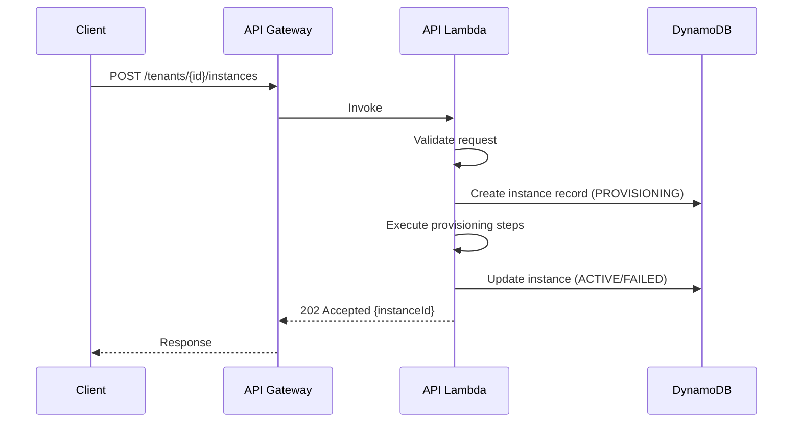

# WordPress Instance Management - Low-Level Design

**Version**: 1.0
**Created**: 2026-01-05
**Status**: Draft
**Component**: WordPress Instance Management Service (2_bbws_instance_lambda)
**Parent HLD**: [HLD 2.7 WordPress Instance Management](../HLDs/2.7_HLD_WordPress_Instance_Management.md)
**Parent BRS**: [BRS 2.7 WordPress Instance Management](../BRS/2.7_BRS_WordPress_Instance_Management.md)

---

## Document Control

| Version | Date | Author | Changes |
|---------|------|--------|---------|
| 1.0 | 2026-01-05 | Agentic Architect | Initial version - Complete LLD for WordPress Instance Management |

---

## Table of Contents

1. [Introduction](#1-introduction)
2. [High Level Epic Overview](#2-high-level-epic-overview)
3. [Architecture](#3-architecture)
4. [Provisioning Service](#4-provisioning-service)
5. [Lifecycle Service](#5-lifecycle-service)
6. [Identity Service](#6-identity-service)
7. [Deprovisioning Service](#7-deprovisioning-service)
8. [Data Model](#8-data-model)
9. [State Machines](#9-state-machines)
10. [Lambda Functions](#10-lambda-functions)
11. [SQS Integration](#11-sqs-integration)
12. [Security](#12-security)
13. [Monitoring & Alerting](#13-monitoring--alerting)
14. [Error Handling](#14-error-handling)
15. [NFRs](#15-nfrs)
16. [Risks and Mitigations](#16-risks-and-mitigations)
17. [Troubleshooting Playbook](#17-troubleshooting-playbook)
18. [Signoff](#18-signoff)
19. [Definition of Terms](#19-definition-of-terms)
20. [References](#20-references)

---

## 1. Introduction

### 1.1 Purpose

This Low-Level Design (LLD) document provides implementation-level details for the **WordPress Instance Management** microservice. This service orchestrates the creation, lifecycle management, and decommissioning of all AWS infrastructure resources required to run a dedicated WordPress instance for each tenant.

**Key Distinction**: This service handles **physical AWS resources** (ECS, EFS, RDS, ALB, Cognito). Logical tenant management (organization, users, metadata) is handled by Tenant Management (BRS 2.5).

### 1.2 Component Overview

| Attribute | Value |
|-----------|-------|
| Runtime | Python 3.12 |
| Memory | 256-1024MB (varies by function) |
| Timeout | 30-900s (varies by function) |
| Architecture | arm64 |
| Framework | AWS Lambda Powertools |

### 1.2.1 Repositories

| Repository | Purpose |
|------------|---------|
| `2_bbws_instance_lambda` | Instance management Lambda functions (CRUD, status, size) |
| `2_bbws_instance_terraform` | Terraform IaC for instance management infrastructure |
| `2_bbws_instance_tests` | Integration and E2E tests for instance management |

### 1.3 Lambda Functions Summary

| Domain | Functions | Description |
|--------|-----------|-------------|
| API Gateway | 8 | CRUD operations, status, size management |
| EventBridge | 1 | `synchronise-tenant-state` - ECS event handler |

### 1.4 Dependencies

| Dependency | Purpose |
|------------|---------|
| AWS ECS | Container orchestration |
| AWS EFS | Persistent WordPress storage |
| AWS RDS MySQL | WordPress database |
| AWS ALB | Load balancing and routing |
| AWS Cognito | Per-tenant authentication |
| AWS Secrets Manager | Database credentials |
| AWS DynamoDB | Resource state tracking |
| AWS SQS | Async command/event handling |
| AWS EventBridge | ECS state change events |
| AWS CloudWatch | Logging, metrics, alarms |

### 1.5 Related Documents

| Document | Relationship |
|----------|--------------|
| BRS 2.7 WordPress Instance Management | Business requirements |
| HLD 2.7 WordPress Instance Management | Architecture design |
| BRS 2.5 Tenant Management | Triggers provisioning |
| HLD 2.0 BBWS ECS WordPress | Platform architecture |

---

## 2. High Level Epic Overview

| Epic | User Stories | Description |
|------|-------------|-------------|
| EPIC-001 | US-2.7-001 to US-2.7-005 | Customer Onboarding (Provisioning) |
| EPIC-002 | US-2.7-006 to US-2.7-010 | Lifecycle Management |
| EPIC-003 | US-2.7-011 to US-2.7-015 | Authentication Setup |
| EPIC-004 | US-2.7-016 to US-2.7-020 | Customer Offboarding (Deprovisioning) |

---

## 3. Architecture

### 3.1 Component Diagram

```
┌─────────────────────────────────────────────────────────────────────────────┐
│                     WordPress Instance Management                            │
├─────────────────────────────────────────────────────────────────────────────┤
│                                                                              │
│   ┌─────────────────────────────────────────────────────────────────────┐   │
│   │                        SQS Event Consumers                           │   │
│   │  ┌──────────────┐  ┌──────────────┐  ┌──────────────┐               │   │
│   │  │START_CLUSTER_│  │START_CLUSTER_│  │START_CLUSTER_│               │   │
│   │  │  CREATION    │  │    PARK      │  │  DELETION    │               │   │
│   │  └──────┬───────┘  └──────┬───────┘  └──────┬───────┘               │   │
│   └─────────┼─────────────────┼─────────────────┼───────────────────────┘   │
│             │                 │                 │                            │
│             ▼                 ▼                 ▼                            │
│             │                 │                 │                            │
│             ▼                 ▼                 ▼                            │
│   ┌─────────────────────────────────────────────────────────────────────┐   │
│   │                         Lambda Functions                             │   │
│   │  ┌─────────┐ ┌─────────┐ ┌─────────┐ ┌─────────┐ ┌─────────┐       │   │
│   │  │  EFS    │ │  RDS    │ │  ECS    │ │  ALB    │ │ Cognito │       │   │
│   │  │ Handler │ │ Handler │ │ Handler │ │ Handler │ │ Handler │       │   │
│   │  └────┬────┘ └────┬────┘ └────┬────┘ └────┬────┘ └────┬────┘       │   │
│   └───────┼───────────┼───────────┼───────────┼───────────┼─────────────┘   │
│           │           │           │           │           │                  │
│           ▼           ▼           ▼           ▼           ▼                  │
│   ┌───────────────────────────────────────────────────────────────────────┐ │
│   │                         AWS Resources                                  │ │
│   │  ┌─────────┐ ┌─────────┐ ┌─────────┐ ┌─────────┐ ┌─────────────────┐ │ │
│   │  │   EFS   │ │   RDS   │ │   ECS   │ │   ALB   │ │    Cognito      │ │ │
│   │  │ Access  │ │ Database│ │ Service │ │ Target  │ │   User Pool     │ │ │
│   │  │ Point   │ │ + User  │ │         │ │ Group   │ │   + App Client  │ │ │
│   │  └─────────┘ └─────────┘ └─────────┘ └─────────┘ └─────────────────┘ │ │
│   └───────────────────────────────────────────────────────────────────────┘ │
│                                                                              │
│   ┌───────────────────────────────────────────────────────────────────────┐ │
│   │                         State Store (DynamoDB)                         │ │
│   │  PK: TENANT#{tenantId}  SK: RESOURCES                                 │ │
│   └───────────────────────────────────────────────────────────────────────┘ │
│                                                                              │
└──────────────────────────────────────────────────────────────────────────────┘
```

### 3.2 SQS Integration Pattern

```
Tenant Management                    Instance Management
      │                                     │
      │  START_CLUSTER_CREATION             │
      │─────────────────────────────────────>│
      │                                     │
      │      (async processing)             │
      │                                     │
      │  CLUSTER_CREATION_COMPLETE          │
      │<─────────────────────────────────────│
      │                                     │
```

---

## 3A. REST API Layer (HATEOAS)

### 3A.1 Hierarchical URL Structure

All APIs follow hierarchical HATEOAS design aligning with HLD 2.7:

```
/v1.0/tenants/{tenantId}/instances
├── /                        (GET - list instances, POST - provision new instance)
└── /{instanceId}
    ├── /                    (GET - get instance details, PUT - update, DELETE - deprovision)
    ├── /status              (GET - get status, PUT - suspend/resume instance)
    └── /size                (PUT - scale instance)
```

### 3A.2 Instance Collection Operations

| Method | Path | Description | Triggers | Auth |
|--------|------|-------------|----------|------|
| GET | `/v1.0/tenants/{tenantId}/instances` | List all instances | Lambda | Admin |
| POST | `/v1.0/tenants/{tenantId}/instances` | Provision new instance | Lambda | Admin |

### 3A.3 Instance Resource Operations

| Method | Path | Description | Triggers | Auth |
|--------|------|-------------|----------|------|
| GET | `/v1.0/tenants/{tenantId}/instances/{instanceId}` | Get instance details | Lambda | Admin |
| PUT | `/v1.0/tenants/{tenantId}/instances/{instanceId}` | Update instance config | Lambda | Admin |
| DELETE | `/v1.0/tenants/{tenantId}/instances/{instanceId}` | Deprovision instance | Lambda | Admin |
| GET | `/v1.0/tenants/{tenantId}/instances/{instanceId}/status` | Get instance status | Lambda | Admin |
| PUT | `/v1.0/tenants/{tenantId}/instances/{instanceId}/status` | Suspend/Resume instance | Lambda | Admin |
| PUT | `/v1.0/tenants/{tenantId}/instances/{instanceId}/size` | Scale ECS service | Lambda | Admin |

### 3A.4 Provision Instance Request/Response

**Request:** `POST /v1.0/tenants/{tenantId}/instances`
```json
{
  "organizationName": "Example Corp",
  "contactEmail": "admin@example.com",
  "tier": "STANDARD",
  "configuration": {
    "desiredCount": 2,
    "wordpressVersion": "6.5"
  }
}
```

**Response (202 Accepted):**
```json
{
  "instanceId": "inst-xyz789",
  "tenantId": "tenant-abc123",
  "status": "PROVISIONING",
  "message": "Instance provisioning initiated.",
  "_links": {
    "self": { "href": "/v1.0/tenants/tenant-abc123/instances/inst-xyz789" },
    "collection": { "href": "/v1.0/tenants/tenant-abc123/instances" },
    "status": { "href": "/v1.0/tenants/tenant-abc123/instances/inst-xyz789/status" }
  }
}
```

### 3A.5 REST → SQS Bridge Pattern



---

## 4. Provisioning Service

### 4.1 Provisioning Steps

| Step | Lambda | Resource | Timeout | Rollback |
|------|--------|----------|---------|----------|
| 1 | `create-efs-access-point` | EFS Access Point | 60s | Delete AP |
| 2 | `create-rds-database` | MySQL DB + User | 120s | Drop DB/User |
| 3 | `store-db-credentials` | Secrets Manager | 30s | Delete Secret |
| 4 | `register-task-definition` | ECS Task Def | 60s | Deregister |
| 5 | `create-ecs-service` | ECS Service | 600s | Delete Service |
| 6 | `create-alb-target-group` | ALB Target Group + Rule | 60s | Delete TG/Rule |
| 7 | `create-cognito-pool` | Cognito User Pool + Client | 120s | Delete Pool |

### 4.2 EFS Access Point Configuration

```python
@dataclass
class EFSAccessPointConfig:
    """EFS Access Point configuration for tenant"""
    tenant_id: str
    file_system_id: str
    root_directory: str  # /tenant-{tenantId}
    posix_user_uid: int = 33  # www-data
    posix_user_gid: int = 33  # www-data
    permissions: str = "755"

    @property
    def access_point_name(self) -> str:
        return f"tenant-{self.tenant_id}-wp-content"
```

**Create Access Point Request:**
```python
def create_access_point(config: EFSAccessPointConfig) -> dict:
    return efs_client.create_access_point(
        FileSystemId=config.file_system_id,
        PosixUser={
            'Uid': config.posix_user_uid,
            'Gid': config.posix_user_gid
        },
        RootDirectory={
            'Path': config.root_directory,
            'CreationInfo': {
                'OwnerUid': config.posix_user_uid,
                'OwnerGid': config.posix_user_gid,
                'Permissions': config.permissions
            }
        },
        Tags=[
            {'Key': 'Name', 'Value': config.access_point_name},
            {'Key': 'bbws:tenant-id', 'Value': config.tenant_id},
            {'Key': 'bbws:managed-by', 'Value': 'instance-management'}
        ]
    )
```

### 4.3 RDS Database Configuration

```python
@dataclass
class RDSDatabaseConfig:
    """RDS Database configuration for tenant"""
    tenant_id: str
    rds_endpoint: str
    admin_secret_arn: str

    @property
    def database_name(self) -> str:
        return f"tenant_{self.tenant_id.replace('-', '_')}_db"

    @property
    def database_user(self) -> str:
        return f"tenant_{self.tenant_id.replace('-', '_')}_user"
```

**Create Database SQL:**
```sql
-- Create database
CREATE DATABASE IF NOT EXISTS tenant_{tenantId}_db
    CHARACTER SET utf8mb4
    COLLATE utf8mb4_unicode_ci;

-- Create user with random password
CREATE USER 'tenant_{tenantId}_user'@'%'
    IDENTIFIED BY '{generated_password}';

-- Grant privileges
GRANT ALL PRIVILEGES ON tenant_{tenantId}_db.*
    TO 'tenant_{tenantId}_user'@'%';

FLUSH PRIVILEGES;
```

### 4.4 ECS Task Definition

```json
{
  "family": "tenant-{tenantId}-wordpress",
  "cpu": "512",
  "memory": "1024",
  "networkMode": "awsvpc",
  "requiresCompatibilities": ["FARGATE"],
  "executionRoleArn": "arn:aws:iam::{account}:role/bbws-ecs-execution-role",
  "taskRoleArn": "arn:aws:iam::{account}:role/bbws-ecs-task-role",
  "volumes": [
    {
      "name": "wp-content",
      "efsVolumeConfiguration": {
        "fileSystemId": "{efs-id}",
        "transitEncryption": "ENABLED",
        "authorizationConfig": {
          "accessPointId": "{access-point-id}",
          "iam": "ENABLED"
        }
      }
    }
  ],
  "containerDefinitions": [
    {
      "name": "wordpress",
      "image": "{ecr-repo}/bbws-wordpress:{version}",
      "essential": true,
      "portMappings": [
        {"containerPort": 80, "protocol": "tcp"}
      ],
      "mountPoints": [
        {
          "sourceVolume": "wp-content",
          "containerPath": "/var/www/html/wp-content"
        }
      ],
      "environment": [
        {"name": "WORDPRESS_DB_HOST", "value": "{rds-endpoint}"},
        {"name": "WORDPRESS_DB_NAME", "value": "tenant_{tenantId}_db"}
      ],
      "secrets": [
        {"name": "WORDPRESS_DB_USER", "valueFrom": "{secret-arn}:username::"},
        {"name": "WORDPRESS_DB_PASSWORD", "valueFrom": "{secret-arn}:password::"}
      ],
      "healthCheck": {
        "command": ["CMD-SHELL", "curl -f http://localhost/ || exit 1"],
        "interval": 30,
        "timeout": 5,
        "retries": 3,
        "startPeriod": 60
      },
      "logConfiguration": {
        "logDriver": "awslogs",
        "options": {
          "awslogs-group": "/aws/ecs/tenant-{tenantId}-wordpress",
          "awslogs-region": "{region}",
          "awslogs-stream-prefix": "wordpress"
        }
      }
    }
  ]
}
```

### 4.5 ECS Service Configuration

```python
def create_ecs_service(tenant_id: str, task_definition_arn: str) -> dict:
    return ecs_client.create_service(
        cluster=CLUSTER_NAME,
        serviceName=f"tenant-{tenant_id}-wordpress",
        taskDefinition=task_definition_arn,
        desiredCount=2,
        launchType='FARGATE',
        platformVersion='1.4.0',
        networkConfiguration={
            'awsvpcConfiguration': {
                'subnets': PRIVATE_SUBNET_IDS,
                'securityGroups': [WORDPRESS_SG_ID],
                'assignPublicIp': 'DISABLED'
            }
        },
        loadBalancers=[
            {
                'targetGroupArn': TARGET_GROUP_ARN,
                'containerName': 'wordpress',
                'containerPort': 80
            }
        ],
        deploymentConfiguration={
            'deploymentCircuitBreaker': {
                'enable': True,
                'rollback': True
            },
            'minimumHealthyPercent': 50,
            'maximumPercent': 200
        },
        enableECSManagedTags=True,
        propagateTags='SERVICE',
        tags=[
            {'key': 'bbws:tenant-id', 'value': tenant_id},
            {'key': 'bbws:managed-by', 'value': 'instance-management'}
        ]
    )
```

### 4.6 ALB Configuration

```python
def create_target_group(tenant_id: str) -> str:
    response = elbv2_client.create_target_group(
        Name=f"tenant-{tenant_id[:8]}-tg",  # Max 32 chars
        Protocol='HTTP',
        Port=80,
        VpcId=VPC_ID,
        HealthCheckProtocol='HTTP',
        HealthCheckPath='/',
        HealthCheckIntervalSeconds=30,
        HealthCheckTimeoutSeconds=5,
        HealthyThresholdCount=2,
        UnhealthyThresholdCount=3,
        TargetType='ip',
        Tags=[
            {'Key': 'bbws:tenant-id', 'Value': tenant_id}
        ]
    )
    return response['TargetGroups'][0]['TargetGroupArn']


def create_listener_rule(tenant_id: str, target_group_arn: str, priority: int) -> str:
    response = elbv2_client.create_rule(
        ListenerArn=LISTENER_ARN,
        Conditions=[
            {
                'Field': 'path-pattern',
                'Values': [f'/tenant/{tenant_id}/*']
            }
        ],
        Priority=priority,
        Actions=[
            {
                'Type': 'forward',
                'TargetGroupArn': target_group_arn
            }
        ],
        Tags=[
            {'Key': 'bbws:tenant-id', 'Value': tenant_id}
        ]
    )
    return response['Rules'][0]['RuleArn']
```

### 4.7 Cognito User Pool Configuration

```python
def create_cognito_user_pool(tenant_id: str) -> dict:
    pool_response = cognito_client.create_user_pool(
        PoolName=f"bbws-tenant-{tenant_id}-user-pool",
        Policies={
            'PasswordPolicy': {
                'MinimumLength': 8,
                'RequireUppercase': True,
                'RequireLowercase': True,
                'RequireNumbers': True,
                'RequireSymbols': True,
                'TemporaryPasswordValidityDays': 7
            }
        },
        AutoVerifiedAttributes=['email'],
        MfaConfiguration='OPTIONAL',
        AccountRecoverySetting={
            'RecoveryMechanisms': [
                {'Name': 'verified_email', 'Priority': 1}
            ]
        },
        UserPoolTags={
            'bbws:tenant-id': tenant_id,
            'bbws:managed-by': 'instance-management'
        }
    )

    user_pool_id = pool_response['UserPool']['Id']

    # Create App Client
    client_response = cognito_client.create_user_pool_client(
        UserPoolId=user_pool_id,
        ClientName=f"bbws-tenant-{tenant_id}-client",
        GenerateSecret=True,
        ExplicitAuthFlows=[
            'ALLOW_USER_PASSWORD_AUTH',
            'ALLOW_REFRESH_TOKEN_AUTH'
        ],
        SupportedIdentityProviders=['COGNITO'],
        CallbackURLs=[f"https://{DOMAIN}/tenant/{tenant_id}/callback"],
        LogoutURLs=[f"https://{DOMAIN}/tenant/{tenant_id}/logout"],
        AllowedOAuthFlows=['code'],
        AllowedOAuthScopes=['openid', 'email', 'profile'],
        AllowedOAuthFlowsUserPoolClient=True
    )

    return {
        'user_pool_id': user_pool_id,
        'client_id': client_response['UserPoolClient']['ClientId'],
        'client_secret': client_response['UserPoolClient']['ClientSecret']
    }
```

---

## 5. Lifecycle Service

### 5.1 Suspend Operation

```python
def suspend_tenant(tenant_id: str, reason: str) -> dict:
    """Suspend tenant by scaling ECS to 0"""

    # 1. Update state to SUSPENDING
    update_resource_state(tenant_id, 'SUSPENDING')

    # 2. Scale ECS service to 0
    ecs_client.update_service(
        cluster=CLUSTER_NAME,
        service=f"tenant-{tenant_id}-wordpress",
        desiredCount=0
    )

    # 3. Wait for tasks to drain (max 2 minutes)
    waiter = ecs_client.get_waiter('services_stable')
    waiter.wait(
        cluster=CLUSTER_NAME,
        services=[f"tenant-{tenant_id}-wordpress"],
        WaiterConfig={'Delay': 10, 'MaxAttempts': 12}
    )

    # 4. Update state to SUSPENDED
    update_resource_state(tenant_id, 'SUSPENDED', reason=reason)

    # 5. Publish completion event
    publish_event('CLUSTER_SUSPEND_COMPLETE', tenant_id)

    return {'status': 'SUSPENDED', 'tenant_id': tenant_id}
```

### 5.2 Resume Operation

```python
def resume_tenant(tenant_id: str) -> dict:
    """Resume tenant by scaling ECS back to desired count"""

    # 1. Update state to RESUMING
    update_resource_state(tenant_id, 'RESUMING')

    # 2. Get desired count from stored state
    resources = get_resource_state(tenant_id)
    desired_count = resources.get('desired_count', 2)

    # 3. Scale ECS service back up
    ecs_client.update_service(
        cluster=CLUSTER_NAME,
        service=f"tenant-{tenant_id}-wordpress",
        desiredCount=desired_count
    )

    # 4. Wait for service to stabilize
    waiter = ecs_client.get_waiter('services_stable')
    waiter.wait(
        cluster=CLUSTER_NAME,
        services=[f"tenant-{tenant_id}-wordpress"],
        WaiterConfig={'Delay': 15, 'MaxAttempts': 20}
    )

    # 5. Update state to ACTIVE
    update_resource_state(tenant_id, 'ACTIVE')

    # 6. Publish completion event
    publish_event('CLUSTER_RESUME_COMPLETE', tenant_id)

    return {'status': 'ACTIVE', 'tenant_id': tenant_id}
```

### 5.3 Scale Operation

```python
def scale_tenant(tenant_id: str, desired_count: int) -> dict:
    """Scale tenant ECS service"""

    # Validate limits (2-10)
    if not (2 <= desired_count <= 10):
        raise ValidationError("Desired count must be between 2 and 10")

    # Update ECS service
    ecs_client.update_service(
        cluster=CLUSTER_NAME,
        service=f"tenant-{tenant_id}-wordpress",
        desiredCount=desired_count
    )

    # Update stored state
    update_resource_state(tenant_id, desired_count=desired_count)

    return {'tenant_id': tenant_id, 'desired_count': desired_count}
```

---

## 6. Identity Service

### 6.1 WordPress OAuth Configuration

After Cognito User Pool is created, configure WordPress MiniOrange plugin:

```python
def configure_wordpress_oauth(tenant_id: str, cognito_config: dict) -> dict:
    """Configure WordPress OAuth plugin via WP-CLI"""

    # Get WordPress admin credentials
    wp_secret = get_wordpress_secret(tenant_id)

    # Execute WP-CLI command via ECS Exec
    command = [
        "wp", "option", "update", "mo_oauth_client_config",
        json.dumps({
            "provider": "custom",
            "client_id": cognito_config['client_id'],
            "client_secret": cognito_config['client_secret'],
            "scope": "openid email profile",
            "authorize_url": f"https://{cognito_config['domain']}/oauth2/authorize",
            "token_url": f"https://{cognito_config['domain']}/oauth2/token",
            "userinfo_url": f"https://{cognito_config['domain']}/oauth2/userInfo"
        }),
        "--format=json"
    ]

    result = execute_ecs_exec(tenant_id, command)
    return result
```

---

## 7. Deprovisioning Service

### 7.1 Deprovisioning Steps (Reverse Order)

| Step | Lambda | Resource | Timeout | Verify |
|------|--------|----------|---------|--------|
| 1 | `remove-alb-rule` | ALB Listener Rule | 30s | Rule deleted |
| 2 | `delete-target-group` | ALB Target Group | 30s | TG deleted |
| 3 | `stop-ecs-service` | ECS Service (scale to 0) | 120s | Tasks stopped |
| 4 | `delete-ecs-service` | ECS Service | 60s | Service deleted |
| 5 | `delete-cognito-pool` | Cognito User Pool | 60s | Pool deleted |
| 6 | `delete-secret` | Secrets Manager | 30s | Secret deleted |
| 7 | `archive-database` | RDS Snapshot | 300s | Snapshot created |
| 8 | `drop-database` | MySQL DB + User | 60s | DB dropped |
| 9 | `archive-efs` | EFS to S3 backup | 300s | Backup complete |
| 10 | `delete-access-point` | EFS Access Point | 60s | AP deleted |

### 7.2 Rollback on Failure

```python
def rollback_provisioning(tenant_id: str, resources: TenantResources) -> None:
    """Rollback in reverse order of creation"""

    # 1. Remove Cognito resources
    if resources.cognito_user_pool_id:
        try:
            cognito_client.delete_user_pool(
                UserPoolId=resources.cognito_user_pool_id
            )
        except Exception as e:
            logger.error(f"Failed to delete Cognito pool: {e}")

    # 2. Remove ALB configuration
    if resources.alb_listener_rule_arn:
        try:
            elbv2_client.delete_rule(RuleArn=resources.alb_listener_rule_arn)
        except Exception as e:
            logger.error(f"Failed to delete ALB rule: {e}")

    if resources.alb_target_group_arn:
        try:
            elbv2_client.delete_target_group(
                TargetGroupArn=resources.alb_target_group_arn
            )
        except Exception as e:
            logger.error(f"Failed to delete target group: {e}")

    # 3. Remove ECS service
    if resources.ecs_service_arn:
        try:
            ecs_client.update_service(
                cluster=CLUSTER_NAME,
                service=resources.ecs_service_arn,
                desiredCount=0
            )
            # Wait for tasks to stop
            time.sleep(30)
            ecs_client.delete_service(
                cluster=CLUSTER_NAME,
                service=resources.ecs_service_arn,
                force=True
            )
        except Exception as e:
            logger.error(f"Failed to delete ECS service: {e}")

    # 4. Remove EFS access point
    if resources.efs_access_point_id:
        try:
            efs_client.delete_access_point(
                AccessPointId=resources.efs_access_point_id
            )
        except Exception as e:
            logger.error(f"Failed to delete EFS access point: {e}")

    # 5. Remove database and user
    if resources.database_name:
        try:
            execute_sql(f"DROP DATABASE IF EXISTS {resources.database_name}")
            execute_sql(f"DROP USER IF EXISTS '{resources.database_user}'@'%'")
        except Exception as e:
            logger.error(f"Failed to drop database: {e}")

    # 6. Remove secrets
    if resources.database_secret_arn:
        try:
            secrets_client.delete_secret(
                SecretId=resources.database_secret_arn,
                ForceDeleteWithoutRecovery=True
            )
        except Exception as e:
            logger.error(f"Failed to delete secret: {e}")

    # 7. Update tenant status to FAILED
    update_resource_state(tenant_id, 'FAILED')
```

---

## 8. Data Model

### 8.1 DynamoDB Table: `{env}-tenant-resources`

**Capacity Mode**: On-Demand

### 8.2 Item Patterns (Aligned with HLD 2.7)

| Entity | PK Pattern | SK Pattern | Purpose |
|--------|------------|------------|---------|
| Instance | `TENANT#{tenantId}` | `INSTANCE` | Instance metadata and state |
| Instance Resource | `TENANT#{tenantId}#INSTANCE` | `RESOURCE#{type}` | AWS resource ARNs (ECS, EFS, RDS, ALB, Cognito) |

### 8.3 Instance Schema

| Attribute | Type | Description |
|-----------|------|-------------|
| PK | String | `TENANT#{tenantId}` |
| SK | String | `INSTANCE` |
| tenantId | String | Tenant identifier |
| provisioningState | String | Current state |
| ecsServiceArn | String | ECS service ARN |
| ecsTaskDefinitionArn | String | Task definition ARN |
| efsAccessPointId | String | EFS access point ID |
| efsAccessPointArn | String | EFS access point ARN |
| databaseName | String | MySQL database name |
| databaseUser | String | MySQL user name |
| databaseSecretArn | String | Secrets Manager ARN |
| albTargetGroupArn | String | ALB target group ARN |
| albListenerRuleArn | String | ALB listener rule ARN |
| cognitoUserPoolId | String | Cognito User Pool ID |
| cognitoAppClientId | String | Cognito App Client ID |
| desiredCount | Number | ECS desired task count |
| provisioningStartedAt | String | ISO 8601 timestamp |
| provisioningCompletedAt | String | ISO 8601 timestamp |
| lastError | String | Last error message |
| createdAt | String | ISO 8601 timestamp |
| updatedAt | String | ISO 8601 timestamp |
| version | Number | Optimistic locking version |

### 8.2 TenantResources Data Class

```python
@dataclass
class TenantResources:
    """Tenant resource state tracking"""
    tenant_id: str
    provisioning_state: ProvisioningState = ProvisioningState.PENDING_PROVISIONING
    ecs_service_arn: Optional[str] = None
    ecs_task_definition_arn: Optional[str] = None
    efs_access_point_id: Optional[str] = None
    efs_access_point_arn: Optional[str] = None
    database_name: Optional[str] = None
    database_user: Optional[str] = None
    database_secret_arn: Optional[str] = None
    alb_target_group_arn: Optional[str] = None
    alb_listener_rule_arn: Optional[str] = None
    cognito_user_pool_id: Optional[str] = None
    cognito_app_client_id: Optional[str] = None
    cognito_domain: Optional[str] = None
    desired_count: int = 2
    provisioning_started_at: Optional[datetime] = None
    provisioning_completed_at: Optional[datetime] = None
    last_error: Optional[str] = None
    created_at: datetime = field(default_factory=datetime.utcnow)
    updated_at: datetime = field(default_factory=datetime.utcnow)
    version: int = 1
```

### 8.3 ProvisioningState Enum

```python
class ProvisioningState(Enum):
    PENDING_PROVISIONING = "PENDING_PROVISIONING"
    PROVISIONING_EFS = "PROVISIONING_EFS"
    PROVISIONING_RDS = "PROVISIONING_RDS"
    PROVISIONING_ECS = "PROVISIONING_ECS"
    CONFIGURING_ALB = "CONFIGURING_ALB"
    PROVISIONING_COGNITO = "PROVISIONING_COGNITO"
    CONFIGURING_WORDPRESS = "CONFIGURING_WORDPRESS"
    ACTIVE = "ACTIVE"
    SUSPENDING = "SUSPENDING"
    SUSPENDED = "SUSPENDED"
    RESUMING = "RESUMING"
    PARKING = "PARKING"
    PARKED = "PARKED"
    UNPARKING = "UNPARKING"
    PENDING_DEPROVISIONING = "PENDING_DEPROVISIONING"
    DEPROVISIONING = "DEPROVISIONING"
    DEPROVISIONED = "DEPROVISIONED"
    FAILED = "FAILED"
```

### 8.7 GSI Design

| Index | PK | SK | Purpose |
|-------|----|----|---------|
| GSI1 | `TENANT#{tenantId}#STATE` | `{state}#{updatedAt}` | List instances by provisioning state |

---

## 9. Provisioning Flow

### 9.1 Provisioning Steps (Lambda Internal)

The `instance-create` Lambda executes these steps sequentially with rollback on failure:

```python
def provision_instance(tenant_id: str, config: ProvisionConfig) -> TenantResources:
    """Execute provisioning steps with rollback on failure"""
    resources = TenantResources(tenant_id=tenant_id)

    try:
        # Step 1: Create EFS Access Point
        resources.efs_access_point_id = create_efs_access_point(tenant_id)
        update_state(tenant_id, 'PROVISIONING_EFS')

        # Step 2: Create RDS Database
        resources.database_name = create_rds_database(tenant_id)
        update_state(tenant_id, 'PROVISIONING_RDS')

        # Step 3: Store DB Credentials
        resources.database_secret_arn = store_db_credentials(tenant_id)

        # Step 4: Register Task Definition
        resources.ecs_task_definition_arn = register_task_definition(tenant_id, resources)
        update_state(tenant_id, 'PROVISIONING_ECS')

        # Step 5: Create ECS Service
        resources.ecs_service_arn = create_ecs_service(tenant_id, resources)

        # Step 6: Wait for Service Stable
        wait_for_ecs_stable(tenant_id)

        # Step 7: Create ALB Target Group
        resources.alb_target_group_arn = create_alb_target_group(tenant_id)
        update_state(tenant_id, 'CONFIGURING_ALB')

        # Step 8: Create Cognito Pool
        cognito = create_cognito_pool(tenant_id)
        resources.cognito_user_pool_id = cognito['user_pool_id']
        update_state(tenant_id, 'PROVISIONING_COGNITO')

        # Step 9: Configure WordPress OAuth
        configure_wordpress_oauth(tenant_id, cognito)

        # Success
        update_state(tenant_id, 'ACTIVE')
        return resources

    except Exception as e:
        logger.error(f"Provisioning failed: {e}")
        rollback_provisioning(tenant_id, resources)
        update_state(tenant_id, 'FAILED', error=str(e))
        raise
```

---

## 10. Lambda Functions

### 10.1 Function Specifications

| Function | Memory | Timeout | Concurrency | Trigger |
|----------|--------|---------|-------------|---------|
| `instance-list` | 256MB | 30s | 10 | API Gateway |
| `instance-create` | 1024MB | 900s | 5 | API Gateway |
| `instance-get` | 256MB | 30s | 10 | API Gateway |
| `instance-update` | 512MB | 300s | 5 | API Gateway |
| `instance-delete` | 1024MB | 900s | 5 | API Gateway |
| `instance-status-get` | 256MB | 30s | 10 | API Gateway |
| `instance-status-update` | 512MB | 300s | 5 | API Gateway |
| `instance-size-update` | 256MB | 60s | 10 | API Gateway |
| `synchronise-tenant-state` | 256MB | 30s | 10 | EventBridge (ECS Events) |

### 10.2 Synchronise Tenant State Lambda

The `synchronise-tenant-state` Lambda is triggered by EventBridge when ECS service state changes occur. It updates DynamoDB to reflect the actual ECS cluster state.

#### EventBridge Rule Configuration

```json
{
  "Name": "bbws-ecs-state-sync-rule",
  "EventPattern": {
    "source": ["aws.ecs"],
    "detail-type": ["ECS Service Action", "ECS Deployment State Change"],
    "detail": {
      "clusterArn": ["arn:aws:ecs:{region}:{account}:cluster/bbws-cluster"]
    }
  },
  "Targets": [{
    "Id": "synchronise-tenant-state-lambda",
    "Arn": "arn:aws:lambda:{region}:{account}:function:synchronise-tenant-state"
  }]
}
```

#### ECS Events Handled

| ECS Event | Detail Type | DynamoDB Status Update |
|-----------|-------------|------------------------|
| `SERVICE_STEADY_STATE` | ECS Service Action | `ACTIVE` |
| `SERVICE_TASK_START_IMPAIRED` | ECS Service Action | `FAILED` |
| `SERVICE_DESIRED_COUNT_UPDATED` | ECS Service Action | `SCALING` |
| `DEPLOYMENT_COMPLETED` | ECS Deployment State Change | `ACTIVE` |
| `DEPLOYMENT_FAILED` | ECS Deployment State Change | `FAILED` |
| `DEPLOYMENT_IN_PROGRESS` | ECS Deployment State Change | `PROVISIONING` |

#### Lambda Implementation

```python
from aws_lambda_powertools import Logger, Tracer
from aws_lambda_powertools.utilities.typing import LambdaContext

logger = Logger()
tracer = Tracer()

# ECS event to DynamoDB status mapping
EVENT_STATUS_MAP = {
    "SERVICE_STEADY_STATE": "ACTIVE",
    "SERVICE_TASK_START_IMPAIRED": "FAILED",
    "SERVICE_DESIRED_COUNT_UPDATED": "SCALING",
    "DEPLOYMENT_COMPLETED": "ACTIVE",
    "DEPLOYMENT_FAILED": "FAILED",
    "DEPLOYMENT_IN_PROGRESS": "PROVISIONING",
}

@logger.inject_lambda_context
@tracer.capture_lambda_handler
def handler(event: dict, context: LambdaContext) -> dict:
    """Synchronise tenant state based on ECS events"""

    detail = event.get("detail", {})
    detail_type = event.get("detail-type", "")

    # Extract tenant ID from ECS service name (format: tenant-{tenantId}-wordpress)
    service_name = detail.get("serviceName", "")
    tenant_id = extract_tenant_id(service_name)

    if not tenant_id:
        logger.warning("Could not extract tenant ID from service name", service_name=service_name)
        return {"statusCode": 400, "message": "Invalid service name"}

    # Determine new status based on event
    event_name = detail.get("eventName", "")
    if detail_type == "ECS Deployment State Change":
        event_name = detail.get("deploymentState", "")

    new_status = EVENT_STATUS_MAP.get(event_name)

    if not new_status:
        logger.info("Unhandled ECS event", event_name=event_name)
        return {"statusCode": 200, "message": "Event ignored"}

    # Update DynamoDB
    update_tenant_state(tenant_id, new_status, event_details={
        "eventName": event_name,
        "detailType": detail_type,
        "timestamp": event.get("time"),
    })

    logger.info("Tenant state synchronised", tenant_id=tenant_id, new_status=new_status)

    return {
        "statusCode": 200,
        "tenantId": tenant_id,
        "newStatus": new_status
    }


def extract_tenant_id(service_name: str) -> str | None:
    """Extract tenant ID from ECS service name"""
    # Format: tenant-{tenantId}-wordpress
    if service_name.startswith("tenant-") and service_name.endswith("-wordpress"):
        return service_name[7:-10]  # Remove 'tenant-' prefix and '-wordpress' suffix
    return None


def update_tenant_state(tenant_id: str, status: str, event_details: dict) -> None:
    """Update tenant provisioning state in DynamoDB"""
    dynamodb = boto3.resource("dynamodb")
    table = dynamodb.Table(os.environ["TENANT_TABLE_NAME"])

    table.update_item(
        Key={"PK": f"TENANT#{tenant_id}", "SK": "INSTANCE"},
        UpdateExpression="SET provisioningState = :status, lastEcsEvent = :event, updatedAt = :now",
        ExpressionAttributeValues={
            ":status": status,
            ":event": event_details,
            ":now": datetime.utcnow().isoformat(),
        }
    )
```

#### Architecture Flow

```
┌─────────────┐     ┌─────────────┐     ┌─────────────┐
│ API Lambda  │────▶│    ECS      │     │             │
│ (Operation) │     │  Service    │     │             │
└─────────────┘     └──────┬──────┘     │             │
                           │            │             │
                    State Change        │             │
                           │            │             │
                           ▼            │             │
                    ┌─────────────┐     │             │
                    │ EventBridge │     │  DynamoDB   │
                    │  (ECS Rule) │     │  (Status)   │
                    └──────┬──────┘     │             │
                           │            │             │
                           ▼            │             │
                    ┌─────────────┐     │             │
                    │ synchronise │────▶│             │
                    │-tenant-state│     │             │
                    └─────────────┘     └─────────────┘
```

---

## 11. SQS Integration

### 11.1 Queue Configuration

| Queue | Purpose | Visibility Timeout | Retention | DLQ |
|-------|---------|-------------------|-----------|-----|
| `bbws-instance-provision` | START_CLUSTER_CREATION | 900s | 4 days | Yes |
| `bbws-instance-lifecycle` | Park/Unpark/Scale | 300s | 4 days | Yes |
| `bbws-instance-deprovision` | START_CLUSTER_DELETION | 900s | 14 days | Yes |
| `bbws-tenant-events` | Completion events | 30s | 4 days | No |

### 11.2 Message Schemas

**START_CLUSTER_CREATION:**
```json
{
  "eventType": "START_CLUSTER_CREATION",
  "tenantId": "tenant-abc123",
  "timestamp": "2026-01-05T10:00:00Z",
  "organizationName": "Example Corp",
  "contactEmail": "admin@example.com",
  "requestedBy": "operator@bbws.com",
  "correlationId": "uuid-correlation-id"
}
```

**CLUSTER_CREATION_COMPLETE:**
```json
{
  "eventType": "CLUSTER_CREATION_COMPLETE",
  "tenantId": "tenant-abc123",
  "timestamp": "2026-01-05T10:12:00Z",
  "status": "SUCCESS",
  "resources": {
    "ecsServiceArn": "arn:aws:ecs:af-south-1:...",
    "efsAccessPointId": "fsap-abc123",
    "cognitoUserPoolId": "af-south-1_xxx"
  },
  "correlationId": "uuid-correlation-id"
}
```

---

## 12. Security

### 12.1 IAM Roles

| Role | Purpose | Key Permissions |
|------|---------|-----------------|
| `bbws-instance-lambda-role` | Lambda execution | ECS, EFS, RDS, ALB, Cognito, Secrets Manager, SQS, DynamoDB |
| `bbws-ecs-execution-role` | ECS task execution | ECR pull, Secrets Manager read, CloudWatch logs |
| `bbws-ecs-task-role` | Container runtime | EFS access, CloudWatch metrics |

### 12.2 Security Controls

| Control | Implementation |
|---------|----------------|
| Encryption at Rest | KMS for EFS, RDS, Secrets Manager |
| Encryption in Transit | TLS 1.2+ everywhere |
| Network Isolation | Private subnets, security groups |
| Secrets Management | Secrets Manager with rotation |
| IAM Least Privilege | Per-function roles |
| Resource Tagging | `bbws:tenant-id` on all resources |

---

## 13. Monitoring & Alerting

### 13.1 CloudWatch Metrics

| Metric | Namespace | Alarm Threshold | Action |
|--------|-----------|-----------------|--------|
| ProvisioningDuration | BBWS/Instance | > 15 minutes | Alert ops |
| ProvisioningSuccess | BBWS/Instance | < 99% | Alert ops |
| ProvisioningFailures | BBWS/Instance | > 0 | Alert ops |
| RollbackCount | BBWS/Instance | > 0 | Alert ops |
| DLQMessageCount | AWS/SQS | > 0 | Alert ops |

### 13.2 CloudWatch Alarms

| Alarm | Condition | Severity | Notification |
|-------|-----------|----------|--------------|
| Provisioning Failure | Any failure | High | SNS → PagerDuty |
| Provisioning Timeout | > 20 minutes | High | SNS → PagerDuty |
| DLQ Messages | DLQ depth > 0 | Medium | SNS → Slack |
| Step Function Failed | Any failure | High | SNS → PagerDuty |

---

## 14. Error Handling

### 14.1 Error Codes

| Code | Description | Recovery Action |
|------|-------------|-----------------|
| PROV-001 | EFS access point creation failed | Retry with backoff |
| PROV-002 | Database creation failed | Check RDS capacity |
| PROV-003 | ECS service stabilization timeout | Check container logs |
| PROV-004 | ALB rule creation failed | Check listener capacity |
| PROV-005 | Cognito pool creation failed | Check service limits |
| PROV-006 | Rollback failed | Manual intervention required |

### 14.2 Retry Strategy

```python
RETRY_CONFIG = {
    'max_retries': 3,
    'initial_delay': 1,  # seconds
    'max_delay': 60,     # seconds
    'backoff_factor': 2,
    'retryable_exceptions': [
        'ThrottlingException',
        'ServiceUnavailableException',
        'RequestLimitExceeded'
    ]
}
```

---

## 15. NFRs

### 15.1 Performance

| Metric | Target | Measurement |
|--------|--------|-------------|
| Provisioning time | < 15 minutes | End-to-end |
| Deprovisioning time | < 10 minutes | End-to-end |
| Suspend time | < 2 minutes | ECS scale to 0 |
| Resume time | < 5 minutes | ECS scale up + healthy |

### 15.2 Availability

| Metric | Target |
|--------|--------|
| Provisioning success rate | > 99% |
| API availability | 99.9% |

---

## 16. Risks and Mitigations

| Risk | Probability | Impact | Mitigation |
|------|-------------|--------|------------|
| Provisioning timeout | Medium | High | Parallel steps where possible |
| Orphaned resources | Low | Medium | Daily cleanup job |
| Rollback failure | Low | Critical | Manual intervention runbook |
| RDS connection limit | Medium | High | Connection pooling |

---

## 17. Troubleshooting Playbook

### 17.1 Provisioning Stuck

1. Check Lambda execution logs in CloudWatch
2. Review CloudWatch logs for failed Lambda
3. Check resource state in DynamoDB
4. Verify AWS service limits not exceeded
5. If stuck, trigger rollback manually

### 17.2 ECS Service Not Stabilizing

1. Check ECS service events
2. Review container logs in CloudWatch
3. Verify security groups allow health checks
4. Check EFS mount point accessibility
5. Verify database connectivity

---

## 18. Signoff

| Role | Name | Signature | Date |
|------|------|-----------|------|
| Technical Lead | | | |
| DevOps Lead | | | |
| Security Lead | | | |

---

## 19. Definition of Terms

| Term | Definition |
|------|------------|
| **Tenant** | Customer organization with dedicated WordPress resources |
| **Provisioning** | Creating all AWS resources for a tenant |
| **Deprovisioning** | Removing all AWS resources for a tenant |
| **Instance** | Complete WordPress environment (ECS + EFS + RDS + ALB + Cognito) |

---

## 20. References

| Document | Path |
|----------|------|
| BRS 2.7 WordPress Instance Management | `BRS/2.7_BRS_WordPress_Instance_Management.md` |
| HLD 2.7 WordPress Instance Management | `HLDs/2.7_HLD_WordPress_Instance_Management.md` |
| HLD 2.0 BBWS ECS WordPress | `HLDs/2.0_BBWS_ECS_WordPress_HLD.md` |
| OpenAPI Spec | `LLDs/openapi/tenant_api_openapi.yaml` |
| Terraform | `2_bbws_ecs_terraform/` |

---

**End of Document**
