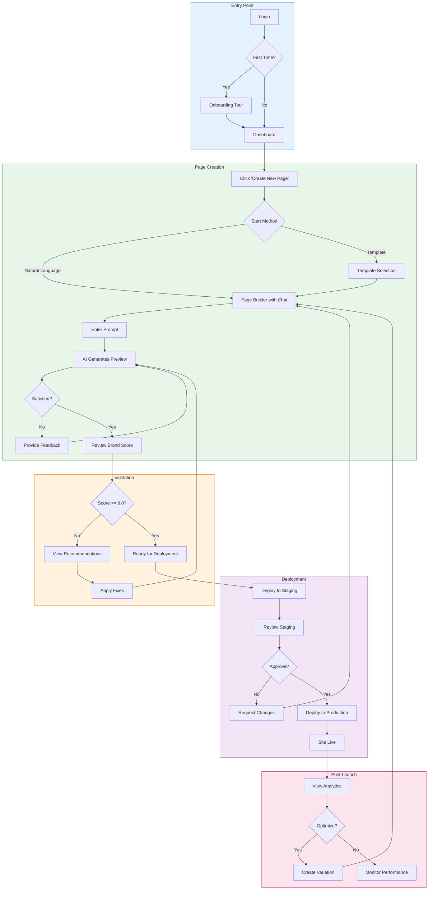
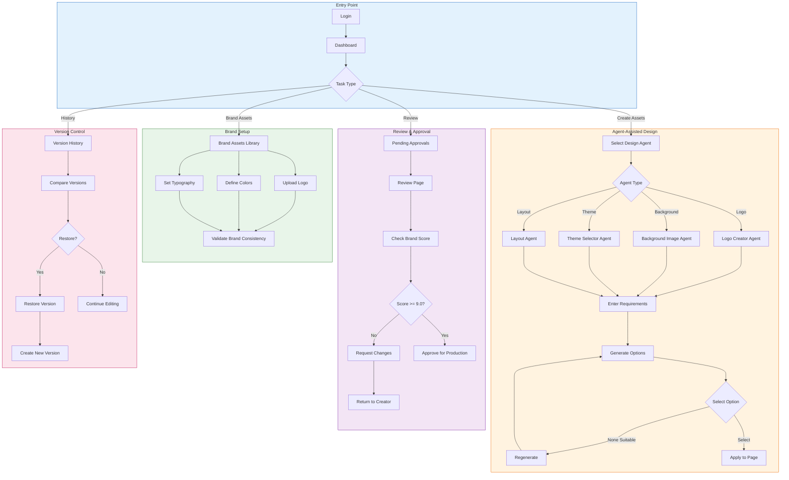
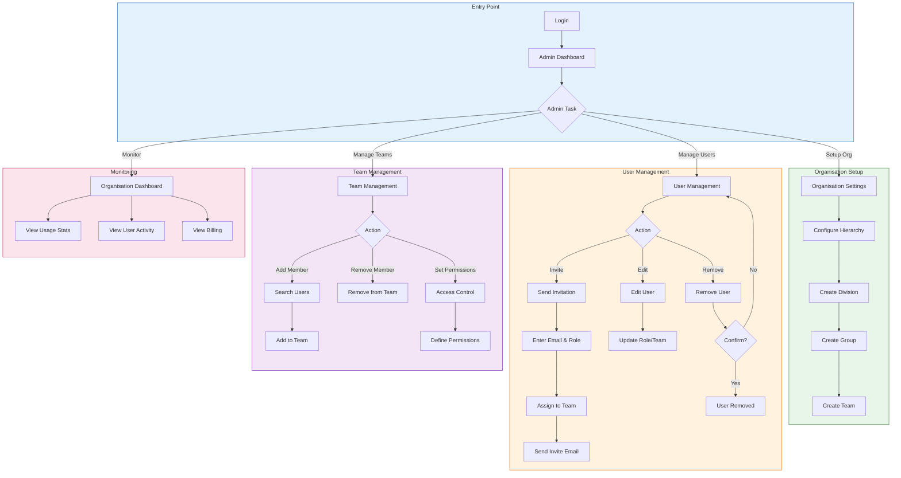
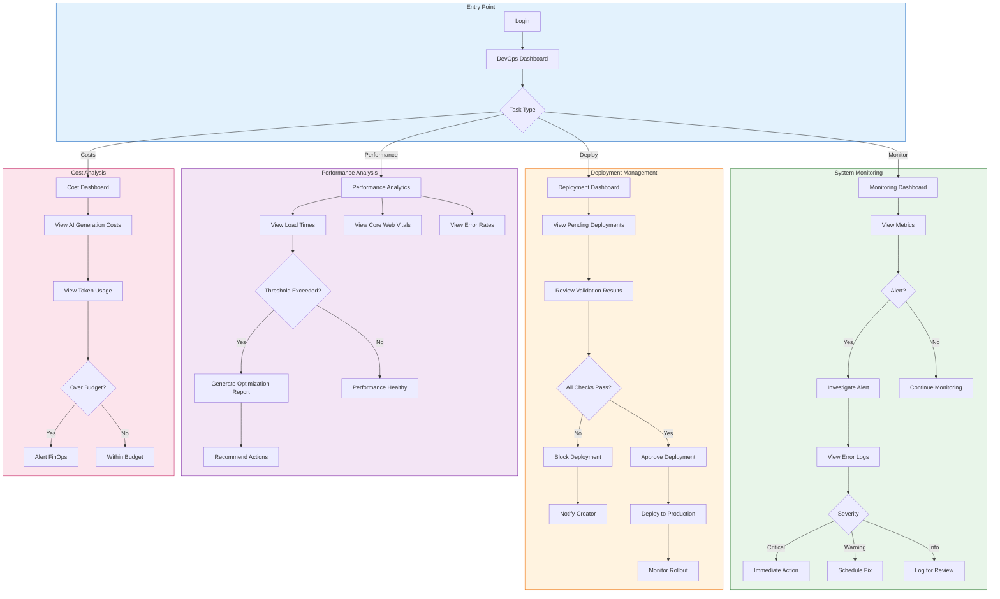
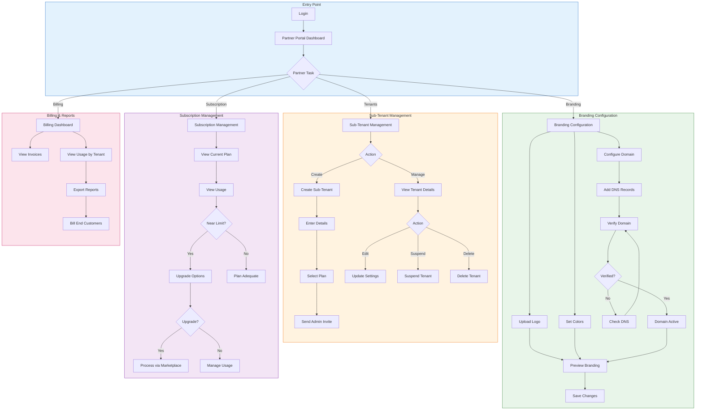

# BBWS Site Builder - Wireframes & User Journey Flows
## Comprehensive UI/UX Design Document

**Version**: 1.1
**Author**: UI/UX Designer Agent
**Date**: 2026-01-16
**Status**: Draft for Review

---

## Document Control

| Version | Date | Author | Changes |
|---------|------|--------|---------|
| 1.0 | 2026-01-16 | UI/UX Designer Agent | Initial wireframes document with 5 personas, user journeys, and screen inventory |
| 1.1 | 2026-01-16 | UI/UX Designer Agent | Added Environment & URL Configuration section, updated all URLs to use kimmyai.io domain patterns |

---

## Related Documents

| Document | Location | Version |
|----------|----------|---------|
| HLD | `../HLDs/BBSW_Site_Builder_HLD_v3.md` | 3.1 |
| BRS | `../BRS/BBWS_Site_Builder_BRS_v1.md` | 1.0 |
| Frontend LLD | `../LLDs/3.1.1_LLD_Site_Builder_Frontend.md` | 1.1 |

---

## Environment & URL Configuration

### Application URLs

| Environment | Page Builder URL | API Base URL |
|-------------|-----------------|--------------|
| DEV | `dev.kimmyai.io/page_builder` | `api.dev.kimmyai.io` |
| SIT | `sit.kimmyai.io/page_builder` | `api.sit.kimmyai.io` |
| PROD | `kimmyai.io/page_builder` | `api.kimmyai.io` |

### Generated Site URLs

| Environment | Static Sites Pattern | WordPress Sites Pattern |
|-------------|---------------------|------------------------|
| DEV | `{site-slug}.sites.dev.kimmyai.io` | `{site-slug}.wpdev.kimmyai.io` |
| SIT | `{site-slug}.sites.sit.kimmyai.io` | `{site-slug}.wpsit.kimmyai.io` |
| PROD | `{site-slug}.sites.kimmyai.io` | `{site-slug}.wp.kimmyai.io` |

### White-Label Partner DNS Configuration

Partners can configure custom domains to white-label the site builder:

| Record Type | Host | Value (DEV) | Value (PROD) |
|-------------|------|-------------|--------------|
| CNAME | `builder.{partner-domain}` | `partners.dev.kimmyai.io` | `partners.kimmyai.io` |
| TXT | `_verify.{partner-domain}` | `kimmyai-verify={verification-code}` | `kimmyai-verify={verification-code}` |

---

## Table of Contents

1. [User Personas Overview](#1-user-personas-overview)
2. [User Journey Maps](#2-user-journey-maps)
3. [Screen Inventory](#3-screen-inventory)
4. [Core Screens (All Users)](#4-core-screens-all-users)
5. [Marketing User Screens](#5-marketing-user-screens)
6. [Designer Screens](#6-designer-screens)
7. [Org Admin Screens](#7-org-admin-screens)
8. [DevOps Engineer Screens](#8-devops-engineer-screens)
9. [White-Label Partner Screens](#9-white-label-partner-screens)
10. [Navigation Flow Diagram](#10-navigation-flow-diagram)
11. [Component Library Reference](#11-component-library-reference)
12. [Responsive Considerations](#12-responsive-considerations)

---

## 1. User Personas Overview

### 1.1 Persona Summary

| Persona | Primary Role | Key Activities | Permission Level |
|---------|--------------|----------------|------------------|
| Marketing User | Marketing Manager, Content Strategist | Creates landing pages via natural language, deploys campaigns | Create, Edit, Deploy (within team scope) |
| Designer | UI/UX Designer, Brand Designer | Designs themes, logos, manages brand assets | Create, Edit, Approve, Manage Templates |
| Org Admin | Administrator, Team Lead | Manages tenants, users, organisation hierarchy | Full Admin (within organisation scope) |
| DevOps Engineer | Platform Engineer, Operations | Monitors, deploys, reviews metrics | Read (monitoring), Deploy (infrastructure) |
| White-Label Partner | Partner Admin | Manages branding, sub-tenants, billing | Partner Admin (delegated tenant management) |

### 1.2 Persona to Epic Mapping

| Epic | Marketing User | Designer | Org Admin | DevOps Engineer | White-Label Partner |
|------|:--------------:|:--------:|:---------:|:---------------:|:-------------------:|
| Epic 1: AI Page Generation | Primary | Secondary | - | - | - |
| Epic 2: Iterative Refinement | Primary | Secondary | - | - | - |
| Epic 3: Quality & Validation | - | Primary | - | Secondary | - |
| Epic 4: Deployment | Primary | - | - | Secondary | - |
| Epic 5: Analytics & Optimization | Primary | - | - | Primary | - |
| Epic 6: Site Designer | Secondary | Primary | - | - | - |
| Epic 7: Tenant Management | - | - | Primary | - | - |
| Epic 8: Site Migration | - | - | - | Primary | - |
| Epic 9: White-Label & Marketplace | - | - | - | - | Primary |

---

## 2. User Journey Maps

### 2.1 Marketing User Journey



### 2.2 Designer Journey



### 2.3 Org Admin Journey



### 2.4 DevOps Engineer Journey



### 2.5 White-Label Partner Journey



---

## 3. Screen Inventory

### 3.1 Core Screens (All Users)

| Screen ID | Screen Name | Route | Personas | User Stories |
|-----------|-------------|-------|----------|--------------|
| CORE-001 | Login | `/login` | All | - |
| CORE-002 | Register | `/register` | All | - |
| CORE-003 | Forgot Password | `/forgot-password` | All | - |
| CORE-004 | Dashboard | `/page_builder` | All | - |
| CORE-005 | Profile Settings | `/settings/profile` | All | - |
| CORE-006 | Notifications | `/notifications` | All | - |

### 3.2 Marketing User Screens

| Screen ID | Screen Name | Route | User Stories |
|-----------|-------------|-------|--------------|
| MKT-001 | Page Builder (Workspace) | `/page_builder/project/:id` | US-001, US-003 |
| MKT-002 | Template Selection | `/page_builder/templates` | US-002 |
| MKT-003 | Generation Progress | `/page_builder/project/:id` (SSE) | US-001 |
| MKT-004 | Version History | `/page_builder/project/:id/history` | US-004 |
| MKT-005 | Deployment Modal | `/page_builder/project/:id` (Modal) | US-007 |
| MKT-006 | Analytics Dashboard | `/analytics` | US-009 |
| MKT-007 | Newsletter Generator | `/page_builder/newsletter` | US-024 |

### 3.3 Designer Screens

| Screen ID | Screen Name | Route | User Stories |
|-----------|-------------|-------|--------------|
| DES-001 | Agent Panel - Logo Creator | `/page_builder/agents/logo` | US-011 |
| DES-002 | Agent Panel - Background | `/page_builder/agents/background` | US-012 |
| DES-003 | Agent Panel - Theme | `/page_builder/agents/theme` | US-013 |
| DES-004 | Agent Panel - Layout | `/page_builder/agents/layout` | US-023 |
| DES-005 | Agent Panel - Blog | `/page_builder/agents/blog` | US-022 |
| DES-006 | Agent Panel - Newsletter | `/page_builder/agents/newsletter` | US-024 |
| DES-007 | Brand Assets Library | `/assets` | US-002 |
| DES-008 | Template Management | `/templates/manage` | US-002 |
| DES-009 | Brand Score Review | `/page_builder/project/:id/validate` | US-005 |
| DES-010 | Page Structure Outliner | `/page_builder/project/:id/outline` | US-014 |

### 3.4 Org Admin Screens

| Screen ID | Screen Name | Route | User Stories |
|-----------|-------------|-------|--------------|
| ADM-001 | Organisation Dashboard | `/admin` | US-015 |
| ADM-002 | User Management | `/admin/users` | US-016 |
| ADM-003 | User Invitation | `/admin/users/invite` | US-016 |
| ADM-004 | Team Management | `/admin/teams` | US-017 |
| ADM-005 | Hierarchy Management | `/admin/hierarchy` | US-015 |
| ADM-006 | Access Control Settings | `/admin/access` | US-017 |
| ADM-007 | Multi-Team Assignment | `/admin/users/:id/teams` | US-018 |

### 3.5 DevOps Engineer Screens

| Screen ID | Screen Name | Route | User Stories |
|-----------|-------------|-------|--------------|
| DEV-001 | Monitoring Dashboard | `/devops` | US-010 |
| DEV-002 | Deployment History | `/devops/deployments` | US-008 |
| DEV-003 | Performance Analytics | `/devops/performance` | US-008 |
| DEV-004 | Error Logs View | `/devops/logs` | US-006 |
| DEV-005 | Cost Analytics | `/devops/costs` | US-010 |
| DEV-006 | Security Scan Results | `/devops/security` | US-006 |
| DEV-007 | Migration Dashboard | `/devops/migration` | US-019, US-020, US-021 |

### 3.6 White-Label Partner Screens

| Screen ID | Screen Name | Route | User Stories |
|-----------|-------------|-------|--------------|
| PTN-001 | Partner Portal Dashboard | `/partner` | US-025-028 |
| PTN-002 | Branding Configuration | `/partner/branding` | US-025 |
| PTN-003 | Sub-Tenant Management | `/partner/tenants` | US-026 |
| PTN-004 | Add Tenant Modal | `/partner/tenants/new` | US-026 |
| PTN-005 | Subscription Management | `/partner/subscription` | US-027 |
| PTN-006 | Billing & Reports | `/partner/billing` | US-028 |
| PTN-007 | Usage Analytics | `/partner/usage` | US-028 |
| PTN-008 | Partner Admin Management | `/partner/admins` | US-026 |

---

## 4. Core Screens (All Users)

### 4.1 Login Screen (CORE-001)

**Route**: `/login`

```
+------------------------------------------------------------------------+
|                                                                        |
|                        [BBWS Site Builder Logo]                        |
|                                                                        |
|                    Welcome Back                                        |
|                    Sign in to continue                                 |
|                                                                        |
|     +------------------------------------------------------------+    |
|     |  Email                                                      |    |
|     |  [user@example.com                                       ]  |    |
|     +------------------------------------------------------------+    |
|                                                                        |
|     +------------------------------------------------------------+    |
|     |  Password                                                   |    |
|     |  [********                                       ] [Show]   |    |
|     +------------------------------------------------------------+    |
|                                                                        |
|     [ ] Remember me                        [Forgot password?]          |
|                                                                        |
|     +------------------------------------------------------------+    |
|     |                    [Sign In]                                |    |
|     +------------------------------------------------------------+    |
|                                                                        |
|     +------------------------------------------------------------+    |
|     |                    [Continue with SSO]                      |    |
|     +------------------------------------------------------------+    |
|                                                                        |
|     Don't have an account? [Sign up]                                   |
|                                                                        |
+------------------------------------------------------------------------+
|  (c) 2026 BBWS Site Builder  |  Privacy  |  Terms  |  Support          |
+------------------------------------------------------------------------+
```

**States**:

```
+-- Empty State --+        +-- Error State --+        +-- Loading State --+
|                 |        |                 |        |                    |
| Email:          |        | Email:          |        | Email:             |
| [            ]  |        | [invalid@     ] |        | [user@example.com] |
|                 |        | ! Invalid email |        |                    |
| Password:       |        |                 |        | Password:          |
| [            ]  |        | Password:       |        | [********        ] |
|                 |        | [********     ] |        |                    |
| [Sign In]       |        | ! Wrong pass    |        | [  Signing in...  ]|
|                 |        |                 |        |     [Spinner]      |
+-----------------+        +-----------------+        +--------------------+
```

### 4.2 Register Screen (CORE-002)

**Route**: `/register`

```
+------------------------------------------------------------------------+
|                                                                        |
|                        [BBWS Site Builder Logo]                        |
|                                                                        |
|                    Create Your Account                                 |
|                    Start building amazing pages                        |
|                                                                        |
|     +------------------------------------------------------------+    |
|     |  Full Name *                                                |    |
|     |  [                                                       ]  |    |
|     +------------------------------------------------------------+    |
|                                                                        |
|     +------------------------------------------------------------+    |
|     |  Email Address *                                            |    |
|     |  [                                                       ]  |    |
|     +------------------------------------------------------------+    |
|                                                                        |
|     +------------------------------------------------------------+    |
|     |  Organisation Name *                                        |    |
|     |  [                                                       ]  |    |
|     +------------------------------------------------------------+    |
|                                                                        |
|     +------------------------------------------------------------+    |
|     |  Password *                                                 |    |
|     |  [                                              ] [Show]    |    |
|     +------------------------------------------------------------+    |
|     Password must be 8+ chars with uppercase, number, symbol           |
|                                                                        |
|     +------------------------------------------------------------+    |
|     |  Confirm Password *                                         |    |
|     |  [                                              ] [Show]    |    |
|     +------------------------------------------------------------+    |
|                                                                        |
|     [ ] I agree to the [Terms of Service] and [Privacy Policy]         |
|                                                                        |
|     +------------------------------------------------------------+    |
|     |                  [Create Account]                           |    |
|     +------------------------------------------------------------+    |
|                                                                        |
|     Already have an account? [Sign in]                                 |
|                                                                        |
+------------------------------------------------------------------------+
```

### 4.3 Dashboard Screen (CORE-004)

**Route**: `/page_builder`

```
+------------------------------------------------------------------------+
|  [Logo] Site Builder           DEV  |  [?] [Bell(3)] [Settings] [Avatar]|
+--------+---------------------------------------------------------------+
|        |                                                               |
| NAV    |  Welcome back, Tebogo!                                        |
|        |  Last login: 2 hours ago                                      |
| ====== |                                                               |
|        |  +-----------------------------------------------------------+|
| [Home] |  |  [+] Create New Landing Page                              ||
| [Build]|  |      Start with AI or choose a template                   ||
| [Templ]|  +-----------------------------------------------------------+|
| [Hist] |                                                               |
|        |  Quick Stats                                                  |
| ------ |  +-------------+ +-------------+ +-------------+ +-----------+|
| Agents |  | Total Sites | | Live Sites  | | This Month  | | Avg Score ||
| ------ |  |     12      | |      7      | |      5      | |    8.7    ||
| o Logo |  +-------------+ +-------------+ +-------------+ +-----------+|
| o BG   |                                                               |
| o Theme|  Recent Projects                                  [View All]  |
| o Layt |  +---------------+ +---------------+ +---------------+        |
| o Blog |  | [Thumbnail]   | | [Thumbnail]   | | [Thumbnail]   |        |
| o News |  | Summer Sale   | | Product Launch| | Newsletter    |        |
|        |  | Draft . 2h    | | Live . 1d     | | Draft . 3d    |        |
| ------ |  | Score: 8.5    | | Score: 9.2    | | Score: 7.8    |        |
| Recent |  | [Edit][Deploy]| | [View][Stats] | | [Edit]        |        |
| ------ |  +---------------+ +---------------+ +---------------+        |
| o Proj1|                                                               |
| o Proj2|  AI Design Agents                                             |
| o Proj3|  +------+ +------+ +------+ +------+ +------+ +------+       |
|        |  | Logo | |  BG  | |Theme | |Layout| | Blog | |News  |       |
|        |  |  AI  | |  AI  | |  AI  | |  AI  | |  AI  | |  AI  |       |
|        |  +------+ +------+ +------+ +------+ +------+ +------+       |
|        |                                                               |
|        |  Templates                                       [Browse All] |
|        |  +---------------+ +---------------+ +---------------+        |
|        |  | SaaS Landing  | | E-commerce    | | Event Page    |        |
|        |  | [Use Template]| | [Use Template]| | [Use Template]|        |
|        |  +---------------+ +---------------+ +---------------+        |
|        |                                                               |
+--------+---------------------------------------------------------------+
|  Brand Score: 8.5/10  |  Auto-saved  |  [Green] Connected              |
+------------------------------------------------------------------------+
```

### 4.4 Profile Settings Screen (CORE-005)

**Route**: `/settings/profile`

```
+------------------------------------------------------------------------+
|  [Logo] Site Builder           DEV  |  [?] [Bell] [Settings] [Avatar]   |
+--------+---------------------------------------------------------------+
|        |                                                               |
| NAV    |  Settings                                                     |
|        |  +------------------+                                         |
| [<Back]|  | Profile          | [Account] [Notifications] [Security]   |
|        |  +------------------+                                         |
|        |                                                               |
|        |  Profile Picture                                              |
|        |  +--------+                                                   |
|        |  |        |  [Change Photo]                                   |
|        |  | [Avatar|  Recommended: 200x200px, JPG or PNG               |
|        |  |    ]   |                                                   |
|        |  +--------+                                                   |
|        |                                                               |
|        |  Personal Information                                         |
|        |  +---------------------------------------------------------+ |
|        |  |  Full Name                                               | |
|        |  |  [Tebogo Tseka                                        ]  | |
|        |  +---------------------------------------------------------+ |
|        |                                                               |
|        |  +---------------------------------------------------------+ |
|        |  |  Email Address                                           | |
|        |  |  [tebogo@example.com                       ] [Verified]  | |
|        |  +---------------------------------------------------------+ |
|        |                                                               |
|        |  +---------------------------------------------------------+ |
|        |  |  Phone (Optional)                                        | |
|        |  |  [+27 82 123 4567                                     ]  | |
|        |  +---------------------------------------------------------+ |
|        |                                                               |
|        |  Organisation Details                                         |
|        |  +---------------------------------------------------------+ |
|        |  |  Organisation                                            | |
|        |  |  Acme Corp                                    [Read-only]| |
|        |  +---------------------------------------------------------+ |
|        |                                                               |
|        |  +---------------------------------------------------------+ |
|        |  |  Role                                                    | |
|        |  |  Marketing Manager                            [Read-only]| |
|        |  +---------------------------------------------------------+ |
|        |                                                               |
|        |  +---------------------------------------------------------+ |
|        |  |  Team(s)                                                 | |
|        |  |  Marketing Team, Product Team                 [Read-only]| |
|        |  +---------------------------------------------------------+ |
|        |                                                               |
|        |              [Cancel Changes]              [Save Changes]     |
|        |                                                               |
+--------+---------------------------------------------------------------+
```

---

## 5. Marketing User Screens

### 5.1 Page Builder (Main Workspace) - MKT-001

**Route**: `/page_builder/project/:projectId`

**Purpose**: Primary workspace for AI-driven page generation with split-view interface.

**Related User Stories**: US-001, US-003

```
+------------------------------------------------------------------------+
|  [Logo] Site Builder    Summer Sale Campaign    DEV | [Deploy v] [Menu] |
+--------+---------------------------------------------------------------+
|        |  [Chat] [Agents] [History]          [Desktop][Tablet][Mobile]  |
|        +-------------------------------+-------------------------------+
| NAV    |                               |                               |
|        |  AI Assistant                 |  Live Preview                 |
| ====== |  --------------------------   |  +--------------------------+ |
|        |                               |  |                          | |
| [Home] |  [Bot] Hi! I'll help you      |  |    [Hero Section]        | |
| [Build]|       create your landing     |  |                          | |
| [Templ]|       page. What would you    |  |    Your Summer Sale      | |
| [Hist] |       like to build today?    |  |    Headline Here         | |
|        |                               |  |                          | |
| ------ |  Suggestions:                 |  |    [CTA Button]          | |
| Agents |  [Product launch page]        |  |                          | |
| ------ |  [Summer sale campaign]       |  |  ------------------------| |
| o Logo |  [Newsletter signup]          |  |                          | |
| o BG   |                               |  |    [Features Grid]       | |
| o Theme|  --------------------------   |  |                          | |
| o Layt |                               |  |    [ ] [ ] [ ]           | |
| o Blog |  [User] Create a summer sale  |  |                          | |
| o News |        landing page with      |  |  ------------------------| |
|        |        hero, 3 product        |  |                          | |
| ------ |        highlights, and        |  |    [Newsletter Form]     | |
| Recent |        newsletter signup      |  |                          | |
| ------ |                               |  |    [Footer]              | |
| o Proj1|  [Bot] Great! I'll create     |  |                          | |
| o Proj2|        that for you.          |  +--------------------------+ |
|        |        Generating...          |                               |
|        |        [=========>    ] 80%   |                               |
|        |                               |                               |
|        +-------------------------------+-------------------------------+
|        |  [Type your message or describe what you want...]      [Send] |
+--------+---------------------------------------------------------------+
|  Brand: 8.5/10 [+0.3]  |  Saving...  |  [Green] Connected | v3 of 5    |
+------------------------------------------------------------------------+
```

**Generation Progress State (SSE Streaming)**:

```
+-------------------------------+
|                               |
|  [Bot] Creating your page...  |
|                               |
|  [===========>        ] 65%   |
|                               |
|  Steps:                       |
|  [Check] Analyzing request    |
|  [Check] Creating structure   |
|  [Spin]  Generating content   |
|  [ ]     Applying styles      |
|  [ ]     Validating brand     |
|                               |
|  Estimated: ~8 seconds        |
|                               |
|  [Cancel Generation]          |
|                               |
+-------------------------------+
```

**Empty State**:

```
+-------------------------------+-------------------------------+
|                               |                               |
|  AI Assistant                 |  Live Preview                 |
|  --------------------------   |  +--------------------------+ |
|                               |  |                          | |
|  [Bot] Hi! I'm your AI        |  |    No Preview Yet        | |
|        assistant. Describe    |  |                          | |
|        the landing page       |  |    Start by describing   | |
|        you want to create     |  |    your page in the      | |
|        and I'll build it      |  |    chat panel            | |
|        for you.               |  |                          | |
|                               |  |    Or choose a template  | |
|  Try:                         |  |    to get started        | |
|  [Create a product launch]    |  |                          | |
|  [Build a signup page]        |  |    [Browse Templates]    | |
|  [Design a coming soon]       |  |                          | |
|                               |  +--------------------------+ |
+-------------------------------+-------------------------------+
```

**Error State**:

```
+-------------------------------+
|                               |
|  [Warning] Generation Failed  |
|                               |
|  We couldn't generate your    |
|  page. This might be due to:  |
|                               |
|  - Service temporarily        |
|    unavailable                |
|  - Request too complex        |
|                               |
|  [Try Again]  [Simplify]      |
|                               |
|  Or try a template instead:   |
|  [Browse Templates]           |
|                               |
+-------------------------------+
```

### 5.2 Template Selection - MKT-002

**Route**: `/page_builder/templates`

**Related User Stories**: US-002

```
+------------------------------------------------------------------------+
|  [Logo] Site Builder           DEV  |  [?] [Bell] [Settings] [Avatar]   |
+--------+---------------------------------------------------------------+
|        |                                                               |
| NAV    |  Choose a Template                                            |
|        |  Start with a pre-designed template and customize with AI     |
|        |                                                               |
|        |  [Search templates...                            ] [Filter v] |
|        |                                                               |
|        |  Categories:                                                  |
|        |  [All] [SaaS] [E-commerce] [Events] [Newsletter] [Portfolio] |
|        |                                                               |
|        |  +---------------+ +---------------+ +---------------+        |
|        |  |               | |               | |               |        |
|        |  | [Preview]     | | [Preview]     | | [Preview]     |        |
|        |  |               | |               | |               |        |
|        |  +---------------+ +---------------+ +---------------+        |
|        |  | Modern SaaS   | | Product Launch| | Event Landing |        |
|        |  | Clean, minimal| | Hero focused  | | RSVP form     |        |
|        |  | [Use] [Preview| | [Use] [Preview| | [Use] [Preview|        |
|        |  +---------------+ +---------------+ +---------------+        |
|        |                                                               |
|        |  +---------------+ +---------------+ +---------------+        |
|        |  |               | |               | |               |        |
|        |  | [Preview]     | | [Preview]     | | [Preview]     |        |
|        |  |               | |               | |               |        |
|        |  +---------------+ +---------------+ +---------------+        |
|        |  | E-commerce    | | Newsletter    | | Portfolio     |        |
|        |  | Product grid  | | Signup focus  | | Project cards |        |
|        |  | [Use] [Preview| | [Use] [Preview| | [Use] [Preview|        |
|        |  +---------------+ +---------------+ +---------------+        |
|        |                                                               |
|        |  [<] Page 1 of 3 [>]                                          |
|        |                                                               |
+--------+---------------------------------------------------------------+
```

**Template Preview Modal**:

```
+------------------------------------------------------------------------+
|  Template Preview: Modern SaaS                                    [X]  |
+------------------------------------------------------------------------+
|                                                                        |
|  +------------------------------------------------------------------+ |
|  |                                                                   | |
|  |  [Desktop][Tablet][Mobile]                                        | |
|  |                                                                   | |
|  |  +-------------------------------------------------------------+ | |
|  |  |                                                              | | |
|  |  |              [Full Template Preview]                         | | |
|  |  |                                                              | | |
|  |  |              Hero Section                                    | | |
|  |  |              Features Grid                                   | | |
|  |  |              Pricing Table                                   | | |
|  |  |              Testimonials                                    | | |
|  |  |              CTA Section                                     | | |
|  |  |              Footer                                          | | |
|  |  |                                                              | | |
|  |  +-------------------------------------------------------------+ | |
|  |                                                                   | |
|  +------------------------------------------------------------------+ |
|                                                                        |
|  Sections Included:                                                    |
|  [Check] Hero  [Check] Features  [Check] Pricing  [Check] CTA         |
|                                                                        |
|  [Cancel]                                        [Use This Template]   |
|                                                                        |
+------------------------------------------------------------------------+
```

### 5.3 Version History - MKT-004

**Route**: `/page_builder/project/:projectId/history`

**Related User Stories**: US-004

```
+------------------------------------------------------------------------+
|  Version History - Summer Sale Campaign                           [X]  |
+------------------------------------------------------------------------+
|                                                                        |
|  Current Version: v5                                                   |
|                                                                        |
|  +---------+---------------------------------+---------+-------------+ |
|  | Version | Changes                         | Time    | Actions     | |
|  +---------+---------------------------------+---------+-------------+ |
|  | v5 [*]  | Updated hero headline           | 2m ago  | [Current]   | |
|  | v4      | Changed color theme to Ocean    | 15m ago | [Restore]   | |
|  | v3      | Added testimonials section      | 1h ago  | [Restore]   | |
|  | v2      | Regenerated product grid        | 2h ago  | [Restore]   | |
|  | v1      | Initial generation              | 3h ago  | [Restore]   | |
|  +---------+---------------------------------+---------+-------------+ |
|                                                                        |
|  Compare Versions                                                      |
|  +----------------------------+    +----------------------------+      |
|  | v5 (Current)               |    | v4 (Selected)              |      |
|  | [Select for compare v]     |    | [Select for compare v]     |      |
|  |                            |    |                            |      |
|  | +------------------------+ |    | +------------------------+ |      |
|  | |                        | |    | |                        | |      |
|  | |   [Preview v5]         | | vs | |   [Preview v4]         | |      |
|  | |                        | |    | |                        | |      |
|  | +------------------------+ |    | +------------------------+ |      |
|  |                            |    |                            |      |
|  | Changes from v4:           |    | Changes from v3:           |      |
|  | - Hero headline updated    |    | - Theme changed            |      |
|  | - CTA button text changed  |    | - Colors updated           |      |
|  +----------------------------+    +----------------------------+      |
|                                                                        |
|  [Close]                              [Restore Selected Version]       |
|                                                                        |
+------------------------------------------------------------------------+
```

### 5.4 Deployment Modal - MKT-005

**Route**: Modal on `/page_builder/project/:id`

**Related User Stories**: US-007, US-008

```
+------------------------------------------------------------------------+
|  Deploy "Summer Sale Campaign"                                    [X]  |
+------------------------------------------------------------------------+
|                                                                        |
|  Pre-deployment Validation                                             |
|  -------------------------------------------------------------------- |
|  [Check] Brand Score: 8.5/10 (Minimum: 8.0)                           |
|  [Check] Security Scan: Passed                                         |
|  [Check] Performance: Load time 1.2s (Max: 3s)                         |
|  [Check] Accessibility: WCAG 2.1 AA Compliant                          |
|                                                                        |
|  Select Environment                                                    |
|  -------------------------------------------------------------------- |
|  +------------------------+    +------------------------+              |
|  |                        |    |                        |              |
|  |  ( ) Staging           |    |  ( ) Production        |              |
|  |                        |    |                        |              |
|  |  Preview & Test        |    |  Go Live               |              |
|  |  Safe testing zone     |    |  Public deployment     |              |
|  |                        |    |                        |              |
|  |  [Recommended]         |    |  Requires 8.0+ score   |              |
|  |                        |    |                        |              |
|  +------------------------+    +------------------------+              |
|                                                                        |
|  Custom Domain (Optional)                                              |
|  +------------------------------------------------------------------+ |
|  | summer-sale.mybrand.com                                          | |
|  +------------------------------------------------------------------+ |
|                                                                        |
|  -------------------------------------------------------------------- |
|                                                                        |
|  [Cancel]                                    [Deploy to Staging]       |
|                                                                        |
+------------------------------------------------------------------------+
```

**Deployment Progress State**:

```
+------------------------------------------------------------------------+
|  Deploying "Summer Sale Campaign"                                      |
+------------------------------------------------------------------------+
|                                                                        |
|  [=============>                                              ] 35%    |
|                                                                        |
|  Steps:                                                                |
|  [Check] Validating content                                            |
|  [Check] Uploading assets to S3                                        |
|  [Spin]  Configuring CloudFront                                        |
|  [ ]     Invalidating cache                                            |
|  [ ]     Verifying deployment                                          |
|                                                                        |
|  Estimated time: ~30 seconds                                           |
|                                                                        |
+------------------------------------------------------------------------+
```

**Deployment Success State**:

```
+------------------------------------------------------------------------+
|  Deployment Successful!                                          [X]   |
+------------------------------------------------------------------------+
|                                                                        |
|  [Check Icon - Large Green]                                            |
|                                                                        |
|  Your page is now live on Staging                                      |
|                                                                        |
|  Preview URL:                                                          |
|  +------------------------------------------------------------------+ |
|  | https://summer-sale-123.sites.sit.kimmyai.io    [Copy] [Open]    | |
|  +------------------------------------------------------------------+ |
|                                                                        |
|  What's next?                                                          |
|  - Review the page in the staging environment                          |
|  - Share with stakeholders for approval                                |
|  - When ready, promote to Production                                   |
|                                                                        |
|  [View Page]              [Promote to Production]        [Close]       |
|                                                                        |
+------------------------------------------------------------------------+
```

**Validation Failed State**:

```
+------------------------------------------------------------------------+
|  Deployment Blocked                                              [X]   |
+------------------------------------------------------------------------+
|                                                                        |
|  [Warning Icon - Orange]                                               |
|                                                                        |
|  Your page cannot be deployed to Production yet                        |
|                                                                        |
|  Issues Found:                                                         |
|  +------------------------------------------------------------------+ |
|  | [X] Brand Score: 7.2/10 (Minimum required: 8.0)                  | |
|  |     - Color palette compliance: 1.2/2.0                          | |
|  |     - Typography compliance: 1.0/1.5                             | |
|  |     [View Recommendations]                                        | |
|  +------------------------------------------------------------------+ |
|  | [Check] Security Scan: Passed                                    | |
|  +------------------------------------------------------------------+ |
|  | [Check] Performance: 2.1s (Max: 3s)                              | |
|  +------------------------------------------------------------------+ |
|                                                                        |
|  [Deploy to Staging Anyway]                    [Fix Issues]            |
|                                                                        |
+------------------------------------------------------------------------+
```

### 5.5 Analytics Dashboard - MKT-006

**Route**: `/analytics`

**Related User Stories**: US-009

```
+------------------------------------------------------------------------+
|  [Logo] Site Builder           DEV  |  [?] [Bell] [Settings] [Avatar]   |
+--------+---------------------------------------------------------------+
|        |                                                               |
| NAV    |  Analytics Dashboard                          [Last 30 days v]|
|        |                                                               |
|        |  +------------------+ +------------------+ +------------------+|
|        |  | Total Page Views | | Avg. Time on Page| | Conversion Rate  ||
|        |  |     15,234       | |     2m 34s       | |      4.2%        ||
|        |  |   [+12% vs prev] | |   [+5% vs prev]  | |   [-0.3% prev]   ||
|        |  +------------------+ +------------------+ +------------------+|
|        |                                                               |
|        |  Page Performance                                             |
|        |  +----------------------------------------------------------+ |
|        |  | Page Name      | Views  | Conversions| Score | Actions   | |
|        |  +----------------------------------------------------------+ |
|        |  | Summer Sale    | 8,234  | 412 (5%)   | 8.5   | [View]    | |
|        |  | Product Launch | 4,521  | 156 (3.4%) | 9.2   | [View]    | |
|        |  | Newsletter     | 2,479  | 198 (8%)   | 7.8   | [View]    | |
|        |  +----------------------------------------------------------+ |
|        |                                                               |
|        |  Component Engagement                                         |
|        |  +----------------------------------------------------------+ |
|        |  |                                                          | |
|        |  |   Hero Section   [=============================] 89%     | |
|        |  |   Features Grid  [========================]      72%     | |
|        |  |   CTA Button     [===================]           58%     | |
|        |  |   Testimonials   [===============]               45%     | |
|        |  |   Newsletter Form[==========]                    31%     | |
|        |  |                                                          | |
|        |  +----------------------------------------------------------+ |
|        |                                                               |
|        |  Traffic Sources                                              |
|        |  +---------------------------+                                |
|        |  |   [Pie Chart]             |  Direct:    45%               |
|        |  |                           |  Organic:   32%               |
|        |  |                           |  Social:    15%               |
|        |  |                           |  Referral:   8%               |
|        |  +---------------------------+                                |
|        |                                                               |
+--------+---------------------------------------------------------------+
```

---

## 6. Designer Screens

### 6.1 Agent Panel - Logo Creator (DES-001)

**Route**: Modal/Slide-over from `/page_builder/agents/logo`

**Related User Stories**: US-011

```
+------------------------------------------------------------------+
|  Logo Creator Agent                                          [X]  |
+------------------------------------------------------------------+
|                                                                   |
|  Describe your logo requirements:                                 |
|  +---------------------------------------------------------------+|
|  | Modern tech company logo with abstract geometric shapes,       ||
|  | using brand colors blue and white                              ||
|  +---------------------------------------------------------------+|
|                                                                   |
|  Style:      [Modern     v]                                       |
|  Colors:     [Brand      v]   [Primary: #1E3A5F] [Sec: #FFFFFF]  |
|  Shape:      [Geometric  v]                                       |
|  Complexity: [Simple     v]                                       |
|                                                                   |
|  [Generate Logos]                                                 |
|                                                                   |
|  -----------------------------------------------------------------|
|                                                                   |
|  Generated Options (4)                                            |
|  +-----------+ +-----------+ +-----------+ +-----------+         |
|  |           | |           | |           | |           |         |
|  |  [Logo 1] | |  [Logo 2] | |  [Logo 3] | |  [Logo 4] |         |
|  |           | |           | |           | |           |         |
|  +-----------+ +-----------+ +-----------+ +-----------+         |
|  | ( ) Select| | (*) Select| | ( ) Select| | ( ) Select|         |
|  +-----------+ +-----------+ +-----------+ +-----------+         |
|                                                                   |
|  Selected: Option 2                                               |
|  +---------------------------------------------------------------+|
|  |  [Large Preview of Selected Logo]                             ||
|  |                                                                ||
|  |  [Download PNG] [Download SVG]                                 ||
|  +---------------------------------------------------------------+|
|                                                                   |
|  [Regenerate All]           [Save to Assets]    [Apply to Page]   |
|                                                                   |
+------------------------------------------------------------------+
```

**Loading State**:

```
+------------------------------------------------------------------+
|  Logo Creator Agent                                          [X]  |
+------------------------------------------------------------------+
|                                                                   |
|  Generating logos...                                              |
|                                                                   |
|  +-----------+ +-----------+ +-----------+ +-----------+         |
|  |           | |           | |           | |           |         |
|  | [Spinner] | | [Spinner] | | [Spinner] | | [Spinner] |         |
|  |           | |           | |           | |           |         |
|  +-----------+ +-----------+ +-----------+ +-----------+         |
|                                                                   |
|  [================>                               ] 45%           |
|                                                                   |
|  Using Stable Diffusion XL...                                     |
|  Estimated time: ~15 seconds                                      |
|                                                                   |
|  [Cancel]                                                         |
|                                                                   |
+------------------------------------------------------------------+
```

### 6.2 Agent Panel - Theme Selector (DES-003)

**Route**: Modal/Slide-over from `/page_builder/agents/theme`

**Related User Stories**: US-013

```
+------------------------------------------------------------------+
|  Theme Selector Agent                                        [X]  |
+------------------------------------------------------------------+
|                                                                   |
|  What's the mood or purpose of your page?                         |
|  +---------------------------------------------------------------+|
|  | Summer sale campaign, energetic and fun, targeting young       ||
|  | professionals aged 25-35                                       ||
|  +---------------------------------------------------------------+|
|                                                                   |
|  Industry: [Retail      v]   Mood: [Energetic   v]               |
|                                                                   |
|  [Generate Themes]                                                |
|                                                                   |
|  -----------------------------------------------------------------|
|                                                                   |
|  Suggested Themes (3)                                             |
|                                                                   |
|  +-------------------+ +-------------------+ +-------------------+|
|  | Sunrise Energy    | | Ocean Breeze      | | Forest Fresh      ||
|  +-------------------+ +-------------------+ +-------------------+|
|  | [Color Strip]     | | [Color Strip]     | | [Color Strip]     ||
|  | #FF6B35 #FFD166   | | #1E3A5F #6EC6CA   | | #2D5016 #8BC34A   ||
|  +-------------------+ +-------------------+ +-------------------+|
|  | Primary: #FF6B35  | | Primary: #1E3A5F  | | Primary: #2D5016  ||
|  | Secondary: #FFD166| | Secondary: #6EC6CA| | Secondary: #8BC34A||
|  | Accent: #073B4C   | | Accent: #FFD166   | | Accent: #FFC107   ||
|  | Background: #FFF  | | Background: #F5F9F| | Background: #F9FBE||
|  | Text: #1A1A1A     | | Text: #1A1A1A     | | Text: #1A1A1A     ||
|  +-------------------+ +-------------------+ +-------------------+|
|  | Brand Score: 8.2  | | Brand Score: 9.1  | | Brand Score: 7.5  ||
|  | (*) Select        | | ( ) Select        | | ( ) Select        ||
|  +-------------------+ +-------------------+ +-------------------+|
|                                                                   |
|  Preview                                                          |
|  +---------------------------------------------------------------+|
|  |  [Live preview of selected theme applied to current page]     ||
|  +---------------------------------------------------------------+|
|                                                                   |
|  [Regenerate]                                    [Apply Theme]    |
|                                                                   |
+------------------------------------------------------------------+
```

### 6.3 Agent Panel - Layout (DES-004)

**Route**: Modal/Slide-over from `/page_builder/agents/layout`

**Related User Stories**: US-023

```
+------------------------------------------------------------------+
|  Layout Generator Agent                                      [X]  |
+------------------------------------------------------------------+
|                                                                   |
|  Describe the page structure you need:                            |
|  +---------------------------------------------------------------+|
|  | Product landing page with hero, 4 feature cards, pricing      ||
|  | comparison, testimonials carousel, and CTA with newsletter    ||
|  +---------------------------------------------------------------+|
|                                                                   |
|  Page Type: [Landing Page v]   Grid: [12-column  v]              |
|  Sections:  [6-8        v]     Responsive: [Yes]                 |
|                                                                   |
|  [Generate Layout]                                                |
|                                                                   |
|  -----------------------------------------------------------------|
|                                                                   |
|  Generated Layout                                                 |
|  +---------------------------------------------------------------+|
|  | +----------------------------------------------------------+ ||
|  | |                    HERO (Full Width)                      | ||
|  | +----------------------------------------------------------+ ||
|  | | +----------+ +----------+ +----------+ +----------+       | ||
|  | | | Feature 1| | Feature 2| | Feature 3| | Feature 4|       | ||
|  | | +----------+ +----------+ +----------+ +----------+       | ||
|  | +----------------------------------------------------------+ ||
|  | |                    PRICING COMPARISON                     | ||
|  | | +----------------+ +----------------+ +----------------+  | ||
|  | | |    Basic       | |    Pro         | |  Enterprise    |  | ||
|  | | +----------------+ +----------------+ +----------------+  | ||
|  | +----------------------------------------------------------+ ||
|  | |                  TESTIMONIALS CAROUSEL                    | ||
|  | +----------------------------------------------------------+ ||
|  | |                    CTA + NEWSLETTER                       | ||
|  | +----------------------------------------------------------+ ||
|  +---------------------------------------------------------------+|
|                                                                   |
|  Viewport: [Desktop v]   Show Grid: [x]                           |
|                                                                   |
|  Section Order: [Drag to reorder]                                 |
|  +-------+ +-------+ +-------+ +-------+ +-------+               |
|  | Hero  | |Feature| |Pricing| |Testim | | CTA   |               |
|  +-------+ +-------+ +-------+ +-------+ +-------+               |
|                                                                   |
|  [Regenerate]                                    [Apply Layout]   |
|                                                                   |
+------------------------------------------------------------------+
```

### 6.4 Brand Assets Library (DES-007)

**Route**: `/assets`

**Related User Stories**: US-002

```
+------------------------------------------------------------------------+
|  [Logo] Site Builder           DEV  |  [?] [Bell] [Settings] [Avatar]   |
+--------+---------------------------------------------------------------+
|        |                                                               |
| NAV    |  Brand Assets Library                           [+ Upload]    |
|        |                                                               |
|        |  [Search assets...            ] [Type: All v] [Sort: Recent v]|
|        |                                                               |
|        |  Logos                                            [View All]  |
|        |  +----------+ +----------+ +----------+ +----------+          |
|        |  |          | |          | |          | |          |          |
|        |  | [Logo 1] | | [Logo 2] | | [Logo 3] | | [Logo 4] |          |
|        |  | Primary  | | Secondary| | Icon Only| | Monochrome          |
|        |  +----------+ +----------+ +----------+ +----------+          |
|        |                                                               |
|        |  Brand Colors                                                 |
|        |  +---------+ +---------+ +---------+ +---------+ +---------+ |
|        |  | #1E3A5F | | #F5A623 | | #2E7D32 | | #FFFFFF | | #1A1A1A | |
|        |  | Primary | | Second. | | Accent  | | Backgnd | | Text    | |
|        |  +---------+ +---------+ +---------+ +---------+ +---------+ |
|        |  [Edit Colors]                                                |
|        |                                                               |
|        |  Typography                                                   |
|        |  +-----------------------------------------------------------+|
|        |  | Heading Font: Inter Bold                                  ||
|        |  | Body Font: Inter Regular                                  ||
|        |  | [Edit Typography]                                         ||
|        |  +-----------------------------------------------------------+|
|        |                                                               |
|        |  Background Images                                [View All]  |
|        |  +----------+ +----------+ +----------+ +----------+          |
|        |  |          | |          | |          | |          |          |
|        |  | [Image1] | | [Image2] | | [Image3] | | [Image4] |          |
|        |  | Hero BG  | | Pattern  | | Abstract | | Photo    |          |
|        |  +----------+ +----------+ +----------+ +----------+          |
|        |                                                               |
|        |  Icons                                            [View All]  |
|        |  [icon] [icon] [icon] [icon] [icon] [icon] [icon] [icon]     |
|        |                                                               |
+--------+---------------------------------------------------------------+
```

### 6.5 Brand Score Review (DES-009)

**Route**: `/page_builder/project/:id/validate`

**Related User Stories**: US-005

```
+------------------------------------------------------------------------+
|  Brand Score Review - Summer Sale Campaign                        [X]  |
+------------------------------------------------------------------------+
|                                                                        |
|  Overall Brand Score                                                   |
|  +------------------------------------------------------------------+ |
|  |                                                                   | |
|  |                    [Circular Progress: 8.5/10]                    | |
|  |                                                                   | |
|  |                    Approved for Production                        | |
|  |                    Score meets minimum threshold (8.0)            | |
|  |                                                                   | |
|  +------------------------------------------------------------------+ |
|                                                                        |
|  Score Breakdown                                                       |
|  +------------------------------------------------------------------+ |
|  | Category                        | Score | Max  | Status          | |
|  +------------------------------------------------------------------+ |
|  | Color Palette Compliance        | 1.8   | 2.0  | [Check] Pass    | |
|  | Typography Compliance           | 1.3   | 1.5  | [Check] Pass    | |
|  | Logo Usage                      | 1.4   | 1.5  | [Check] Pass    | |
|  | Layout & Spacing                | 1.2   | 1.5  | [!] Needs Work  | |
|  | Component Style Consistency     | 1.5   | 1.5  | [Check] Perfect | |
|  | Imagery & Iconography           | 0.8   | 1.0  | [!] Needs Work  | |
|  | Content Tone & Voice            | 0.5   | 1.0  | [X] Issue       | |
|  +------------------------------------------------------------------+ |
|  | TOTAL                           | 8.5   | 10.0 |                 | |
|  +------------------------------------------------------------------+ |
|                                                                        |
|  Recommendations                                                       |
|  +------------------------------------------------------------------+ |
|  | [!] Layout & Spacing (1.2/1.5)                                    | |
|  |     - Increase padding between feature cards                      | |
|  |     - Align CTA button with brand guidelines                      | |
|  |     [Auto-Fix]                                                    | |
|  +------------------------------------------------------------------+ |
|  | [!] Imagery (0.8/1.0)                                             | |
|  |     - Hero image contrast could be improved                       | |
|  |     - Consider using brand-approved stock images                  | |
|  |     [Generate Alternatives]                                       | |
|  +------------------------------------------------------------------+ |
|  | [X] Content Tone (0.5/1.0)                                        | |
|  |     - Headline uses informal language                             | |
|  |     - CTA text doesn't match brand voice                          | |
|  |     [Rewrite with AI]                                             | |
|  +------------------------------------------------------------------+ |
|                                                                        |
|  [Close]              [Apply All Fixes]              [Continue Deploy] |
|                                                                        |
+------------------------------------------------------------------------+
```

### 6.6 Page Structure Outliner (DES-010)

**Route**: `/page_builder/project/:id/outline`

**Related User Stories**: US-014

```
+------------------------------------------------------------------------+
|  Page Structure Outliner                                         [X]   |
+------------------------------------------------------------------------+
|                                                                        |
|  AI-Proposed Structure                                                 |
|  Based on: "Product landing page for fitness app"                      |
|                                                                        |
|  +------------------------------------------------------------------+ |
|  | Section          | Purpose              | Components              | |
|  +------------------------------------------------------------------+ |
|  | 1. Hero          | First impression     | Headline, Subhead, CTA  | |
|  |    [Move Up/Down]|                      | Background Image        | |
|  +------------------------------------------------------------------+ |
|  | 2. Social Proof  | Build trust          | Logo Strip, Stats       | |
|  |    [Move Up/Down]|                      |                         | |
|  +------------------------------------------------------------------+ |
|  | 3. Features      | Highlight benefits   | 3-4 Feature Cards       | |
|  |    [Move Up/Down]|                      | Icons, Descriptions     | |
|  +------------------------------------------------------------------+ |
|  | 4. How It Works  | Explain process      | 3 Step Cards            | |
|  |    [Move Up/Down]|                      | Numbers, Icons          | |
|  +------------------------------------------------------------------+ |
|  | 5. Testimonials  | Social validation    | Quote Cards             | |
|  |    [Move Up/Down]|                      | User Photos, Ratings    | |
|  +------------------------------------------------------------------+ |
|  | 6. Pricing       | Convert users        | Pricing Table           | |
|  |    [Move Up/Down]|                      | Feature Comparison      | |
|  +------------------------------------------------------------------+ |
|  | 7. FAQ           | Address concerns     | Accordion Items         | |
|  |    [Move Up/Down]|                      |                         | |
|  +------------------------------------------------------------------+ |
|  | 8. CTA           | Final conversion     | Headline, Button        | |
|  |    [Move Up/Down]|                      |                         | |
|  +------------------------------------------------------------------+ |
|                                                                        |
|  [+ Add Section]  [Remove Selected]                                    |
|                                                                        |
|  Feedback (optional):                                                  |
|  +------------------------------------------------------------------+ |
|  | Replace FAQ with Newsletter signup section                        | |
|  +------------------------------------------------------------------+ |
|                                                                        |
|  [Regenerate Structure]      [Approve]         [Proceed to Generation] |
|                                                                        |
+------------------------------------------------------------------------+
```

---

## 7. Org Admin Screens

### 7.1 Organisation Dashboard (ADM-001)

**Route**: `/admin`

**Related User Stories**: US-015

```
+------------------------------------------------------------------------+
|  [Logo] Site Builder           DEV  |  [?] [Bell] [Settings] [Avatar]   |
+--------+---------------------------------------------------------------+
|        |                                                               |
| ADMIN  |  Organisation Dashboard: Acme Corp                            |
| NAV    |                                                               |
|        |  +-------------+ +-------------+ +-------------+ +------------+|
| [Dash] |  | Total Users | | Active Teams| | Sites       | | This Month ||
| [Users]|  |     45      | |      8      | |     23      | |   156 gen  ||
| [Teams]|  +-------------+ +-------------+ +-------------+ +------------+|
| [Hier] |                                                               |
| [Access|  Organisation Hierarchy                                       |
|        |  +-----------------------------------------------------------+|
|        |  | Acme Corp (Organisation)                                  ||
|        |  |  +-- Marketing Division                                   ||
|        |  |  |   +-- Brand Group                                      ||
|        |  |  |   |   +-- Content Team (5 members)                     ||
|        |  |  |   |   +-- Design Team (3 members)                      ||
|        |  |  |   +-- Campaigns Group                                  ||
|        |  |  |       +-- Digital Team (4 members)                     ||
|        |  |  +-- Product Division                                     ||
|        |  |      +-- Engineering Group                                ||
|        |  |          +-- Frontend Team (6 members)                    ||
|        |  |          +-- Backend Team (4 members)                     ||
|        |  +-----------------------------------------------------------+|
|        |  [Edit Hierarchy]                                             |
|        |                                                               |
|        |  Recent Activity                                              |
|        |  +-----------------------------------------------------------+|
|        |  | 2 hours ago | John Doe invited to Content Team            ||
|        |  | 5 hours ago | Jane Smith created new site "Summer Promo"  ||
|        |  | 1 day ago   | Mike Johnson role changed to Designer       ||
|        |  | 2 days ago  | Frontend Team created                       ||
|        |  +-----------------------------------------------------------+|
|        |                                                               |
|        |  Quick Actions                                                |
|        |  [+ Invite User] [+ Create Team] [View Reports] [Settings]   |
|        |                                                               |
+--------+---------------------------------------------------------------+
```

### 7.2 User Management (ADM-002)

**Route**: `/admin/users`

**Related User Stories**: US-016

```
+------------------------------------------------------------------------+
|  [Logo] Site Builder           DEV  |  [?] [Bell] [Settings] [Avatar]   |
+--------+---------------------------------------------------------------+
|        |                                                               |
| ADMIN  |  User Management                              [+ Invite User] |
| NAV    |                                                               |
|        |  [Search users...              ] [Role: All v] [Team: All v]  |
|        |                                                               |
|        |  +-----------------------------------------------------------+|
|        |  | User              | Email                | Role    | Team  ||
|        |  +-----------------------------------------------------------+|
|        |  | [Avatar] John Doe | john@acme.com        | Admin   | All   ||
|        |  |          Active   |                      |         |       ||
|        |  |                                  [Edit] [Remove] [...] ||
|        |  +-----------------------------------------------------------+|
|        |  | [Avatar] Jane S.  | jane@acme.com        | Designer| Design||
|        |  |          Active   |                      |         |       ||
|        |  |                                  [Edit] [Remove] [...] ||
|        |  +-----------------------------------------------------------+|
|        |  | [Avatar] Mike J.  | mike@acme.com        | Marketer| Content|
|        |  |          Active   |                      |         |       ||
|        |  |                                  [Edit] [Remove] [...] ||
|        |  +-----------------------------------------------------------+|
|        |  | [Avatar] Sarah K. | sarah@acme.com       | Marketer| Digital|
|        |  |          Pending  | Invitation sent 2d ago         |       ||
|        |  |                                  [Resend] [Cancel] [...] ||
|        |  +-----------------------------------------------------------+|
|        |                                                               |
|        |  [< Prev] Page 1 of 3 [Next >]                                |
|        |                                                               |
+--------+---------------------------------------------------------------+
```

### 7.3 User Invitation (ADM-003)

**Route**: `/admin/users/invite` (Modal)

**Related User Stories**: US-016

```
+------------------------------------------------------------------------+
|  Invite New User                                                 [X]   |
+------------------------------------------------------------------------+
|                                                                        |
|  User Details                                                          |
|  +------------------------------------------------------------------+ |
|  | Email Address *                                                   | |
|  | [newuser@example.com                                           ]  | |
|  +------------------------------------------------------------------+ |
|                                                                        |
|  +------------------------------------------------------------------+ |
|  | Full Name *                                                       | |
|  | [                                                              ]  | |
|  +------------------------------------------------------------------+ |
|                                                                        |
|  Role Assignment                                                       |
|  +------------------------------------------------------------------+ |
|  | Role *                                                            | |
|  | [Select Role                                                   v] | |
|  |   - Admin (Full organisation access)                              | |
|  |   - Designer (Brand assets, templates, approvals)                 | |
|  |   - Marketer (Create, edit, deploy pages)                         | |
|  |   - Viewer (Read-only access)                                     | |
|  +------------------------------------------------------------------+ |
|                                                                        |
|  Team Assignment                                                       |
|  +------------------------------------------------------------------+ |
|  | Primary Team *                                                    | |
|  | [Select Team                                                   v] | |
|  |   - Content Team                                                  | |
|  |   - Design Team                                                   | |
|  |   - Digital Team                                                  | |
|  +------------------------------------------------------------------+ |
|                                                                        |
|  [ ] Also add to additional teams:                                     |
|      [ ] Content Team  [ ] Design Team  [ ] Digital Team              |
|                                                                        |
|  Personal Message (Optional)                                           |
|  +------------------------------------------------------------------+ |
|  | Welcome to Acme Corp's Site Builder! We're excited to have you   | |
|  | on the team.                                                      | |
|  +------------------------------------------------------------------+ |
|                                                                        |
|  [Cancel]                                              [Send Invitation]|
|                                                                        |
+------------------------------------------------------------------------+
```

### 7.4 Team Management (ADM-004)

**Route**: `/admin/teams`

**Related User Stories**: US-017

```
+------------------------------------------------------------------------+
|  [Logo] Site Builder           DEV  |  [?] [Bell] [Settings] [Avatar]   |
+--------+---------------------------------------------------------------+
|        |                                                               |
| ADMIN  |  Team Management                               [+ Create Team]|
| NAV    |                                                               |
|        |  [Search teams...                              ] [Division v] |
|        |                                                               |
|        |  Content Team                                      [Manage]   |
|        |  +-----------------------------------------------------------+|
|        |  | Marketing Division > Brand Group                          ||
|        |  | 5 members | 12 sites | Created: Jan 2025                  ||
|        |  |                                                           ||
|        |  | Members:                                                  ||
|        |  | [Avatar] John (Admin) [Avatar] Jane [Avatar] Mike         ||
|        |  | [Avatar] Sarah [Avatar] Tom                               ||
|        |  |                                                           ||
|        |  | [Add Member] [Edit Team] [View Sites]                     ||
|        |  +-----------------------------------------------------------+|
|        |                                                               |
|        |  Design Team                                       [Manage]   |
|        |  +-----------------------------------------------------------+|
|        |  | Marketing Division > Brand Group                          ||
|        |  | 3 members | 8 sites | Created: Feb 2025                   ||
|        |  |                                                           ||
|        |  | Members:                                                  ||
|        |  | [Avatar] Lisa (Admin) [Avatar] David [Avatar] Emma        ||
|        |  |                                                           ||
|        |  | [Add Member] [Edit Team] [View Sites]                     ||
|        |  +-----------------------------------------------------------+|
|        |                                                               |
|        |  Digital Team                                      [Manage]   |
|        |  +-----------------------------------------------------------+|
|        |  | Marketing Division > Campaigns Group                      ||
|        |  | 4 members | 15 sites | Created: Dec 2024                  ||
|        |  +-----------------------------------------------------------+|
|        |                                                               |
+--------+---------------------------------------------------------------+
```

### 7.5 Access Control Settings (ADM-006)

**Route**: `/admin/access`

**Related User Stories**: US-017

```
+------------------------------------------------------------------------+
|  [Logo] Site Builder           DEV  |  [?] [Bell] [Settings] [Avatar]   |
+--------+---------------------------------------------------------------+
|        |                                                               |
| ADMIN  |  Access Control Settings                                      |
| NAV    |                                                               |
|        |  Role Permissions                                             |
|        |  +-----------------------------------------------------------+|
|        |  | Permission          | Admin | Designer | Marketer | Viewer||
|        |  +-----------------------------------------------------------+|
|        |  | Create Sites        |  [x]  |   [x]    |   [x]    |  [ ]  ||
|        |  | Edit Sites          |  [x]  |   [x]    |   [x]    |  [ ]  ||
|        |  | Delete Sites        |  [x]  |   [x]    |   [ ]    |  [ ]  ||
|        |  | Deploy to Staging   |  [x]  |   [x]    |   [x]    |  [ ]  ||
|        |  | Deploy to Production|  [x]  |   [x]    |   [ ]    |  [ ]  ||
|        |  | Manage Templates    |  [x]  |   [x]    |   [ ]    |  [ ]  ||
|        |  | Manage Brand Assets |  [x]  |   [x]    |   [ ]    |  [ ]  ||
|        |  | View Analytics      |  [x]  |   [x]    |   [x]    |  [x]  ||
|        |  | Manage Users        |  [x]  |   [ ]    |   [ ]    |  [ ]  ||
|        |  | Manage Teams        |  [x]  |   [ ]    |   [ ]    |  [ ]  ||
|        |  +-----------------------------------------------------------+|
|        |                                                               |
|        |  Data Isolation                                               |
|        |  +-----------------------------------------------------------+|
|        |  | [x] Users can only access their assigned team's data     ||
|        |  | [x] Cross-team access requires explicit invitation        ||
|        |  | [x] Log all cross-team access attempts                    ||
|        |  +-----------------------------------------------------------+|
|        |                                                               |
|        |  Session Settings                                             |
|        |  +-----------------------------------------------------------+|
|        |  | Session Timeout: [30 minutes v]                          ||
|        |  | [x] Require re-authentication for deployments            ||
|        |  | [x] Force password change every [90] days                ||
|        |  +-----------------------------------------------------------+|
|        |                                                               |
|        |  [Reset to Defaults]                         [Save Settings] |
|        |                                                               |
+--------+---------------------------------------------------------------+
```

---

## 8. DevOps Engineer Screens

### 8.1 Monitoring Dashboard (DEV-001)

**Route**: `/devops`

**Related User Stories**: US-010

```
+------------------------------------------------------------------------+
|  [Logo] Site Builder           DEV  |  [?] [Bell] [Settings] [Avatar]   |
+--------+---------------------------------------------------------------+
|        |                                                               |
| DEVOPS |  System Monitoring Dashboard                    [Last 24h v]  |
| NAV    |                                                               |
|        |  Health Status                                                |
| [Dash] |  +-------------+ +-------------+ +-------------+ +------------+|
| [Deploy|  | API Gateway | | Lambda      | | DynamoDB    | | CloudFront ||
| [Perf] |  | [Green] OK  | | [Green] OK  | | [Green] OK  | | [Green] OK ||
| [Logs] |  +-------------+ +-------------+ +-------------+ +------------+|
| [Costs]|  +-------------+ +-------------+ +-------------+ +------------+|
| [Secur]|  | Bedrock     | | AgentCore   | | EventBridge | | Cognito    ||
|        |  | [Green] OK  | | [Yellow] Deg| | [Green] OK  | | [Green] OK ||
|        |  +-------------+ +-------------+ +-------------+ +------------+|
|        |                                                               |
|        |  Active Alerts (2)                                            |
|        |  +-----------------------------------------------------------+|
|        |  | [Yellow] AgentCore latency elevated - P95: 850ms (>500ms) ||
|        |  |          Started: 15 minutes ago | [Investigate] [Mute]   ||
|        |  +-----------------------------------------------------------+|
|        |  | [Info] Scheduled maintenance in 2 hours (eu-west-1)      ||
|        |  |        [View Details] [Dismiss]                           ||
|        |  +-----------------------------------------------------------+|
|        |                                                               |
|        |  Generation Metrics                                           |
|        |  +-----------------------------------------------------------+|
|        |  |  Requests/min     [Line Graph over time]                  ||
|        |  |  Avg: 45 | Peak: 120 | Current: 52                        ||
|        |  +-----------------------------------------------------------+|
|        |  |  Latency (P95)    [Line Graph over time]                  ||
|        |  |  Avg: 12.3s | Peak: 28s | Current: 11.8s                  ||
|        |  +-----------------------------------------------------------+|
|        |  |  Success Rate     [Line Graph over time]                  ||
|        |  |  Avg: 98.5% | Min: 95.2% | Current: 99.1%                 ||
|        |  +-----------------------------------------------------------+|
|        |                                                               |
+--------+---------------------------------------------------------------+
```

### 8.2 Deployment History (DEV-002)

**Route**: `/devops/deployments`

**Related User Stories**: US-008

```
+------------------------------------------------------------------------+
|  [Logo] Site Builder           DEV  |  [?] [Bell] [Settings] [Avatar]   |
+--------+---------------------------------------------------------------+
|        |                                                               |
| DEVOPS |  Deployment History                             [Filter v]    |
| NAV    |                                                               |
|        |  [Search deployments...     ] [Env: All v] [Status: All v]   |
|        |                                                               |
|        |  +-----------------------------------------------------------+|
|        |  | ID          | Site          | Env   | Status | Time       ||
|        |  +-----------------------------------------------------------+|
|        |  | dep_abc123  | Summer Sale   | PROD  | [Green]| 2h ago     ||
|        |  |             | v5 | Score: 8.5 | Load: 1.2s               ||
|        |  |             | [View] [Logs] [Rollback]                    ||
|        |  +-----------------------------------------------------------+|
|        |  | dep_def456  | Product Launch| STAGE | [Green]| 5h ago     ||
|        |  |             | v3 | Score: 9.2 | Load: 1.0s               ||
|        |  |             | [View] [Logs] [Promote to Prod]             ||
|        |  +-----------------------------------------------------------+|
|        |  | dep_ghi789  | Newsletter    | PROD  | [Red]  | 1d ago     ||
|        |  |             | v2 | Failed: Performance exceeded 3s        ||
|        |  |             | [View] [Logs] [View Error]                  ||
|        |  +-----------------------------------------------------------+|
|        |  | dep_jkl012  | Event Page    | STAGE | [Green]| 2d ago     ||
|        |  |             | v4 | Score: 8.8 | Load: 1.5s               ||
|        |  |             | [View] [Logs] [Promote to Prod]             ||
|        |  +-----------------------------------------------------------+|
|        |                                                               |
|        |  [< Prev] Page 1 of 10 [Next >]                               |
|        |                                                               |
|        |  Deployment Statistics (Last 30 Days)                         |
|        |  +-------------+ +-------------+ +-------------+              |
|        |  | Total       | | Success Rate| | Avg Time    |              |
|        |  |    156      | |    94.2%    | |    45s      |              |
|        |  +-------------+ +-------------+ +-------------+              |
|        |                                                               |
+--------+---------------------------------------------------------------+
```

### 8.3 Performance Analytics (DEV-003)

**Route**: `/devops/performance`

**Related User Stories**: US-008

```
+------------------------------------------------------------------------+
|  [Logo] Site Builder           DEV  |  [?] [Bell] [Settings] [Avatar]   |
+--------+---------------------------------------------------------------+
|        |                                                               |
| DEVOPS |  Performance Analytics                          [Last 7d v]   |
| NAV    |                                                               |
|        |  Core Web Vitals                                              |
|        |  +-----------------------------------------------------------+|
|        |  |  LCP (Largest Contentful Paint)                          ||
|        |  |  [Bar Graph by Site]                                      ||
|        |  |  Avg: 1.8s | Good (<2.5s): 89% | Needs Improvement: 11%  ||
|        |  +-----------------------------------------------------------+|
|        |  |  FID (First Input Delay)                                 ||
|        |  |  [Bar Graph by Site]                                      ||
|        |  |  Avg: 45ms | Good (<100ms): 96% | Needs Improvement: 4%  ||
|        |  +-----------------------------------------------------------+|
|        |  |  CLS (Cumulative Layout Shift)                           ||
|        |  |  [Bar Graph by Site]                                      ||
|        |  |  Avg: 0.05 | Good (<0.1): 92% | Needs Improvement: 8%    ||
|        |  +-----------------------------------------------------------+|
|        |                                                               |
|        |  AI Generation Performance                                    |
|        |  +-----------------------------------------------------------+|
|        |  |  TTFT (Time to First Token)                              ||
|        |  |  [Line Graph over time]                                   ||
|        |  |  Avg: 1.2s | P95: 2.8s | Target: <2s                     ||
|        |  +-----------------------------------------------------------+|
|        |  |  Total Generation Time                                    ||
|        |  |  [Line Graph over time]                                   ||
|        |  |  Avg: 12.3s | P95: 24s | Target: <15s                    ||
|        |  +-----------------------------------------------------------+|
|        |                                                               |
|        |  Slowest Pages (Action Needed)                                |
|        |  +-----------------------------------------------------------+|
|        |  | Page           | LCP    | FID   | CLS  | Action          ||
|        |  +-----------------------------------------------------------+|
|        |  | Newsletter v2  | 3.2s   | 120ms | 0.15 | [Optimize]      ||
|        |  | Event Page v1  | 2.8s   | 85ms  | 0.12 | [Optimize]      ||
|        |  +-----------------------------------------------------------+|
|        |                                                               |
+--------+---------------------------------------------------------------+
```

### 8.4 Error Logs View (DEV-004)

**Route**: `/devops/logs`

**Related User Stories**: US-006

```
+------------------------------------------------------------------------+
|  [Logo] Site Builder           DEV  |  [?] [Bell] [Settings] [Avatar]   |
+--------+---------------------------------------------------------------+
|        |                                                               |
| DEVOPS |  Error Logs                                      [Last 24h v] |
| NAV    |                                                               |
|        |  [Search logs...          ] [Level: All v] [Service: All v]  |
|        |                                                               |
|        |  +-----------------------------------------------------------+|
|        |  | Time          | Level | Service    | Message              ||
|        |  +-----------------------------------------------------------+|
|        |  | 14:32:15      | ERROR | Generation | Bedrock timeout      ||
|        |  | gen_abc123    | Request exceeded 60s timeout               ||
|        |  |               | [View Stack Trace] [Related Logs]         ||
|        |  +-----------------------------------------------------------+|
|        |  | 14:28:42      | WARN  | Validation | Brand score below    ||
|        |  | val_def456    | threshold for site_xyz                     ||
|        |  |               | [View Details] [Related Logs]             ||
|        |  +-----------------------------------------------------------+|
|        |  | 14:15:33      | ERROR | Security   | XSS pattern detected ||
|        |  | sec_ghi789    | in generated content - blocked            ||
|        |  |               | [View Details] [View Input]               ||
|        |  +-----------------------------------------------------------+|
|        |  | 13:55:12      | INFO  | Deployment | Successful deploy    ||
|        |  | dep_jkl012    | to production for site_abc                 ||
|        |  |               | [View Deployment]                          ||
|        |  +-----------------------------------------------------------+|
|        |                                                               |
|        |  Error Summary (Last 24h)                                     |
|        |  +-----------------------------------------------------------+|
|        |  | Service       | Errors | Warnings | Rate Change           ||
|        |  +-----------------------------------------------------------+|
|        |  | Generation    |   12   |    45    | [+5% from yesterday]  ||
|        |  | Validation    |    3   |    28    | [-2% from yesterday]  ||
|        |  | Deployment    |    1   |     5    | [No change]           ||
|        |  | Security      |    5   |    12    | [+8% from yesterday]  ||
|        |  +-----------------------------------------------------------+|
|        |                                                               |
+--------+---------------------------------------------------------------+
```

### 8.5 Cost Analytics (DEV-005)

**Route**: `/devops/costs`

**Related User Stories**: US-010

```
+------------------------------------------------------------------------+
|  [Logo] Site Builder           DEV  |  [?] [Bell] [Settings] [Avatar]   |
+--------+---------------------------------------------------------------+
|        |                                                               |
| DEVOPS |  Cost Analytics                                 [January v]   |
| NAV    |                                                               |
|        |  Monthly Summary                                              |
|        |  +-----------------------------------------------------------+|
|        |  |                                                           ||
|        |  |  Total Cost: R 38,450                                     ||
|        |  |  Budget: R 45,000                                         ||
|        |  |  [===========================>     ] 85% of budget        ||
|        |  |                                                           ||
|        |  |  Projected Month-End: R 42,200 (Within Budget)            ||
|        |  |                                                           ||
|        |  +-----------------------------------------------------------+|
|        |                                                               |
|        |  Cost Breakdown by Service                                    |
|        |  +-----------------------------------------------------------+|
|        |  | Service             | Cost (R)  | % Total | Trend        ||
|        |  +-----------------------------------------------------------+|
|        |  | Bedrock Claude      | 14,500    |  37.7%  | [+12%]       ||
|        |  | Bedrock SD XL       |  4,800    |  12.5%  | [+5%]        ||
|        |  | AgentCore           |  5,200    |  13.5%  | [Stable]     ||
|        |  | Lambda              |  1,450    |   3.8%  | [Stable]     ||
|        |  | DynamoDB            |  1,380    |   3.6%  | [-2%]        ||
|        |  | S3 + CloudFront     |  3,800    |   9.9%  | [+8%]        ||
|        |  | Cross-region xfer   |  2,620    |   6.8%  | [+15%]       ||
|        |  | Other               |  4,700    |  12.2%  | [Stable]     ||
|        |  +-----------------------------------------------------------+|
|        |                                                               |
|        |  AI Generation Costs                                          |
|        |  +-----------------------------------------------------------+|
|        |  |  [Line Graph: Daily AI costs over month]                  ||
|        |  |                                                           ||
|        |  |  Total Generations: 8,234                                 ||
|        |  |  Avg Cost per Generation: R 2.35                          ||
|        |  |  Tokens Used: 12.4M input, 8.2M output                    ||
|        |  +-----------------------------------------------------------+|
|        |                                                               |
|        |  Cost Optimization Recommendations                            |
|        |  +-----------------------------------------------------------+|
|        |  | [!] Use Claude Haiku for initial drafts (save ~R 3,500)  ||
|        |  | [!] Enable S3 Intelligent-Tiering (save ~R 400)          ||
|        |  | [i] Cross-region costs trending up - review architecture ||
|        |  +-----------------------------------------------------------+|
|        |                                                               |
+--------+---------------------------------------------------------------+
```

---

## 9. White-Label Partner Screens

### 9.1 Partner Portal Dashboard (PTN-001)

**Route**: `/partner`

**Related User Stories**: US-025, US-026, US-027, US-028

```
+------------------------------------------------------------------------+
|  [Partner Logo] Partner Portal                  |  [?] [Settings] [Avatar]|
+--------+---------------------------------------------------------------+
|        |                                                               |
| PARTNER|  Welcome, Acme Partner!                         Plan: Premium |
| NAV    |                                                               |
|        |  +------------------+ +------------------+ +------------------+|
| [Dash] |  | Sub-Tenants      | | Generations      | | Monthly Bill     ||
| [Brand]|  |     12 / 50      | |   3,450 / 5,000  | |   R 24,500       ||
| [Tennt]|  | [Manage ->]      | | [View Usage ->]  | | [View Invoice ->]||
| [Subsc]|  +------------------+ +------------------+ +------------------+|
| [Bill] |                                                               |
|        |  Quick Actions                                                |
|        |  +----------+ +----------+ +----------+ +----------+          |
|        |  | + Add    | | Update   | | Manage   | | Export   |          |
|        |  | Tenant   | | Branding | | Admins   | | Reports  |          |
|        |  +----------+ +----------+ +----------+ +----------+          |
|        |                                                               |
|        |  Recent Sub-Tenants                              [View All]   |
|        |  +-----------------------------------------------------------+|
|        |  | Name            | Status  | Sites | Usage     | Plan      ||
|        |  +-----------------------------------------------------------+|
|        |  | TechCorp Ltd    | [Green] |  5    | 245 gen   | Standard  ||
|        |  | StartupXYZ      | [Green] |  3    | 123 gen   | Free      ||
|        |  | RetailMax       | [Yellow]|  0    | -         | Premium   ||
|        |  | MediaGroup      | [Green] |  8    | 567 gen   | Standard  ||
|        |  +-----------------------------------------------------------+|
|        |                                                               |
|        |  Usage Alerts                                                 |
|        |  +-----------------------------------------------------------+|
|        |  | [Warning] Usage at 69% of monthly limit                   ||
|        |  |           (3,450 / 5,000 generations)                     ||
|        |  |           [Upgrade Plan] [Manage Usage]                   ||
|        |  +-----------------------------------------------------------+|
|        |                                                               |
+--------+---------------------------------------------------------------+
|  Partner ID: ptn_abc123  |  Domain: builder.acmepartner.com            |
+------------------------------------------------------------------------+
```

### 9.2 Branding Configuration (PTN-002)

**Route**: `/partner/branding`

**Related User Stories**: US-025

```
+------------------------------------------------------------------------+
|  [<-] Partner Portal    Branding Configuration                         |
+------------------------------------------------------------------------+
|                                                                        |
|  Brand Identity                                                        |
|  +------------------------------------------------------------------+ |
|  |  Logo                            |  Favicon                       | |
|  |  +-------------------+           |  +--------+                    | |
|  |  |                   |           |  |        |                    | |
|  |  |  [Partner Logo]   |           |  | [Fav]  |                    | |
|  |  |                   |           |  |        |                    | |
|  |  +-------------------+           |  +--------+                    | |
|  |  [Upload New Logo]               |  [Upload Favicon]              | |
|  |  Max: 500KB, PNG/SVG             |  Max: 100KB, ICO/PNG           | |
|  +------------------------------------------------------------------+ |
|                                                                        |
|  Colors                                                                |
|  +------------------------------------------------------------------+ |
|  |  Primary Color           |  Secondary Color                       | |
|  |  +--------+ #1E3A5F      |  +--------+ #F5A623                    | |
|  |  |  [==]  | [Edit]       |  |  [==]  | [Edit]                     | |
|  |  +--------+              |  +--------+                            | |
|  +------------------------------------------------------------------+ |
|                                                                        |
|  Company Details                                                       |
|  +------------------------------------------------------------------+ |
|  | Company Name:   [Acme Partner                                  ]  | |
|  | Support Email:  [support@acmepartner.com                       ]  | |
|  | Footer Text:    [Powered by Acme Partner                       ]  | |
|  | [ ] Hide "Powered by BBWS" badge                                  | |
|  +------------------------------------------------------------------+ |
|                                                                        |
|  Custom Domain                                                         |
|  +------------------------------------------------------------------+ |
|  | Domain: [builder.acmepartner.com                               ]  | |
|  | Status: [Green] Verified (SSL Active)                             | |
|  |                                                                    | |
|  | DNS Records Required:                                              | |
|  | +--------------------------------------------------------------+  | |
|  | | Type  | Name                    | Value                      |  | |
|  | | CNAME | builder.acmepartner.com | partners.kimmyai.io        |  | |
|  | | TXT   | _verify.acmepartner.com | kimmyai-verify=abc123      |  | |
|  | +--------------------------------------------------------------+  | |
|  | [Verify Domain]                                                   | |
|  +------------------------------------------------------------------+ |
|                                                                        |
|  Preview                                                               |
|  +------------------------------------------------------------------+ |
|  | +--------------------------------------------------------------+ | |
|  | |  [Partner Logo]  Partner Site Builder     [Login] [Register] | | |
|  | |                                                               | | |
|  | |  Welcome to [Company Name]'s Site Builder                     | | |
|  | |  Create stunning landing pages with AI                        | | |
|  | |                                                               | | |
|  | |  [Get Started]                                                | | |
|  | |                                                               | | |
|  | |  [Footer Text] | Privacy | Terms                              | | |
|  | +--------------------------------------------------------------+ | |
|  +------------------------------------------------------------------+ |
|                                                                        |
|  [Cancel]                                            [Save Changes]    |
|                                                                        |
+------------------------------------------------------------------------+
```

### 9.3 Sub-Tenant Management (PTN-003)

**Route**: `/partner/tenants`

**Related User Stories**: US-026

```
+------------------------------------------------------------------------+
|  [<-] Partner Portal    Sub-Tenant Management           [+ Add Tenant] |
+------------------------------------------------------------------------+
|                                                                        |
|  Sub-Tenants (12 / 50)                        [Search...] [Filter v]   |
|  +------------------------------------------------------------------+ |
|  | Name           | Status  | Admin Email        | Sites| Usage|Plan | |
|  +------------------------------------------------------------------+ |
|  | TechCorp Ltd   |[Green]  | admin@techcorp.com |  5   | 245  | Std | |
|  | StartupXYZ     |[Green]  | ceo@startupxyz.com |  3   | 123  | Free| |
|  | RetailMax      |[Yellow] | ops@retailmax.com  |  0   | -    | Prem| |
|  | MediaGroup     |[Green]  | it@mediagroup.co   |  8   | 567  | Std | |
|  | FinanceHub     |[Red]    | admin@finhub.com   |  2   | 89   | Std | |
|  +------------------------------------------------------------------+ |
|                                                                        |
|  | [<] | Page 1 of 3 | [>] |                                          |
|                                                                        |
+------------------------------------------------------------------------+
|  Selected: TechCorp Ltd                                                |
|  +------------------------------------------------------------------+ |
|  |  Tenant Details                                                   | |
|  |  ID: ten_xyz789                     Created: 2025-06-15           | |
|  |  Admin: admin@techcorp.com          Plan: Standard                | |
|  |                                                                    | |
|  |  Usage This Month                                                  | |
|  |  - Generations: 245 / 500                                         | |
|  |  - Sites: 5                                                        | |
|  |  - Storage: 1.2 GB                                                 | |
|  |                                                                    | |
|  |  [View Full Details] [Edit Plan] [Suspend] [Delete]               | |
|  +------------------------------------------------------------------+ |
+------------------------------------------------------------------------+
```

**Add Tenant Modal (PTN-004)**:

```
+------------------------------------------------------------------------+
|  Create New Sub-Tenant                                           [X]   |
+------------------------------------------------------------------------+
|                                                                        |
|  Organisation Name *                                                   |
|  +------------------------------------------------------------------+ |
|  | [                                                              ]  | |
|  +------------------------------------------------------------------+ |
|                                                                        |
|  Admin Email *                                                         |
|  +------------------------------------------------------------------+ |
|  | [                                                              ]  | |
|  +------------------------------------------------------------------+ |
|                                                                        |
|  Subscription Plan                                                     |
|  +------------------------------------------------------------------+ |
|  | ( ) Free (50 generations/month)                                   | |
|  | (*) Standard (500 generations/month)                              | |
|  | ( ) Premium (5,000 generations/month)                             | |
|  +------------------------------------------------------------------+ |
|                                                                        |
|  [i] An invitation email will be sent to the admin email address.     |
|      Your partner branding will be applied automatically.             |
|                                                                        |
|  [Cancel]                                           [Create Tenant]    |
|                                                                        |
+------------------------------------------------------------------------+
```

### 9.4 Subscription Management (PTN-005)

**Route**: `/partner/subscription`

**Related User Stories**: US-027

```
+------------------------------------------------------------------------+
|  [<-] Partner Portal    Subscription Management                        |
+------------------------------------------------------------------------+
|                                                                        |
|  Current Plan                                                          |
|  +------------------------------------------------------------------+ |
|  |  [Star] PREMIUM                                   R 2,999/month   | |
|  |                                                                    | |
|  |  Included:                                                         | |
|  |  [Check] Up to 50 sub-tenants                                     | |
|  |  [Check] 5,000 generations/month                                  | |
|  |  [Check] 50 GB storage                                            | |
|  |  [Check] Custom domain                                            | |
|  |  [Check] White-label branding                                     | |
|  |  [Check] Priority support                                         | |
|  |                                                                    | |
|  |  Billing Period: Monthly                                           | |
|  |  Next Renewal: 2026-02-01                                          | |
|  |  Marketplace ID: mkt_abc123                                        | |
|  +------------------------------------------------------------------+ |
|                                                                        |
|  Usage This Period (Jan 1 - Jan 31, 2026)                             |
|  +------------------------------------------------------------------+ |
|  |  Generations  [==================>       ] 3,450 / 5,000 (69%)    | |
|  |  Sub-Tenants  [====                      ] 12 / 50 (24%)          | |
|  |  Storage      [=======                   ] 15.2 / 50 GB (30%)     | |
|  +------------------------------------------------------------------+ |
|                                                                        |
|  [Warning] You are at 69% of your monthly generation limit.           |
|            Consider upgrading to Enterprise for unlimited generations.|
|                                                                        |
|  Change Plan                                                           |
|  +----------------+ +----------------+ +----------------+              |
|  |   STANDARD     | |  [*] PREMIUM   | |   ENTERPRISE   |              |
|  |   R 499/mo     | |   R 2,999/mo   | |   Custom       |              |
|  |                | |   Current Plan | |                |              |
|  |   [Downgrade]  | |                | |   [Contact Us] |              |
|  +----------------+ +----------------+ +----------------+              |
|                                                                        |
|  [Cancel Subscription]                                                 |
|                                                                        |
+------------------------------------------------------------------------+
```

### 9.5 Billing & Reports (PTN-006)

**Route**: `/partner/billing`

**Related User Stories**: US-028

```
+------------------------------------------------------------------------+
|  [<-] Partner Portal    Billing & Reports                              |
+------------------------------------------------------------------------+
|                                                                        |
|  Billing Summary - January 2026                                        |
|  +------------------------------------------------------------------+ |
|  |  Total Amount Due                                R 24,500.00      | |
|  |                                                                    | |
|  |  Breakdown:                                                        | |
|  |  - Platform Fee (Premium Plan)                   R 2,999.00       | |
|  |  - Additional Generations (450 @ R 5)            R 2,250.00       | |
|  |  - Storage Overage (5.2 GB @ R 50)               R 260.00         | |
|  |  - Sub-Tenant Usage Fees                         R 18,991.00      | |
|  |                                                                    | |
|  |  [Download Invoice]                      [View Details]           | |
|  +------------------------------------------------------------------+ |
|                                                                        |
|  Usage by Sub-Tenant                                    [Export CSV]   |
|  +------------------------------------------------------------------+ |
|  | Tenant         | Generations | Storage | API Calls | Amount       | |
|  +------------------------------------------------------------------+ |
|  | TechCorp Ltd   | 245         | 1.2 GB  | 12,450    | R 4,500      | |
|  | MediaGroup     | 567         | 3.1 GB  | 28,350    | R 8,200      | |
|  | StartupXYZ     | 123         | 0.5 GB  | 6,150     | R 2,100      | |
|  | FinanceHub     | 89          | 0.8 GB  | 4,450     | R 1,650      | |
|  | ...            |             |         |           |              | |
|  +------------------------------------------------------------------+ |
|                                                                        |
|  Billing History                                                       |
|  +------------------------------------------------------------------+ |
|  | Period       | Amount      | Status    | Invoice                  | |
|  +------------------------------------------------------------------+ |
|  | Jan 2026     | R 24,500    | [Yellow]  | [Download]               | |
|  | Dec 2025     | R 22,100    | [Green]   | [Download]               | |
|  | Nov 2025     | R 19,800    | [Green]   | [Download]               | |
|  | Oct 2025     | R 18,500    | [Green]   | [Download]               | |
|  +------------------------------------------------------------------+ |
|                                                                        |
|  AWS Marketplace Metering                                              |
|  +------------------------------------------------------------------+ |
|  |  Metering Status: [Green] Active                                  | |
|  |  Last Submitted: 2026-01-16 14:30:00                              | |
|  |  Records This Period: 3,450 generations                           | |
|  |                                                                    | |
|  |  [View Metering History]                                          | |
|  +------------------------------------------------------------------+ |
|                                                                        |
+------------------------------------------------------------------------+
```

---

## 10. Navigation Flow Diagram

### 10.1 Overall Application Navigation

```mermaid
flowchart TB
    subgraph Public["Public Routes"]
        LOGIN["/login"]
        REGISTER["/register"]
        FORGOT["/forgot-password"]
    end

    subgraph Core["Core Routes (All Users)"]
        DASH["/page_builder<br/>Dashboard"]
        PROFILE["/settings/profile<br/>Profile Settings"]
        NOTIF["/notifications<br/>Notifications"]
    end

    subgraph Marketing["Marketing User Routes"]
        BUILD["/page_builder/project/:id<br/>Builder Workspace"]
        TEMPL["/page_builder/templates<br/>Template Selection"]
        HIST["/page_builder/project/:id/history<br/>Version History"]
        ANALYTICS["/analytics<br/>Analytics Dashboard"]
        NEWS["/page_builder/newsletter<br/>Newsletter Generator"]
    end

    subgraph Designer["Designer Routes"]
        AGENTS["/page_builder/agents/:type<br/>Agent Panels"]
        ASSETS["/assets<br/>Brand Assets Library"]
        TMGMT["/templates/manage<br/>Template Management"]
        VALID["/page_builder/project/:id/validate<br/>Brand Score Review"]
        OUTLINE["/page_builder/project/:id/outline<br/>Page Outliner"]
    end

    subgraph Admin["Org Admin Routes"]
        ADMIN["/admin<br/>Org Dashboard"]
        USERS["/admin/users<br/>User Management"]
        TEAMS["/admin/teams<br/>Team Management"]
        HIER["/admin/hierarchy<br/>Hierarchy Management"]
        ACCESS["/admin/access<br/>Access Control"]
    end

    subgraph DevOps["DevOps Routes"]
        DEVOPS["/devops<br/>Monitoring Dashboard"]
        DEPLOYS["/devops/deployments<br/>Deployment History"]
        PERF["/devops/performance<br/>Performance Analytics"]
        LOGS["/devops/logs<br/>Error Logs"]
        COSTS["/devops/costs<br/>Cost Analytics"]
    end

    subgraph Partner["Partner Routes"]
        PTNR["/partner<br/>Partner Dashboard"]
        BRAND["/partner/branding<br/>Branding Config"]
        TENANT["/partner/tenants<br/>Sub-Tenant Mgmt"]
        SUBS["/partner/subscription<br/>Subscription Mgmt"]
        BILL["/partner/billing<br/>Billing & Reports"]
    end

    LOGIN --> DASH
    REGISTER --> DASH

    DASH --> BUILD
    DASH --> TEMPL
    DASH --> AGENTS
    DASH --> ASSETS
    DASH --> ADMIN
    DASH --> DEVOPS
    DASH --> PTNR

    BUILD --> HIST
    BUILD --> VALID
    BUILD --> OUTLINE
    BUILD --> ANALYTICS

    TEMPL --> BUILD

    ADMIN --> USERS
    ADMIN --> TEAMS
    ADMIN --> HIER
    ADMIN --> ACCESS

    DEVOPS --> DEPLOYS
    DEVOPS --> PERF
    DEVOPS --> LOGS
    DEVOPS --> COSTS

    PTNR --> BRAND
    PTNR --> TENANT
    PTNR --> SUBS
    PTNR --> BILL

    style Public fill:#ffebee,stroke:#c62828
    style Core fill:#e3f2fd,stroke:#1565c0
    style Marketing fill:#e8f5e9,stroke:#2e7d32
    style Designer fill:#fff3e0,stroke:#ef6c00
    style Admin fill:#f3e5f5,stroke:#7b1fa2
    style DevOps fill:#e0f7fa,stroke:#00838f
    style Partner fill:#fce4ec,stroke:#c2185b
```



### 10.2 Role-Based Access Matrix

| Route | Marketing | Designer | Org Admin | DevOps | Partner |
|-------|:---------:|:--------:|:---------:|:------:|:-------:|
| `/page_builder` (Dashboard) | Yes | Yes | Yes | Yes | No |
| `/page_builder/project/:id` | Yes | Yes | View | View | No |
| `/page_builder/templates` | Yes | Yes | No | No | No |
| `/page_builder/agents/:type` | Yes | Yes | No | No | No |
| `/assets` | View | Yes | No | No | No |
| `/templates/manage` | No | Yes | No | No | No |
| `/analytics` | Yes | View | View | Yes | No |
| `/admin/*` | No | No | Yes | No | No |
| `/devops/*` | No | No | No | Yes | No |
| `/partner/*` | No | No | No | No | Yes |

---

## 11. Component Library Reference

### 11.1 Button Styles

```
Primary Button:
+--------------------+
| [  Action Text  ]  |   <- Blue background (#1E3A5F), white text
+--------------------+

Secondary Button:
+--------------------+
| [  Action Text  ]  |   <- White background, blue border, blue text
+--------------------+

Destructive Button:
+--------------------+
| [  Delete Item  ]  |   <- Red background (#DC2626), white text
+--------------------+

Ghost Button:
+--------------------+
| [  Cancel       ]  |   <- Transparent, text only
+--------------------+
```

### 11.2 Form Elements

```
Text Input:
+------------------------------------------------------------------+
| Label                                                             |
| +--------------------------------------------------------------+ |
| | Placeholder text                                              | |
| +--------------------------------------------------------------+ |
| Helper text or error message                                     |
+------------------------------------------------------------------+

Select/Dropdown:
+------------------------------------------------------------------+
| Label                                                             |
| +------------------------------------------------------------v-+ |
| | Selected option                                              | |
| +--------------------------------------------------------------+ |
+------------------------------------------------------------------+

Checkbox:
[ ] Unchecked label
[x] Checked label

Radio:
( ) Unselected option
(*) Selected option
```

### 11.3 Card Styles

```
Basic Card:
+------------------------------------------------------------------+
|                                                                   |
|  Card Title                                                       |
|  Card description or content goes here                            |
|                                                                   |
|  [Action Button]                                                  |
|                                                                   |
+------------------------------------------------------------------+

Project Card:
+---------------+
| [Thumbnail]   |
+---------------+
| Project Name  |
| Status . Time |
| Score: 8.5    |
| [Edit][Deploy]|
+---------------+

Stat Card:
+------------------+
| Metric Name      |
|     1,234        |
| [+12% vs prev]   |
+------------------+
```

### 11.4 Modal Structure

```
+------------------------------------------------------------------------+
|  Modal Title                                                      [X]  |
+------------------------------------------------------------------------+
|                                                                        |
|  Modal content area                                                    |
|  Can contain forms, text, images, etc.                                 |
|                                                                        |
+------------------------------------------------------------------------+
|  [Secondary Action]                              [Primary Action]      |
+------------------------------------------------------------------------+
```

### 11.5 Status Indicators

```
Status Badges:
[Green]  Active/Success/Live
[Yellow] Pending/Warning/Degraded
[Red]    Error/Failed/Suspended
[Gray]   Inactive/Disabled

Progress Indicators:
[=========>           ] 45%    <- Progress bar with percentage
[Spinner]                      <- Loading spinner
[Check]                        <- Success checkmark
[X]                            <- Error/failed mark
[!]                            <- Warning indicator
```

### 11.6 Navigation Components

```
Top Navigation:
+------------------------------------------------------------------------+
|  [Logo] App Name                    ENV | [?] [Bell] [Settings] [Avatar]|
+------------------------------------------------------------------------+

Side Navigation:
+--------+
|        |
| [Icon] | <- Selected item (highlighted)
| [Icon] | <- Default item
| [Icon] | <- Default item
| ------ | <- Separator
| [Icon] | <- Section header
| [Icon] | <- Sub-item
|        |
+--------+

Breadcrumb:
Home > Projects > Summer Sale > Edit

Tabs:
[Tab 1] [Tab 2] [Tab 3]
^^^^^^^^
 Active tab (underlined)
```

---

## 12. Responsive Considerations

### 12.1 Breakpoints

| Breakpoint | Width | Layout Changes |
|------------|-------|----------------|
| Mobile | < 640px | Single column, hamburger nav, stacked panels |
| Tablet | 640px - 1024px | Two columns, collapsible sidebar |
| Desktop | > 1024px | Full layout, expanded sidebar |

### 12.2 Mobile Adaptations

**Dashboard (Mobile)**:

```
+---------------------------+
| [=] Site Builder    [Avatar]|
+---------------------------+
| Welcome back, Tebogo!      |
|                            |
| +------------------------+ |
| | [+] Create New Page    | |
| +------------------------+ |
|                            |
| Recent Projects            |
| +------------------------+ |
| | [Thumb] Summer Sale    | |
| | Draft . 2h . Score: 8.5| |
| +------------------------+ |
| +------------------------+ |
| | [Thumb] Product Launch | |
| | Live . 1d . Score: 9.2 | |
| +------------------------+ |
|                            |
| AI Agents                  |
| [Logo][BG][Theme][Layout]  |
| [Blog][News][Outline]      |
|                            |
+---------------------------+
```

**Builder (Mobile)**:

```
+---------------------------+
| [=] Summer Sale     [Deploy]|
+---------------------------+
| [Chat] [Preview] [Agents]  |
+---------------------------+
|                            |
| [Bot] Hi! I'll help you    |
|       create your landing  |
|       page...              |
|                            |
| [User] Create a summer     |
|        sale page with...   |
|                            |
| [Bot] Great! Generating... |
|       [========>    ] 80%  |
|                            |
+---------------------------+
| [Type message...]   [Send] |
+---------------------------+
```

### 12.3 Tablet Adaptations

**Builder (Tablet)**:

```
+------------------------------------------+
| [=] Site Builder  Summer Sale   [Deploy] |
+------------------------------------------+
| [Chat] [Agents] [History]                |
+------------------------------------------+
|                  |                       |
| AI Assistant     | Live Preview         |
| ----------       | +------------------+ |
|                  | |                  | |
| [Bot] Hi!...     | | [Preview]        | |
|                  | |                  | |
| [User] Create... | +------------------+ |
|                  |                       |
| [Bot] Great!     | [Desktop][Tab][Mobile]|
|                  |                       |
+------------------------------------------+
| [Type message...]               [Send]   |
+------------------------------------------+
```

### 12.4 Key Responsive Patterns

1. **Split View**: On mobile, tabs switch between Chat and Preview instead of side-by-side
2. **Navigation**: Hamburger menu on mobile/tablet, expanded sidebar on desktop
3. **Cards**: Grid layout collapses from 3-4 columns (desktop) to 2 (tablet) to 1 (mobile)
4. **Modals**: Full-screen on mobile, centered overlay on desktop
5. **Tables**: Horizontal scroll or card-based layout on mobile
6. **Forms**: Single column on mobile, multi-column on desktop

---

## Appendix A: Screen State Summary

| Screen | Empty State | Loading State | Error State | Success State |
|--------|:-----------:|:-------------:|:-----------:|:-------------:|
| Login | Yes | Yes | Yes | N/A |
| Dashboard | Yes | Yes | Yes | N/A |
| Page Builder | Yes | Yes | Yes | Yes |
| Template Selection | Yes | Yes | Yes | N/A |
| Agent Panels | N/A | Yes | Yes | Yes |
| Deployment Modal | N/A | Yes | Yes | Yes |
| Analytics | Yes | Yes | Yes | N/A |
| Admin Screens | Yes | Yes | Yes | Yes |
| DevOps Screens | Yes | Yes | Yes | N/A |
| Partner Screens | Yes | Yes | Yes | Yes |

---

## Appendix B: HATEOAS Navigation Reference

All API-driven screens should render navigation based on `_links` in API responses:

```json
{
  "_links": {
    "self": { "href": "/v1/tenants/ten_xyz/sites/site_abc" },
    "deploy_staging": { "href": "/v1/.../deployments", "method": "POST" },
    "deploy_production": { "href": "/v1/.../deployments", "method": "POST" },
    "versions": { "href": "/v1/.../versions" },
    "delete": { "href": "/v1/.../sites/site_abc", "method": "DELETE" }
  }
}
```

**UI Mapping**:
- `deploy_staging` present -> Show "Deploy to Staging" button
- `deploy_production` present -> Show "Deploy to Production" button
- `delete` present -> Show "Delete" option in menu
- Link absent -> Hide/disable corresponding action

---

**End of Document**

*Document generated by UI/UX Designer Agent*
