# LLD Architecture Diagrams

**Version**: 1.0
**Created**: 2026-01-25
**Worker**: 6-8 (Stage 6 - Project Plan 5 LLD Implementation)
**Purpose**: Comprehensive architecture diagrams for all LLD components

---

## Table of Contents

1. [Component Diagram](#1-component-diagram)
2. [Deployment Diagram](#2-deployment-diagram)
3. [Sequence Diagrams](#3-sequence-diagrams)
4. [Data Flow Diagram](#4-data-flow-diagram)
5. [Event Flow Diagram](#5-event-flow-diagram)

---

## 1. Component Diagram

### 1.1 Full System Component Diagram

This diagram shows all services and their interactions across the BBWS platform.

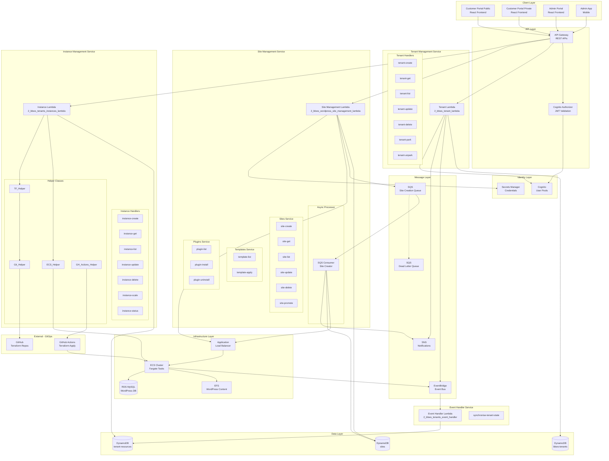

### 1.2 Tenant Lambda Service Components

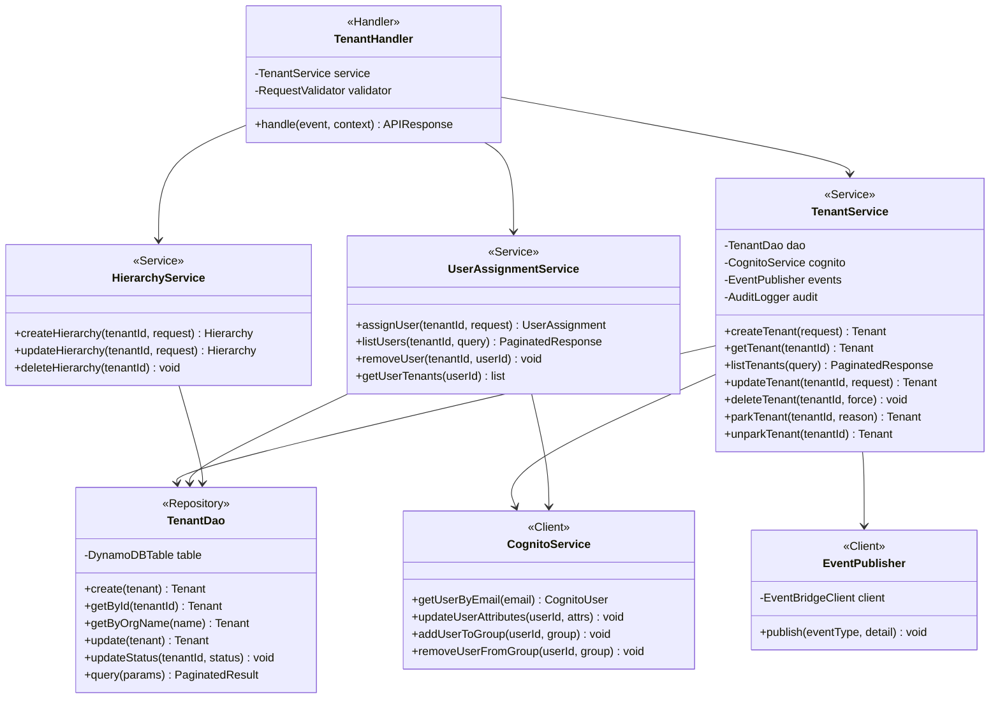

### 1.3 Site Management Service Components

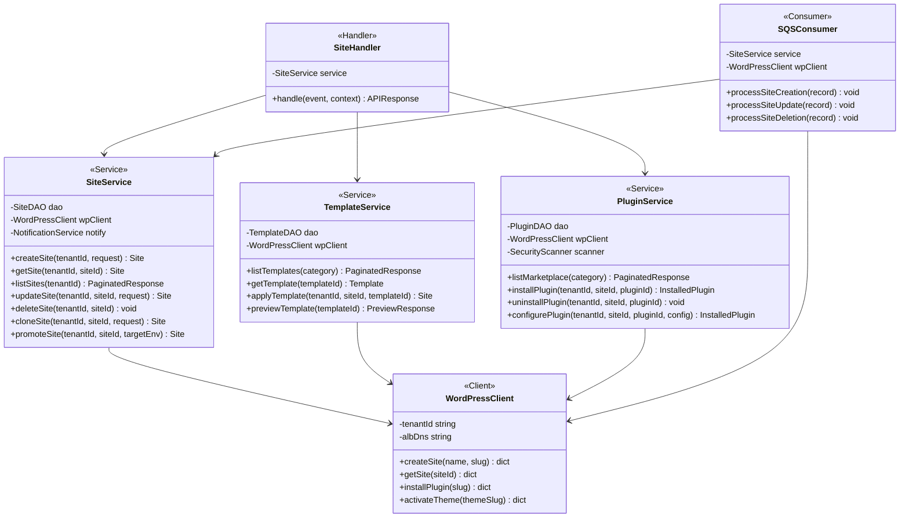

### 1.4 Instance Management Service Components

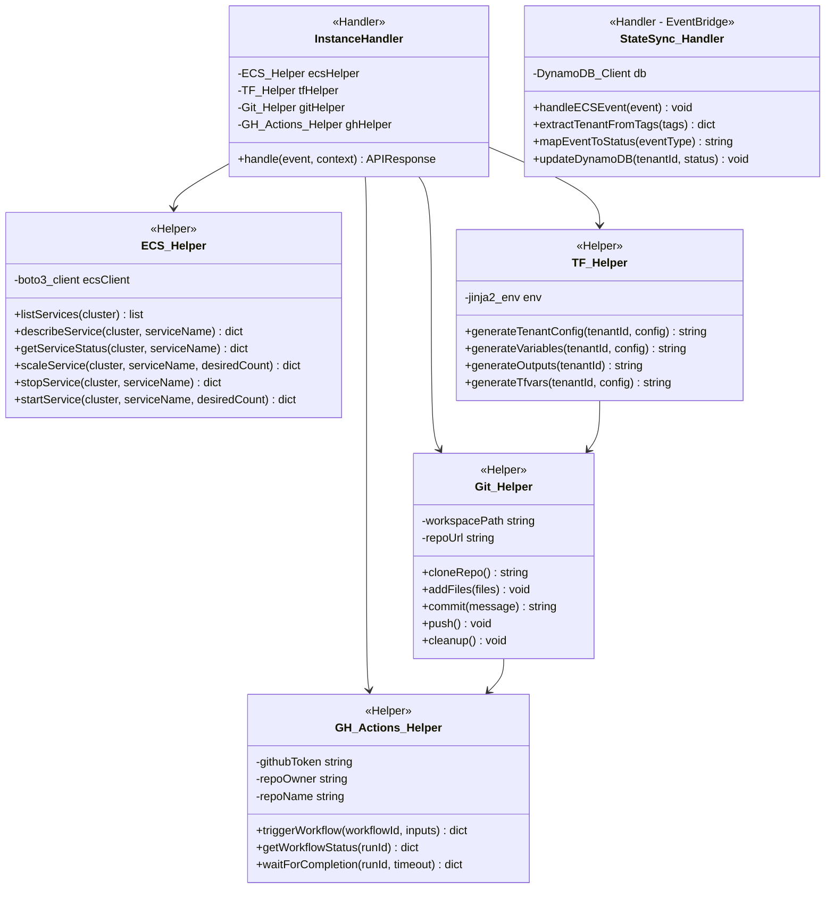

---

## 2. Deployment Diagram

### 2.1 Multi-Environment AWS Infrastructure

```mermaid
graph TB
    subgraph "DEV Environment"
        subgraph "AWS Account: 536580886816"
            subgraph "Region: af-south-1"
                subgraph "VPC - DEV"
                    subgraph "Public Subnets"
                        ALB_DEV[ALB<br/>bbws-alb-dev]
                        NAT_DEV[NAT Gateway]
                    end
                    subgraph "Private Subnets - AZ1"
                        ECS_DEV_AZ1[ECS Tasks<br/>Tenant Services]
                        Lambda_DEV_AZ1[Lambda Functions<br/>VPC Connected]
                    end
                    subgraph "Private Subnets - AZ2"
                        ECS_DEV_AZ2[ECS Tasks<br/>Tenant Services]
                        Lambda_DEV_AZ2[Lambda Functions<br/>VPC Connected]
                    end
                    subgraph "Data Subnets"
                        RDS_DEV[(RDS MySQL<br/>Multi-AZ)]
                        EFS_DEV[(EFS<br/>WordPress Content)]
                    end
                end
                APIGW_DEV[API Gateway]
                DDB_DEV[(DynamoDB<br/>On-Demand)]
                Cognito_DEV[Cognito<br/>User Pool]
                S3_DEV[(S3 Buckets<br/>No Public Access)]
                EventBridge_DEV[EventBridge]
                SQS_DEV[SQS Queues]
            end
        end
    end

    subgraph "SIT Environment"
        subgraph "AWS Account: 815856636111"
            subgraph "Region: af-south-1"
                subgraph "VPC - SIT"
                    subgraph "Public Subnets SIT"
                        ALB_SIT[ALB<br/>bbws-alb-sit]
                        NAT_SIT[NAT Gateway]
                    end
                    subgraph "Private Subnets SIT - AZ1"
                        ECS_SIT_AZ1[ECS Tasks]
                        Lambda_SIT_AZ1[Lambda Functions]
                    end
                    subgraph "Private Subnets SIT - AZ2"
                        ECS_SIT_AZ2[ECS Tasks]
                        Lambda_SIT_AZ2[Lambda Functions]
                    end
                    subgraph "Data Subnets SIT"
                        RDS_SIT[(RDS MySQL<br/>Multi-AZ)]
                        EFS_SIT[(EFS)]
                    end
                end
                APIGW_SIT[API Gateway]
                DDB_SIT[(DynamoDB)]
                Cognito_SIT[Cognito]
                S3_SIT[(S3 Buckets)]
                EventBridge_SIT[EventBridge]
                SQS_SIT[SQS Queues]
            end
        end
    end

    subgraph "PROD Environment"
        subgraph "AWS Account: 093646564004"
            subgraph "Primary Region: af-south-1"
                subgraph "VPC - PROD Primary"
                    subgraph "Public Subnets PROD"
                        ALB_PROD[ALB<br/>bbws-alb-prod]
                        NAT_PROD[NAT Gateway]
                    end
                    subgraph "Private Subnets PROD - AZ1"
                        ECS_PROD_AZ1[ECS Tasks]
                        Lambda_PROD_AZ1[Lambda Functions]
                    end
                    subgraph "Private Subnets PROD - AZ2"
                        ECS_PROD_AZ2[ECS Tasks]
                        Lambda_PROD_AZ2[Lambda Functions]
                    end
                    subgraph "Private Subnets PROD - AZ3"
                        ECS_PROD_AZ3[ECS Tasks]
                        Lambda_PROD_AZ3[Lambda Functions]
                    end
                    subgraph "Data Subnets PROD"
                        RDS_PROD[(RDS MySQL<br/>Multi-AZ)]
                        EFS_PROD[(EFS)]
                    end
                end
                APIGW_PROD[API Gateway]
                DDB_PROD[(DynamoDB<br/>Global Tables)]
                Cognito_PROD[Cognito]
                S3_PROD[(S3 Buckets<br/>Cross-Region Replication)]
                Route53[Route 53<br/>Health Checks]
                CloudFront[CloudFront<br/>CDN]
            end

            subgraph "DR Region: eu-west-1"
                subgraph "VPC - PROD DR"
                    ALB_DR[ALB<br/>bbws-alb-dr]
                    ECS_DR[ECS Tasks<br/>Standby]
                end
                DDB_DR[(DynamoDB<br/>Global Tables Replica)]
                S3_DR[(S3 Buckets<br/>Replicated)]
            end
        end
    end

    %% Cross-region replication
    DDB_PROD -.->|Global Tables| DDB_DR
    S3_PROD -.->|Cross-Region Replication| S3_DR
    Route53 --> ALB_PROD
    Route53 -.->|Failover| ALB_DR
```

### 2.2 Per-Environment Lambda Deployment

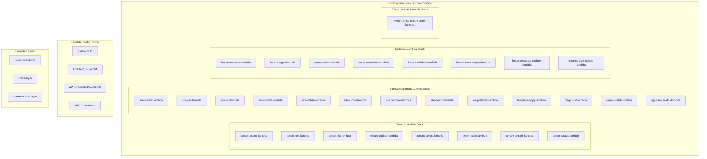

---

## 3. Sequence Diagrams

### 3.1 Tenant Creation Flow

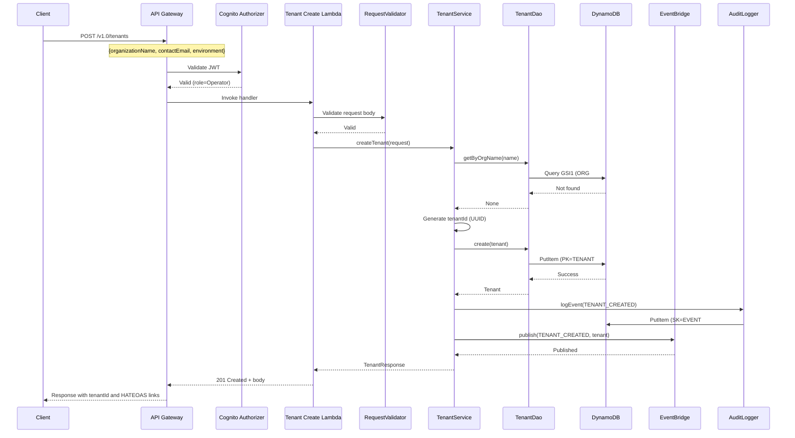

### 3.2 Site Creation (Async) Flow - API to SQS to WordPress

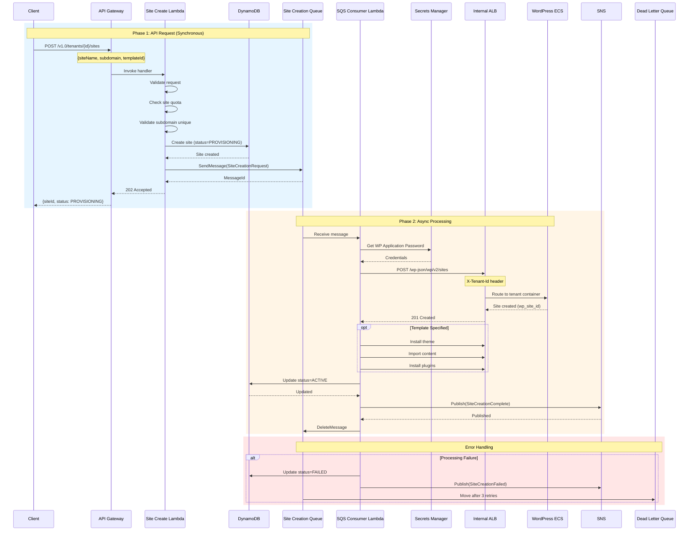

### 3.3 Instance Provisioning (GitOps) Flow

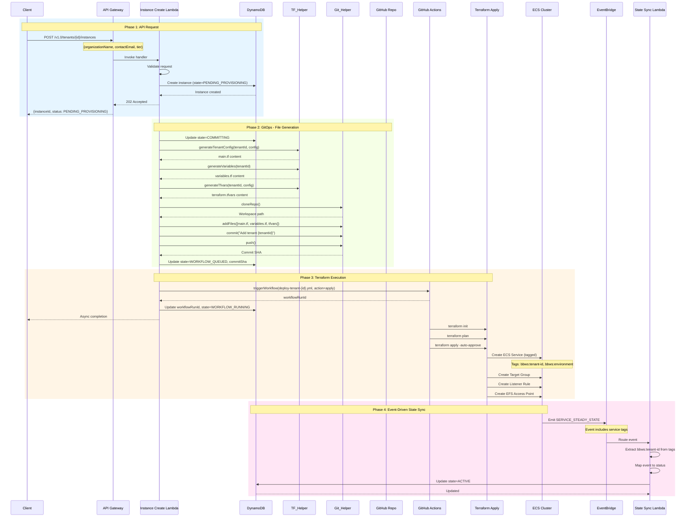

### 3.4 Event-Driven State Synchronization

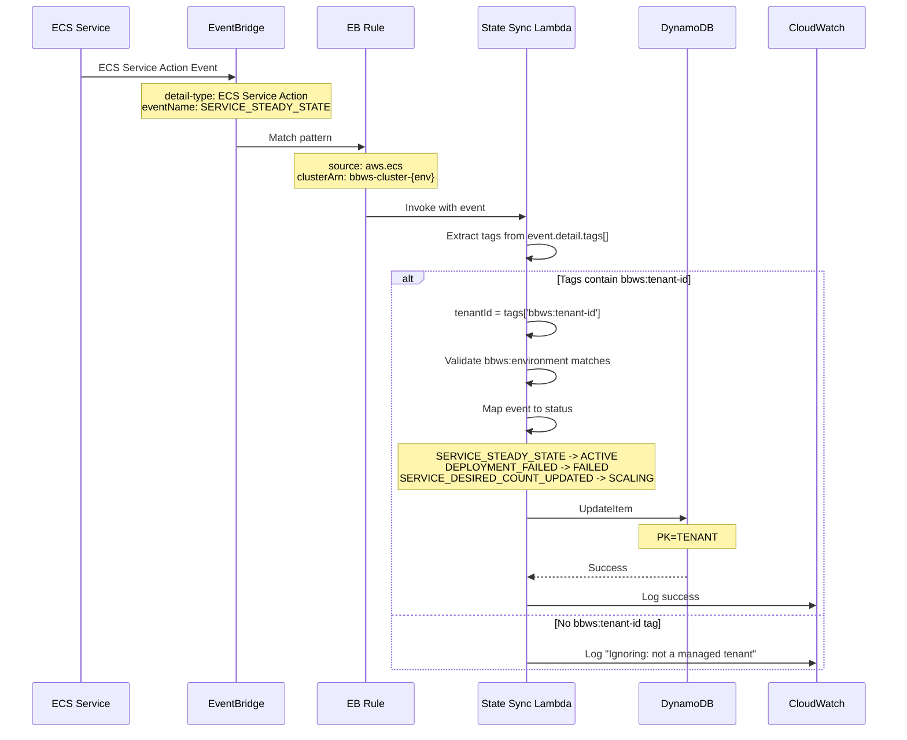

---

## 4. Data Flow Diagram

### 4.1 DynamoDB Single-Table Design - Access Patterns

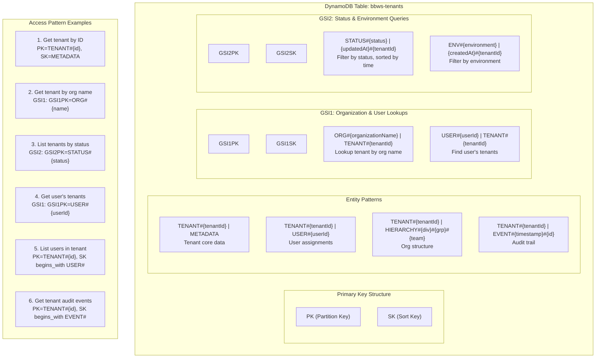

### 4.2 Sites Table Access Patterns

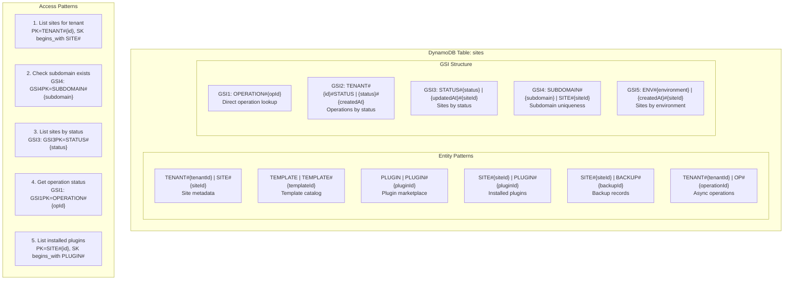

### 4.3 Instance Resources Table Access Patterns

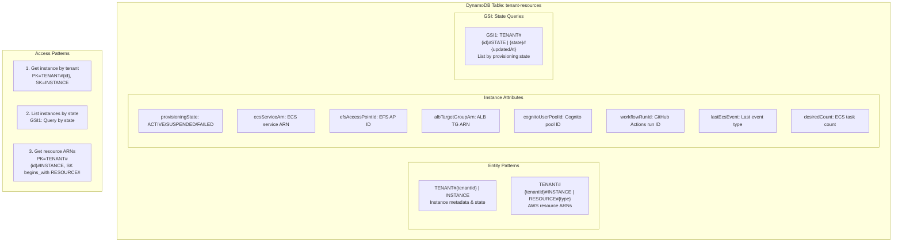

---

## 5. Event Flow Diagram

### 5.1 EventBridge Event Routing

```mermaid
graph TB
    subgraph "Event Sources"
        TenantLambda[Tenant Lambda<br/>TENANT_CREATED<br/>TENANT_PARKED<br/>TENANT_UNPARKED]
        SiteLambda[Site Management Lambda<br/>SITE_CREATED<br/>SITE_DELETED]
        ECS[ECS Cluster<br/>SERVICE_STEADY_STATE<br/>DEPLOYMENT_FAILED<br/>TASK_STATE_CHANGE]
        PayFast[PayFast ITN<br/>ORDER_CREATED]
    end

    subgraph "EventBridge"
        EB[EventBridge<br/>bbws-events-{env}]

        subgraph "Rules"
            R1[tenant-lifecycle-rule<br/>source: bbws.tenant-management]
            R2[site-lifecycle-rule<br/>source: bbws.site-management]
            R3[ecs-state-sync-rule<br/>source: aws.ecs]
            R4[order-events-rule<br/>source: bbws.payment]
        end
    end

    subgraph "Event Targets"
        subgraph "Tenant Events"
            WPInstanceLambda[WP Instance Lambda<br/>Handle park/unpark]
        end

        subgraph "Site Events"
            NotifyLambda[Notification Lambda]
        end

        subgraph "ECS Events"
            StateSyncLambda[State Sync Lambda<br/>Update DynamoDB]
        end

        subgraph "Order Events (SNS Fan-Out)"
            SNSTopic[SNS Topic<br/>bbws-order-events]
            Q1[SQS: order-record]
            Q2[SQS: order-pdf]
            Q3[SQS: internal-notify]
            Q4[SQS: customer-notify]
            L1[OrderCreatorRecord]
            L2[OrderPDFCreator]
            L3[InternalNotificationSender]
            L4[CustomerConfirmationSender]
        end
    end

    subgraph "Data Stores"
        DDB[(DynamoDB)]
        S3[(S3 Bucket)]
        SES[SES Email]
    end

    %% Event flow
    TenantLambda --> EB
    SiteLambda --> EB
    ECS --> EB
    PayFast --> EB

    EB --> R1
    EB --> R2
    EB --> R3
    EB --> R4

    R1 --> WPInstanceLambda
    R2 --> NotifyLambda
    R3 --> StateSyncLambda
    R4 --> SNSTopic

    SNSTopic --> Q1
    SNSTopic --> Q2
    SNSTopic --> Q3
    SNSTopic --> Q4

    Q1 --> L1
    Q2 --> L2
    Q3 --> L3
    Q4 --> L4

    WPInstanceLambda --> DDB
    StateSyncLambda --> DDB
    L1 --> DDB
    L2 --> S3
    L3 --> SES
    L4 --> SES
```

### 5.2 ECS State Change Events

```mermaid
graph LR
    subgraph "ECS Cluster"
        Service[ECS Service<br/>tenant-{id}-wordpress]
        Task1[Task 1]
        Task2[Task 2]
    end

    subgraph "Events Emitted"
        E1[SERVICE_STEADY_STATE<br/>Service stabilized]
        E2[SERVICE_TASK_START_IMPAIRED<br/>Tasks failing]
        E3[SERVICE_DESIRED_COUNT_UPDATED<br/>Scale operation]
        E4[DEPLOYMENT_COMPLETED<br/>Deploy finished]
        E5[DEPLOYMENT_FAILED<br/>Deploy failed]
        E6[DEPLOYMENT_IN_PROGRESS<br/>Deploying]
        E7[TASK_STOPPED<br/>Task terminated]
        E8[TASK_RUNNING<br/>Task started]
    end

    subgraph "State Mapping"
        S1[ACTIVE]
        S2[FAILED]
        S3[SCALING]
        S4[PROVISIONING]
        S5[Log Only]
    end

    Service --> E1
    Service --> E2
    Service --> E3
    Service --> E4
    Service --> E5
    Service --> E6
    Task1 --> E7
    Task2 --> E8

    E1 --> S1
    E2 --> S2
    E3 --> S3
    E4 --> S1
    E5 --> S2
    E6 --> S4
    E7 --> S5
    E8 --> S5
```

### 5.3 Order Processing Event Flow (SNS Fan-Out)

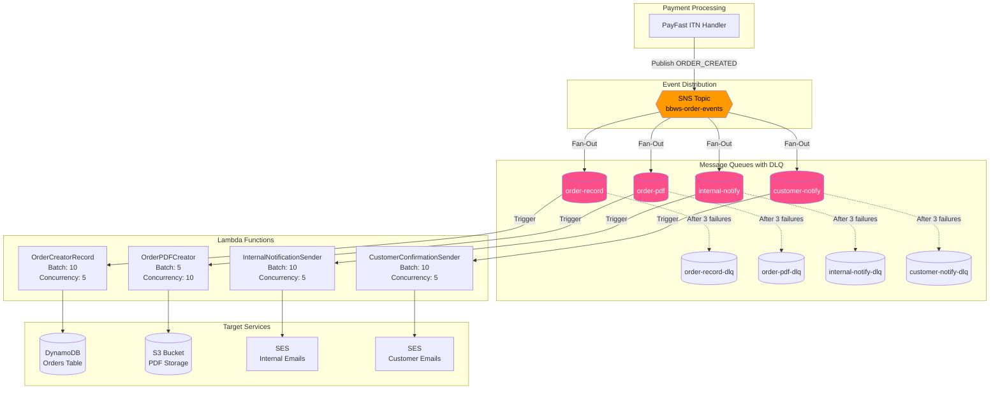

---

## Appendix: Repository Mapping

| Repository | Service | Lambda Functions |
|------------|---------|------------------|
| `2_bbws_tenant_lambda` | Tenant Management | 8 functions (CRUD, park/unpark, status) |
| `2_bbws_wordpress_site_management_lambda` | Site Management | 11+ functions (sites, templates, plugins) |
| `2_bbws_tenants_instances_lambda` | Instance Management | 8 functions (CRUD, status, scale) |
| `2_bbws_tenants_event_handler` | Event Handler | 1 function (state sync) |
| `2_bbws_tenants_instances_dev` | GitOps - DEV | Terraform configs + GitHub Actions |
| `2_bbws_tenants_instances_sit` | GitOps - SIT | Terraform configs + GitHub Actions |
| `2_bbws_tenants_instances_prod` | GitOps - PROD | Terraform configs + GitHub Actions |

---

## Document Control

| Version | Date | Author | Changes |
|---------|------|--------|---------|
| 1.0 | 2026-01-25 | Worker 6-8 | Initial version - All architecture diagrams |

---

**End of Document**
