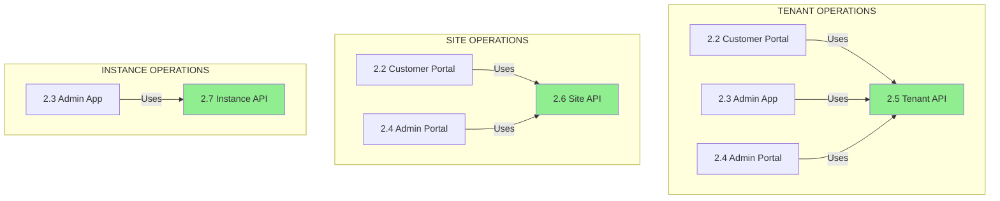
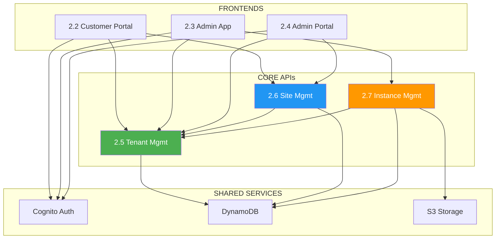
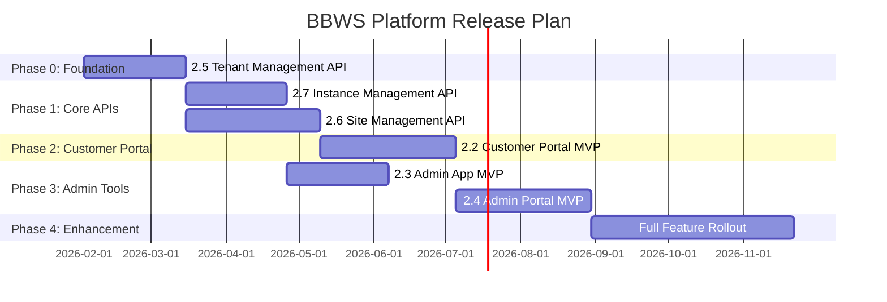

# BBWS BRS Analysis Report
## Functions, Duplications & Release Plan

**Generated**: 2026-01-16
**Prepared by**: Agentic Project Manager
**Status**: For Review

---

## 1. Executive Summary

This analysis covers 6 Business Requirements Specifications (BRS) for the BBWS platform:

| BRS | Name | Type | Primary User |
|-----|------|------|--------------|
| 2.2 | Customer Portal (Private) | UI/Frontend | Customers |
| 2.3 | Admin App | UI/Frontend | BBWS Admins |
| 2.4 | Admin Portal | UI/Frontend | BBWS Staff |
| 2.5 | Tenant Management | API/Backend | System/APIs |
| 2.6 | WordPress Site Management | API/Backend | System/APIs |
| 2.7 | WordPress Instance Management | API/Backend | System/APIs |

**Key Finding**: The 6 BRS documents form a **3-Layer Architecture**:
- **Layer 1 (APIs)**: 2.5, 2.6, 2.7 - Core backend services
- **Layer 2 (Customer UI)**: 2.2 - Customer-facing frontend
- **Layer 3 (Admin UIs)**: 2.3, 2.4 - Internal admin frontends

---

## 2. System Architecture Overview

```
┌─────────────────────────────────────────────────────────────────────────────┐
│                           BBWS PLATFORM ARCHITECTURE                         │
├─────────────────────────────────────────────────────────────────────────────┤
│                                                                              │
│   ┌──────────────────────────────────────────────────────────────────────┐  │
│   │                        FRONTEND LAYER (UIs)                           │  │
│   ├──────────────────────────────────────────────────────────────────────┤  │
│   │                                                                        │  │
│   │  ┌─────────────────┐  ┌─────────────────┐  ┌─────────────────┐       │  │
│   │  │    BRS 2.2      │  │    BRS 2.3      │  │    BRS 2.4      │       │  │
│   │  │   CUSTOMER      │  │   ADMIN APP     │  │  ADMIN PORTAL   │       │  │
│   │  │   PORTAL        │  │   (Operations)  │  │  (Staff Console)│       │  │
│   │  │  (Private)      │  │                 │  │                 │       │  │
│   │  └────────┬────────┘  └────────┬────────┘  └────────┬────────┘       │  │
│   │           │                    │                    │                 │  │
│   └───────────┼────────────────────┼────────────────────┼─────────────────┘  │
│               │                    │                    │                    │
│               ▼                    ▼                    ▼                    │
│   ┌──────────────────────────────────────────────────────────────────────┐  │
│   │                        API GATEWAY LAYER                              │  │
│   │                    (REST APIs + Lambda Authorizers)                   │  │
│   └──────────────────────────────────────────────────────────────────────┘  │
│               │                    │                    │                    │
│               ▼                    ▼                    ▼                    │
│   ┌──────────────────────────────────────────────────────────────────────┐  │
│   │                        BACKEND LAYER (APIs)                           │  │
│   ├──────────────────────────────────────────────────────────────────────┤  │
│   │                                                                        │  │
│   │  ┌─────────────────┐  ┌─────────────────┐  ┌─────────────────┐       │  │
│   │  │    BRS 2.5      │  │    BRS 2.6      │  │    BRS 2.7      │       │  │
│   │  │    TENANT       │  │   WORDPRESS     │  │   WORDPRESS     │       │  │
│   │  │  MANAGEMENT     │  │     SITE        │  │   INSTANCE      │       │  │
│   │  │    (Logical)    │  │  MANAGEMENT     │  │  MANAGEMENT     │       │  │
│   │  │                 │  │   (Content)     │  │ (Infrastructure)│       │  │
│   │  └─────────────────┘  └─────────────────┘  └─────────────────┘       │  │
│   │        WHO?                 WHAT?               WHERE?               │  │
│   │   (Organisation)         (Sites/Content)       (Environments)        │  │
│   │                                                                        │  │
│   └──────────────────────────────────────────────────────────────────────┘  │
│                                                                              │
└─────────────────────────────────────────────────────────────────────────────┘
```

---

## 3. Function Matrix by BRS

### 3.1 Core Functions Summary

| Function Domain | 2.2 Customer Portal | 2.3 Admin App | 2.4 Admin Portal | 2.5 Tenant API | 2.6 Site API | 2.7 Instance API |
|----------------|:-------------------:|:-------------:|:----------------:|:--------------:|:------------:|:----------------:|
| **Authentication** | Customer Auth | Admin MFA | Admin MFA | - | - | - |
| **Tenant CRUD** | View Own | Cross-Env | Cross-Tenant | **PRIMARY** | - | - |
| **Org Hierarchy** | Manage Own | - | View All | **PRIMARY** | - | - |
| **User Management** | Invite Users | Assign Roles | Manage Admins | **PRIMARY** | - | - |
| **Site Creation** | Create Sites | - | - | - | **PRIMARY** | - |
| **Site Management** | Manage Sites | View Status | Force Actions | - | **PRIMARY** | - |
| **Template Marketplace** | Use Templates | - | - | - | **PRIMARY** | - |
| **Plugin Management** | Install Plugins | - | - | - | **PRIMARY** | - |
| **Environment Promotion** | DEV→SIT→PROD | Approval Flow | - | - | **PRIMARY** | - |
| **Instance Provisioning** | - | One-Click | - | - | - | **PRIMARY** |
| **Instance Lifecycle** | - | Suspend/Resume | - | - | - | **PRIMARY** |
| **Backups** | Create/Restore | Trigger/Verify | - | - | - | **PRIMARY** |
| **Monitoring** | View Status | Real-time | System Health | - | - | - |
| **DNS/Certificates** | - | Manage | - | - | - | - |
| **Support Tickets** | Create/Reply | - | Queue/Assign | - | - | - |
| **Campaigns** | - | - | Create/Manage | - | - | - |
| **SLA Management** | - | - | Monitor/Config | - | - | - |
| **Billing** | View/Pay | - | View All | - | - | - |
| **Audit Logs** | - | View | Query/Report | - | - | - |
| **Cost Management** | - | View/Optimize | Revenue Reports | - | - | - |

**Legend**:
- **PRIMARY** = This BRS owns the core API implementation
- Other entries = Consumers of the API through UI

---

## 4. Duplication Analysis

### 4.1 Identified Duplications (OVERLAPS)



### 4.2 Duplication Matrix

| Overlapping Function | BRS Documents | Risk Level | Resolution |
|---------------------|---------------|------------|------------|
| **Tenant View/Edit** | 2.2, 2.3, 2.4 | LOW | Different scopes: Own vs Cross-Env vs Cross-Tenant |
| **Site Status View** | 2.2, 2.3, 2.4 | LOW | Different perspectives: Customer vs Ops vs Staff |
| **User Management** | 2.2, 2.3, 2.4, 2.5 | MEDIUM | Clear API ownership (2.5), UIs consume |
| **Environment Promotion** | 2.2, 2.3 | MEDIUM | Customer initiates (2.2), Admin approves (2.3) |
| **Support Tickets** | 2.2, 2.4 | LOW | Customer creates (2.2), Staff manages (2.4) |
| **Monitoring/Health** | 2.3, 2.4 | MEDIUM | Different focus: Instance vs Platform |
| **Backup Operations** | 2.2, 2.3 | LOW | Customer backup (2.2), Admin verify (2.3) |

### 4.3 Duplication Risk Assessment

```
┌────────────────────────────────────────────────────────────────────────┐
│                    DUPLICATION RISK HEATMAP                             │
├────────────────────────────────────────────────────────────────────────┤
│                                                                         │
│   Function              2.2   2.3   2.4   2.5   2.6   2.7   Risk       │
│   ─────────────────────────────────────────────────────────────────    │
│   Tenant CRUD           [■]   [■]   [■]   [●]   [ ]   [ ]   LOW ✅     │
│   User Assignment       [■]   [■]   [■]   [●]   [ ]   [ ]   MEDIUM ⚠️  │
│   Site Management       [■]   [□]   [■]   [ ]   [●]   [ ]   LOW ✅     │
│   Env Promotion         [■]   [■]   [ ]   [ ]   [●]   [ ]   MEDIUM ⚠️  │
│   Support Tickets       [■]   [ ]   [■]   [ ]   [ ]   [ ]   LOW ✅     │
│   Monitoring            [□]   [■]   [■]   [ ]   [ ]   [ ]   MEDIUM ⚠️  │
│                                                                         │
│   Legend: [●] = Primary Owner  [■] = Uses API  [□] = Limited Use       │
│                                                                         │
└────────────────────────────────────────────────────────────────────────┘
```

### 4.4 Resolution Recommendations

| Overlap Area | Recommendation |
|--------------|----------------|
| **User Management** | Single API (2.5), clear role separation in UIs |
| **Environment Promotion** | Workflow: Customer initiates → Admin approves → System executes |
| **Monitoring** | Shared metrics layer, different dashboards per audience |
| **Backup Operations** | Single API (2.7), customer triggers, admin verifies |

---

## 5. Dependency Flow

### 5.1 API Dependencies



### 5.2 Build Order (Dependencies)

```
PHASE 1: Foundation APIs (No Dependencies)
├── 2.5 Tenant Management API  ← MUST BUILD FIRST
│
PHASE 2: Dependent APIs
├── 2.6 WordPress Site Management API  ← Depends on 2.5
├── 2.7 WordPress Instance Management API  ← Depends on 2.5
│
PHASE 3: Frontends (Depend on ALL APIs)
├── 2.2 Customer Portal  ← Depends on 2.5, 2.6
├── 2.3 Admin App  ← Depends on 2.5, 2.7
├── 2.4 Admin Portal  ← Depends on 2.5, 2.6
```

---

## 6. Release Plan

### 6.1 Phase Overview



### 6.2 Detailed Release Schedule

| Phase | BRS | Deliverable | Duration | Dependencies | Priority |
|-------|-----|-------------|----------|--------------|----------|
| **0** | 2.5 | Tenant Management API | 6 weeks | None | P0 - CRITICAL |
| **1a** | 2.7 | Instance Management API | 6 weeks | 2.5 | P0 - CRITICAL |
| **1b** | 2.6 | Site Management API | 8 weeks | 2.5 | P0 - CRITICAL |
| **2** | 2.2 | Customer Portal MVP | 8 weeks | 2.5, 2.6 | P0 - CRITICAL |
| **3a** | 2.3 | Admin App MVP | 6 weeks | 2.5, 2.7 | P1 - HIGH |
| **3b** | 2.4 | Admin Portal MVP | 8 weeks | 2.5, 2.6 | P1 - HIGH |
| **4** | ALL | Full Features | 12 weeks | All MVPs | P2 - MEDIUM |

### 6.3 MVP Feature Sets

#### Phase 0: BRS 2.5 - Tenant Management API (MVP)
- [ ] Tenant CRUD operations
- [ ] Organization hierarchy management
- [ ] User-tenant assignments
- [ ] Status lifecycle (PENDING → ACTIVE → SUSPENDED)
- [ ] DynamoDB single-table design

#### Phase 1a: BRS 2.7 - Instance Management API (MVP)
- [ ] Customer onboarding (provision WordPress)
- [ ] Instance suspension/resumption
- [ ] Basic resource scaling
- [ ] Customer offboarding

#### Phase 1b: BRS 2.6 - Site Management API (MVP)
- [ ] Site CRUD operations
- [ ] Basic template application
- [ ] Plugin installation (curated list)
- [ ] Environment promotion (DEV → SIT → PROD)

#### Phase 2: BRS 2.2 - Customer Portal (MVP)
- [ ] Customer authentication (Cognito)
- [ ] Dashboard with summary widgets
- [ ] Site management UI
- [ ] Subscription viewing
- [ ] Support ticket creation

#### Phase 3a: BRS 2.3 - Admin App (MVP)
- [ ] Admin authentication with MFA
- [ ] Tenant discovery dashboard
- [ ] One-click provisioning wizard
- [ ] Multi-environment promotion workflow
- [ ] Basic monitoring

#### Phase 3b: BRS 2.4 - Admin Portal (MVP)
- [ ] Admin authentication
- [ ] Cross-tenant visibility
- [ ] Support ticket queue
- [ ] Basic campaign management
- [ ] SLA monitoring

### 6.4 Risk Mitigation

| Risk | Impact | Mitigation |
|------|--------|------------|
| API delays block frontends | HIGH | Parallel development with mocked APIs |
| Integration issues | MEDIUM | Continuous integration testing |
| Scope creep | HIGH | Strict MVP definitions |
| Resource contention | MEDIUM | Clear team assignments per BRS |

---

## 7. Implementation Recommendations

### 7.1 Development Strategy

```
┌─────────────────────────────────────────────────────────────────────────┐
│                    RECOMMENDED DEVELOPMENT APPROACH                      │
├─────────────────────────────────────────────────────────────────────────┤
│                                                                          │
│   1. API-FIRST DEVELOPMENT                                               │
│      ├── Define OpenAPI specs for 2.5, 2.6, 2.7 FIRST                   │
│      ├── Generate mock servers for frontend teams                        │
│      └── Frontend teams can start in parallel                            │
│                                                                          │
│   2. SHARED INFRASTRUCTURE                                               │
│      ├── Single DynamoDB table design (all APIs)                        │
│      ├── Shared Cognito pools (Customer + Admin)                        │
│      └── Common Lambda layers (auth, logging)                           │
│                                                                          │
│   3. MICROSERVICES ISOLATION                                             │
│      ├── Each BRS = separate repo                                        │
│      ├── Each BRS = separate Terraform                                   │
│      └── Each BRS = separate CI/CD pipeline                             │
│                                                                          │
│   4. TEST-DRIVEN DEVELOPMENT                                             │
│      ├── Unit tests per Lambda                                           │
│      ├── Integration tests per API                                       │
│      └── E2E tests per frontend                                          │
│                                                                          │
└─────────────────────────────────────────────────────────────────────────┘
```

### 7.2 Team Structure Recommendation

| Team | Responsibility | BRS Ownership |
|------|----------------|---------------|
| **API Team** | Core backend services | 2.5, 2.6, 2.7 |
| **Customer UX Team** | Customer-facing UI | 2.2 |
| **Admin UX Team** | Internal tools | 2.3, 2.4 |
| **Platform Team** | Infrastructure, CI/CD | Shared services |
| **QA Team** | Testing all layers | Cross-cutting |

### 7.3 Critical Path

```
START
  │
  ▼
┌─────────────────┐
│ 2.5 Tenant API  │ ◄── CRITICAL: Everything depends on this
└────────┬────────┘
         │
    ┌────┴────┐
    ▼         ▼
┌───────┐  ┌───────┐
│ 2.7   │  │ 2.6   │ ◄── Can be parallel after 2.5
│ Inst. │  │ Site  │
└───┬───┘  └───┬───┘
    │          │
    ▼          ▼
┌───────┐  ┌───────┐
│ 2.3   │  │ 2.2   │ ◄── Frontends after their APIs
│ Admin │  │ Cust. │
└───┬───┘  └───┬───┘
    │          │
    └────┬─────┘
         ▼
    ┌─────────┐
    │  2.4    │ ◄── Admin Portal needs both site + tenant APIs
    │ Portal  │
    └────┬────┘
         │
         ▼
        END
```

---

## 8. Summary

### 8.1 Key Insights

1. **Clear Separation**: APIs (2.5, 2.6, 2.7) vs UIs (2.2, 2.3, 2.4)
2. **Low Duplication Risk**: Overlaps are by design (same API, different views)
3. **Critical Dependency**: BRS 2.5 (Tenant Management) is the foundation
4. **Parallel Opportunity**: 2.6 and 2.7 can develop in parallel after 2.5

### 8.2 Next Steps

1. **Approve this analysis** and release plan
2. **Create project plans** for each phase
3. **Define OpenAPI specs** for 2.5, 2.6, 2.7
4. **Allocate teams** per recommendation
5. **Begin Phase 0** (BRS 2.5 Tenant Management API)

---

## 9. Sign-Off

| Role | Name | Date | Signature |
|------|------|------|-----------|
| Product Owner | | | |
| Technical Lead | | | |
| Business Owner | | | |

---

*Document generated by Agentic Project Manager*
*Location: `.claude/staging/brs-analysis/BRS_Analysis_Report.md`*
