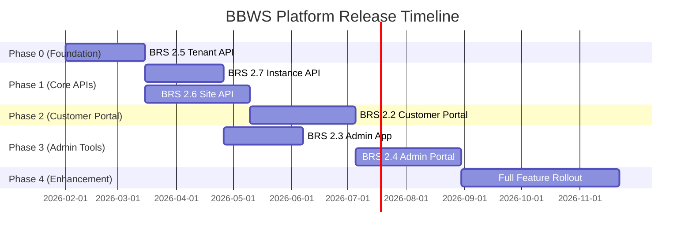

# BBWS Platform - Master Release Plan
## BRS 2.2, 2.3, 2.4, 2.5, 2.6, 2.7 Implementation

**Document ID**: PP-MASTER-BBWS-PLATFORM
**Version**: 1.1
**Created**: 2026-01-16
**Last Updated**: 2026-01-25
**Status**: Active - In Development
**SDLC Reference**: `bbws-sdlc-v1/process-definition.md`
**Release Plans**: `../release_plans/` (Phase-based release plan documents)

---

## PROJECT STATUS

```
┌─────────────────────────────────────────────────────────────────────────┐
│                     MASTER RELEASE PLAN STATUS                          │
│                     Last Updated: 2026-01-25                            │
├─────────────────────────────────────────────────────────────────────────┤
│                                                                          │
│   Overall Progress: [████████░░░░░░░░░░░░] 40%                          │
│                                                                          │
│   Phase 0:  [██████████] 100% ✅ FULLY DEPLOYED TO DEV                  │
│   Phase 1a: [██████████] 100% ✅ FULLY DEPLOYED TO DEV                  │
│   Phase 1b: [██░░░░░░░░] 20%  🔄 In Development (Site Mgmt API)         │
│   Phase 2:  [░░░░░░░░░░] 0%   ⏸️ Blocked by Phase 1b                    │
│   Phase 3a: [░░░░░░░░░░] 0%   ⏸️ Not Started (can start after 1a)       │
│   Phase 3b: [░░░░░░░░░░] 0%   ⏸️ Blocked by Phase 2                     │
│                                                                          │
│   KEY DEPLOYMENTS:                                                       │
│   ✅ Lambda: bbws-tenant-instance-management-dev (eu-west-1)            │
│   ✅ Lambda Env: ECS_CLUSTER_NAME, TEMPLATE_BUCKET, GITHUB_* configured │
│   ✅ CI/CD: GitHub Actions with OIDC auth                               │
│   ✅ API Gateway: https://o158f3j653.execute-api.eu-west-1.amazonaws.com│
│   ✅ DynamoDB: tenants table with 4 GSIs (eu-west-1)                    │
│   ✅ IAM: Full DynamoDB CRUD + GSI access policies                      │
│   ✅ ECS Cluster: dev-cluster (eu-west-1) - Ready for instances         │
│                                                                          │
│   RELEASE PLANS: See ../release_plans/ for detailed phase plans         │
│                                                                          │
└─────────────────────────────────────────────────────────────────────────┘
```

---

## RELEASE PLANS DIRECTORY

All detailed release plans are now organized in the `../release_plans/` directory:

```
release_plans/
├── README.md                           # Master index
├── phase-0-foundation/
│   ├── R1.0_Tenant_Management_API.md   # BRS 2.5
│   └── R1.0.1_Access_Management.md     # BRS 2.8 (Dependency)
├── phase-1-core-apis/
│   ├── R1.1_Instance_Management_API.md # BRS 2.7
│   ├── R1.2_Site_Management_API.md     # BRS 2.6
│   └── R1.3_Subscription_Billing.md    # BRS 2.1.11 (Dependency)
├── phase-2-customer-portal/
│   └── R2.0_Customer_Portal_Private.md # BRS 2.2 (65 User Stories)
└── phase-3-admin-tools/
    ├── R2.1_Admin_App.md               # BRS 2.3
    └── R2.2_Admin_Portal.md            # BRS 2.4
```

---

## 1. Executive Summary

### 1.1 Objective

Implement the complete BBWS Platform consisting of 3 core backend APIs and 3 frontend applications, following the BBWS Full-Stack SDLC process with parallel track execution.

### 1.2 Platform Components

| Component | BRS | Type | Phase | Priority |
|-----------|-----|------|-------|----------|
| Tenant Management API | 2.5 | Backend API | Phase 0 | P0 - CRITICAL |
| Instance Management API | 2.7 | Backend API | Phase 1a | P0 - CRITICAL |
| Site Management API | 2.6 | Backend API | Phase 1b | P0 - CRITICAL |
| Customer Portal (Private) | 2.2 | React Frontend | Phase 2 | P0 - CRITICAL |
| Admin App | 2.3 | React Frontend | Phase 3a | P1 - HIGH |
| Admin Portal | 2.4 | React Frontend | Phase 3b | P1 - HIGH |

### 1.3 SDLC Tracks

Following `bbws-sdlc-v1/process-definition.md`:

| Track | Stages | Workers | Applies To |
|-------|--------|---------|------------|
| **Backend** | 10 | 35 | BRS 2.5, 2.6, 2.7 |
| **Frontend** | 6 | 22 | BRS 2.2, 2.3, 2.4 |
| **Tenant** | 3 | 13 | BRS 2.5 (specialized) |

---

## 2. Release Phase Overview



---

## 3. Phase Breakdown

### Phase 0: BRS 2.5 - Tenant Management API (Foundation)

**Duration**: 6 weeks
**SDLC Track**: Backend (10 stages) + Tenant (3 stages)
**Workers**: 35 + 13 = 48 workers

| Stage | Name | Workers | Agent |
|-------|------|---------|-------|
| Stage 1 | Requirements & Analysis | 4 | Project Manager |
| Stage 2 | HLD Creation | 3 | HLD Architect |
| Stage 3 | LLD Creation | 4 | LLD Architect |
| Stage 4 | API Tests (TDD) | 4 | SDET Engineer |
| Stage 5 | API Implementation | 5 | Python AWS Developer |
| Stage 6 | API Proxy | 2 | Python AWS Developer |
| Stage 7 | Infrastructure (Terraform) | 4 | DevOps Engineer |
| Stage 8 | CI/CD Pipeline | 3 | DevOps Engineer |
| Stage 9 | Route53/Domain | 3 | DevOps Engineer |
| Stage 10 | Deploy & Test | 3 | DevOps + SDET |
| Stage T1 | Tenant API Implementation | 4 | Python AWS Developer |
| Stage T2 | User Hierarchy System | 4 | Python AWS Developer |
| Stage T3 | Access Control & RBAC | 5 | Python AWS Developer |

**Validation Gates**:
- Gate 1: Design Approval (after Stage 3)
- Gate 2: Code Review (after Stage 6)
- Gate 3: Infrastructure Review (after Stage 9)
- Gate T1: Tenant Security Review (after Stage T3)
- Gate 4: Production Ready (after Stage 10)

**Deliverables**:
- `HLDs/2.5_HLD_Tenant_Management.md`
- `LLDs/2.5_LLD_Tenant_Management.md`
- `2_bbws_tenant_management/` repository
- `openapi/tenant_management_v1.0.yaml`
- Terraform modules
- CI/CD pipelines
- Runbooks

---

### Phase 1a: BRS 2.7 - Instance Management API

**Duration**: 6 weeks
**SDLC Track**: Backend (10 stages)
**Dependencies**: Phase 0 (Tenant API)
**Workers**: 35 workers

| Stage | Name | Workers |
|-------|------|---------|
| Stage 1 | Requirements & Analysis | 4 |
| Stage 2 | HLD Creation | 3 |
| Stage 3 | LLD Creation | 4 |
| Stage 4 | API Tests (TDD) | 4 |
| Stage 5 | API Implementation | 5 |
| Stage 6 | API Proxy | 2 |
| Stage 7 | Infrastructure (Terraform) | 4 |
| Stage 8 | CI/CD Pipeline | 3 |
| Stage 9 | Route53/Domain | 3 |
| Stage 10 | Deploy & Test | 3 |

**Deliverables**:
- `HLDs/2.7_HLD_Instance_Management.md`
- `LLDs/2.7_LLD_Instance_Management.md`
- `2_bbws_tenants_instances_lambda/` repository (shared with Phase 0)
- DynamoDB State Table for operation tracking
- Lambda-orchestrated provisioning with DynamoDB state management
- CloudWatch monitoring for stuck/failed operations
- ECS/EFS/RDS provisioning automation

---

### Phase 1b: BRS 2.6 - Site Management API

**Duration**: 8 weeks
**SDLC Track**: Backend (10 stages)
**Dependencies**: Phase 0 (Tenant API)
**Workers**: 35 workers

**Deliverables**:
- `HLDs/2.6_HLD_Site_Management.md`
- `LLDs/2.6_LLD_Site_Management.md`
- `2_bbws_site_management/` repository
- Template marketplace
- Plugin management
- Environment promotion workflows

---

### Phase 2: BRS 2.2 - Customer Portal (Private)

**Duration**: 8 weeks
**SDLC Track**: Frontend (6 stages)
**Dependencies**: Phase 1b (Site API)
**Workers**: 22 workers

| Stage | Name | Workers | Agent |
|-------|------|---------|-------|
| Stage F1 | UI/UX Design | 4 | UX Designer |
| Stage F2 | Prototype | 3 | Web Developer |
| Stage F3 | React Mock API | 4 | Web Developer |
| Stage F4 | Frontend Tests | 4 | SDET Engineer |
| Stage F5 | API Integration | 4 | Web Developer |
| Stage F6 | Frontend Deploy | 3 | DevOps Engineer |

**Validation Gates**:
- Gate F1: Frontend Review (after Stage F4)
- Gate F2: Integration Approval (after Stage F5)

**Deliverables**:
- `2_1_bbws_web_private/` repository
- React SPA
- S3/CloudFront deployment
- Customer authentication (Cognito)

---

### Phase 3a: BRS 2.3 - Admin App

**Duration**: 6 weeks
**SDLC Track**: Frontend (6 stages)
**Dependencies**: Phase 1a (Instance API)
**Workers**: 22 workers

**Deliverables**:
- `2_bbws_admin_app/` repository
- Admin authentication (MFA)
- Cross-environment management
- Monitoring dashboards

---

### Phase 3b: BRS 2.4 - Admin Portal

**Duration**: 8 weeks
**SDLC Track**: Frontend (6 stages)
**Dependencies**: Phase 2 (Customer Portal)
**Workers**: 22 workers

**Deliverables**:
- `2_bbws_admin_portal/` repository
- Campaign management
- Support ticket queue
- SLA monitoring
- Cross-tenant visibility

---

## 4. Dependency Graph

```
                    ┌─────────────────┐
                    │ Phase 0: 2.5    │
                    │ Tenant API      │
                    │ (CRITICAL PATH) │
                    └────────┬────────┘
                             │
              ┌──────────────┼──────────────┐
              │              │              │
              ▼              ▼              │
   ┌─────────────────┐  ┌─────────────────┐ │
   │ Phase 1a: 2.7   │  │ Phase 1b: 2.6   │ │
   │ Instance API    │  │ Site API        │ │
   └────────┬────────┘  └────────┬────────┘ │
            │                    │          │
            ▼                    ▼          │
   ┌─────────────────┐  ┌─────────────────┐ │
   │ Phase 3a: 2.3   │  │ Phase 2: 2.2    │ │
   │ Admin App       │  │ Customer Portal │ │
   └─────────────────┘  └────────┬────────┘ │
                                 │          │
                                 ▼          │
                        ┌─────────────────┐ │
                        │ Phase 3b: 2.4   │ │
                        │ Admin Portal    │ │
                        └─────────────────┘ │
```

---

## 5. Resource Allocation

### 5.1 Team Structure

| Team | Members | Phases |
|------|---------|--------|
| **API Team** | 3 developers | Phase 0, 1a, 1b |
| **Customer UX Team** | 2 developers | Phase 2 |
| **Admin UX Team** | 2 developers | Phase 3a, 3b |
| **DevOps Team** | 2 engineers | All phases |
| **QA/SDET Team** | 2 engineers | All phases |
| **Project Manager** | 1 PM | All phases |

### 5.2 Parallel Execution Strategy

| Timeframe | Active Phases | Teams |
|-----------|---------------|-------|
| Weeks 1-6 | Phase 0 | API, DevOps, QA |
| Weeks 7-12 | Phase 1a + 1b (parallel) | API split, DevOps, QA |
| Weeks 13-20 | Phase 2 + 3a (parallel) | Customer UX, Admin UX |
| Weeks 21-28 | Phase 3b | Admin UX |
| Weeks 29-40 | Phase 4 (Enhancement) | All teams |

---

## 6. SDLC Process Integration

### 6.1 Project Folder Structure

Each phase follows the SDLC project folder pattern:

```
2_bbws_docs/
├── project_plans/
│   ├── MASTER_RELEASE_PLAN.md (this file)
│   ├── 00_BRS_Analysis_Report.md
│   ├── Phase_0_BRS_2.5_Tenant_Management_API.md
│   ├── Phase_1a_BRS_2.7_Instance_Management_API.md
│   ├── Phase_1b_BRS_2.6_Site_Management_API.md
│   ├── Phase_2_BRS_2.2_Customer_Portal.md
│   ├── Phase_3a_BRS_2.3_Admin_App.md
│   ├── Phase_3b_BRS_2.4_Admin_Portal.md
│   └── openapi-specs/
│       ├── tenant_management_v1.0.yaml
│       ├── site_management_v1.0.yaml
│       └── instance_management_v1.0.yaml
│
└── release_plans/                        # NEW: Phase-based release plans
    ├── README.md                         # Master index with dependency graph
    ├── phase-0-foundation/               # Foundation APIs
    │   ├── R1.0_Tenant_Management_API.md
    │   └── R1.0.1_Access_Management.md
    ├── phase-1-core-apis/                # Core backend APIs
    │   ├── R1.1_Instance_Management_API.md
    │   ├── R1.2_Site_Management_API.md
    │   └── R1.3_Subscription_Billing.md
    ├── phase-2-customer-portal/          # Customer frontend
    │   └── R2.0_Customer_Portal_Private.md
    └── phase-3-admin-tools/              # Admin frontends
        ├── R2.1_Admin_App.md
        └── R2.2_Admin_Portal.md
```

### 6.2 Stage Execution via agent-spawn

```bash
# Phase 0: Execute backend + tenant tracks
cd project_plans/phase-0-tenant-api/
agent-spawn stage-1-requirements/ --runner kiro --trust-all-tools
# Wait for gate approval...
agent-spawn stage-2-hld/ --runner kiro --trust-all-tools
# Continue through stages...

# Phase 1a: Execute in parallel with 1b
agent-spawn ../phase-1a-instance-api/ --runner kiro --trust-all-tools

# Phase 1b: Execute in parallel with 1a
agent-spawn ../phase-1b-site-api/ --runner kiro --trust-all-tools
```

### 6.3 Validation Gate Protocol

Each gate requires:
1. All workers in previous stage COMPLETE
2. Gate criteria documented in stage plan
3. Explicit approval: "approved" / "go" / "continue"
4. Gate approval logged in project_plan.md

---

## 7. Risk Management

| Risk | Impact | Probability | Mitigation |
|------|--------|-------------|------------|
| Phase 0 delays | HIGH | MEDIUM | Prioritize critical path |
| API contract changes | HIGH | LOW | Freeze specs after Stage 3 |
| Integration issues | MEDIUM | MEDIUM | Continuous integration |
| Resource contention | MEDIUM | MEDIUM | Clear team assignments |
| Scope creep | HIGH | HIGH | Strict MVP definitions |

---

## 8. Success Metrics

| Metric | Target |
|--------|--------|
| Phase 0 completion | 6 weeks |
| All APIs functional | Phase 1 complete |
| Customer Portal MVP | Phase 2 complete |
| Admin tools MVP | Phase 3 complete |
| E2E test coverage | > 80% |
| Zero critical bugs | Before production |

---

## 9. Release Management

### Release Schedule Summary

| Release # | Phase | BRS | Target Release Date | UAT Signoff Date | Business Owner |
|-----------|-------|-----|---------------------|------------------|----------------|
| R1.0 | Phase 0 | 2.5 Tenant Management API | _______________ | _______________ | _______________ |
| R1.1 | Phase 1a | 2.7 Instance Management API | _______________ | _______________ | _______________ |
| R1.2 | Phase 1b | 2.6 Site Management API | _______________ | _______________ | _______________ |
| R2.0 | Phase 2 | 2.2 Customer Portal | _______________ | _______________ | _______________ |
| R2.1 | Phase 3a | 2.3 Admin App | _______________ | _______________ | _______________ |
| R2.2 | Phase 3b | 2.4 Admin Portal | _______________ | _______________ | _______________ |

---

### R1.0 - Phase 0: BRS 2.5 Tenant Management API

| Attribute | Value |
|-----------|-------|
| **Release #** | R1.0 |
| **Release Date** | _______________ |
| **UAT Signoff Date** | _______________ |
| **Business Owner** | _______________ |

**Deliverables**:
- [ ] `HLDs/2.5_HLD_Tenant_Management.md` - Approved
- [ ] `LLDs/2.5_LLD_Tenant_Management.md` - Approved
- [ ] `2_bbws_tenant_management/` repository - Code complete
- [ ] `openapi-specs/tenant_management_v1.0.yaml` - Finalized
- [ ] Terraform modules - Deployed to DEV
- [ ] CI/CD pipelines - Operational
- [ ] Runbooks - Published
- [ ] Unit tests - >80% coverage
- [ ] Integration tests - All passing
- [ ] API documentation - Published

**Definition of Done**:
- [ ] All SDLC stages (1-10 + T1-T3) completed
- [ ] All validation gates approved
- [ ] Code review completed and approved
- [ ] Security review passed
- [ ] Performance tests meet SLA (< 200ms P95 latency)
- [ ] DEV environment deployment successful
- [ ] SIT environment deployment successful
- [ ] UAT completed with sign-off
- [ ] PROD deployment approved
- [ ] Monitoring and alerting configured
- [ ] Rollback procedure documented and tested

---

### R1.1 - Phase 1a: BRS 2.7 Instance Management API

| Attribute | Value |
|-----------|-------|
| **Release #** | R1.1 |
| **Release Date** | _______________ |
| **UAT Signoff Date** | _______________ |
| **Business Owner** | _______________ |

**Deliverables**:
- [ ] `HLDs/2.7_HLD_Instance_Management.md` - Approved
- [ ] `LLDs/2.7_LLD_Instance_Management.md` - Approved
- [ ] `2_bbws_tenants_instances_lambda/` repository - Code complete (shared with Phase 0)
- [ ] `openapi-specs/instance_management_v1.0.yaml` - Finalized
- [ ] DynamoDB State Table for operation tracking - Deployed
- [ ] Lambda-orchestrated provisioning with DynamoDB state management - Functional
- [ ] ECS/EFS/RDS provisioning automation - Functional
- [ ] CloudWatch monitoring for stuck/failed operations - Configured
- [ ] Terraform modules - Deployed to DEV
- [ ] CI/CD pipelines - Operational
- [ ] Unit tests - >80% coverage
- [ ] Integration tests - All passing

**Definition of Done**:
- [ ] All SDLC stages (1-10) completed
- [ ] All validation gates approved
- [ ] Tenant provisioning < 15 minutes (automated)
- [ ] DynamoDB state tracking operational (PENDING → IN_PROGRESS → COMPLETED/FAILED/STUCK)
- [ ] Cross-account AssumeRole working (DEV/SIT/PROD)
- [ ] Health checks operational
- [ ] DEV environment deployment successful
- [ ] SIT environment deployment successful
- [ ] UAT completed with sign-off
- [ ] PROD deployment approved
- [ ] Monitoring dashboards configured
- [ ] CloudWatch alarms for stuck/failed operations

---

### R1.2 - Phase 1b: BRS 2.6 Site Management API

| Attribute | Value |
|-----------|-------|
| **Release #** | R1.2 |
| **Release Date** | _______________ |
| **UAT Signoff Date** | _______________ |
| **Business Owner** | _______________ |

**Deliverables**:
- [ ] `HLDs/2.6_HLD_Site_Management.md` - Approved
- [ ] `LLDs/2.6_LLD_Site_Management.md` - Approved
- [ ] `2_bbws_site_management/` repository - Code complete
- [ ] `openapi-specs/site_management_v1.0.yaml` - Finalized
- [ ] Template marketplace - Functional
- [ ] Plugin management system - Functional
- [ ] Environment promotion workflows (DEV→SIT→PROD) - Tested
- [ ] Terraform modules - Deployed to DEV
- [ ] CI/CD pipelines - Operational
- [ ] Unit tests - >80% coverage
- [ ] Integration tests - All passing

**Definition of Done**:
- [ ] All SDLC stages (1-10) completed
- [ ] All validation gates approved
- [ ] Site CRUD operations functional
- [ ] Template application working
- [ ] Plugin installation/management working
- [ ] Environment promotion tested end-to-end
- [ ] DEV environment deployment successful
- [ ] SIT environment deployment successful
- [ ] UAT completed with sign-off
- [ ] PROD deployment approved

---

### R2.0 - Phase 2: BRS 2.2 Customer Portal

| Attribute | Value |
|-----------|-------|
| **Release #** | R2.0 |
| **Release Date** | _______________ |
| **UAT Signoff Date** | _______________ |
| **Business Owner** | _______________ |

**Deliverables**:
- [ ] `2_1_bbws_web_private/` repository - Code complete
- [ ] React SPA - Build passing
- [ ] S3/CloudFront deployment - Configured
- [ ] Cognito authentication - Integrated
- [ ] Dashboard component - Functional
- [ ] Site management UI - Functional
- [ ] Billing integration - Functional
- [ ] Support ticket UI - Functional
- [ ] Unit tests - >80% coverage
- [ ] E2E tests - All critical paths passing

**Definition of Done**:
- [ ] All SDLC stages (F1-F6) completed
- [ ] All validation gates approved
- [ ] UI/UX design approved by stakeholders
- [ ] Accessibility compliance (WCAG 2.1 AA)
- [ ] Mobile responsive design verified
- [ ] API integration with 2.5, 2.6, 2.7 complete
- [ ] Cross-browser testing passed (Chrome, Firefox, Safari, Edge)
- [ ] DEV environment deployment successful
- [ ] SIT environment deployment successful
- [ ] UAT completed with sign-off
- [ ] PROD deployment approved
- [ ] Analytics tracking configured

---

### R2.1 - Phase 3a: BRS 2.3 Admin App

| Attribute | Value |
|-----------|-------|
| **Release #** | R2.1 |
| **Release Date** | _______________ |
| **UAT Signoff Date** | _______________ |
| **Business Owner** | _______________ |

**Deliverables**:
- [ ] `2_bbws_admin_app/` repository - Code complete
- [ ] Admin authentication (MFA) - Implemented
- [ ] Tenant dashboard - Functional
- [ ] Provisioning wizard - Functional
- [ ] Multi-environment promotion UI - Functional
- [ ] Monitoring dashboards - Integrated
- [ ] Cross-account access - Working
- [ ] Unit tests - >80% coverage
- [ ] E2E tests - All critical paths passing

**Definition of Done**:
- [ ] All SDLC stages (F1-F6) completed
- [ ] All validation gates approved
- [ ] MFA authentication enforced
- [ ] Cross-account AssumeRole verified (DEV/SIT/PROD)
- [ ] Tenant provisioning workflow tested
- [ ] Promotion workflow tested (DEV→SIT→PROD)
- [ ] Audit logging operational
- [ ] DEV environment deployment successful
- [ ] SIT environment deployment successful
- [ ] UAT completed with sign-off
- [ ] PROD deployment approved (internal only)

---

### R2.2 - Phase 3b: BRS 2.4 Admin Portal

| Attribute | Value |
|-----------|-------|
| **Release #** | R2.2 |
| **Release Date** | _______________ |
| **UAT Signoff Date** | _______________ |
| **Business Owner** | _______________ |

**Deliverables**:
- [ ] `2_bbws_admin_portal/` repository - Code complete
- [ ] Campaign management module - Functional
- [ ] Support ticket queue - Functional
- [ ] SLA monitoring dashboard - Functional
- [ ] Cross-tenant visibility - Working
- [ ] Revenue analytics - Functional
- [ ] Audit logging - Integrated
- [ ] Report generation - Functional
- [ ] Unit tests - >80% coverage
- [ ] E2E tests - All critical paths passing

**Definition of Done**:
- [ ] All SDLC stages (F1-F6) completed
- [ ] All validation gates approved
- [ ] Campaign CRUD operations functional
- [ ] Ticket assignment and escalation working
- [ ] SLA breach detection operational
- [ ] Cross-tenant GSI queries verified
- [ ] Staff role permissions enforced
- [ ] DEV environment deployment successful
- [ ] SIT environment deployment successful
- [ ] UAT completed with sign-off
- [ ] PROD deployment approved (internal only)

---

## 10. Approval

| Role | Name | Date | Signature |
|------|------|------|-----------|
| Product Owner | | | |
| Tech Lead | | | |
| DevOps Lead | | | |
| Business Owner | | | |

---

## 11. Next Steps

1. **Approve this Master Release Plan**
2. **Create project folder structures** for each phase
3. **Generate OpenAPI specs** for APIs 2.5, 2.6, 2.7
4. **Begin Phase 0 execution** (BRS 2.5 Tenant API)
5. **Track progress** using work.state files

---

*This plan follows the BBWS Full-Stack SDLC v3.0 process definition.*
*All phases use agent-spawn for automated worker execution.*
*Approval gates require explicit user approval before proceeding.*
