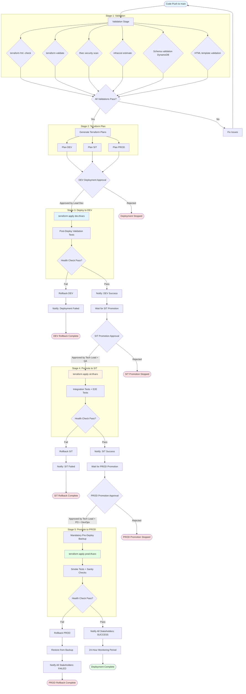
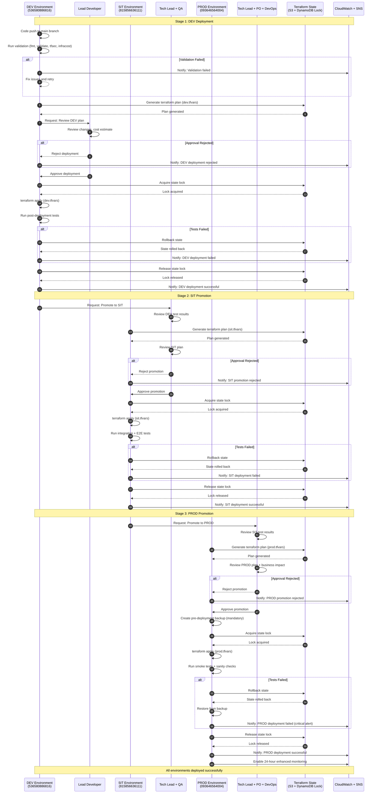

# Architecture Diagrams

**Worker ID**: worker-4-architecture-diagrams
**Stage**: Stage 2 - LLD Document Creation
**Project**: project-plan-1
**Date**: 2025-12-25
**Status**: COMPLETE

---

## Diagram 1: DynamoDB Table Relationships

This diagram shows the structure of all three DynamoDB tables (Tenants, Products, Campaigns), their partition key (PK) and sort key (SK) patterns, Global Secondary Indexes (GSIs), and entity relationships.

```mermaid
erDiagram
    TENANT ||--o{ ORDER : "has"
    PRODUCT ||--o{ CAMPAIGN : "referenced by"
    PRODUCT ||--o{ ORDER_ITEM : "referenced by"
    ORDER ||--|{ ORDER_ITEM : "contains (embedded)"
    ORDER ||--o{ PAYMENT : "has"

    TENANT {
        string PK "TENANT#id"
        string SK "METADATA"
        string id "UUID"
        string email "Unique email"
        string status "UNVALIDATED|VALIDATED|REGISTERED|SUSPENDED"
        string organizationName "Optional"
        string destinationEmail "Optional"
        boolean active "Soft delete flag"
        string dateCreated "ISO 8601"
        string dateLastUpdated "ISO 8601"
        string lastUpdatedBy "User/System"
    }

    PRODUCT {
        string PK "PRODUCT#id"
        string SK "METADATA"
        string id "UUID"
        string name "Product name"
        string description "Description"
        number price "Decimal price"
        list features "Feature strings"
        string billingCycle "monthly|yearly"
        boolean active "Soft delete flag"
        string dateCreated "ISO 8601"
        string dateLastUpdated "ISO 8601"
        string lastUpdatedBy "User/System"
    }

    CAMPAIGN {
        string PK "CAMPAIGN#code"
        string SK "METADATA"
        string id "UUID"
        string code "Business key"
        string description "Description"
        number discountPercentage "0-100"
        string productId "References PRODUCT"
        string termsConditionsLink "URL"
        string fromDate "YYYY-MM-DD"
        string toDate "YYYY-MM-DD"
        boolean active "Soft delete flag"
        string dateCreated "ISO 8601"
        string dateLastUpdated "ISO 8601"
        string lastUpdatedBy "User/System"
    }

    ORDER {
        string PK "TENANT#tenantId"
        string SK "ORDER#orderId"
        string id "UUID"
        string tenantId "References TENANT"
        string customerEmail "Email"
        string status "PENDING_PAYMENT|PAID|PROCESSING|COMPLETED|CANCELLED|REFUNDED"
        list items "OrderItem embedded array"
        number subtotal "Before tax"
        number tax "Tax amount"
        number total "Subtotal + tax"
        string currency "ZAR"
        object campaign "Campaign snapshot (embedded)"
        object billingAddress "Address object"
        string paymentMethod "payfast"
        object paymentDetails "Optional"
        string cancellationReason "Optional"
        boolean active "Soft delete flag"
        string dateCreated "ISO 8601"
        string dateLastUpdated "ISO 8601"
        string lastUpdatedBy "User/System"
    }

    ORDER_ITEM {
        string id "UUID (embedded)"
        string productId "References PRODUCT"
        string productName "Snapshot"
        number quantity "Quantity"
        number unitPrice "Snapshot"
        number discount "Applied discount"
        number subtotal "Calculated"
        boolean active "Soft delete flag"
        string dateCreated "ISO 8601"
        string dateLastUpdated "ISO 8601"
        string lastUpdatedBy "User/System"
    }

    PAYMENT {
        string PK "TENANT#tenantId#ORDER#orderId"
        string SK "PAYMENT#paymentId"
        string id "UUID"
        string orderId "References ORDER"
        number amount "Payment amount"
        string status "PENDING|COMPLETED|FAILED|REFUNDED"
        string payfastId "PayFast ID"
        string paidAt "ISO 8601"
        boolean active "Soft delete flag"
        string dateCreated "ISO 8601"
        string dateLastUpdated "ISO 8601"
        string lastUpdatedBy "User/System"
    }
```

### GSI Overview for Tables

**Tenant Table GSIs:**
- `EmailIndex`: PK=email, SK=entityType (Find tenant by email)
- `TenantStatusIndex`: PK=status, SK=dateCreated (List tenants by status)
- `ActiveIndex`: PK=active, SK=dateCreated (Sparse index for soft delete queries)

**Product Table GSIs:**
- `ProductActiveIndex`: PK=active, SK=dateCreated (List active products)
- `ActiveIndex`: PK=active, SK=dateCreated (Sparse index for soft delete queries)

**Campaign Table GSIs:**
- `CampaignActiveIndex`: PK=active, SK=fromDate (List active campaigns by date)
- `CampaignProductIndex`: PK=productId, SK=fromDate (List campaigns by product)
- `ActiveIndex`: PK=active, SK=dateCreated (Sparse index for soft delete queries)

### Access Patterns

1. **Get tenant by email**: Query EmailIndex with email
2. **List tenant orders**: Query base table where PK=TENANT#{tenantId} and SK begins_with ORDER#
3. **List orders by status**: Query OrderStatusIndex with status
4. **List active products**: Query ProductActiveIndex with active=true
5. **List campaigns for product**: Query CampaignProductIndex with productId
6. **Get order payments**: Query where PK=TENANT#{tenantId}#ORDER#{orderId} and SK begins_with PAYMENT#

---

## Diagram 2: S3 Bucket Organization

This diagram shows the S3 bucket structure, folder organization, template files, versioning, and cross-region replication for PROD.

```mermaid
graph TD
    subgraph "DEV Environment (af-south-1)"
        A[bbws-templates-dev]
        A --> B1[receipts/]
        A --> C1[notifications/]
        A --> D1[invoices/]

        B1 --> B1A[receipt.html]
        B1 --> B1B[receipt_internal.html]
        B1 --> B1C[order.html]
        B1 --> B1D[order_internal.html]

        C1 --> C1A[order_confirmation_customer.html]
        C1 --> C1B[order_confirmation_internal.html]
        C1 --> C1C[payment_confirmation_customer.html]
        C1 --> C1D[payment_confirmation_internal.html]
        C1 --> C1E[site_creation_customer.html]
        C1 --> C1F[site_creation_internal.html]

        D1 --> D1A[invoice.html]
        D1 --> D1B[invoice_internal.html]

        A -.->|Versioning: Enabled| V1[Version History: 30 days]
        A -.->|Public Access: BLOCKED| P1[Security]
        A -.->|Encryption: SSE-S3| E1[AES-256]
    end

    subgraph "SIT Environment (af-south-1)"
        F[bbws-templates-sit]
        F --> G1[receipts/]
        F --> H1[notifications/]
        F --> I1[invoices/]

        G1 --> G1A[receipt.html]
        G1 --> G1B[receipt_internal.html]
        G1 --> G1C[order.html]
        G1 --> G1D[order_internal.html]

        H1 --> H1A[order_confirmation_customer.html]
        H1 --> H1B[order_confirmation_internal.html]
        H1 --> H1C[payment_confirmation_customer.html]
        H1 --> H1D[payment_confirmation_internal.html]
        H1 --> H1E[site_creation_customer.html]
        H1 --> H1F[site_creation_internal.html]

        I1 --> I1A[invoice.html]
        I1 --> I1B[invoice_internal.html]

        F -.->|Versioning: Enabled| V2[Version History: 60 days]
        F -.->|Public Access: BLOCKED| P2[Security]
        F -.->|Encryption: SSE-S3| E2[AES-256]
        F -.->|Access Logging: Enabled| L2[Audit Trail]
    end

    subgraph "PROD Environment (af-south-1)"
        J[bbws-templates-prod]
        J --> K1[receipts/]
        J --> L1[notifications/]
        J --> M1[invoices/]

        K1 --> K1A[receipt.html]
        K1 --> K1B[receipt_internal.html]
        K1 --> K1C[order.html]
        K1 --> K1D[order_internal.html]

        L1 --> L1A[order_confirmation_customer.html]
        L1 --> L1B[order_confirmation_internal.html]
        L1 --> L1C[payment_confirmation_customer.html]
        L1 --> L1D[payment_confirmation_internal.html]
        L1 --> L1E[site_creation_customer.html]
        L1 --> L1F[site_creation_internal.html]

        M1 --> M1A[invoice.html]
        M1 --> M1B[invoice_internal.html]

        J -.->|Versioning: Enabled| V3[Version History: 90 days]
        J -.->|Public Access: BLOCKED| P3[Security]
        J -.->|Encryption: SSE-S3| E3[AES-256]
        J -.->|Access Logging: Enabled| L3[Audit Trail]
    end

    subgraph "DR Region (eu-west-1)"
        N[bbws-templates-prod-replica]
        N --> O1[receipts/]
        N --> P1R[notifications/]
        N --> Q1[invoices/]

        O1 --> O1A[Replicated templates]
        P1R --> P1A[Replicated templates]
        Q1 --> Q1A[Replicated templates]
    end

    J ==>|Cross-Region Replication| N
    J -.->|Hourly Sync| N

    style A fill:#e1f5ff
    style F fill:#fff4e1
    style J fill:#e1ffe1
    style N fill:#ffe1e1
```



### Bucket Configuration Summary

| Environment | Bucket Name | Region | Versioning | Lifecycle | Replication | Public Access |
|-------------|-------------|--------|------------|-----------|-------------|---------------|
| DEV | bbws-templates-dev | af-south-1 | Enabled | 30 days | No | BLOCKED |
| SIT | bbws-templates-sit | af-south-1 | Enabled | 60 days | No | BLOCKED |
| PROD | bbws-templates-prod | af-south-1 | Enabled | 90 days | Yes (eu-west-1) | BLOCKED |
| DR | bbws-templates-prod-replica | eu-west-1 | Enabled | 90 days | N/A | BLOCKED |

### Template Categories

- **Receipts**: Payment and order receipts (customer + internal versions)
- **Notifications**: Order confirmations, payment confirmations, site creation (customer + internal versions)
- **Invoices**: Billing invoices (customer + internal versions)

---

## Diagram 3: CI/CD Pipeline Flow

This diagram shows the complete CI/CD pipeline flow with validation stages, approval gates, deployment stages, testing, and rollback paths.



### Pipeline Stage Summary

| Stage | Actions | Approval Required | Failure Handling |
|-------|---------|-------------------|------------------|
| **Validation** | terraform fmt, validate, tfsec, infracost, schema validation, template validation | No | Fix issues, re-run |
| **Terraform Plan** | Generate plans for all environments | No | Auto-fail if plan errors |
| **DEV Deployment** | Apply to DEV, run basic tests | Yes (Lead Dev) | Rollback DEV |
| **SIT Promotion** | Apply to SIT, run integration tests | Yes (Tech Lead + QA) | Rollback SIT |
| **PROD Promotion** | Backup, apply to PROD, smoke tests | Yes (Tech Lead + PO + DevOps) | Rollback PROD + restore data |

### Rollback Strategy

- **DEV**: Terraform state rollback (immediate)
- **SIT**: Terraform state rollback + data restore if needed
- **PROD**: Terraform state rollback + mandatory data restore from backup

---

## Diagram 4: Environment Promotion

This diagram shows the detailed environment promotion workflow, approval requirements at each gate, state management, and success/failure paths.



### Approval Gates Summary

| Gate | Approvers | Criteria | Rejection Action |
|------|-----------|----------|------------------|
| **DEV Deployment** | Lead Developer | Plan review, cost estimate | Stop deployment, fix issues |
| **SIT Promotion** | Tech Lead + QA Lead | DEV test results, SIT plan review | Stop promotion, investigate |
| **PROD Promotion** | Tech Lead + Product Owner + DevOps | SIT test results, business impact, change window | Stop promotion, reschedule |

### State Management

- **State Backend**: S3 bucket per environment (bbws-terraform-state-{env})
- **State Locking**: DynamoDB table per environment (terraform-state-lock-{env})
- **State Path**: Repository-specific sub-folders (2_1_bbws_dynamodb_schemas/, 2_1_bbws_s3_schemas/)
- **State Isolation**: Separate .tfstate files per component (tenants, products, campaigns, templates)

### Success Criteria

1. **DEV**: All validation passes + post-deploy tests pass
2. **SIT**: DEV success + integration tests pass + E2E tests pass
3. **PROD**: SIT success + smoke tests pass + sanity checks pass + 24-hour stability

### Failure Recovery

1. **Terraform State Rollback**: Revert to previous known-good state
2. **Data Restore**: Restore from backup (PITR for DynamoDB, S3 versioning)
3. **Notification**: Alert all stakeholders via Slack + Email
4. **Investigation**: Root cause analysis before next attempt

---

## Summary

All four architecture diagrams have been created in Mermaid format and are ready for inclusion in the LLD document:

1. **DynamoDB Table Relationships**: Shows entity structure, PK/SK patterns, GSIs, and relationships
2. **S3 Bucket Organization**: Shows bucket structure, folder organization, templates, versioning, and replication
3. **CI/CD Pipeline Flow**: Shows validation, approval gates, deployment stages, testing, and rollback paths
4. **Environment Promotion**: Shows sequence of promotions from DEV → SIT → PROD with state management

### Diagram Usage in LLD

- **Section 4.x**: Insert Diagram 1 (DynamoDB relationships) and Diagram 2 (S3 organization)
- **Section 5.x**: Insert Diagram 3 (CI/CD pipeline) and Diagram 4 (Environment promotion)
- **Section 7.x**: Reference Diagram 2 for disaster recovery (cross-region replication)

### Mermaid Compatibility

All diagrams use standard Mermaid syntax compatible with:
- GitHub Markdown rendering
- GitLab Markdown rendering
- VS Code Mermaid Preview extension
- Mermaid Live Editor (https://mermaid.live)
- Documentation tools (MkDocs, Docusaurus, etc.)

---

**Document Status**: COMPLETE
**Diagrams Created**: 4/4
**Validation**: All diagrams use valid Mermaid syntax
**Ready for LLD Integration**: Yes
