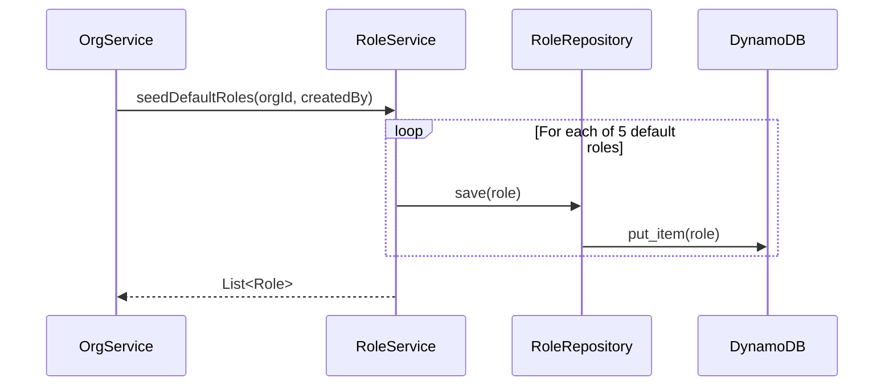

# Role Service LLD Review - Implementation-Ready Specifications

**Worker ID**: worker-4-role-service-review
**Stage**: Stage 1 - LLD Review & Analysis
**Source Document**: `/Users/tebogotseka/Documents/agentic_work/2_bbws_docs/LLDs/2.8.4_LLD_Role_Service.md`
**Review Date**: 2026-01-23
**Status**: COMPLETE

---

## 1. Lambda Function Checklist (8 Total Functions)

### 1.1 Platform Role Operations (2 Functions - Read Only)

| # | Function Name | Handler File | Method | Endpoint | Auth Required | Permission Required |
|---|---------------|--------------|--------|----------|---------------|---------------------|
| 1 | list_platform_roles | `platform/list_platform_roles.py` | GET | `/v1/platform/roles` | Authenticated | None (any authenticated user) |
| 2 | get_platform_role | `platform/get_platform_role.py` | GET | `/v1/platform/roles/{roleId}` | Authenticated | None (any authenticated user) |

### 1.2 Organisation Role Operations (6 Functions)

| # | Function Name | Handler File | Method | Endpoint | Auth Required | Permission Required |
|---|---------------|--------------|--------|----------|---------------|---------------------|
| 3 | create_role | `organisation/create_role.py` | POST | `/v1/organisations/{orgId}/roles` | Authenticated | `role:create` (Org Admin) |
| 4 | list_roles | `organisation/list_roles.py` | GET | `/v1/organisations/{orgId}/roles` | Authenticated | Org Member |
| 5 | get_role | `organisation/get_role.py` | GET | `/v1/organisations/{orgId}/roles/{roleId}` | Authenticated | Org Member |
| 6 | update_role | `organisation/update_role.py` | PUT | `/v1/organisations/{orgId}/roles/{roleId}` | Authenticated | `role:update` (Org Admin) |
| 7 | assign_permissions | `organisation/assign_permissions.py` | PUT | `/v1/organisations/{orgId}/roles/{roleId}/permissions` | Authenticated | `role:update` (Org Admin) |
| 8 | delete_role | `organisation/update_role.py` (soft delete) | PUT | `/v1/organisations/{orgId}/roles/{roleId}` | Authenticated | `role:delete` (Org Admin) |

**Note**: Delete operation is implemented as a soft delete (setting `active=false`) via the update endpoint.

### 1.3 Lambda Configuration

| Attribute | Value |
|-----------|-------|
| Repository | `2_bbws_access_role_lambda` |
| Runtime | Python 3.12 |
| Memory | 256MB |
| Timeout | 30s |
| Architecture | arm64 |
| Layer | aws-lambda-powertools |

---

## 2. API Contract Summary

### 2.1 Platform Roles Endpoints

#### GET /v1/platform/roles - List Platform Roles

**Query Parameters**:
| Parameter | Type | Required | Default | Description |
|-----------|------|----------|---------|-------------|
| pageSize | integer | No | 50 | Number of items per page |
| startAt | string | No | null | Pagination cursor |

**Response (200 OK)**:
```json
{
  "items": [RoleResponse],
  "startAt": "string|null",
  "moreAvailable": true,
  "count": 3,
  "_links": {
    "self": {"href": "/v1/platform/roles"},
    "next": {"href": "/v1/platform/roles?startAt=xxx"}
  }
}
```

#### GET /v1/platform/roles/{roleId} - Get Platform Role Details

**Path Parameters**:
| Parameter | Type | Required | Description |
|-----------|------|----------|-------------|
| roleId | string | Yes | Platform role UUID |

**Response (200 OK)**: `RoleResponse` object

**Error Responses**:
- 404 Not Found - Role does not exist

---

### 2.2 Organisation Roles Endpoints

#### POST /v1/organisations/{orgId}/roles - Create Organisation Role

**Path Parameters**:
| Parameter | Type | Required | Description |
|-----------|------|----------|-------------|
| orgId | string (UUID) | Yes | Organisation ID |

**Request Body (CreateRoleRequest)**:
```json
{
  "name": "CONTENT_MANAGER",
  "displayName": "Content Manager",
  "description": "Manages content across sites",
  "scope": "ORGANISATION",
  "permissions": ["site:read", "site:update"],
  "priority": 100
}
```

**Validation Rules**:
| Field | Type | Required | Constraints |
|-------|------|----------|-------------|
| name | string | Yes | 2-50 chars, pattern: `^[A-Z][A-Z0-9_]*$` |
| displayName | string | Yes | 2-100 chars |
| description | string | No | Max 500 chars |
| scope | enum | No | ORGANISATION (default), TEAM |
| permissions | array[string] | Yes | Min 1 permission |
| priority | integer | No | 1-999, default: 100 |

**Response (201 Created)**: `RoleResponse` object

**Error Responses**:
- 400 Bad Request - Validation failed
- 409 Conflict - Role name already exists in org

---

#### GET /v1/organisations/{orgId}/roles - List Organisation Roles

**Query Parameters**:
| Parameter | Type | Required | Default | Description |
|-----------|------|----------|---------|-------------|
| scope | enum | No | all | ORGANISATION, TEAM |
| includeInactive | boolean | No | false | Include deactivated roles |
| pageSize | integer | No | 50 | Number of items per page |
| startAt | string | No | null | Pagination cursor |

**Response (200 OK)**: `RoleListResponse` object

---

#### GET /v1/organisations/{orgId}/roles/{roleId} - Get Role Details

**Response (200 OK)**: `RoleResponse` object with full permission details

**Error Responses**:
- 404 Not Found - Role does not exist

---

#### PUT /v1/organisations/{orgId}/roles/{roleId} - Update Role

**Request Body (UpdateRoleRequest)**:
```json
{
  "displayName": "Updated Display Name",
  "description": "Updated description",
  "scope": "TEAM",
  "priority": 50,
  "active": false
}
```

**Validation Rules**:
| Field | Type | Required | Constraints |
|-------|------|----------|-------------|
| displayName | string | No | 2-100 chars |
| description | string | No | Max 500 chars |
| scope | enum | No | ORGANISATION, TEAM |
| priority | integer | No | 1-999 |
| active | boolean | No | false = soft delete |

**Response (200 OK)**: `RoleResponse` object

**Error Responses**:
- 400 Bad Request - Role in use (when deactivating)
- 403 Forbidden - Cannot modify system role
- 404 Not Found - Role does not exist

---

#### PUT /v1/organisations/{orgId}/roles/{roleId}/permissions - Assign Permissions

**Request Body (AssignPermissionsRequest)**:
```json
{
  "permissions": ["site:read", "site:update", "site:publish"]
}
```

**Validation Rules**:
| Field | Type | Required | Constraints |
|-------|------|----------|-------------|
| permissions | array[string] | Yes | Min 1 permission, all must exist |

**Response (200 OK)**: `RoleResponse` object with updated permissions

**Error Responses**:
- 400 Bad Request - Invalid permission ID
- 403 Forbidden - Cannot modify system role
- 404 Not Found - Role does not exist

---

### 2.3 Response Schema - RoleResponse

```json
{
  "id": "role-990e8400-e29b-41d4-a716-446655440001",
  "name": "ORG_ADMIN",
  "displayName": "Organisation Admin",
  "description": "Full organisation access",
  "organisationId": "org-550e8400-e29b-41d4-a716-446655440000",
  "scope": "ORGANISATION",
  "permissions": [
    {
      "id": "perm-010",
      "name": "org:read",
      "resource": "org",
      "action": "read"
    }
  ],
  "isSystem": false,
  "isDefault": true,
  "priority": 1,
  "userCount": 2,
  "active": true,
  "dateCreated": "2026-01-10T08:00:00Z",
  "dateLastUpdated": "2026-01-20T16:00:00Z",
  "_links": {
    "self": {"href": "/v1/organisations/{orgId}/roles/{roleId}"},
    "organisation": {"href": "/v1/organisations/{orgId}"},
    "permissions": {"href": "/v1/organisations/{orgId}/roles/{roleId}/permissions", "method": "PUT"},
    "users": {"href": "/v1/organisations/{orgId}/roles/{roleId}/users"},
    "update": {"href": "/v1/organisations/{orgId}/roles/{roleId}", "method": "PUT"}
  }
}
```

---

## 3. DynamoDB Schema

**Table Name**: `bbws-aipagebuilder-{env}-ddb-access-management`
**Capacity Mode**: On-Demand (as per project standards)

### 3.1 Platform Role Entity (System-Defined, Read-Only)

| Attribute | Type | Description | Example |
|-----------|------|-------------|---------|
| PK | String | Partition key | `PLATFORM` |
| SK | String | Sort key | `ROLE#{roleId}` |
| roleId | String | UUID | `role-platform-admin-001` |
| name | String | Role code | `PLATFORM_ADMIN` |
| displayName | String | Human-readable name | `Platform Administrator` |
| description | String | Role description | Full platform access |
| scope | String | Always PLATFORM | `PLATFORM` |
| permissions | StringSet | Permission IDs | `["org:create", "org:read"]` |
| isSystem | Boolean | Always true | `true` |
| isDefault | Boolean | Always false | `false` |
| priority | Number | Display order | `1` |
| active | Boolean | Always true | `true` |
| dateCreated | String | ISO 8601 | `2026-01-01T00:00:00Z` |
| GSI1PK | String | GSI partition | `PLATFORM#ACTIVE#true` |
| GSI1SK | String | GSI sort | `ROLE#{name}` |

### 3.2 Organisation Role Entity (Customizable)

| Attribute | Type | Description | Example |
|-----------|------|-------------|---------|
| PK | String | Partition key | `ORG#{organisationId}` |
| SK | String | Sort key | `ROLE#{roleId}` |
| roleId | String | UUID | `role-990e8400-...` |
| name | String | Role code (unique per org) | `ORG_ADMIN` |
| displayName | String | Human-readable name | `Organisation Admin` |
| description | String | Role description | Full org access |
| organisationId | String | Parent org UUID | `org-550e8400-...` |
| scope | String | ORGANISATION or TEAM | `ORGANISATION` |
| permissions | StringSet | Permission IDs | `["org:read", "user:create"]` |
| isSystem | Boolean | Always false for org roles | `false` |
| isDefault | Boolean | True for seeded roles | `true` |
| priority | Number | Display order (1=highest) | `1` |
| active | Boolean | Soft delete flag | `true` |
| dateCreated | String | ISO 8601 | `2026-01-10T08:00:00Z` |
| dateLastUpdated | String | ISO 8601 | `2026-01-20T16:00:00Z` |
| createdBy | String | Creator email | `admin@org.com` |
| lastUpdatedBy | String | Last updater email | `admin@org.com` |
| GSI1PK | String | GSI partition | `ORG#{orgId}#ACTIVE#{active}` |
| GSI1SK | String | GSI sort | `ROLE#{name}` |

### 3.3 User Role Assignment Entity

| Attribute | Type | Description | Example |
|-----------|------|-------------|---------|
| PK | String | Partition key | `ORG#{organisationId}#USER#{userId}` |
| SK | String | Sort key | `ROLE#{roleId}` |
| organisationId | String | Organisation UUID | `org-550e8400-...` |
| userId | String | User UUID | `user-123-...` |
| roleId | String | Role UUID | `role-990e8400-...` |
| roleName | String | Role name (denormalized) | `ORG_ADMIN` |
| scope | String | ORGANISATION or TEAM | `ORGANISATION` |
| teamId | String | Team UUID (if TEAM scoped) | `null` or `team-...` |
| assignedBy | String | Email of assigner | `admin@org.com` |
| assignedAt | String | ISO 8601 timestamp | `2026-01-15T10:00:00Z` |
| active | Boolean | Soft delete flag | `true` |
| GSI1PK | String | GSI partition | `ORG#{orgId}#ROLE#{roleId}` |
| GSI1SK | String | GSI sort | `USER#{userId}` |

### 3.4 GSI Definitions

| GSI Name | PK | SK | Purpose |
|----------|----|----|---------|
| GSI1 | GSI1PK | GSI1SK | Role name lookup, users by role |

### 3.5 Access Patterns

| Pattern | Query | Index |
|---------|-------|-------|
| Get platform role by ID | PK=PLATFORM, SK=ROLE#{roleId} | Table |
| List platform roles | PK=PLATFORM, SK begins_with ROLE# | Table |
| Get org role by ID | PK=ORG#{orgId}, SK=ROLE#{roleId} | Table |
| List org roles | PK=ORG#{orgId}, SK begins_with ROLE# | Table |
| Find role by name | GSI1PK=ORG#{orgId}#ACTIVE#true, GSI1SK=ROLE#{name} | GSI1 |
| Get user's roles | PK=ORG#{orgId}#USER#{userId}, SK begins_with ROLE# | Table |
| List users with role | GSI1PK=ORG#{orgId}#ROLE#{roleId} | GSI1 |
| Count users with role | GSI1PK=ORG#{orgId}#ROLE#{roleId}, count | GSI1 |

---

## 4. Role Types

### 4.1 Platform Roles (System-Defined, Read-Only)

| Role Name | Display Name | Description | Key Permissions |
|-----------|--------------|-------------|-----------------|
| PLATFORM_ADMIN | Platform Administrator | Full platform access, manage orgs | org:create, org:read, org:update, org:delete |
| SUPPORT_AGENT | Support Agent | View orgs, assist users, no data modification | org:read, user:read (read-only) |
| BILLING_ADMIN | Billing Administrator | Manage subscriptions, view usage | subscription:*, usage:read |

**Characteristics**:
- `isSystem = true` (cannot be modified)
- `scope = PLATFORM`
- Pre-seeded at platform initialization
- Cannot be created, updated, or deleted via API

### 4.2 Organisation Roles (Org-Scoped, Customizable)

| Role Name | Display Name | Scope | Description |
|-----------|--------------|-------|-------------|
| ORG_ADMIN | Organisation Admin | ORGANISATION | Full org access, manage users and teams |
| ORG_MANAGER | Organisation Manager | ORGANISATION | Manage teams, invite users |
| SITE_ADMIN | Site Admin | TEAM | Full site management access |
| SITE_EDITOR | Site Editor | TEAM | Edit sites, publish content |
| SITE_VIEWER | Site Viewer | TEAM | Read-only site access |

**Characteristics**:
- `isSystem = false` (can be modified)
- `isDefault = true` (for seeded roles)
- Org admins can create additional custom roles

---

## 5. Role Scopes

| Scope | Code | Description | Access Level | Examples |
|-------|------|-------------|--------------|----------|
| PLATFORM | `PLATFORM` | System-wide access across all organisations | Full platform | PLATFORM_ADMIN, SUPPORT_AGENT, BILLING_ADMIN |
| ORGANISATION | `ORGANISATION` | Access within a single organisation | Entire org | ORG_ADMIN, ORG_MANAGER |
| TEAM | `TEAM` | Access scoped to specific team(s) | Team-level | SITE_ADMIN, SITE_EDITOR, SITE_VIEWER |

### Scope Hierarchy

```
PLATFORM (highest)
    |
    v
ORGANISATION
    |
    v
TEAM (lowest/most granular)
```

### Scope Evaluation Rules

1. **PLATFORM** scope roles have access across all organisations
2. **ORGANISATION** scope roles have access to all teams within their org
3. **TEAM** scope roles only have access to assigned team(s)
4. Users can have multiple roles with different scopes
5. Permissions from all roles are combined (additive model)

---

## 6. Permission Bundling Mechanism

### 6.1 Role-Permission Relationship

```
Role
  |
  +-- permissions: ["perm-001", "perm-002", "perm-003"]
```

Roles bundle multiple permissions together for easier assignment. Instead of assigning individual permissions to users, administrators assign roles.

### 6.2 Permission Format

Permissions follow the `resource:action` format:

| Resource | Available Actions | Examples |
|----------|-------------------|----------|
| org | read, update | org:read, org:update |
| user | create, read, update, delete | user:create, user:read |
| team | create, read, update, delete | team:create, team:delete |
| role | create, read, update, delete | role:create, role:update |
| site | create, read, update, delete, publish | site:publish |
| invitation | create, read, revoke | invitation:create |

**Wildcard Permission**: `resource:*` grants all actions on that resource.

### 6.3 Additive Model (Permission Union)

When a user has multiple roles, permissions are **combined additively** (union):

```
User Roles: [SITE_EDITOR, SITE_VIEWER]
           |
           v
SITE_EDITOR permissions: [site:read, site:update, site:publish]
SITE_VIEWER permissions: [site:read]
           |
           v
Combined permissions: [site:read, site:update, site:publish]
```

**Key Points**:
- No permission subtraction/denial
- Most permissive access wins
- Duplicate permissions are de-duplicated
- Priority field determines display order, not evaluation precedence

### 6.4 Default Organisation Role Permission Bundles

| Role | Permissions |
|------|-------------|
| ORG_ADMIN | `org:read`, `org:update`, `user:create`, `user:read`, `user:update`, `user:delete`, `team:create`, `team:read`, `team:update`, `team:delete`, `role:create`, `role:read`, `role:update`, `role:delete`, `site:create`, `site:read`, `site:update`, `site:delete`, `site:publish`, `invitation:create`, `invitation:read`, `invitation:revoke` |
| ORG_MANAGER | `org:read`, `user:read`, `team:create`, `team:read`, `team:update`, `invitation:create`, `invitation:read` |
| SITE_ADMIN | `site:create`, `site:read`, `site:update`, `site:delete`, `site:publish` |
| SITE_EDITOR | `site:read`, `site:update`, `site:publish` |
| SITE_VIEWER | `site:read` |

---

## 7. Default Organisation Roles (Seeded on Org Creation)

### 7.1 Seeding Trigger

When a new organisation is created via Organisation Service, the Role Service `seedDefaultRoles(orgId, createdBy)` method is invoked to create 5 default roles.

### 7.2 Default Roles Specification

| # | Name | Display Name | Scope | Priority | Permissions |
|---|------|--------------|-------|----------|-------------|
| 1 | ORG_ADMIN | Organisation Admin | ORGANISATION | 1 | org:read, org:update, user:*, team:*, role:*, site:*, invitation:* |
| 2 | ORG_MANAGER | Organisation Manager | ORGANISATION | 2 | org:read, user:read, team:create/read/update, invitation:create/read |
| 3 | SITE_ADMIN | Site Admin | TEAM | 3 | site:* |
| 4 | SITE_EDITOR | Site Editor | TEAM | 4 | site:read, site:update, site:publish |
| 5 | SITE_VIEWER | Site Viewer | TEAM | 5 | site:read |

### 7.3 Default Role Characteristics

| Property | Value |
|----------|-------|
| isSystem | `false` (can be modified by org admin) |
| isDefault | `true` (distinguishes from custom roles) |
| active | `true` |
| createdBy | System or org creator email |

### 7.4 Seeding Sequence



---

## 8. Integration Points

### 8.1 Service Dependencies

| Integration | Direction | Purpose | API/Method |
|-------------|-----------|---------|------------|
| Permission Service | Role Service calls | Validate permissions exist | `validatePermissions(permissions)` |
| Organisation Service | Org Service calls Role Service | Seed default roles on org creation | `seedDefaultRoles(orgId, createdBy)` |
| User Service | User Service queries roles | Get user's effective permissions | `findByUserId(orgId, userId)` |
| Authorizer Lambda | Authorizer queries roles | Resolve user permissions for API access | Query user role assignments |
| Audit Service | Role Service calls | Log all role CRUD operations | `logRoleCreated()`, `logPermissionsChanged()`, `logRoleDeactivated()` |
| Team Service | Team membership drives TEAM scope | Validate team-scoped role assignments | Check team membership |

### 8.2 Data Flow Diagram

```
┌─────────────────┐     creates org      ┌─────────────────┐
│  Organisation   │──────────────────────▶│   Role Service  │
│    Service      │                       │                 │
└─────────────────┘                       └────────┬────────┘
                                                   │
                                                   │ seedDefaultRoles()
                                                   ▼
                                          ┌─────────────────┐
                                          │    DynamoDB     │
                                          │ (access-mgmt)   │
                                          └────────┬────────┘
                                                   │
           ┌───────────────────────────────────────┼───────────────────────────────┐
           │                                       │                               │
           ▼                                       ▼                               ▼
┌─────────────────┐                     ┌─────────────────┐              ┌─────────────────┐
│  Permission     │                     │    Authorizer   │              │   Audit Service │
│    Service      │◀────validates───────│     Lambda      │──────logs───▶│                 │
└─────────────────┘                     └─────────────────┘              └─────────────────┘
```

### 8.3 Event Triggers

| Event | Source | Target | Action |
|-------|--------|--------|--------|
| Organisation created | Organisation Service | Role Service | Seed 5 default roles |
| Role permissions changed | Role Service | Audit Service | Log permission change with before/after state |
| User role assigned | User Service | Role Service | Create UserRoleAssignment record |
| API request | API Gateway | Authorizer Lambda | Resolve user permissions from role assignments |

### 8.4 Cross-Service Validation

| Validation | Service | Purpose |
|------------|---------|---------|
| Permission exists | Permission Service | Prevent assignment of non-existent permissions |
| Org exists | Organisation Service | Validate orgId in path matches user context |
| Team exists | Team Service | Validate team-scoped role assignments |
| User belongs to org | User Service | Prevent cross-org access |

---

## 9. Risk Assessment

### 9.1 Identified Risks

| Risk ID | Risk Description | Impact | Likelihood | Severity | Mitigation |
|---------|------------------|--------|------------|----------|------------|
| RISK-001 | Delete role with assigned users | Users lose access unexpectedly | Medium | High | Check user count before deactivation; return 400 if count > 0 |
| RISK-002 | Privilege escalation via custom role | User gains unintended access | High | Low | Validate permissions against allowlist; audit all permission changes |
| RISK-003 | Duplicate role names causing confusion | Ambiguous role assignments | Low | Medium | Unique constraint per org enforced at DB level |
| RISK-004 | Invalid permission assignment | Role has non-functional permissions | Medium | Low | Validate permissions exist via Permission Service before assignment |
| RISK-005 | System role modification | Platform integrity compromised | High | Low | Check `isSystem` flag; return 403 for any modification attempt |
| RISK-006 | Permission consistency drift | Stale permissions in roles | Medium | Medium | Audit log all permission changes with before/after state |
| RISK-007 | Orphaned role assignments | Deleted roles still referenced | Medium | Medium | Soft delete only; check assignments before deactivation |
| RISK-008 | Cross-org access | User from org A accesses org B roles | High | Medium | Validate authContext.orgId matches path orgId |
| RISK-009 | Role count explosion | Performance degradation from many roles | Low | Low | Pagination on list endpoints; monitoring on role count per org |
| RISK-010 | Circular role dependencies | Undefined permission evaluation | Medium | Low | Roles do not inherit from other roles; flat permission model |

### 9.2 Security Controls

| Control | Implementation | Risk Addressed |
|---------|----------------|----------------|
| Org isolation | Validate orgId in auth context vs path | RISK-008 |
| System role protection | Check `isSystem=true` before any update/delete | RISK-005 |
| User count check | `countUsersWithRole()` before deactivation | RISK-001, RISK-007 |
| Permission validation | Call Permission Service for each permission | RISK-004 |
| Audit logging | Log all CRUD operations with actor and timestamp | RISK-002, RISK-006 |
| Soft delete | Never hard delete; set `active=false` | RISK-007 |

### 9.3 Exception Handling

| Exception | HTTP Status | Trigger | User Message |
|-----------|-------------|---------|--------------|
| RoleNotFoundException | 404 | Role ID not found | "Role not found" |
| DuplicateRoleNameException | 409 | Role name already exists in org | "Role name already exists" |
| RoleInUseException | 400 | Deactivating role with assigned users | "Role has X users assigned. Reassign users first." |
| InvalidPermissionException | 400 | Permission ID does not exist | "Permission {id} not found" |
| CannotModifySystemRoleException | 403 | Attempt to modify platform role | "System roles cannot be modified" |
| UnauthorizedOrgAccessException | 403 | User accessing different org's roles | "Access denied to this organisation" |

---

## 10. Non-Functional Requirements

### 10.1 Performance Targets

| Metric | Target |
|--------|--------|
| Create role latency (p95) | < 500ms |
| List roles latency (p95) | < 200ms |
| Get role latency (p95) | < 100ms |
| Assign permissions latency (p95) | < 500ms |
| Lambda cold start | < 2s |
| Error rate | < 0.1% |

### 10.2 Security Requirements

| Requirement | Implementation |
|-------------|----------------|
| Data at rest encryption | DynamoDB KMS encryption |
| Data in transit encryption | TLS 1.3 for all communications |
| Authorization | Cognito JWT tokens + custom authorizer |
| Audit trail | All operations logged with actor and timestamp |

---

## 11. Terraform Implementation Notes

### 11.1 Lambda Functions to Create

```hcl
# Platform role handlers (read-only)
resource "aws_lambda_function" "list_platform_roles" { ... }
resource "aws_lambda_function" "get_platform_role" { ... }

# Organisation role handlers
resource "aws_lambda_function" "create_role" { ... }
resource "aws_lambda_function" "list_roles" { ... }
resource "aws_lambda_function" "get_role" { ... }
resource "aws_lambda_function" "update_role" { ... }
resource "aws_lambda_function" "assign_permissions" { ... }
```

### 11.2 API Gateway Routes

```hcl
# Platform routes
GET    /v1/platform/roles              -> list_platform_roles
GET    /v1/platform/roles/{roleId}     -> get_platform_role

# Organisation routes
POST   /v1/organisations/{orgId}/roles                        -> create_role
GET    /v1/organisations/{orgId}/roles                        -> list_roles
GET    /v1/organisations/{orgId}/roles/{roleId}               -> get_role
PUT    /v1/organisations/{orgId}/roles/{roleId}               -> update_role
PUT    /v1/organisations/{orgId}/roles/{roleId}/permissions   -> assign_permissions
```

### 11.3 IAM Permissions Required

```json
{
  "Effect": "Allow",
  "Action": [
    "dynamodb:GetItem",
    "dynamodb:PutItem",
    "dynamodb:UpdateItem",
    "dynamodb:Query"
  ],
  "Resource": [
    "arn:aws:dynamodb:*:*:table/bbws-aipagebuilder-*-ddb-access-management",
    "arn:aws:dynamodb:*:*:table/bbws-aipagebuilder-*-ddb-access-management/index/*"
  ]
}
```

---

## 12. Project Structure

```
2_bbws_access_role_lambda/
├── src/
│   ├── handlers/
│   │   ├── __init__.py
│   │   ├── platform/
│   │   │   ├── __init__.py
│   │   │   ├── list_platform_roles.py
│   │   │   └── get_platform_role.py
│   │   └── organisation/
│   │       ├── __init__.py
│   │       ├── create_role.py
│   │       ├── list_roles.py
│   │       ├── get_role.py
│   │       ├── update_role.py
│   │       └── assign_permissions.py
│   ├── services/
│   │   ├── __init__.py
│   │   └── role_service.py
│   ├── repositories/
│   │   ├── __init__.py
│   │   ├── role_repository.py
│   │   └── user_role_repository.py
│   ├── models/
│   │   ├── __init__.py
│   │   ├── role.py
│   │   ├── user_role_assignment.py
│   │   ├── default_roles.py
│   │   └── requests.py
│   ├── exceptions/
│   │   ├── __init__.py
│   │   └── role_exceptions.py
│   └── utils/
│       ├── __init__.py
│       ├── response_builder.py
│       ├── validators.py
│       └── hateoas.py
├── tests/
│   ├── unit/
│   │   ├── test_handlers/
│   │   ├── test_services/
│   │   └── test_repositories/
│   └── integration/
│       └── test_api.py
├── terraform/
│   ├── main.tf
│   ├── api_gateway.tf
│   ├── lambda.tf
│   ├── iam.tf
│   ├── variables.tf
│   └── outputs.tf
├── openapi/
│   └── role-service-api.yaml
├── requirements.txt
├── pytest.ini
└── README.md
```

---

## 13. Success Criteria Checklist

| # | Criteria | Status |
|---|----------|--------|
| 1 | All 8 Lambda functions documented | COMPLETE |
| 2 | Platform vs Org roles differentiated | COMPLETE |
| 3 | Role scopes documented (PLATFORM, ORGANISATION, TEAM) | COMPLETE |
| 4 | Default org roles listed with permissions | COMPLETE |
| 5 | Permission bundling mechanism explained | COMPLETE |
| 6 | Integration points identified | COMPLETE |
| 7 | Risks assessed with mitigations | COMPLETE |
| 8 | DynamoDB schema specified | COMPLETE |
| 9 | API contracts documented | COMPLETE |

---

## 14. Open Items (TBC from LLD)

| # | Item | Status | Impact |
|---|------|--------|--------|
| TBC-001 | Role hierarchy (inheritance) | Open | Would change additive model; may require role parent-child relationships |
| TBC-002 | Time-limited role assignments | Open | Would add `expiresAt` to UserRoleAssignment entity |
| TBC-003 | Conditional permissions | Open | Would add context-based permission evaluation (e.g., time of day, IP) |

---

**Review Completed**: 2026-01-23
**Reviewer**: Worker-4 (Role Service Review)
**Next Stage**: Stage 2 - Infrastructure Terraform Implementation
