# Project Plan: Site Builder Bedrock Generation API (3.1.2_LLD)

**Project ID**: project-plan-2
**Created**: 2026-01-15
**Status**: PENDING
**Type**: LLD Creation with API Implementation
**Parent HLD**: [BBWS AI-Powered Site Builder HLD](../../HLDs/3.0_BBSW_Site_Builder_HLD.md)
**Target LLD**: 3.1.2_LLD_Site_Builder_Bedrock_Generation_API.md

---

## Project Overview

**Objective**: Design and implement the Bedrock-powered Generation API that provides AI capabilities for the Site Builder, including page generation with streaming (Claude Sonnet 4.5), logo/background generation (Stable Diffusion XL), theme and layout suggestions, and brand validation scoring.

### Key Objectives

1. **Design Generation API Architecture**: Create comprehensive LLD with class diagrams, sequence diagrams, and API contracts for all Bedrock-powered endpoints
2. **Implement Page Generation with Streaming**: Build Lambda functions using Claude Sonnet 4.5 for real-time page generation via Server-Sent Events (SSE)
3. **Implement Image Generation**: Build Lambda functions using Stable Diffusion XL for logo and background image generation
4. **Implement Brand Validation & Scoring**: Build brand consistency scoring engine (8/10 minimum threshold)
5. **Deploy Multi-Environment Infrastructure**: Terraform infrastructure for DEV/SIT/PROD with proper parameterization
6. **Create CI/CD Pipelines**: GitHub Actions for automated deployment with approval gates
7. **Integration Testing**: End-to-end testing with Site Builder Frontend
8. **Operational Documentation**: Runbooks for deployment, troubleshooting, and rollback

### Success Criteria

- All 9 stages completed with approval gates passed
- All Lambda functions deployed to DEV environment
- All API endpoints responding correctly (< 10ms non-gen, < 60s generation)
- Brand validation scoring working correctly (8/10 minimum threshold)
- Streaming SSE functional for page generation (TTFT < 2s, TTLT < 60s)
- Integration tests passing with Site Builder Frontend
- DynamoDB capacity on-demand mode only
- S3 buckets with blocked public access
- No hardcoded credentials (parameterized for all environments)

---

## Project Tracking

### Overall Progress: 56% Complete

```
[==========          ] 5/9 stages complete
```

### Current Status
- **Active Stage**: Stage 6 PENDING - Terraform Infrastructure
- **Current Activity**: Awaiting approval to begin Terraform Infrastructure deployment
- **Blockers**: None

### Gate 1 Approval
- **Status**: APPROVED
- **Date**: 2026-01-17
- **Approver**: User (Manual approval)
- **Notes**: Requirements analysis complete, proceeding to LLD review

### Gate 2 Approval
- **Status**: APPROVED
- **Date**: 2026-01-17
- **Approver**: User (Manual approval)
- **LLD Version**: 1.4
- **Notes**: LLD complete with ADRs, proceeding to OpenAPI & Tests

### Stage 3 Completion
- **Status**: COMPLETE
- **Date**: 2026-01-18
- **Workers Completed**: 5/5
- **Deliverables Created**:
  - `openapi/generation-api.yaml` - Page generation endpoints with SSE streaming
  - `openapi/agents-api.yaml` - AI agent endpoints (logo, background, theme, layout, blog, newsletter)
  - `openapi/validation-api.yaml` - Brand, accessibility, SEO, performance validation
  - `tests/test_cases.md` - Comprehensive test cases for all services
  - `tests/fixtures/mock_bedrock_responses.py` - Mock Bedrock responses for testing
  - `tests/fixtures/test_data.py` - Test data fixtures for all services
- **Notes**: Ready for Stage 4 Lambda Implementation

### Stage 4 Completion
- **Status**: COMPLETE
- **Date**: 2026-01-18
- **Workers Completed**: 8/8
- **Deliverables Created**:
  - `api/generation_service/clients/bedrock_client.py` - BedrockClient and BedrockStreamingClient
  - `api/generation_service/clients/bedrock_models.py` - Pydantic models (ClaudeRequest, StableDiffusionRequest, SSEEvent)
  - `api/generation_service/generators/page_generator.py` - PageGenerator with Claude Sonnet 4.5
  - `api/generation_service/generators/streaming_handler.py` - SSE streaming with CORS support
  - `api/generation_service/agents/logo_creator.py` - LogoCreator with Stable Diffusion XL
  - `api/generation_service/agents/background_creator.py` - BackgroundCreator with SD XL
  - `api/generation_service/agents/theme_selector.py` - ThemeSelector with Claude
  - `api/generation_service/agents/layout_agent.py` - LayoutAgent with Claude
  - `api/generation_service/agents/blog_agent.py` - BlogAgent with streaming support
  - `api/generation_service/agents/newsletter_agent.py` - NewsletterAgent for email templates
  - `api/validation_service/validators/brand_validator.py` - Hybrid brand validation (rule-based + AI)
  - `api/generation_service/state/generation_state_manager.py` - DynamoDB state management
- **Key Features**:
  - SSE streaming for real-time generation (TTFT < 2s target)
  - Brand validation with 8/10 production threshold
  - Multi-tenant isolation with DynamoDB single-table design
  - Support for both streaming and synchronous generation
- **Notes**: Ready for Stage 5 Local Testing with Strands SDK and LocalStack

### Stage 5 Completion
- **Status**: COMPLETE
- **Date**: 2026-01-18
- **Workers Completed**: 5/5
- **Architecture Clarification**: Pure Lambda + Bedrock Runtime (NOT Bedrock Agents/AgentCore)
- **Deliverables Created**:
  - `local-dev/localstack/init-dynamodb.sh` - Updated with site-builder-generations table
  - `api/tests/conftest.py` - Pytest fixtures for LocalStack and mocked Bedrock
  - `api/tests/mocks/mock_bedrock.py` - Mock Bedrock client (Claude, SD XL) with streaming
  - `api/tests/unit/test_bedrock_client.py` - BedrockClient unit tests
  - `api/tests/unit/test_page_generator.py` - PageGenerator unit tests
  - `api/tests/unit/test_logo_creator.py` - LogoCreator unit tests
  - `api/tests/unit/test_brand_validator.py` - BrandValidator unit tests
  - `api/tests/unit/test_generation_state_manager.py` - State manager unit tests
  - `api/tests/local/test_page_generator.py` - Page generation E2E tests
  - `api/tests/local/test_generation_state.py` - State manager E2E tests
  - `api/tests/run_local_tests.sh` - Test runner script with report generation
  - `api/tests/requirements-test.txt` - Test dependencies
  - `api/tests/README.md` - Local testing guide
- **Key Features**:
  - MockBedrockClient simulating `invoke_model` API calls
  - MockBedrockStreamingClient for `invoke_model_with_response_stream`
  - SSE event generation for Lambda Response Streaming
  - LocalStack integration for DynamoDB and S3
  - Unit tests for all Lambda implementations
  - HTML test reports and coverage reporting
- **Notes**: Ready for Stage 6 Terraform Infrastructure

### Stage Progress

| # | Stage | Status | Progress | Workers | Agentic Time | Manual Time | Time Saved | Sub-Plan |
|---|-------|--------|----------|---------|--------------|-------------|------------|----------|
| 1 | Requirements Analysis | COMPLETE | `[==========] 4/4` | 4/4 | 15 min | 2-3 days | ~2.5 days | [View](stage-1-requirements-analysis/plan.md) |
| 2 | LLD Creation | COMPLETE | `[==========] 6/6` | 6/6 | 45 min | 5-7 days | ~5.5 days | [View](stage-2-lld-creation/plan.md) |
| 3 | OpenAPI & Tests | COMPLETE | `[==========] 5/5` | 5/5 | 30 min | 3-4 days | ~3.5 days | [View](stage-3-openapi-tests/plan.md) |
| 4 | Lambda Implementation | COMPLETE | `[==========] 8/8` | 8/8 | 2 hours | 7-10 days | ~8 days | [View](stage-4-lambda-implementation/plan.md) |
| 5 | **Local Testing** | COMPLETE | `[==========] 5/5` | 5/5 | 1 hour | 2-3 days | ~2.5 days | [View](stage-5-local-testing/plan.md) |
| 6 | Terraform Infrastructure | PENDING | `[          ] 0/6` | 0/6 | 1-2 hours | 4-5 days | ~4 days | [View](stage-6-terraform-infrastructure/plan.md) |
| 7 | CI/CD Pipeline | PENDING | `[          ] 0/4` | 0/4 | 30-45 min | 2-3 days | ~2.5 days | [View](stage-7-cicd-pipeline/plan.md) |
| 8 | Integration Testing | PENDING | `[          ] 0/4` | 0/4 | 45-60 min | 3-4 days | ~3.5 days | [View](stage-8-integration-testing/plan.md) |
| 9 | Documentation | PENDING | `[          ] 0/4` | 0/4 | 30-45 min | 2-3 days | ~2.5 days | [View](stage-9-documentation/plan.md) |
| | **TOTAL** | | | **46 workers** | **~9-14 hours** | **~30-42 days** | **~35 days** | |

**Legend**: PENDING | IN_PROGRESS | COMPLETE | FAILED | PAUSED

**Progress Bar Guide**:
- Empty: `[          ]` (0%)
- 50%: `[=====     ]`
- 100%: `[==========]`

---

## Project Workflow Phases

```mermaid
graph TB
    Start([Project Request]) --> Stage1[Stage 1: Requirements Analysis]
    Stage1 --> Gate1{Gate 1:<br/>Requirements<br/>Approved?}
    Gate1 -->|No| Stage1
    Gate1 -->|Yes| Stage2[Stage 2: LLD Creation]
    Stage2 --> Gate2{Gate 2:<br/>LLD Approved?}
    Gate2 -->|No| Stage2
    Gate2 -->|Yes| Stage3[Stage 3: OpenAPI & Tests]
    Stage3 --> Stage4[Stage 4: Lambda Implementation]
    Stage4 --> Stage5[Stage 5: Local Testing]
    Stage5 --> Gate3{Gate 3:<br/>Local Tests<br/>Passed?}
    Gate3 -->|No| Stage4
    Gate3 -->|Yes| Stage6[Stage 6: Terraform Infrastructure]
    Stage6 --> Stage7[Stage 7: CI/CD Pipeline]
    Stage7 --> Gate4{Gate 4:<br/>DevOps Review<br/>Passed?}
    Gate4 -->|No| Stage6
    Gate4 -->|Yes| Stage8[Stage 8: Integration Testing]
    Stage8 --> TestPass{Integration<br/>Tests Pass?}
    TestPass -->|No| Stage4
    TestPass -->|Yes| Stage9[Stage 9: Documentation]
    Stage9 --> Gate5{Gate 5:<br/>Final Approval?}
    Gate5 -->|No| Stage9
    Gate5 -->|Yes| Complete([Project Complete])

    style Stage1 fill:#e1f5ff
    style Stage2 fill:#fff4e1
    style Stage3 fill:#e7f5e1
    style Stage4 fill:#ffe1e1
    style Stage5 fill:#ffcce1
    style Stage6 fill:#f0e1ff
    style Stage7 fill:#e1fff4
    style Stage8 fill:#fff0e1
    style Stage9 fill:#e1e1ff
    style Gate1 fill:#ffd700
    style Gate2 fill:#ffd700
    style Gate3 fill:#ffd700
    style Gate4 fill:#ffd700
    style Gate5 fill:#ffd700
    style TestPass fill:#ffd700
    style Start fill:#90EE90
    style Complete fill:#90EE90
```



**Flow Explanation:**
- **Stage 1**: Analyze HLD, BRS, define API contracts and requirements
- **Stage 2**: Create comprehensive LLD with class diagrams, sequence diagrams
- **Stage 3**: Write OpenAPI specifications and unit test cases
- **Stage 4**: Implement Lambda functions in Python 3.12
- **Stage 5**: Local testing with Strands SDK, LocalStack, mocked Bedrock (before AWS deployment)
- **Stage 6**: Create Terraform modules for infrastructure
- **Stage 7**: Build GitHub Actions CI/CD pipelines
- **Stage 8**: Integration testing with Frontend
- **Stage 9**: Create operational runbooks and API documentation

---

## Stage Breakdown

### Stage 1: Requirements Analysis
**Objective**: Analyze HLD, BRS, existing Frontend LLD, and define comprehensive API contracts and requirements for the Bedrock Generation API.

**Dependencies**: None (Starting stage)
**Deliverables**:
- Requirements specification document
- API contracts definition (endpoints, payloads, responses)
- Data model definitions
- Integration points with Frontend

**Workers**:
- `worker-1-hld-analysis`: Analyze Site Builder HLD for API requirements
- `worker-2-brs-analysis`: Extract functional requirements from BRS
- `worker-3-frontend-integration`: Analyze Frontend LLD for API integration points
- `worker-4-api-contracts`: Define comprehensive API contracts

**Expected Duration**:
- Agentic: 30-45 minutes
- Manual: 2-3 days
**State**: PENDING

---

### Stage 2: LLD Creation
**Objective**: Create comprehensive Low-Level Design document with class diagrams, sequence diagrams, data models, and architecture decisions.

**Dependencies**: Stage 1 complete (Gate 1 approved)
**Deliverables**:
- 3.1.2_LLD_Site_Builder_Bedrock_Generation_API.md
- Class diagrams for all Lambda functions
- Sequence diagrams for all API flows
- DynamoDB schema designs
- S3 bucket structure

**Workers**:
- `worker-1-lld-structure`: Create LLD document structure and introduction
- `worker-2-class-diagrams`: Design class diagrams for Lambda functions
- `worker-3-sequence-diagrams`: Create sequence diagrams for API flows
- `worker-4-data-models`: Define DynamoDB and S3 data models
- `worker-5-architecture`: Document architecture decisions and rationale
- `worker-6-nfr-security`: Document NFRs and security requirements

**Expected Duration**:
- Agentic: 1-2 hours
- Manual: 5-7 days
**State**: PENDING

---

### Stage 3: OpenAPI & Tests
**Objective**: Write OpenAPI specifications for all API endpoints and define comprehensive unit test cases.

**Dependencies**: Stage 2 complete (Gate 2 approved)
**Deliverables**:
- OpenAPI 3.0 YAML specifications (separate files per microservice)
- Unit test case definitions
- Mock data for testing
- Test coverage requirements

**Workers**:
- `worker-1-openapi-generation`: OpenAPI spec for generation endpoints
- `worker-2-openapi-agents`: OpenAPI spec for agent endpoints (logo, background, theme)
- `worker-3-openapi-validation`: OpenAPI spec for validation endpoints
- `worker-4-test-cases`: Define unit test cases for all Lambda functions
- `worker-5-mock-data`: Create mock data and test fixtures

**Expected Duration**:
- Agentic: 45-60 minutes
- Manual: 3-4 days
**State**: PENDING

---

### Stage 4: Lambda Implementation
**Objective**: Implement all Lambda functions in Python 3.12 following TDD, OOP principles, and AWS best practices.

**Dependencies**: Stage 3 complete
**Deliverables**:
- Lambda function code (Python 3.12)
- Bedrock integration code (Claude Sonnet 4.5, Stable Diffusion XL)
- Unit tests with pytest
- SSE streaming implementation

**Workers**:
- `worker-1-page-generator`: Page generation Lambda with Claude Sonnet 4.5
- `worker-2-streaming-handler`: SSE streaming handler for real-time generation
- `worker-3-logo-creator`: Logo generation Lambda with Stable Diffusion XL
- `worker-4-background-creator`: Background image generation Lambda
- `worker-5-theme-selector`: Theme suggestion Lambda with Claude
- `worker-6-layout-agent`: Layout generation Lambda with Claude
- `worker-7-brand-validator`: Brand validation and scoring Lambda
- `worker-8-generation-state`: Generation state management DynamoDB handler

**Expected Duration**:
- Agentic: 2-3 hours
- Manual: 7-10 days
**State**: PENDING

---

### Stage 5: Local Testing (Pre-AWS Deployment)
**Objective**: Test all Lambda functions locally using Strands SDK, LocalStack, and mocked Bedrock responses before deploying to AWS. This validates functionality without incurring AWS costs.

**Reference**: [Bedrock Agents Migration Research](../../../0_playpen/research/bedrock_agents_migration/)

**Dependencies**: Stage 4 complete
**Deliverables**:
- Local test environment setup (LocalStack, SAM)
- Strands SDK integration for agent testing
- End-to-end local test suite
- Performance baseline metrics
- Test report with pass/fail status

**Workers**:
- `worker-1-localstack-setup`: Configure LocalStack for DynamoDB, S3, and API Gateway emulation
- `worker-2-strands-integration`: Integrate Strands SDK for local Bedrock agent testing
- `worker-3-mock-bedrock`: Configure mock Bedrock responses (Claude, SD XL) for offline testing
- `worker-4-local-e2e`: Run end-to-end tests locally with mocked infrastructure
- `worker-5-test-report`: Generate test report and validate all Lambda functions work locally

**Testing Approach**:
```bash
# Start LocalStack
docker-compose up -d localstack

# Install Strands SDK for agent testing
pip install strands-agents

# Run local tests with mocked Bedrock
pytest tests/ --localstack --mock-bedrock

# Generate test report
pytest tests/ --html=reports/local-test-report.html
```

**Expected Duration**:
- Agentic: 1-2 hours
- Manual: 2-3 days
**State**: PENDING

---

### Stage 6: Terraform Infrastructure
**Objective**: Create Terraform modules for Lambda, API Gateway, DynamoDB, and S3 infrastructure with multi-environment support.

**Dependencies**: Stage 5 complete (Gate 3 approved)
**Deliverables**:
- Terraform modules (separate per microservice)
- Environment configurations (DEV, SIT, PROD)
- IAM roles and policies
- CloudWatch monitoring and alerting

**Workers**:
- `worker-1-lambda-module`: Lambda function Terraform module
- `worker-2-api-gateway-module`: API Gateway Terraform module
- `worker-3-dynamodb-module`: DynamoDB table Terraform module (on-demand capacity)
- `worker-4-s3-module`: S3 bucket Terraform module (no public access)
- `worker-5-iam-module`: IAM roles and policies module
- `worker-6-monitoring-module`: CloudWatch monitoring and SNS alerting

**Expected Duration**:
- Agentic: 1-2 hours
- Manual: 4-5 days
**State**: PENDING

---

### Stage 7: CI/CD Pipeline
**Objective**: Build GitHub Actions pipelines for automated deployment to DEV/SIT/PROD with approval gates.

**Dependencies**: Stage 6 complete
**Deliverables**:
- GitHub Actions workflows
- Terraform plan/apply pipelines
- Lambda deployment pipelines
- Environment promotion workflows

**Workers**:
- `worker-1-terraform-workflow`: Terraform plan and apply workflows
- `worker-2-lambda-deployment`: Lambda deployment workflow
- `worker-3-environment-promotion`: DEV -> SIT -> PROD promotion workflow
- `worker-4-rollback-workflow`: Rollback workflow for failed deployments

**Expected Duration**:
- Agentic: 30-45 minutes
- Manual: 2-3 days
**State**: PENDING

---

### Stage 8: Integration Testing
**Objective**: Integration testing with Site Builder Frontend, end-to-end validation of all API flows.

**Dependencies**: Stage 7 complete (Gate 4 approved)
**Deliverables**:
- Integration test suite
- E2E test scenarios
- Performance test results
- Bug reports and fixes

**Workers**:
- `worker-1-frontend-integration`: Test Frontend API integration
- `worker-2-streaming-tests`: Test SSE streaming functionality
- `worker-3-performance-tests`: Performance and load testing
- `worker-4-e2e-scenarios`: End-to-end test scenarios

**Expected Duration**:
- Agentic: 45-60 minutes
- Manual: 3-4 days
**State**: PENDING

---

### Stage 9: Documentation
**Objective**: Create operational runbooks, API documentation, and troubleshooting guides.

**Dependencies**: Stage 8 complete
**Deliverables**:
- Deployment runbook
- Troubleshooting runbook
- Rollback runbook
- API documentation

**Workers**:
- `worker-1-deployment-runbook`: Deployment runbook for DEV/SIT/PROD
- `worker-2-troubleshooting-runbook`: Troubleshooting guide for common issues
- `worker-3-rollback-runbook`: Rollback procedures runbook
- `worker-4-api-documentation`: Comprehensive API documentation

**Expected Duration**:
- Agentic: 30-45 minutes
- Manual: 2-3 days
**State**: PENDING

---

## Technical Stack

### Implementation Language/Tools

**Primary**: Python 3.12
**Rationale**:
- Native AWS SDK (boto3) support
- Excellent Bedrock integration
- Strong typing with type hints
- Rich ecosystem for AI/ML
- Fast Lambda cold starts

**Alternative**: Node.js/TypeScript (future enhancement for edge functions)
- Edge compute optimization
- Streaming support improvements

### Core Dependencies

| Dependency | Version | Purpose |
|------------|---------|---------|
| **boto3** | 1.34.x | AWS SDK for Python |
| **botocore** | 1.34.x | Core boto3 functionality |
| **pydantic** | 2.x | Data validation and settings |
| **pytest** | 8.x | Testing framework |
| **pytest-asyncio** | 0.23.x | Async test support |
| **moto** | 5.x | AWS service mocking |

### AI Models

| Model | Service | Purpose |
|-------|---------|---------|
| **Claude Sonnet 4.5** | Bedrock | Page generation, theme suggestions, layout |
| **Stable Diffusion XL** | Bedrock | Logo generation, background images |

### AWS Services

| Service | Purpose |
|---------|---------|
| **Lambda** | Serverless compute for all APIs |
| **API Gateway** | REST API with Cognito authorization |
| **DynamoDB** | Generation state, templates, prompts (on-demand) |
| **S3** | Generated assets, images (no public access) |
| **Bedrock** | AI model invocation |
| **CloudWatch** | Logging, monitoring, alerting |
| **SNS** | Notifications and alerts |
| **SQS** | Async processing queues |
| **X-Ray** | Distributed tracing |

### Integration Points

| Integration | Description |
|-------------|-------------|
| **Site Builder Frontend** | React SPA consuming Generation API via SSE |
| **Cognito** | JWT authentication and tenant isolation |
| **CloudFront** | CDN for generated assets |
| **Route 53** | DNS management for custom domains |

---

## Project Folder Structure

```
3_1_2_site_builder_generation_api/
├── README.md                           # Repository overview
├── .github/
│   └── workflows/
│       ├── terraform-plan.yml          # Terraform plan workflow
│       ├── terraform-apply.yml         # Terraform apply workflow
│       ├── lambda-deploy.yml           # Lambda deployment workflow
│       ├── promotion.yml               # Environment promotion
│       └── rollback.yml                # Rollback workflow
│
├── src/
│   ├── lambdas/
│   │   ├── page_generator/
│   │   │   ├── __init__.py
│   │   │   ├── handler.py              # Lambda handler
│   │   │   ├── generator.py            # Page generation logic
│   │   │   ├── streaming.py            # SSE streaming handler
│   │   │   └── requirements.txt
│   │   │
│   │   ├── logo_creator/
│   │   │   ├── __init__.py
│   │   │   ├── handler.py
│   │   │   ├── creator.py              # Logo generation with SD XL
│   │   │   └── requirements.txt
│   │   │
│   │   ├── background_creator/
│   │   │   ├── __init__.py
│   │   │   ├── handler.py
│   │   │   ├── creator.py
│   │   │   └── requirements.txt
│   │   │
│   │   ├── theme_selector/
│   │   │   ├── __init__.py
│   │   │   ├── handler.py
│   │   │   ├── selector.py
│   │   │   └── requirements.txt
│   │   │
│   │   ├── layout_agent/
│   │   │   ├── __init__.py
│   │   │   ├── handler.py
│   │   │   ├── agent.py
│   │   │   └── requirements.txt
│   │   │
│   │   ├── brand_validator/
│   │   │   ├── __init__.py
│   │   │   ├── handler.py
│   │   │   ├── validator.py            # Brand scoring logic
│   │   │   ├── scorer.py               # 8/10 minimum threshold
│   │   │   └── requirements.txt
│   │   │
│   │   └── generation_state/
│   │       ├── __init__.py
│   │       ├── handler.py
│   │       ├── state_manager.py        # DynamoDB state management
│   │       └── requirements.txt
│   │
│   └── shared/
│       ├── __init__.py
│       ├── bedrock_client.py           # Bedrock API wrapper
│       ├── dynamodb_client.py          # DynamoDB operations
│       ├── s3_client.py                # S3 operations
│       ├── models.py                   # Pydantic data models
│       └── utils.py                    # Shared utilities
│
├── terraform/
│   ├── modules/
│   │   ├── lambda/
│   │   │   ├── main.tf
│   │   │   ├── variables.tf
│   │   │   └── outputs.tf
│   │   │
│   │   ├── api_gateway/
│   │   │   ├── main.tf
│   │   │   ├── variables.tf
│   │   │   └── outputs.tf
│   │   │
│   │   ├── dynamodb/
│   │   │   ├── main.tf
│   │   │   ├── variables.tf
│   │   │   └── outputs.tf
│   │   │
│   │   ├── s3/
│   │   │   ├── main.tf
│   │   │   ├── variables.tf
│   │   │   └── outputs.tf
│   │   │
│   │   ├── iam/
│   │   │   ├── main.tf
│   │   │   ├── variables.tf
│   │   │   └── outputs.tf
│   │   │
│   │   └── monitoring/
│   │       ├── main.tf
│   │       ├── variables.tf
│   │       └── outputs.tf
│   │
│   └── environments/
│       ├── dev/
│       │   ├── main.tf
│       │   ├── variables.tf
│       │   └── terraform.tfvars
│       │
│       ├── sit/
│       │   ├── main.tf
│       │   ├── variables.tf
│       │   └── terraform.tfvars
│       │
│       └── prod/
│           ├── main.tf
│           ├── variables.tf
│           └── terraform.tfvars
│
├── openapi/
│   ├── generation-api.yaml             # Page generation endpoints
│   ├── agents-api.yaml                 # Agent endpoints (logo, bg, theme)
│   └── validation-api.yaml             # Brand validation endpoints
│
├── tests/
│   ├── unit/
│   │   ├── test_page_generator.py
│   │   ├── test_logo_creator.py
│   │   ├── test_background_creator.py
│   │   ├── test_theme_selector.py
│   │   ├── test_layout_agent.py
│   │   ├── test_brand_validator.py
│   │   └── test_generation_state.py
│   │
│   ├── integration/
│   │   ├── test_frontend_integration.py
│   │   ├── test_streaming.py
│   │   └── test_e2e.py
│   │
│   └── fixtures/
│       ├── mock_bedrock_responses.py
│       └── test_data.py
│
└── docs/
    └── runbooks/
        ├── deployment_runbook.md
        ├── troubleshooting_runbook.md
        └── rollback_runbook.md
```

---

## Key Design Decisions

### Decision 1: SSE Streaming for Page Generation
**Context**: Page generation can take 15-60 seconds; users need real-time feedback
**Options Considered**:
- Option A: WebSocket connection
- Option B: Server-Sent Events (SSE) via Lambda Response Streaming

**Chosen**: Option B - SSE via Lambda Response Streaming
**Rationale**:
- Native Lambda support since 2023
- Simpler than WebSocket (no connection management)
- Frontend already designed for SSE (see Frontend LLD Section 11.2)
- Time to First Token (TTFT) < 2s requirement achievable

### Decision 2: Separate Lambda per Agent
**Context**: Multiple AI agents with different AI models and processing requirements
**Options Considered**:
- Option A: Single monolithic Lambda with routing
- Option B: Separate Lambda per agent

**Chosen**: Option B - Separate Lambda per agent
**Rationale**:
- Independent scaling per agent type
- Isolated failures (logo generation failure doesn't affect page generation)
- Independent deployment cycles
- Clearer cost attribution per agent

### Decision 3: DynamoDB for Generation State Management
**Context**: Need to track generation progress, versions, and state across requests
**Options Considered**:
- Option A: In-memory state (ephemeral)
- Option B: DynamoDB with on-demand capacity

**Chosen**: Option B - DynamoDB with on-demand capacity
**Rationale**:
- CLAUDE.md requirement: "DynamoDB table capacity mode must always be on-demand"
- Supports version history (US-004)
- Enables generation resumption after failures
- Multi-region replication for DR

### Decision 4: S3 with No Public Access
**Context**: Need to store generated images and assets securely
**Options Considered**:
- Option A: Public S3 bucket with CloudFront
- Option B: Private S3 bucket with pre-signed URLs

**Chosen**: Option B - Private S3 bucket with pre-signed URLs
**Rationale**:
- CLAUDE.md requirement: "all S3 buckets must never have public access"
- Pre-signed URLs provide time-limited access
- CloudFront OAC for CDN distribution
- Better security posture

### Decision 5: Brand Scoring Algorithm
**Context**: Need to validate brand consistency with 8/10 minimum threshold
**Options Considered**:
- Option A: Rule-based scoring only
- Option B: AI-powered scoring with Claude

**Chosen**: Option B - AI-powered scoring with Claude (hybrid approach)
**Rationale**:
- Claude can evaluate subjective brand elements (tone, voice)
- Rule-based checks for objective elements (colors, fonts)
- Consistent with HLD Section 11 (Brand Consistency Scoring)
- More accurate and comprehensive evaluation

---

## Testing Strategy

### Unit Tests
- **Page Generator**: Prompt construction, HTML validation, streaming buffer
- **Logo Creator**: SD XL request formatting, image processing
- **Background Creator**: Image generation, S3 upload
- **Theme Selector**: Theme suggestion logic, color validation
- **Layout Agent**: Layout structure validation
- **Brand Validator**: Scoring algorithm, threshold enforcement
- **Generation State**: DynamoDB operations, state transitions

### Integration Tests
- **Frontend Integration**: API contract validation, SSE streaming
- **Bedrock Integration**: Claude and SD XL model invocation
- **DynamoDB Integration**: Read/write operations, query patterns
- **S3 Integration**: File upload/download, pre-signed URLs

### Performance Tests
- **Generation Latency**: TTFT < 2s, TTLT < 60s
- **Image Generation**: < 30s per image
- **API Response Time**: < 10ms for non-generation endpoints
- **Concurrent Users**: 100 concurrent generations

### Test Coverage Target
- **Minimum**: 80% code coverage
- **Goal**: 90%+ code coverage
- **Critical Paths**: 100% coverage (generation, validation, deployment)

---

## Success Metrics

| Metric | Target | Measurement |
|--------|--------|-------------|
| **All Stages Complete** | 8/8 stages | Stage completion tracking |
| **Lambda Functions Deployed** | 7 functions to DEV | AWS Console verification |
| **API Response Time (non-gen)** | < 10ms | CloudWatch metrics |
| **Generation TTFT** | < 2s | X-Ray tracing |
| **Generation TTLT** | < 60s | CloudWatch metrics |
| **Brand Score Accuracy** | 95%+ | Manual validation |
| **SSE Streaming** | Functional | Integration test pass |
| **Integration Tests** | 100% pass | CI/CD pipeline results |
| **Unit Test Coverage** | >= 80% | pytest-cov report |
| **Zero Hardcoded Credentials** | 100% parameterized | Code review |

---

## Usage Examples

### Page Generation API

```bash
# Start page generation with streaming
curl -X POST \
  -H "Authorization: Bearer ${JWT_TOKEN}" \
  -H "Content-Type: application/json" \
  -H "Accept: text/event-stream" \
  "${API_BASE}/v1/sites/${TENANT_ID}/generation" \
  -d '{
    "prompt": "Create a summer sale landing page with hero section and 3 product highlights",
    "templateId": "ecommerce-sale",
    "brandAssets": {
      "primaryColor": "#0066CC",
      "secondaryColor": "#FF6600",
      "logo": "s3://assets/logo.png"
    }
  }'

# Response (SSE stream)
data: {"type": "progress", "progress": 10, "message": "Analyzing requirements..."}
data: {"type": "chunk", "content": "<!DOCTYPE html><html>..."}
data: {"type": "chunk", "content": "<head><title>Summer Sale</title>..."}
...
data: {"type": "complete", "generationId": "gen-123", "brandScore": 8.5}
```

### Logo Generation API

```bash
# Generate logos
curl -X POST \
  -H "Authorization: Bearer ${JWT_TOKEN}" \
  -H "Content-Type: application/json" \
  "${API_BASE}/v1/agents/logo" \
  -d '{
    "prompt": "Modern tech company logo with abstract geometric shapes",
    "style": "modern",
    "colors": ["#0066CC", "#FFFFFF"],
    "count": 4
  }'

# Response
{
  "type": "logo",
  "results": [
    {"id": "logo-1", "url": "https://cdn.../logo-1.png", "preview": "base64..."},
    {"id": "logo-2", "url": "https://cdn.../logo-2.png", "preview": "base64..."},
    {"id": "logo-3", "url": "https://cdn.../logo-3.png", "preview": "base64..."},
    {"id": "logo-4", "url": "https://cdn.../logo-4.png", "preview": "base64..."}
  ]
}
```

### Brand Validation API

```bash
# Validate brand compliance
curl -X GET \
  -H "Authorization: Bearer ${JWT_TOKEN}" \
  "${API_BASE}/v1/sites/${SITE_ID}/validate"

# Response
{
  "brandScore": 8.5,
  "securityPassed": true,
  "performanceMs": 1200,
  "accessibilityPassed": true,
  "issues": [
    {
      "category": "brand",
      "severity": "warning",
      "message": "Secondary color contrast ratio is 4.2:1",
      "suggestion": "Consider increasing contrast to 4.5:1 for WCAG AA"
    }
  ]
}
```

---

## Stage Dependencies

```mermaid
graph LR
    S1[Stage 1:<br/>Requirements<br/>Analysis] --> G1{Gate 1}
    G1 --> S2[Stage 2:<br/>LLD Creation]
    S2 --> G2{Gate 2}
    G2 --> S3[Stage 3:<br/>OpenAPI & Tests]
    S3 --> S4[Stage 4:<br/>Lambda<br/>Implementation]
    S4 --> S5[Stage 5:<br/>Local Testing]
    S5 --> G3{Gate 3}
    G3 --> S6[Stage 6:<br/>Terraform<br/>Infrastructure]
    S6 --> S7[Stage 7:<br/>CI/CD Pipeline]
    S7 --> G4{Gate 4}
    G4 --> S8[Stage 8:<br/>Integration<br/>Testing]
    S8 --> S9[Stage 9:<br/>Documentation]
    S9 --> G5{Gate 5}

    style S1 fill:#e1f5ff
    style S2 fill:#fff4e1
    style S3 fill:#e7f5e1
    style S4 fill:#ffe1e1
    style S5 fill:#ffcce1
    style S6 fill:#f0e1ff
    style S7 fill:#e1fff4
    style S8 fill:#fff0e1
    style S9 fill:#e1e1ff
    style G1 fill:#ffd700
    style G2 fill:#ffd700
    style G3 fill:#ffd700
    style G4 fill:#ffd700
    style G5 fill:#ffd700
```



---

## Approval Gates

| Gate | After Stage | Approvers | Approval Criteria |
|------|-------------|-----------|-------------------|
| **Gate 1** | Stage 1 | Tech Lead, Product Owner | Requirements complete, API contracts defined |
| **Gate 2** | Stage 2 | Tech Lead, Solutions Architect | LLD comprehensive, diagrams complete |
| **Gate 3** | Stage 5 | Tech Lead, Developer Lead | Local tests passing, all Lambdas work with mocked Bedrock |
| **Gate 4** | Stage 7 | DevOps Lead, Security Team | Infrastructure review, CI/CD validated |
| **Gate 5** | Stage 9 | Product Owner, Tech Lead, Operations Lead | All tests passing, documentation complete |

---

## Lessons from Research

### From Site Builder HLD Analysis
1. **Multi-Agent Architecture**: 7 AI agents identified with clear separation of concerns
2. **Brand Scoring Threshold**: 8/10 minimum for production deployment (Section 11)
3. **Streaming Requirement**: TTFT < 2s, TTLT < 60s for generation (Section 2.1)

### From Frontend LLD Analysis
1. **SSE Implementation**: Frontend expects Server-Sent Events for streaming (Section 11.2)
2. **API Contract**: Defined endpoints in Section 8 must be implemented
3. **Type Definitions**: TypeScript interfaces define expected payloads (Section 10)

### From CLAUDE.md Requirements
1. **DynamoDB On-Demand**: Mandatory capacity mode for all tables
2. **S3 No Public Access**: All buckets must block public access
3. **Environment Parameterization**: No hardcoded credentials
4. **TDD Approach**: All development must follow test-driven development
5. **Microservice Terraform**: Separate Terraform scripts per microservice

---

## Notes and Assumptions

### Assumptions
- AWS Bedrock access is available in af-south-1 and eu-west-1 regions
- Claude Sonnet 4.5 model is available in Bedrock
- Stable Diffusion XL model is available in Bedrock
- Cognito User Pool is already configured (from Customer Portal)
- Frontend team has implemented SSE handling as per Frontend LLD
- API Gateway with Cognito authorizer is configured

### Constraints
- PROD region is af-south-1 (primary) with eu-west-1 (DR)
- Changes must flow DEV -> SIT -> PROD (no direct PROD deployments)
- All resources must be serverless (no EC2/ECS)
- OpenAPI specifications must be separate files per API
- Each microservice must have its own Terraform script

### Future Enhancements
- **Caching Layer**: Add ElastiCache for frequently used templates
- **A/B Testing**: Implement variant generation for optimization
- **Custom Models**: Fine-tune Claude for brand-specific generation
- **Edge Generation**: Explore Lambda@Edge for lower latency
- **Analytics Pipeline**: Integrate with CloudWatch for usage analytics

---

## Project Completion Criteria

The project is considered **COMPLETE** when:

1. All 9 stages are marked `COMPLETE`
2. All 5 approval gates have been passed
3. All Lambda functions passing local tests with mocked Bedrock (Stage 5)
4. All 7 Lambda functions deployed to DEV environment
5. All API endpoints responding correctly with < 10ms latency (non-gen)
6. SSE streaming functional with TTFT < 2s, TTLT < 60s
7. Brand validation scoring working (8/10 minimum threshold enforced)
8. Integration tests passing with Site Builder Frontend
9. Unit test coverage >= 80%
10. All runbooks and documentation complete
11. Zero hardcoded credentials (100% parameterized)
12. DynamoDB tables with on-demand capacity
13. S3 buckets with blocked public access
14. Project summary document created by Project Summator

---

## Input Documents

| Document | Location |
|----------|----------|
| Site Builder HLD | `/Users/tebogotseka/Documents/agentic_work/2_bbws_docs/HLDs/3.0_BBSW_Site_Builder_HLD.md` |
| Site Builder Frontend LLD | `/Users/tebogotseka/Documents/agentic_work/2_bbws_docs/LLDs/3.1.1_LLD_Site_Builder_Frontend.md` |
| Project Plan Template | `/Users/tebogotseka/Documents/agentic_work/2_bbws_agents/agentic_architect/templates/project_plan_template.md` |
| PM Agent Guidelines | `/Users/tebogotseka/Documents/agentic_work/2_bbws_agents/agentic_architect/Agentic_Project_Manager.md` |

---

## Output Locations

| Deliverable | Location |
|-------------|----------|
| **LLD Document** | `/Users/tebogotseka/Documents/agentic_work/2_bbws_docs/LLDs/3.1.2_LLD_Site_Builder_Bedrock_Generation_API.md` |
| **API Repository** | `3_1_2_site_builder_generation_api/` (GitHub) |
| **OpenAPI Specs** | `3_1_2_site_builder_generation_api/openapi/` |
| **Runbooks** | `3_1_2_site_builder_generation_api/docs/runbooks/` |

---

**Created**: 2026-01-15
**Last Updated**: 2026-01-18
**Project Manager**: Agentic Project Manager
**Next Action**: Await user approval to begin Stage 6 - Terraform Infrastructure (requires Gate 3 approval)
