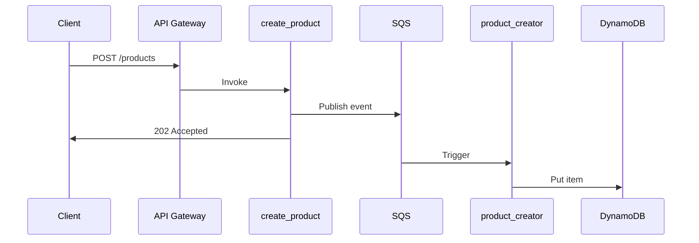
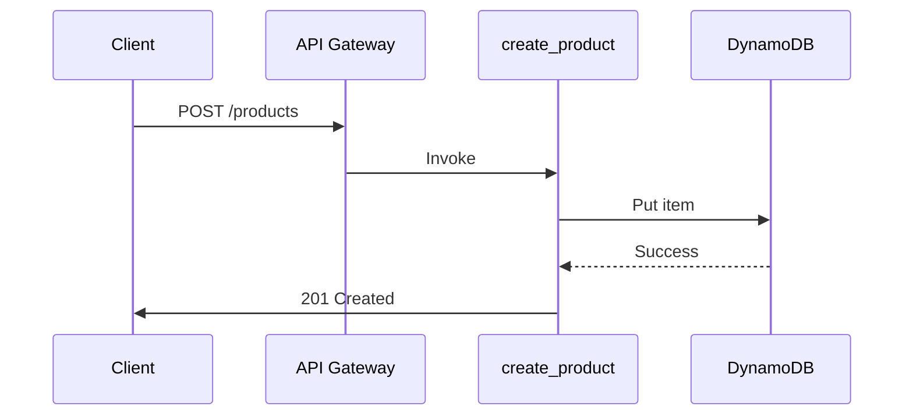

# SQS Removal Summary - V3 Direct DB Integration

**Date**: 2025-12-29
**Change**: Removed all SQS dependencies, implemented direct DynamoDB integration
**Status**: ✅ COMPLETE - Ready for Your Approval

---

## What Changed

### LLD Updated (v3.0 → v4.0) ✅

**File**: `/Users/tebogotseka/Documents/agentic_work/2_bbws_docs/LLDs/2.1.4_LLD_Product_Lambda.md`

**Removed**:
- ❌ All SQS queue references (ProductChangeQueue, DLQ)
- ❌ product_creator Lambda (event processor)
- ❌ Event-driven architecture pattern
- ❌ SQS message schemas (ProductChangeEvent)
- ❌ Async processing (202 Accepted responses)

**Changed**:
- ✅ 6 Lambda functions → 5 Lambda functions (removed product_creator)
- ✅ Architecture: Event-driven → Direct synchronous
- ✅ create/update/delete: Now write directly to DynamoDB
- ✅ Response codes: 202 Accepted → 201 Created / 200 OK / 204 No Content
- ✅ Consistency: Eventual → Immediate
- ✅ Component diagram: Removed SQSQueue and ProductCreatorRecordHandler classes
- ✅ User stories: Updated to reflect synchronous operations
- ✅ Version: 4.0

---

### Project Plan Updated (V2 → V3) ✅

**New File**: `PROJECT_PLAN_V3_DIRECT_DB.md`

**Infrastructure Changes**:
- ❌ Removed: `sqs.tf` (SQS queue + DLQ)
- ❌ Removed: `s3.tf` (audit bucket)
- ❌ Removed: `sns.tf` (SNS topic)
- ✅ Kept: `api_gateway.tf`, `dynamodb.tf`, `iam.tf`, `cloudwatch.tf`

**Lambda Changes**:
- ❌ Removed: `product_creator` Lambda (6 → 5 functions)
- ❌ Removed: `src/event_handlers/` folder
- ❌ Removed: `src/models/events.py` (SQS schemas)
- ❌ Removed: `src/services/sqs_service.py`
- ✅ Updated: create/update/delete handlers write directly to DynamoDB

**Timeline Changes**:
- Workers: 12 → 10 (2 fewer)
- Duration: 7 days → 5-6 days (20% faster)

---

## Architecture Comparison

### Before (V2 with SQS)



**Flow**: Client → API → SQS → Event Processor → DynamoDB
**Response**: 202 Accepted (async)
**Consistency**: Eventual (delay before data available)
**Lambdas**: 6 (5 API + 1 event processor)

---

### After (V3 Direct DB) ⭐ SIMPLIFIED



**Flow**: Client → API → DynamoDB
**Response**: 201 Created (sync)
**Consistency**: Immediate (read your writes)
**Lambdas**: 5 (all API handlers)

---

## Lambda Function Changes

| Function | V2 (with SQS) | V3 (Direct DB) | Change |
|----------|---------------|----------------|--------|
| **list_products** | GET → DynamoDB | GET → DynamoDB | No change |
| **get_product** | GET → DynamoDB | GET → DynamoDB | No change |
| **create_product** | POST → **SQS** (202) | POST → **DynamoDB** (**201**) | ✅ Direct write |
| **update_product** | PUT → **SQS** (202) | PUT → **DynamoDB** (**200**) | ✅ Direct write |
| **delete_product** | DELETE → **SQS** (202) | DELETE → **DynamoDB** (**204**) | ✅ Direct write |
| **product_creator** | **SQS → DynamoDB** | ❌ **REMOVED** | No longer needed |

---

## Response Code Changes

| Operation | V2 (with SQS) | V3 (Direct DB) | Standard REST |
|-----------|---------------|----------------|---------------|
| **Create** | 202 Accepted | **201 Created** | ✅ Standard |
| **Update** | 202 Accepted | **200 OK** | ✅ Standard |
| **Delete** | 202 Accepted | **204 No Content** | ✅ Standard |
| **Get** | 200 OK | 200 OK | ✅ Standard |
| **List** | 200 OK | 200 OK | ✅ Standard |

**Note**: V3 uses standard REST response codes, V2 used 202 (async processing)

---

## Code Changes in Lambdas

### create_product.py

**Before (V2 with SQS)**:
```python
def handler(event, context):
    # Validate request
    product_data = validate_request(event)

    # Generate ID
    product_id = str(uuid.uuid4())

    # Publish to SQS
    sqs_client.send_message(
        QueueUrl=queue_url,
        MessageBody=json.dumps({
            'eventType': 'CREATE',
            'productId': product_id,
            'productData': product_data
        })
    )

    # Return 202 Accepted (async)
    return {
        'statusCode': 202,
        'body': json.dumps({'productId': product_id})
    }
```

**After (V3 Direct DB)**:
```python
def handler(event, context):
    # Validate request
    product_data = validate_request(event)

    # Generate ID
    product_id = str(uuid.uuid4())

    # Direct DynamoDB write
    product = product_repository.create({
        'productId': product_id,
        **product_data
    })

    # Return 201 Created (sync)
    return {
        'statusCode': 201,
        'body': json.dumps(product)
    }
```

**Key Differences**:
- ✅ Direct `product_repository.create()` call
- ✅ Immediate DynamoDB write (put_item)
- ✅ Return full product object
- ✅ 201 Created (not 202 Accepted)
- ❌ No SQS publishing

---

## Benefits of V3 (Direct DB)

### Simplicity
- ✅ **5 Lambdas** instead of 6 (removed event processor)
- ✅ **No SQS** - No queues, no DLQs, no event source mappings
- ✅ **No event schemas** - No ProductChangeEvent models
- ✅ **Simpler code** - Direct DB writes, no message publishing
- ✅ **Easier debugging** - Single Lambda execution, no async tracing

### Consistency
- ✅ **Immediate consistency** - Read your writes instantly
- ✅ **No eventual consistency delays** - Data available immediately
- ✅ **Standard REST responses** - 201/200/204 (not 202)

### Performance
- ✅ **Lower latency** - One less hop (no SQS in middle)
- ✅ **Faster end-to-end** - No async processing delay
- ✅ **No SQS bottleneck** - Direct DynamoDB writes scale better

### Cost
- ✅ **No SQS charges** - Eliminated queue costs
- ✅ **One less Lambda** - No product_creator execution costs
- ✅ **Lower CloudWatch costs** - Fewer log streams

### Maintenance
- ✅ **Fewer moving parts** - No SQS to monitor
- ✅ **No DLQ handling** - No failed message management
- ✅ **Simpler testing** - No async flow testing
- ✅ **Easier troubleshooting** - Direct request-response

---

## Timeline Improvement

| Aspect | V2 (with SQS) | V3 (Direct DB) | Improvement |
|--------|---------------|----------------|-------------|
| **Workers** | 12 | 10 | 2 fewer (17% reduction) |
| **Duration** | 7 days | 5-6 days | 1-2 days faster (20% reduction) |
| **Files** | ~79 | ~50 | 29 fewer files (37% reduction) |
| **Lambdas** | 6 | 5 | 1 fewer Lambda |
| **AWS Resources** | API GW + DDB + SQS + DLQ | API GW + DDB | 2 fewer resources |

---

## What's NOT Removed

**Infrastructure (Still Included)**:
- ✅ API Gateway: `bbws-product-api-{env}`
- ✅ DynamoDB: `bbws-products-{env}` (with 2 GSIs)
- ✅ IAM Roles: Lambda execution roles
- ✅ CloudWatch: Log groups & alarms

**Lambda Repo (Still Included)**:
- ✅ All 5 API handlers
- ✅ ProductRepository (DynamoDB access)
- ✅ ProductService (business logic)
- ✅ Pydantic models
- ✅ Validators & exceptions
- ✅ Tests (80%+ coverage)
- ✅ CI/CD workflows (6 total)

---

## Migration Notes

**If you had V2 deployed, migration steps**:
1. Update Lambda handlers to write directly to DynamoDB
2. Remove SQS event source mappings
3. Delete SQS queues (after verifying no messages)
4. Remove product_creator Lambda
5. Update API Gateway responses (202 → 201/200/204)
6. Test immediate consistency

**For new deployment (V3)**:
- Just follow PROJECT_PLAN_V3_DIRECT_DB.md
- No SQS resources created
- No event processor needed

---

## Files to Review

📄 **PRIMARY DOCUMENTS**:
1. **`SQS_REMOVAL_SUMMARY.md`** ⭐ This file
2. **`PROJECT_PLAN_V3_DIRECT_DB.md`** ⭐ Updated plan (5-6 days, 10 workers)
3. **`2.1.4_LLD_Product_Lambda.md`** (v4.0) - Updated LLD

📄 **PREVIOUS VERSIONS** (superseded):
- `PROJECT_PLAN_V2_MONOREPO.md` - V2 with SQS (superseded)
- `PROJECT_PLAN.md` - V1 microservices (superseded)

---

## Approval Checklist

Please confirm you're OK with:
- ✅ No SQS queues (direct DB writes)
- ✅ No product_creator Lambda (5 Lambdas total)
- ✅ Synchronous operations (immediate consistency)
- ✅ Standard REST responses (201/200/204)
- ✅ 5-6 day timeline
- ✅ Simpler architecture (lowest complexity)

---

## To Approve

Reply with:
- **"GO"** or
- **"APPROVED"** or
- **"Proceed with V3"** or
- **"Confirm"**

---

## What Happens After Approval

1. Initialize Stage 1 (2 workers)
2. Create infrastructure repo (API Gateway + DynamoDB only, NO SQS)
3. Deploy infrastructure to DEV
4. Create product lambda repo structure
5. Implement 5 Lambda functions with direct DB writes
6. Create CI/CD workflows
7. Integration testing
8. **Complete in 5-6 days**

---

**Status**: 🟡 **AWAITING YOUR APPROVAL**

**Current Architecture**: V3 (Direct DB) - 2 repos, 5 Lambdas, NO SQS
**LLD Version**: 4.0 (updated)
**Timeline**: 5-6 working days

---

**Created**: 2025-12-29
**Document**: SQS Removal Summary
**Next**: User approval to proceed with V3 direct DB plan
