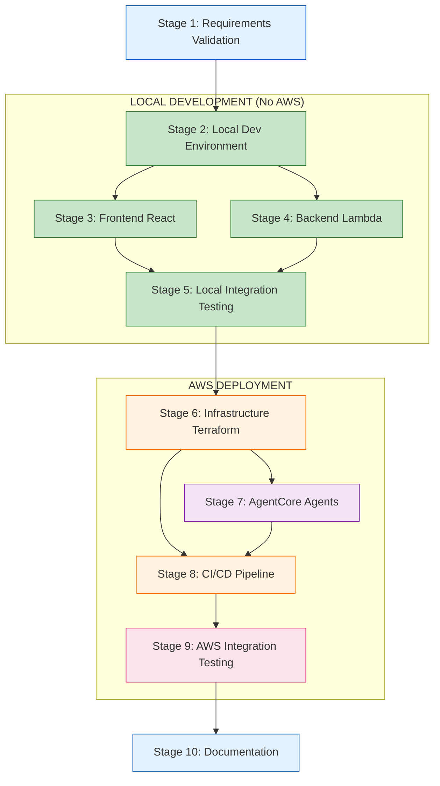

# BBWS AI-Powered Site Builder - Implementation Project Plan

**Project Name**: BBWS AI-Powered Site Builder
**Version**: 2.0
**Created**: 2026-01-16
**Updated**: 2026-01-16
**Status**: PENDING (Awaiting User Approval)
**Total Stages**: 10
**Total Workers**: 60+
**Approach**: Local-First Development with Mocked Services

---

## Document Control

| Version | Date | Author | Changes |
|---------|------|--------|---------|
| 1.0 | 2026-01-16 | Agentic Project Manager | Initial project plan |
| 2.0 | 2026-01-16 | Agentic Project Manager | Restructured for local-first development with mocking |

---

## 1. Project Overview

### 1.1 Purpose

This project plan outlines the complete implementation of the **BBWS AI-Powered Site Builder** - a serverless, multi-tenant SaaS platform enabling non-technical users to generate production-ready landing pages through conversational AI.

### 1.2 Development Approach: Local-First

This plan prioritizes **local development and testing** before AWS deployment:

| Phase | Focus | Testing Environment |
|-------|-------|---------------------|
| **Phase 1** | Requirements + Local Setup | Developer machine |
| **Phase 2** | Frontend + Backend Development | Local with mocks |
| **Phase 3** | Local Integration Testing | Docker Compose stack |
| **Phase 4** | AWS Infrastructure + Deployment | DEV environment |
| **Phase 5** | AWS Integration + Production | SIT/PROD environments |

### 1.3 Key Characteristics

| Attribute | Value |
|-----------|-------|
| Architecture | Hybrid Regional: eu-west-1 (AgentCore), af-south-1 (Data Residency) |
| AI Engine | AWS Bedrock AgentCore (7 agents) |
| Compute | Serverless (Lambda, API Gateway) |
| Frontend | React 18, TypeScript, Vite |
| Backend | Python 3.12 Lambda |
| Infrastructure | Terraform IaC |
| CI/CD | GitHub Actions |
| Multi-Tenant | Yes (Org > Division > Group > Team > User) |
| **Local Testing** | LocalStack, SAM Local, MSW, Docker Compose |

### 1.4 Input Documents

| Document | Path | Purpose |
|----------|------|---------|
| HLD v3.1 | `../HLDs/BBSW_Site_Builder_HLD_v3.md` | Architecture, components, data flows |
| BRS v1.1 | `../BRS/BBWS_Site_Builder_BRS_v1.md` | Business requirements, user stories |
| Frontend LLD | `../LLDs/3.1.1_LLD_Site_Builder_Frontend.md` | React frontend design |
| Generation API LLD | `../LLDs/3.1.2_LLD_Site_Builder_Generation_API.md` | Backend API design |
| UX Wireframes | `../UX/Site_Builder_Wireframes_v1.md` | User journeys, screen designs |

---

## 2. Local Development Stack

### 2.1 Technology Stack for Local Testing

| Component | Local Tool | Purpose |
|-----------|-----------|---------|
| **DynamoDB** | LocalStack | Local DynamoDB emulation |
| **S3** | LocalStack | Local S3 bucket emulation |
| **Cognito** | Mock JWT | Local authentication tokens |
| **API Gateway** | SAM Local | Local Lambda invocation |
| **Lambda** | SAM Local | Run Lambda functions locally |
| **AgentCore** | Mock Fixtures | JSON fixtures for agent responses |
| **Frontend API** | MSW (Mock Service Worker) | Browser-based API mocking |
| **Full Stack** | Docker Compose | Orchestrate all local services |

### 2.2 Mock Strategy

```
┌─────────────────────────────────────────────────────────────────┐
│                     LOCAL DEVELOPMENT STACK                      │
├─────────────────────────────────────────────────────────────────┤
│                                                                 │
│  ┌─────────────┐    ┌─────────────┐    ┌─────────────────────┐ │
│  │   React     │───►│    MSW      │───►│  Mock API Handlers  │ │
│  │   (Vite)    │    │  (Browser)  │    │  (JSON Fixtures)    │ │
│  └─────────────┘    └─────────────┘    └─────────────────────┘ │
│                                                                 │
│  ┌─────────────┐    ┌─────────────┐    ┌─────────────────────┐ │
│  │  SAM Local  │───►│   Lambda    │───►│    LocalStack       │ │
│  │  (API GW)   │    │  Functions  │    │  (DynamoDB, S3)     │ │
│  └─────────────┘    └─────────────┘    └─────────────────────┘ │
│                                                                 │
│  ┌─────────────────────────────────────────────────────────────┐│
│  │              Agent Mock Service (Express)                    ││
│  │  - SSE streaming simulation                                  ││
│  │  - JSON fixtures for each agent type                         ││
│  │  - Configurable response delays                              ││
│  └─────────────────────────────────────────────────────────────┘│
│                                                                 │
└─────────────────────────────────────────────────────────────────┘
```

---

## 3. Stages Overview (Revised for Local-First)

### 3.1 Stage Summary

| Stage | Name | Workers | Dependencies | Focus |
|-------|------|---------|--------------|-------|
| 1 | Requirements Validation | 5 | None | Validate all documents |
| 2 | **Local Development Environment** | 5 | Stage 1 | LocalStack, SAM, MSW setup |
| 3 | Frontend React Development | 9 | Stage 2 | UI with mocked APIs |
| 4 | Backend Lambda Development | 8 | Stage 2 | Lambda with LocalStack |
| 5 | **Local Integration Testing** | 4 | Stages 3, 4 | Test user journeys locally |
| 6 | Infrastructure (Terraform) | 8 | Stage 5 | Deploy to AWS DEV |
| 7 | AgentCore Agent Development | 8 | Stage 6 | Deploy agents to AWS |
| 8 | CI/CD Pipeline Setup | 5 | Stages 6, 7 | Automate deployments |
| 9 | AWS Integration Testing | 4 | Stage 8 | E2E on AWS |
| 10 | Documentation & Runbooks | 4 | Stage 9 | Operational docs |

### 3.2 Stage Dependencies (Mermaid)



### 3.3 Local vs AWS Testing Matrix

| User Journey | Local Testing | AWS Testing |
|--------------|---------------|-------------|
| Login/Authentication | Mock JWT tokens | Cognito |
| Create Landing Page | Mock agent responses | AgentCore |
| Iterate with AI Chat | SSE mock streaming | AgentCore SSE |
| Preview Page | Local HTML render | S3/CloudFront |
| Deploy to Staging | Mock deployment | S3 deployment |
| View Analytics | Mock metrics | CloudWatch/DynamoDB |
| Partner Portal | Full local flow | Full AWS flow |

---

## 4. Detailed Stage Plans

### 4.1 Stage 1: Requirements Validation

**Objective**: Validate all input documents and ensure completeness before development.

| Worker | Task | Inputs | Outputs |
|--------|------|--------|---------|
| worker-1-hld-validation | Validate HLD v3.1 completeness | HLD | HLD validation checklist |
| worker-2-brs-validation | Validate BRS user stories coverage | BRS | User story mapping |
| worker-3-lld-frontend-validation | Validate Frontend LLD | Frontend LLD | Component checklist |
| worker-4-lld-api-validation | Validate API LLD | API LLD | API endpoint matrix |
| worker-5-ux-wireframes-validation | Validate UX coverage | Wireframes | Screen-to-story mapping |

**Success Criteria**:
- [ ] All 9 epics have user stories mapped
- [ ] All 28 user stories have acceptance criteria
- [ ] All API endpoints documented
- [ ] All screens mapped to user stories
- [ ] No blocking TBCs remain

---

### 4.2 Stage 2: Local Development Environment (NEW)

**Objective**: Set up complete local development stack for testing without AWS.

| Worker | Task | Components | Outputs |
|--------|------|------------|---------|
| worker-1-localstack-setup | Configure LocalStack | DynamoDB, S3 tables/buckets | docker-compose.localstack.yml |
| worker-2-sam-local-config | SAM Local configuration | Lambda functions, API GW | template.yaml, samconfig.toml |
| worker-3-msw-handlers | Mock Service Worker setup | API mocks for frontend | src/mocks/handlers.ts |
| worker-4-agent-mock-service | Agent response mock server | SSE streaming, fixtures | agent-mock-server/ |
| worker-5-docker-compose | Full stack orchestration | All services | docker-compose.yml |

**Deliverables**:

```
local-dev/
├── docker-compose.yml           # Full stack orchestration
├── docker-compose.localstack.yml # LocalStack services
├── localstack/
│   ├── init-dynamodb.sh         # Create tables on startup
│   └── init-s3.sh               # Create buckets on startup
├── sam/
│   ├── template.yaml            # SAM template for local
│   └── samconfig.toml           # SAM configuration
├── mocks/
│   ├── msw/
│   │   ├── handlers.ts          # MSW request handlers
│   │   ├── browser.ts           # Browser setup
│   │   └── fixtures/            # JSON response fixtures
│   └── agents/
│       ├── server.ts            # Express mock server
│       ├── sse-stream.ts        # SSE streaming helper
│       └── fixtures/
│           ├── site-generator.json
│           ├── outliner.json
│           ├── theme-selector.json
│           ├── layout.json
│           ├── logo-creator.json
│           ├── background-image.json
│           ├── blogger.json
│           └── validator.json
└── scripts/
    ├── start-local.sh           # Start all local services
    ├── stop-local.sh            # Stop all local services
    └── seed-data.sh             # Seed test data
```

**Success Criteria**:
- [ ] `docker-compose up` starts full local stack
- [ ] LocalStack DynamoDB tables created automatically
- [ ] LocalStack S3 buckets created automatically
- [ ] SAM Local starts API Gateway on localhost:3001
- [ ] MSW intercepts frontend API calls
- [ ] Agent mock server returns SSE streams
- [ ] Test data can be seeded with one command

---

### 4.3 Stage 3: Frontend React Development

**Objective**: Implement the React frontend with mocked APIs (no AWS dependency).

| Worker | Task | Components | Local Testing |
|--------|------|------------|---------------|
| worker-1-app-shell-routing | App shell, routes | AppShell, Header, Sidebar | MSW mocks |
| worker-2-auth-context | Auth context (mock JWT) | AuthContext, login flows | Mock tokens |
| worker-3-dashboard-components | Dashboard UI | ProjectCard, AgentCard | MSW mocks |
| worker-4-builder-workspace | Main workspace | SplitPane, ActionBar | MSW mocks |
| worker-5-chat-panel | Chat interface + SSE | ChatPanel, StreamingMessage | Agent mock SSE |
| worker-6-preview-panel | Live preview | PreviewFrame, DeviceSelector | Local HTML |
| worker-7-agent-panels | Design agent UIs | LogoCreator, ThemeSelector | Agent mocks |
| worker-8-deployment-modal | Deploy workflow | DeploymentModal, ValidationReport | MSW mocks |
| worker-9-partner-portal | Partner management | PartnerDashboard, BrandingConfig | MSW mocks |

**Success Criteria**:
- [ ] All screens from wireframes implemented
- [ ] Full user journeys testable locally
- [ ] SSE streaming works with mock server
- [ ] Responsive design verified
- [ ] Unit tests pass with mocked APIs
- [ ] `npm run dev` starts frontend with mocks

---

### 4.4 Stage 4: Backend Lambda Development

**Objective**: Implement all Lambda functions testable with LocalStack.

| Worker | Task | User Stories | Local Testing |
|--------|------|--------------|---------------|
| worker-1-tenant-service | Tenant CRUD | US-015 | LocalStack DynamoDB |
| worker-2-user-service | User management | US-016-018 | LocalStack DynamoDB |
| worker-3-site-service | Site CRUD, versions | US-001, US-004 | LocalStack DynamoDB/S3 |
| worker-4-generation-service | AI generation orchestration | US-001, US-003 | Mock agent calls |
| worker-5-deployment-service | S3/CloudFront deploy | US-007, US-008 | LocalStack S3 |
| worker-6-validation-service | Brand score, security | US-005, US-006 | Mock validator |
| worker-7-analytics-service | Usage metrics | US-009, US-010 | LocalStack DynamoDB |
| worker-8-partner-service | White-label, billing | US-025-028 | LocalStack DynamoDB |

**Success Criteria**:
- [ ] All Lambda functions run with SAM Local
- [ ] DynamoDB operations work with LocalStack
- [ ] S3 operations work with LocalStack
- [ ] Unit tests with moto (AWS mocking)
- [ ] >80% code coverage
- [ ] `sam local start-api` serves all endpoints

---

### 4.5 Stage 5: Local Integration Testing (NEW)

**Objective**: Validate complete user journeys locally before AWS deployment.

| Worker | Task | Test Coverage | Tools |
|--------|------|---------------|-------|
| worker-1-frontend-backend-integration | Frontend ↔ Backend tests | All API calls | Cypress + SAM Local |
| worker-2-user-journey-tests | Complete user flows | All personas | Playwright |
| worker-3-agent-mock-validation | Agent response handling | SSE, multi-agent | Jest + mock server |
| worker-4-local-e2e-suite | Full E2E test suite | Happy paths + errors | Playwright |

**Test Scenarios**:

| Scenario | Steps | Expected Result |
|----------|-------|-----------------|
| Marketing User Creates Page | Login → Chat → Generate → Preview → Deploy | Page deployed to mock S3 |
| Designer Updates Theme | Login → Select Site → Theme Panel → Save | Theme applied in preview |
| Org Admin Invites User | Login → Admin → Users → Invite → Email | Mock email sent |
| Partner Configures Branding | Login → Partner Portal → Branding → Save | Branding persisted |

**Success Criteria**:
- [ ] All 5 persona journeys pass locally
- [ ] SSE streaming works end-to-end
- [ ] Error handling verified
- [ ] Performance baseline established
- [ ] No AWS credentials required for tests
- [ ] CI can run tests without AWS

---

### 4.6 Stage 6: Infrastructure (Terraform)

**Objective**: Deploy AWS infrastructure to DEV environment.

| Worker | Task | Region | Components |
|--------|------|--------|------------|
| worker-1-af-south-api-gateway | API Gateway + WAF | af-south-1 | REST API, usage plans |
| worker-2-af-south-dynamodb | DynamoDB tables | af-south-1 | 6 tables with GSIs |
| worker-3-af-south-s3 | S3 buckets | af-south-1 | Brand assets, sites |
| worker-4-af-south-cognito | Cognito setup | af-south-1 | User pool, groups |
| worker-5-af-south-lambda-scaffold | Lambda scaffolding | af-south-1 | IAM roles, layers |
| worker-6-eu-west-agentcore-config | AgentCore configuration | eu-west-1 | Agent definitions |
| worker-7-cross-region-eventbridge | EventBridge rules | Both | Cross-region routing |
| worker-8-global-route53-waf | Global resources | Global | Route 53, WAF ACL |

**Success Criteria**:
- [ ] All modules pass `terraform validate`
- [ ] DEV environment deployed
- [ ] Smoke tests pass on DEV
- [ ] No hardcoded credentials
- [ ] S3 public access blocked

---

### 4.7 Stage 7: AgentCore Agent Development

**Objective**: Implement and deploy AI agents to AWS Bedrock AgentCore.

| Worker | Task | AI Model | User Stories |
|--------|------|----------|--------------|
| worker-1-site-generator-agent | Orchestrator agent | Claude Sonnet 4.5 | US-001, US-002 |
| worker-2-outliner-agent | Page structure | Claude Haiku | US-014 |
| worker-3-theme-selector-agent | Color/style | Claude Haiku | US-013 |
| worker-4-layout-agent | Responsive layouts | Claude Sonnet 4.5 | US-023 |
| worker-5-logo-creator-agent | Logo generation | Stable Diffusion XL | US-011 |
| worker-6-background-image-agent | Background images | Stable Diffusion XL | US-012 |
| worker-7-blogger-agent | Blog/newsletter | Claude Sonnet 4.5 | US-022, US-024 |
| worker-8-validator-agent | Brand compliance | Claude Haiku | US-005, US-006 |

**Success Criteria**:
- [ ] All agents deploy to AgentCore (eu-west-1)
- [ ] Cedar policies configured
- [ ] Agent memory working
- [ ] Mock fixtures updated with real responses

---

### 4.8 Stage 8: CI/CD Pipeline Setup

**Objective**: Create GitHub Actions workflows for all repositories.

| Worker | Task | Repository | Workflows |
|--------|------|------------|-----------|
| worker-1-infra-github-actions | Infra pipeline | bbws-site-builder-infra | plan.yml, apply.yml |
| worker-2-api-github-actions | API pipeline | bbws-site-builder-api | test.yml, deploy.yml |
| worker-3-agents-github-actions | Agents pipeline | bbws-site-builder-agents | test.yml, deploy.yml |
| worker-4-frontend-github-actions | Frontend pipeline | bbws-site-builder-web | test.yml, deploy.yml |
| worker-5-integration-test-workflow | E2E tests | All | integration.yml |

**Success Criteria**:
- [ ] Local tests run in CI (no AWS needed)
- [ ] AWS tests run on deployment
- [ ] DEV auto-deploy on merge
- [ ] SIT/PROD manual approval

---

### 4.9 Stage 9: AWS Integration Testing

**Objective**: Comprehensive testing on AWS DEV environment.

| Worker | Task | Test Type | Coverage |
|--------|------|-----------|----------|
| worker-1-api-integration-tests | API tests on AWS | Integration | All endpoints |
| worker-2-agent-integration-tests | Agent tests on AWS | Integration | All agents |
| worker-3-e2e-tests | End-to-end on AWS | E2E | User journeys |
| worker-4-performance-tests | Load tests | Performance | Generation, deploy |

**Success Criteria**:
- [ ] All API endpoints tested on AWS
- [ ] Real agent responses validated
- [ ] User journeys pass on DEV
- [ ] Performance within thresholds

---

### 4.10 Stage 10: Documentation & Runbooks

**Objective**: Create operational documentation.

| Worker | Task | Output |
|--------|------|--------|
| worker-1-deployment-runbook | Deployment procedures | DEPLOYMENT.md |
| worker-2-environment-promotion-runbook | DEV > SIT > PROD | PROMOTION.md |
| worker-3-troubleshooting-runbook | Common issues | TROUBLESHOOTING.md |
| worker-4-dr-failover-runbook | Disaster recovery | DR_FAILOVER.md |

**Success Criteria**:
- [ ] Step-by-step procedures
- [ ] Rollback instructions included
- [ ] Local development guide included

---

## 5. Approval Gates

| Gate | After Stage | Focus | Approvers |
|------|-------------|-------|-----------|
| Gate 1 | Stage 1 | Requirements validated | Product Owner |
| Gate 2 | Stage 2 | Local environment working | Tech Lead |
| Gate 3 | Stage 5 | **Local testing complete** | QA Lead, Tech Lead |
| Gate 4 | Stage 6 | AWS DEV deployed | DevOps Lead |
| Gate 5 | Stage 7 | Agents deployed | AI Lead |
| Gate 6 | Stage 8 | CI/CD operational | DevOps Lead |
| Gate 7 | Stage 9 | AWS testing complete | QA Lead |
| Gate 8 | Stage 10 | Production ready | Business Owner |

---

## 6. Progress Tracking

### 6.1 Stage Progress

| Stage | Name | Status | Workers | Complete |
|-------|------|--------|---------|----------|
| 1 | Requirements Validation | PENDING | 5 | 0/5 |
| 2 | Local Development Environment | PENDING | 5 | 0/5 |
| 3 | Frontend React Development | PENDING | 9 | 0/9 |
| 4 | Backend Lambda Development | PENDING | 8 | 0/8 |
| 5 | Local Integration Testing | PENDING | 4 | 0/4 |
| 6 | Infrastructure (Terraform) | PENDING | 8 | 0/8 |
| 7 | AgentCore Agent Development | PENDING | 8 | 0/8 |
| 8 | CI/CD Pipeline Setup | PENDING | 5 | 0/5 |
| 9 | AWS Integration Testing | PENDING | 4 | 0/4 |
| 10 | Documentation & Runbooks | PENDING | 4 | 0/4 |

### 6.2 Local Testing Milestone

| Checkpoint | Status |
|------------|--------|
| LocalStack running | PENDING |
| SAM Local running | PENDING |
| MSW configured | PENDING |
| Agent mock server running | PENDING |
| Frontend loads with mocks | PENDING |
| Backend APIs work locally | PENDING |
| User journeys pass locally | PENDING |
| **Ready for AWS deployment** | PENDING |

---

## 7. Quick Start Commands

### Start Local Development Stack
```bash
cd local-dev
docker-compose up -d          # Start LocalStack + mock services
sam local start-api           # Start Lambda API
cd ../frontend && npm run dev # Start React with MSW
```

### Run Local Tests
```bash
npm run test:local            # Unit tests with mocks
npm run test:integration      # Frontend + Backend integration
npm run test:e2e:local        # Full E2E with Playwright
```

### Deploy to AWS (After Local Testing)
```bash
cd infra && terraform apply -var-file=envs/dev.tfvars
sam deploy --config-env dev
```

---

## 8. Risk Register

| Risk | Impact | Mitigation |
|------|--------|------------|
| LocalStack doesn't match AWS exactly | Medium | Validate with AWS DEV early |
| Mock fixtures diverge from real agents | Medium | Update fixtures from real responses |
| Local tests pass but AWS fails | Medium | Comprehensive AWS integration stage |
| SSE mocking incomplete | Low | Test with real agents in Stage 7 |

---

**Project Manager**: Agentic Project Manager
**Last Updated**: 2026-01-16
