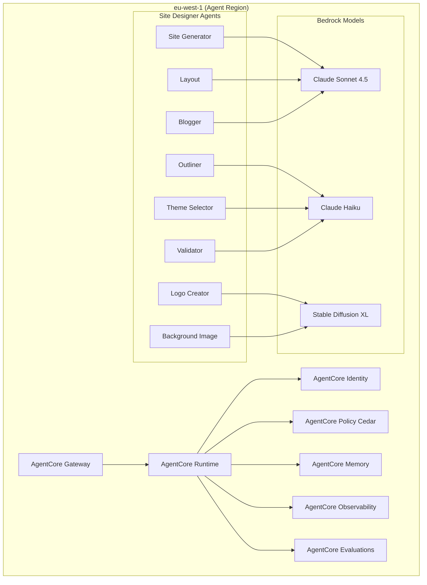

# Stage 4: AgentCore Agent Development

**Stage ID**: stage-4-agentcore-agents
**Project**: project-plan-site-builder
**Status**: PENDING
**Workers**: 8 (parallel execution)

---

## Stage Objective

Implement all 8 AI agents using AWS Bedrock AgentCore in eu-west-1. Each agent has defined capabilities, tools, memory configuration, and Cedar policies for tenant isolation.

---

## Stage Workers

| Worker | Task | AI Model | User Stories | Status |
|--------|------|----------|--------------|--------|
| worker-1-site-generator-agent | Orchestrator agent | Claude Sonnet 4.5 | US-001, US-002 | PENDING |
| worker-2-outliner-agent | Page structure generation | Claude Haiku | US-014 | PENDING |
| worker-3-theme-selector-agent | Color/style suggestions | Claude Haiku | US-013 | PENDING |
| worker-4-layout-agent | Responsive layouts | Claude Sonnet 4.5 | US-023 | PENDING |
| worker-5-logo-creator-agent | Logo generation | Stable Diffusion XL | US-011 | PENDING |
| worker-6-background-image-agent | Background images | Stable Diffusion XL | US-012 | PENDING |
| worker-7-blogger-agent | Blog/newsletter content | Claude Sonnet 4.5 | US-022, US-024 | PENDING |
| worker-8-validator-agent | Brand compliance | Claude Haiku + Custom | US-005, US-006 | PENDING |

---

## Stage Inputs

| Input | Source |
|-------|--------|
| HLD v3.1 | `../../HLDs/BBSW_Site_Builder_HLD_v3.md` (Section 7: AI Agents) |
| API LLD | `../../LLDs/3.1.2_LLD_Site_Builder_Generation_API.md` |
| Agent Personas | S3 bucket (bbws-agent-personas-{env}) |

---

## Stage Outputs

| Output | Description | Location |
|--------|-------------|----------|
| Agent Definitions | AgentCore agent configs | bbws-site-builder-agents |
| Tool Definitions | Lambda function tools | bbws-site-builder-agents |
| Cedar Policies | Tenant isolation policies | bbws-site-builder-agents |
| Prompt Templates | Agent personas in S3 | bbws-agent-personas-{env} |
| Memory Configuration | Session memory settings | bbws-site-builder-agents |
| Evaluation Definitions | Agent quality checks | bbws-site-builder-agents |

---

## AgentCore Architecture



---

## Agent Specifications

### 1. Site Generator Agent (Orchestrator)

| Attribute | Value |
|-----------|-------|
| Model | Claude Sonnet 4.5 |
| Role | Orchestrates page generation |
| Sub-Agents | Outliner, Theme, Layout |
| Memory | Session-based, 30 min retention |
| Output | HTML + CSS |

### 2. Outliner Agent

| Attribute | Value |
|-----------|-------|
| Model | Claude Haiku |
| Role | Generates page structure |
| Input | User requirements |
| Output | Section hierarchy JSON |

### 3. Theme Selector Agent

| Attribute | Value |
|-----------|-------|
| Model | Claude Haiku |
| Role | Suggests color palettes, typography |
| Input | Industry, mood, brand colors |
| Output | Theme configuration JSON |

### 4. Layout Agent

| Attribute | Value |
|-----------|-------|
| Model | Claude Sonnet 4.5 |
| Role | Creates responsive layouts |
| Input | Page sections, device targets |
| Output | CSS Grid/Flexbox layout |

### 5. Logo Creator Agent

| Attribute | Value |
|-----------|-------|
| Model | Stable Diffusion XL |
| Role | Generates logo options |
| Input | Style, colors, description |
| Output | 4 logo variations (PNG) |
| Guardrails | Content moderation enabled |

### 6. Background Image Agent

| Attribute | Value |
|-----------|-------|
| Model | Stable Diffusion XL |
| Role | Generates background images |
| Input | Style, dimensions, theme |
| Output | 4 background options (WEBP) |
| Guardrails | Content moderation enabled |

### 7. Blogger Agent

| Attribute | Value |
|-----------|-------|
| Model | Claude Sonnet 4.5 |
| Role | Generates blog/newsletter content |
| Input | Topic, keywords, tone, length |
| Output | Markdown/HTML content |

### 8. Validator Agent

| Attribute | Value |
|-----------|-------|
| Model | Claude Haiku + Custom rules |
| Role | Brand compliance, security scan |
| Input | Generated HTML/CSS |
| Output | Validation report, score |

---

## Cedar Policies

### Tenant Isolation Policy

```cedar
// Only allow agents to access data belonging to the requesting tenant
permit (
    principal,
    action == Action::"invokeAgent",
    resource
)
when {
    principal.tenantId == resource.tenantId
};
```

### Rate Limiting Policy

```cedar
// Enforce rate limits based on subscription tier
forbid (
    principal,
    action == Action::"invokeAgent",
    resource
)
when {
    principal.tier == "free" &&
    principal.requestsThisMonth >= 50
};
```

---

## Success Criteria

- [ ] All 8 agents deployed to AgentCore
- [ ] Cedar policies for tenant isolation configured
- [ ] Agent memory configured (30 min session)
- [ ] Evaluations defined for each agent
- [ ] Prompt templates uploaded to S3
- [ ] Content moderation guardrails enabled for image agents
- [ ] Cross-region EventBridge integration working
- [ ] All agents pass functional testing
- [ ] Stage summary created

---

## Dependencies

**Depends On**: Stage 2 (Infrastructure Terraform)

**Blocks**:
- Stage 5 (Frontend React Development)
- Stage 6 (CI/CD Pipeline Setup)

---

## Approval Gate

**Gate 4: Agent Review**

| Approver | Area | Status |
|----------|------|--------|
| AI Lead | Agent quality | PENDING |
| Product Owner | Output quality | PENDING |
| Security | Guardrails, policies | PENDING |

**Gate Criteria**:
- All agents functional
- Cedar policies configured
- Content moderation enabled
- Sample generations approved

---

**Created**: 2026-01-16
