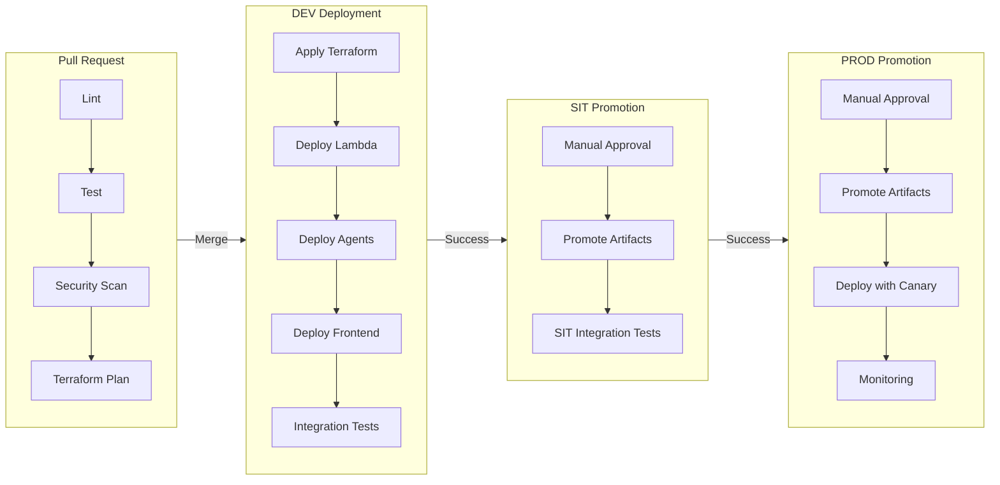

# Stage 6: CI/CD Pipeline Setup

**Stage ID**: stage-6-cicd-pipeline
**Project**: project-plan-site-builder
**Status**: PENDING
**Workers**: 5 (parallel execution)

---

## Stage Objective

Create GitHub Actions workflows for all repositories. Implement automated testing, deployment to DEV, and manual promotion to SIT/PROD.

---

## Stage Workers

| Worker | Task | Repository | Status |
|--------|------|------------|--------|
| worker-1-infra-github-actions | Infrastructure pipeline | bbws-site-builder-infra | PENDING |
| worker-2-api-github-actions | API Lambda pipeline | bbws-site-builder-api | PENDING |
| worker-3-agents-github-actions | AgentCore pipeline | bbws-site-builder-agents | PENDING |
| worker-4-frontend-github-actions | Frontend pipeline | bbws-site-builder-web | PENDING |
| worker-5-integration-test-workflow | E2E test workflow | All repos | PENDING |

---

## Stage Inputs

| Input | Source |
|-------|--------|
| Terraform Modules | Stage 2 output |
| Lambda Functions | Stage 3 output |
| Agent Definitions | Stage 4 output |
| Frontend Application | Stage 5 output |

---

## Stage Outputs

| Output | Description | Location |
|--------|-------------|----------|
| `.github/workflows/validate.yml` | PR validation | All repos |
| `.github/workflows/deploy-dev.yml` | DEV deployment | All repos |
| `.github/workflows/promote-sit.yml` | SIT promotion | All repos |
| `.github/workflows/promote-prod.yml` | PROD promotion | All repos |
| `.github/workflows/integration.yml` | E2E tests | All repos |
| `.github/workflows/rollback.yml` | Rollback workflow | All repos |

---

## Pipeline Architecture



---

## Workflow Details

### 1. Validate Workflow (PR)

```yaml
name: Validate PR
on:
  pull_request:
    branches: [main, develop]

jobs:
  lint:
    runs-on: ubuntu-latest
    steps:
      - uses: actions/checkout@v4
      # Lint, format check

  test:
    runs-on: ubuntu-latest
    steps:
      - uses: actions/checkout@v4
      # Unit tests, coverage

  security:
    runs-on: ubuntu-latest
    steps:
      - uses: actions/checkout@v4
      # SAST, dependency scan

  terraform-plan:
    runs-on: ubuntu-latest
    steps:
      - uses: actions/checkout@v4
      # terraform init, validate, plan
```

### 2. Deploy DEV Workflow

```yaml
name: Deploy to DEV
on:
  push:
    branches: [main]

env:
  ENVIRONMENT: dev
  AWS_REGION: af-south-1

jobs:
  deploy-infra:
    runs-on: ubuntu-latest
    environment: dev
    steps:
      - uses: actions/checkout@v4
      # terraform apply

  deploy-api:
    needs: deploy-infra
    runs-on: ubuntu-latest
    steps:
      # SAM deploy or Lambda update

  deploy-agents:
    needs: deploy-infra
    runs-on: ubuntu-latest
    steps:
      # AgentCore deploy

  deploy-frontend:
    needs: [deploy-api, deploy-agents]
    runs-on: ubuntu-latest
    steps:
      # Vite build, S3 sync, CloudFront invalidate

  integration-tests:
    needs: deploy-frontend
    runs-on: ubuntu-latest
    steps:
      # Run E2E tests
```

### 3. Promote to SIT/PROD

```yaml
name: Promote to SIT
on:
  workflow_dispatch:
    inputs:
      version:
        description: 'Version to promote'
        required: true

jobs:
  promote:
    runs-on: ubuntu-latest
    environment: sit
    steps:
      - name: Manual Approval
        # Environment protection rule
      - name: Promote Artifacts
        # Copy from DEV to SIT
```

---

## Environment Protection Rules

| Environment | Approvers | Wait Timer | Branch |
|-------------|-----------|------------|--------|
| dev | None | 0 | main |
| sit | DevOps Lead | 0 | main |
| prod | DevOps Lead, Product Owner | 30 min | main |

---

## Success Criteria

- [ ] All repositories have validate workflow
- [ ] DEV auto-deploys on merge to main
- [ ] SIT requires manual approval
- [ ] PROD requires dual approval + 30 min timer
- [ ] Rollback workflow functional
- [ ] Integration tests pass
- [ ] Slack/SNS notifications configured
- [ ] Stage summary created

---

## Dependencies

**Depends On**:
- Stage 2 (Infrastructure Terraform)
- Stage 3 (Backend Lambda Development)
- Stage 4 (AgentCore Agent Development)
- Stage 5 (Frontend React Development)

**Blocks**:
- Stage 7 (Integration Testing)

---

## Approval Gate

**Gate 6: Pipeline Review**

| Approver | Area | Status |
|----------|------|--------|
| DevOps Lead | Pipeline quality | PENDING |
| Security | Secrets management | PENDING |

**Gate Criteria**:
- All pipelines functional
- DEV deployment successful
- Rollback tested
- Notifications working

---

**Created**: 2026-01-16
