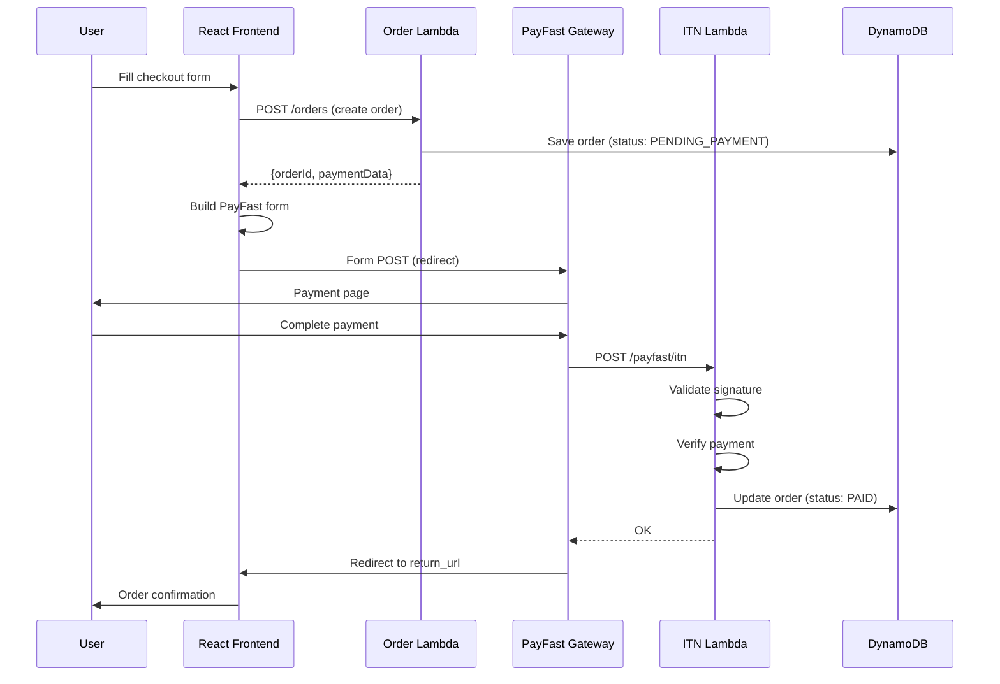

# PayFast Integration Research for BBWS Buy Module

**Version**: 1.0
**Created**: 2026-01-05
**Status**: Research Complete
**Target Codebase**: `2_1_bbws_web_public/buy`

---

## Table of Contents

1. [Executive Summary](#1-executive-summary)
2. [PayFast Overview](#2-payfast-overview)
3. [Integration Architecture](#3-integration-architecture)
4. [Current Buy Module Analysis](#4-current-buy-module-analysis)
5. [PayFast Integration Requirements](#5-payfast-integration-requirements)
6. [Implementation Approach](#6-implementation-approach)
7. [Security Considerations](#7-security-considerations)
8. [Testing Strategy](#8-testing-strategy)
9. [Environment Configuration](#9-environment-configuration)
10. [References](#10-references)

---

## 1. Executive Summary

This research document provides comprehensive analysis for integrating PayFast payment gateway into the BBWS Buy module. The integration will enable secure online payments for South African customers via Visa, Mastercard, Instant EFT, and other local payment methods.

### Key Findings

| Aspect | Finding |
|--------|---------|
| Integration Type | Custom Integration (Form POST redirect) |
| Sandbox URL | `https://sandbox.payfast.co.za/eng/process` |
| Production URL | `https://www.payfast.co.za/eng/process` |
| Authentication | Merchant ID + Merchant Key + MD5 Signature |
| Notification | ITN (Instant Transaction Notification) webhook |
| Current Order Flow | Frontend → Order Lambda → DynamoDB (no payment processing) |

### Recommended Architecture

```
Frontend (React) → PayFast Form → PayFast Payment Page → ITN Notification → Lambda → DynamoDB
```

---

## 2. PayFast Overview

### 2.1 About PayFast

PayFast is South Africa's leading online payment gateway, enabling businesses to accept:
- Credit/Debit Cards (Visa, Mastercard, American Express)
- Instant EFT (all major SA banks)
- Mobicred
- SnapScan
- Samsung Pay
- Apple Pay

### 2.2 Integration Types

| Type | Description | Use Case |
|------|-------------|----------|
| **Custom Integration** | Form POST to PayFast, redirect payment | Full control, recommended for BBWS |
| **Onsite Integration** | iFrame/modal on your site | Better UX, NOT available in sandbox |
| **API Integration** | Direct API calls | Subscriptions, tokenization, recurring |

### 2.3 Sandbox vs Production

| Aspect | Sandbox | Production |
|--------|---------|------------|
| URL | `sandbox.payfast.co.za` | `www.payfast.co.za` |
| Credentials | Test credentials | Live credentials |
| Payments | Virtual wallet only | Real payments |
| Onsite | NOT available | Available |
| Purpose | Testing | Live transactions |

---

## 3. Integration Architecture

### 3.1 Payment Flow Diagram



### 3.2 Component Responsibilities

| Component | Responsibility |
|-----------|----------------|
| **Frontend** | Collect customer data, build PayFast form, handle redirects |
| **Order Lambda** | Create order, generate payment reference, return PayFast params |
| **ITN Lambda** | Receive PayFast notification, validate, update order status |
| **DynamoDB** | Store order with payment status |

---

## 4. Current Buy Module Analysis

### 4.1 Codebase Structure

```
buy/src/
├── App.tsx                     # Main app, routing
├── components/
│   ├── checkout/
│   │   ├── CheckoutPage.tsx    # Order form container
│   │   ├── CustomerForm.tsx    # Customer details form
│   │   └── OrderSummary.tsx    # Order summary display
│   ├── pricing/
│   │   ├── PricingPage.tsx     # Product listing
│   │   └── PricingCard.tsx     # Individual product card
│   └── layout/
│       ├── PageLayout.tsx      # Layout wrapper
│       └── Navigation.tsx      # Navigation bar
├── services/
│   ├── orderApi.ts             # Order submission to backend
│   └── productApi.ts           # Product fetching
├── config/
│   └── index.ts                # Environment configuration
├── types/
│   ├── api.ts                  # API types
│   ├── form.ts                 # Form types
│   └── product.ts              # Product types
└── utils/
    └── validation.ts           # Form validation
```

### 4.2 Current Order Flow

**Current Implementation** (`orderApi.ts:353-426`):

1. Customer fills form → `CustomerForm.tsx`
2. Form validated → `validation.ts`
3. Payload transformed → `transformToBackendPayload()`
4. POST to Order Lambda → `/orders/v1.0/orders`
5. Order created with status `PENDING`
6. No payment processing currently

### 4.3 Current Data Transformation

```typescript
// Frontend Form → Backend Payload
{
  customerEmail: "john@example.com",
  firstName: "John",
  lastName: "Doe",
  primaryPhone: "+27821234567",
  totalAmount: 95.00,
  currency: "ZAR",
  items: [{
    productId: "PROD-ENTRY",
    productName: "Entry",
    quantity: 1,
    unitPrice: 95.00,
    totalPrice: 95.00
  }],
  billingAddress: { ... }
}
```

### 4.4 Integration Gap Analysis

| Current State | Required for PayFast |
|---------------|---------------------|
| Order created, no payment | Payment processing required |
| Success redirect to home | Redirect to PayFast, then return |
| No payment reference | Generate m_payment_id |
| No signature | MD5 signature generation |
| No ITN endpoint | ITN webhook handler needed |

---

## 5. PayFast Integration Requirements

### 5.1 Sandbox Credentials

| Parameter | Value | Notes |
|-----------|-------|-------|
| `merchant_id` | `10000100` | Test merchant ID |
| `merchant_key` | `46f0cd694581a` | Test merchant key |
| `passphrase` | `jt7NOE43FZPn` | For signature generation |

**Source**: [PayFast Developer Documentation](https://developers.payfast.co.za/)

### 5.2 Required Form Parameters

| Parameter | Required | Description |
|-----------|----------|-------------|
| `merchant_id` | Yes | Unique PayFast merchant identifier |
| `merchant_key` | Yes | Unique PayFast merchant key |
| `return_url` | Yes | URL to redirect after successful payment |
| `cancel_url` | Yes | URL to redirect if payment cancelled |
| `notify_url` | Yes | URL for ITN notifications (webhook) |
| `name_first` | No | Customer first name |
| `name_last` | No | Customer last name |
| `email_address` | No | Customer email |
| `m_payment_id` | No | Your unique payment reference |
| `amount` | Yes | Payment amount in ZAR |
| `item_name` | Yes | Description of purchase |
| `signature` | Yes | MD5 hash of all parameters |

### 5.3 Parameter Order (Critical!)

The signature MUST be generated with parameters in this exact order:

```
merchant_id, merchant_key, return_url, cancel_url, notify_url,
name_first, name_last, email_address, cell_number, m_payment_id,
amount, item_name, item_description, custom_int1, custom_int2,
custom_int3, custom_int4, custom_int5, custom_str1, custom_str2,
custom_str3, custom_str4, custom_str5, email_confirmation,
confirmation_address, payment_method, subscription_type,
billing_date, recurring_amount, frequency, cycles
```

### 5.4 Signature Generation

```typescript
import crypto from 'crypto';

function generateSignature(data: Record<string, string>, passphrase: string): string {
  // 1. Create parameter string in correct order
  const orderedKeys = [
    'merchant_id', 'merchant_key', 'return_url', 'cancel_url',
    'notify_url', 'name_first', 'name_last', 'email_address',
    'cell_number', 'm_payment_id', 'amount', 'item_name',
    'item_description', 'custom_int1', 'custom_int2', 'custom_int3',
    'custom_int4', 'custom_int5', 'custom_str1', 'custom_str2',
    'custom_str3', 'custom_str4', 'custom_str5'
  ];

  // 2. Build parameter string (only include non-empty values)
  let paramString = '';
  orderedKeys.forEach(key => {
    if (data[key] && data[key] !== '') {
      paramString += `${key}=${encodeURIComponent(data[key]).replace(/%20/g, '+')}&`;
    }
  });

  // 3. Add passphrase
  paramString += `passphrase=${encodeURIComponent(passphrase).replace(/%20/g, '+')}`;

  // 4. Generate MD5 hash
  return crypto.createHash('md5').update(paramString).digest('hex');
}
```

### 5.5 Common Signature Issues

| Issue | Cause | Solution |
|-------|-------|----------|
| Signature mismatch | Wrong parameter order | Use exact order from docs |
| Signature mismatch | Incorrect URL encoding | Use uppercase hex (%3A not %3a) |
| Signature mismatch | Spaces encoded wrong | Encode as '+' not '%20' |
| Signature mismatch | Empty passphrase in prod | Don't include passphrase if empty |

---

## 6. Implementation Approach

### 6.1 Frontend Changes

#### 6.1.1 New PayFast Form Component

```typescript
// src/components/checkout/PayFastForm.tsx
interface PayFastFormProps {
  paymentData: PayFastPaymentData;
  onCancel: () => void;
}

interface PayFastPaymentData {
  merchant_id: string;
  merchant_key: string;
  return_url: string;
  cancel_url: string;
  notify_url: string;
  name_first: string;
  name_last: string;
  email_address: string;
  cell_number: string;
  m_payment_id: string;
  amount: string;
  item_name: string;
  item_description: string;
  signature: string;
}

const PayFastForm: React.FC<PayFastFormProps> = ({ paymentData, onCancel }) => {
  const formRef = useRef<HTMLFormElement>(null);
  const [isSubmitting, setIsSubmitting] = useState(false);

  const payFastUrl = import.meta.env.VITE_PAYFAST_URL ||
    'https://sandbox.payfast.co.za/eng/process';

  const handleSubmit = () => {
    setIsSubmitting(true);
    formRef.current?.submit();
  };

  return (
    <form ref={formRef} action={payFastUrl} method="POST">
      {Object.entries(paymentData).map(([key, value]) => (
        <input key={key} type="hidden" name={key} value={value} />
      ))}
      <button type="button" onClick={handleSubmit} disabled={isSubmitting}>
        {isSubmitting ? 'Redirecting to PayFast...' : 'Pay with PayFast'}
      </button>
      <button type="button" onClick={onCancel}>Cancel</button>
    </form>
  );
};
```

#### 6.1.2 Modified Checkout Flow

```typescript
// CheckoutPage.tsx - Modified flow
const handleSubmit = async () => {
  // 1. Validate form
  const validation = validateOrderForm(formData);
  if (!validation.isValid) { ... }

  // 2. Create order and get PayFast data
  const response = await createOrderWithPayment(formData, selectedPlan);

  // 3. Show PayFast form (user clicks to redirect)
  setPaymentData(response.paymentData);
  setShowPayFastForm(true);
};
```

### 6.2 Backend Changes

#### 6.2.1 Order Lambda Modifications

Add to Order Lambda response:

```typescript
// Lambda response includes PayFast data
{
  orderId: "ORD-123",
  status: "PENDING_PAYMENT",
  paymentData: {
    merchant_id: process.env.PAYFAST_MERCHANT_ID,
    merchant_key: process.env.PAYFAST_MERCHANT_KEY,
    return_url: `${process.env.FRONTEND_URL}/order/success?orderId=ORD-123`,
    cancel_url: `${process.env.FRONTEND_URL}/order/cancelled?orderId=ORD-123`,
    notify_url: `${process.env.API_URL}/payfast/itn`,
    name_first: "John",
    name_last: "Doe",
    email_address: "john@example.com",
    cell_number: "+27821234567",
    m_payment_id: "ORD-123",
    amount: "95.00",
    item_name: "Entry Plan - BBWS",
    item_description: "BBWS Entry Plan Subscription",
    signature: "<generated_md5_signature>"
  }
}
```

#### 6.2.2 New ITN Lambda

```typescript
// payfast-itn-handler/index.ts
export const handler = async (event: APIGatewayProxyEvent) => {
  const body = parseBody(event.body);

  // 1. Validate signature
  if (!validateSignature(body)) {
    return { statusCode: 400, body: 'Invalid signature' };
  }

  // 2. Verify with PayFast
  const isValid = await verifyWithPayFast(body);
  if (!isValid) {
    return { statusCode: 400, body: 'Payment verification failed' };
  }

  // 3. Update order status
  await updateOrderStatus(body.m_payment_id, {
    status: body.payment_status === 'COMPLETE' ? 'PAID' : 'FAILED',
    pf_payment_id: body.pf_payment_id,
    payment_timestamp: new Date().toISOString()
  });

  // 4. Return OK (PayFast expects 200 OK)
  return { statusCode: 200, body: 'OK' };
};
```

### 6.3 DynamoDB Schema Update

Add payment fields to Order table:

| Field | Type | Description |
|-------|------|-------------|
| `paymentStatus` | String | PENDING_PAYMENT, PAID, FAILED, CANCELLED |
| `paymentMethod` | String | PAYFAST |
| `pf_payment_id` | String | PayFast payment reference |
| `paymentTimestamp` | String | ISO timestamp of payment |
| `paymentAmount` | Number | Amount paid in ZAR |

---

## 7. Security Considerations

### 7.1 Signature Validation

**Always validate ITN signature**:

```typescript
function validateITNSignature(data: Record<string, string>, receivedSignature: string): boolean {
  const passphrase = process.env.PAYFAST_PASSPHRASE;
  const calculatedSignature = generateSignature(data, passphrase);
  return calculatedSignature === receivedSignature;
}
```

### 7.2 Server Verification

**Always verify with PayFast server**:

```typescript
async function verifyWithPayFast(data: Record<string, string>): Promise<boolean> {
  const pfHost = process.env.NODE_ENV === 'production'
    ? 'www.payfast.co.za'
    : 'sandbox.payfast.co.za';

  const response = await fetch(`https://${pfHost}/eng/query/validate`, {
    method: 'POST',
    headers: { 'Content-Type': 'application/x-www-form-urlencoded' },
    body: new URLSearchParams(data).toString()
  });

  const result = await response.text();
  return result === 'VALID';
}
```

### 7.3 Environment Variables

**Never hardcode credentials**:

```bash
# .env.development
VITE_PAYFAST_URL=https://sandbox.payfast.co.za/eng/process
PAYFAST_MERCHANT_ID=10000100
PAYFAST_MERCHANT_KEY=46f0cd694581a
PAYFAST_PASSPHRASE=jt7NOE43FZPn

# .env.production
VITE_PAYFAST_URL=https://www.payfast.co.za/eng/process
PAYFAST_MERCHANT_ID=<your_live_merchant_id>
PAYFAST_MERCHANT_KEY=<your_live_merchant_key>
PAYFAST_PASSPHRASE=<your_live_passphrase>
```

### 7.4 HTTPS Requirements

- All URLs (return, cancel, notify) MUST be HTTPS in production
- ITN endpoint must be publicly accessible
- SSL certificate must be valid

---

## 8. Testing Strategy

### 8.1 Sandbox Testing

1. Use sandbox credentials (merchant_id: 10000100)
2. Access sandbox.payfast.co.za
3. Use virtual wallet (no real card needed)
4. Test all payment scenarios

### 8.2 Test Scenarios

| Scenario | Test Steps | Expected |
|----------|------------|----------|
| Successful payment | Complete payment on PayFast | Order status = PAID |
| Cancelled payment | Click cancel on PayFast | Redirect to cancel_url |
| Failed payment | Use test failure card | Order status = FAILED |
| ITN validation | Verify signature check | Valid signatures accepted |
| Invalid signature | Send tampered data | Request rejected |

### 8.3 Sandbox Limitations

| Feature | Sandbox | Production |
|---------|---------|------------|
| Card payments | Virtual wallet only | Full card support |
| Onsite integration | NOT available | Available |
| Real transactions | No | Yes |

---

## 9. Environment Configuration

### 9.1 DEV Environment

```bash
# Frontend (.env.development)
VITE_ENV=development
VITE_PAYFAST_URL=https://sandbox.payfast.co.za/eng/process
VITE_API_BASE_URL=https://api.dev.kimmyai.io

# Backend Lambda
PAYFAST_MERCHANT_ID=10000100
PAYFAST_MERCHANT_KEY=46f0cd694581a
PAYFAST_PASSPHRASE=jt7NOE43FZPn
PAYFAST_SANDBOX=true
```

### 9.2 SIT Environment

```bash
# Same as DEV (sandbox mode)
PAYFAST_SANDBOX=true
```

### 9.3 PROD Environment

```bash
# Frontend (.env.production)
VITE_ENV=production
VITE_PAYFAST_URL=https://www.payfast.co.za/eng/process
VITE_API_BASE_URL=https://api.kimmyai.io

# Backend Lambda
PAYFAST_MERCHANT_ID=<live_merchant_id>
PAYFAST_MERCHANT_KEY=<live_merchant_key>
PAYFAST_PASSPHRASE=<live_passphrase>
PAYFAST_SANDBOX=false
```

### 9.4 Production Checklist

- [ ] Update merchant_id to production value
- [ ] Update merchant_key to production value
- [ ] Update passphrase to production value
- [ ] Change API endpoint: sandbox.payfast.co.za → payfast.co.za
- [ ] Update notify_url to production domain
- [ ] Verify HTTPS certificate valid on all URLs
- [ ] Test with small real transaction
- [ ] Enable error monitoring/alerting

---

## 10. References

### 10.1 Official Documentation

- [PayFast Developer Portal](https://developers.payfast.co.za/)
- [PayFast API Documentation](https://developers.payfast.co.za/api)
- [PayFast FAQ](https://payfast.io/faq/merchant-faqs/)

### 10.2 Integration Guides

- [PayFast Node.js Signature Function](https://dev.to/greggcbs/payfast-api-nodejs-signature-and-headers-function-1m92)
- [PayFast PHP SDK](https://github.com/Payfast/payfast-php-sdk)
- [PayFast Express Handler (payfast-lib)](https://github.com/mactunechy/payfast-lib)

### 10.3 Libraries

| Library | Language | Features |
|---------|----------|----------|
| `payfast-lib` | Node.js/Express | ITN handling, TypeScript |
| `@ngelekanyo/payfast-subscribe` | Node.js | Subscription payments |
| `node-payfast` | Node.js | Custom integration |

### 10.4 Postman Collection

- [PayFast Sandbox Postman Collection](https://documenter.getpostman.com/view/10608852/TVCmSQZu)

---

## Appendix A: Quick Reference Card

### Sandbox URLs

| Purpose | URL |
|---------|-----|
| Payment Form | `https://sandbox.payfast.co.za/eng/process` |
| Validate ITN | `https://sandbox.payfast.co.za/eng/query/validate` |
| Dashboard | `https://sandbox.payfast.co.za` |

### Test Credentials

| Parameter | Value |
|-----------|-------|
| merchant_id | 10000100 |
| merchant_key | 46f0cd694581a |
| passphrase | jt7NOE43FZPn |

### Response Codes

| Status | Meaning |
|--------|---------|
| COMPLETE | Payment successful |
| FAILED | Payment failed |
| PENDING | Payment pending |
| CANCELLED | User cancelled |

---

**End of Document**
