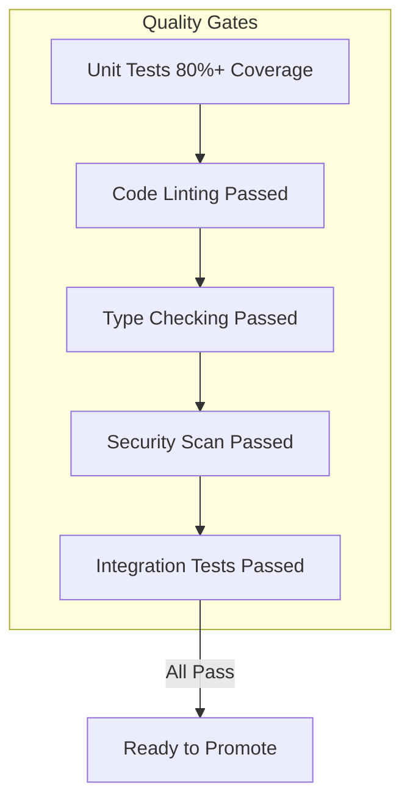
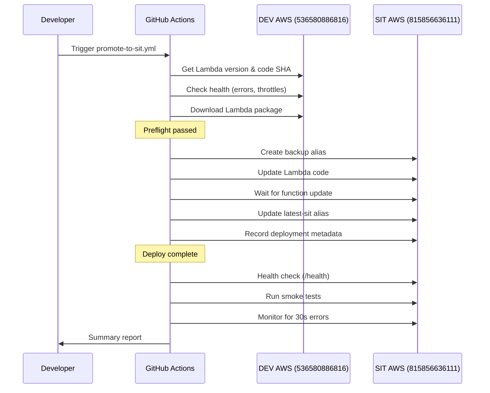
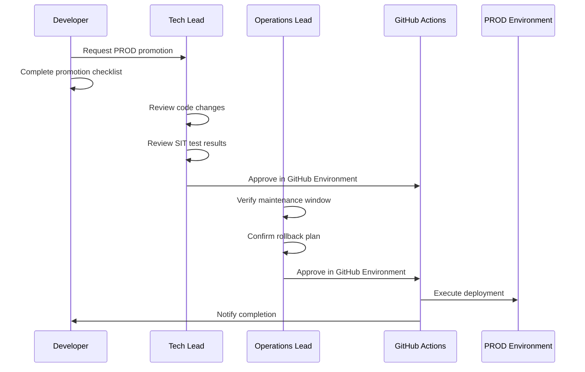
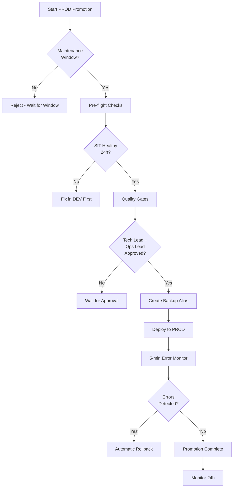
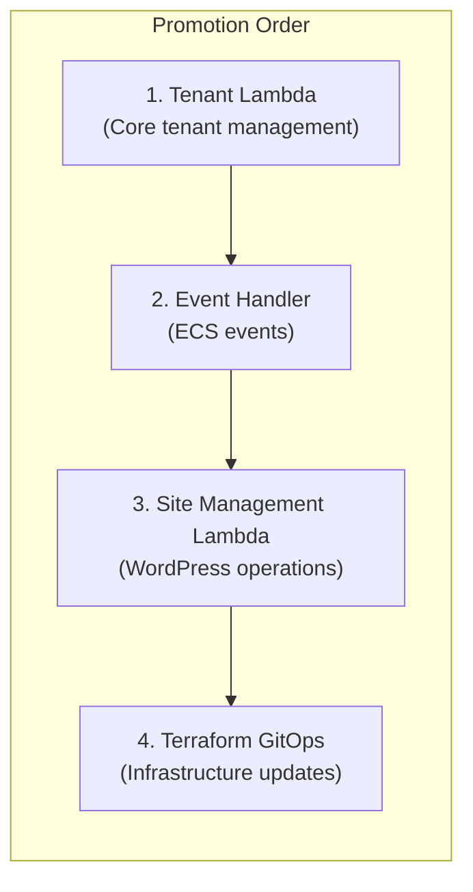
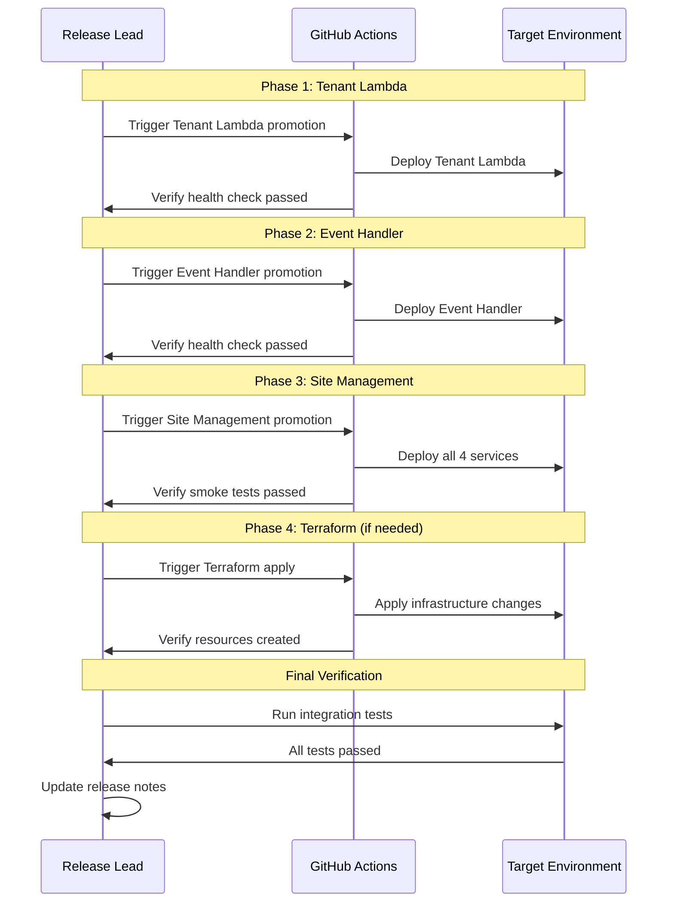
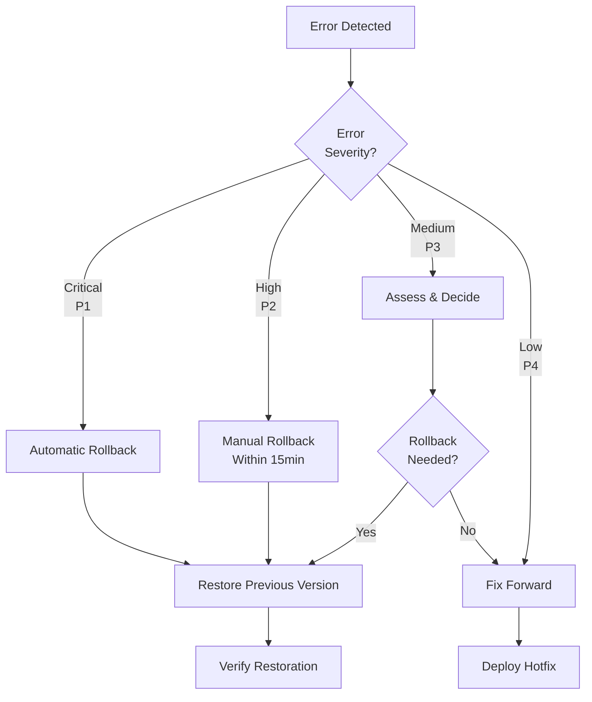

# Environment Promotion Runbook

**Document ID**: RB-003
**Version**: 1.0
**Last Updated**: 2026-01-25
**Owner**: Platform Engineering Team
**Classification**: Internal

---

## Table of Contents

1. [Overview](#1-overview)
2. [Promotion Prerequisites](#2-promotion-prerequisites)
3. [DEV to SIT Promotion](#3-dev-to-sit-promotion)
4. [SIT to PROD Promotion](#4-sit-to-prod-promotion)
5. [Cross-Service Promotion Coordination](#5-cross-service-promotion-coordination)
6. [Rollback Procedures Per Environment](#6-rollback-procedures-per-environment)
7. [Promotion Checklist Template](#7-promotion-checklist-template)

---

## 1. Overview

### 1.1 Purpose

This runbook provides standardized procedures for promoting workloads across environments in the BBWS Multi-Tenant WordPress Hosting Platform. All promotions follow the principle: **Fix in DEV, promote to SIT, test in SIT, promote to PROD**.

### 1.2 Promotion Workflow

```mermaid
flowchart LR
    subgraph DEV["DEV Environment"]
        DEV_DEPLOY[Deploy & Test]
        DEV_FIX[Fix Defects]
        DEV_VERIFY[Verify Changes]
    end

    subgraph SIT["SIT Environment"]
        SIT_APPROVE[Approval Gate]
        SIT_DEPLOY[Deploy]
        SIT_INT_TEST[Integration Tests]
        SIT_VERIFY[Verify 24h Stability]
    end

    subgraph PROD["PROD Environment"]
        PROD_APPROVE[Tech Lead + Ops Lead Approval]
        PROD_MAINTENANCE[Maintenance Window]
        PROD_DEPLOY[Deploy]
        PROD_MONITOR[Monitor 5min]
    end

    DEV_DEPLOY --> DEV_FIX
    DEV_FIX --> DEV_VERIFY
    DEV_VERIFY -->|Promote| SIT_APPROVE
    SIT_APPROVE --> SIT_DEPLOY
    SIT_DEPLOY --> SIT_INT_TEST
    SIT_INT_TEST --> SIT_VERIFY
    SIT_VERIFY -->|Promote| PROD_APPROVE
    PROD_APPROVE --> PROD_MAINTENANCE
    PROD_MAINTENANCE --> PROD_DEPLOY
    PROD_DEPLOY --> PROD_MONITOR
```



### 1.3 Environment Configuration

| Environment | AWS Account | Region | OIDC Role | Auto-Deploy |
|-------------|-------------|--------|-----------|-------------|
| DEV | 536580886816 | af-south-1 | `bbws-github-actions-role-dev` | Yes (on push to main) |
| SIT | 815856636111 | af-south-1 | `bbws-github-actions-role-sit` | No (manual trigger) |
| PROD | 093646564004 | af-south-1 (primary) / eu-west-1 (failover) | `bbws-github-actions-role-prod` | No (strict manual) |

### 1.4 Services Covered

| Repository | Service | Deployment Method | Lambda Function |
|------------|---------|-------------------|-----------------|
| `2_bbws_tenants_instances_lambda` | Tenant + Instance Management | GitHub Actions + Lambda ZIP | `bbws-tenant-instance-management-{env}` |
| `2_bbws_wordpress_site_management_lambda` | Site Management (4 services) | GitHub Actions + Terraform | `{env}-bbws-{sites/templates/plugins/async}-service` |
| `2_bbws_tenants_event_handler` | ECS Event Handler | GitHub Actions + SAM | `bbws-ecs-event-handler-{env}` |
| `2_bbws_tenants_instances_dev` | Terraform GitOps | GitHub Actions + Terraform | N/A (Infrastructure) |

---

## 2. Promotion Prerequisites

### 2.1 Quality Gates

All promotions must satisfy these quality gates:



| Gate | DEV to SIT | SIT to PROD | Verification Command |
|------|------------|-------------|---------------------|
| Unit Tests | Required (80%+) | Trusted from SIT | `pytest --cov=src --cov-fail-under=80` |
| Code Linting | Required | Trusted from SIT | `ruff check src/ tests/` |
| Type Checking | Required | Trusted from SIT | `mypy src/` |
| Security Scan | Required | Required (re-run) | `bandit -r src/` |
| Integration Tests | Required | Required | `pytest tests/integration/` |
| Error Rate Check | <10 errors/hour | <5 errors/24h | CloudWatch metrics |
| Throttle Check | 0 throttles/hour | 0 throttles/24h | CloudWatch metrics |

### 2.2 Approval Requirements

| Promotion | Required Approvers | Minimum Approvers |
|-----------|-------------------|-------------------|
| DEV to SIT | Dev Lead | 1 |
| SIT to PROD | Tech Lead + Operations Lead | 2 |

### 2.3 Documentation Requirements

Before promoting, ensure:

- [ ] Release notes documented in GitHub Release
- [ ] Change request ticket created (PROD only)
- [ ] Rollback plan reviewed
- [ ] Monitoring dashboards accessible

---

## 3. DEV to SIT Promotion

### 3.1 Pre-Promotion Verification

#### 3.1.1 Verify DEV Environment Health

```bash
# Configure AWS credentials for DEV
aws configure set region af-south-1
export AWS_PROFILE=bbws-dev

# Check Lambda function health
aws lambda get-function \
  --function-name bbws-tenant-instance-management-dev \
  --query 'Configuration.{State:State,LastModified:LastModified,CodeSha256:CodeSha256}' \
  --output table

# Check error rate in last hour
aws cloudwatch get-metric-statistics \
  --namespace AWS/Lambda \
  --metric-name Errors \
  --dimensions Name=FunctionName,Value=bbws-tenant-instance-management-dev \
  --start-time $(date -u -d '1 hour ago' +%Y-%m-%dT%H:%M:%S) \
  --end-time $(date -u +%Y-%m-%dT%H:%M:%S) \
  --period 3600 \
  --statistics Sum \
  --output text

# Check throttles
aws cloudwatch get-metric-statistics \
  --namespace AWS/Lambda \
  --metric-name Throttles \
  --dimensions Name=FunctionName,Value=bbws-tenant-instance-management-dev \
  --start-time $(date -u -d '1 hour ago' +%Y-%m-%dT%H:%M:%S) \
  --end-time $(date -u +%Y-%m-%dT%H:%M:%S) \
  --period 3600 \
  --statistics Sum \
  --output text
```

#### 3.1.2 Verify Integration Tests Pass

```bash
# Run integration tests locally or check CI status
cd /path/to/repository
pytest tests/integration/ -v --tb=short

# Or check GitHub Actions status
gh run list --workflow=deploy-dev.yml --limit 5
```

### 3.2 Promotion Procedures by Service

#### 3.2.1 Tenant + Instance Lambda (`2_bbws_tenants_instances_lambda`)

**Workflow File**: `.github/workflows/promote-to-sit.yml`

**Step-by-Step Procedure**:

1. Navigate to GitHub Actions
   ```
   https://github.com/BigBeardWebSolutions/2_bbws_tenants_instances_lambda/actions
   ```

2. Select **"Promote to SIT"** workflow

3. Click **"Run workflow"**

4. Configure inputs:
   - `dev_version`: Leave empty for latest, or specify version number
   - `skip_quality_gates`: `false` (never skip unless emergency)

5. Click **"Run workflow"**

6. Wait for workflow stages:
   ```
   Pre-flight Checks -> Deploy to SIT -> Post-Deployment Verification -> Summary
   ```

7. Verify deployment in SIT:
   ```bash
   export AWS_PROFILE=bbws-sit
   aws lambda get-function \
     --function-name bbws-tenant-instance-management-sit \
     --query 'Configuration.{State:State,Version:Version,LastModified:LastModified}' \
     --output table
   ```

**Workflow Diagram**:



#### 3.2.2 Site Management Lambda (`2_bbws_wordpress_site_management_lambda`)

**Workflow File**: `.github/workflows/deploy-sit.yml`

**Step-by-Step Procedure**:

1. Navigate to GitHub Actions
   ```
   https://github.com/BigBeardWebSolutions/2_bbws_wordpress_site_management_lambda/actions
   ```

2. Select **"Deploy to SIT"** workflow

3. Click **"Run workflow"**

4. Configure inputs:
   - `artifact_version`: Specify version from DEV (e.g., `v1.0.5`)
   - `approve_deployment`: `true`

5. Click **"Run workflow"**

6. Wait for stages:
   ```
   Check DEV Health -> Test (parallel for 4 services) -> Deploy -> Smoke Tests
   ```

7. Verify all 4 Lambda functions deployed:
   ```bash
   export AWS_PROFILE=bbws-sit
   for FUNC in sit-bbws-sites-service sit-bbws-templates-service sit-bbws-plugins-service sit-bbws-async-processor; do
     aws lambda get-function --function-name $FUNC --query 'Configuration.State' --output text
     echo "$FUNC: verified"
   done
   ```

#### 3.2.3 ECS Event Handler (`2_bbws_tenants_event_handler`)

**Workflow File**: `.github/workflows/promote-to-sit.yml`

**Step-by-Step Procedure**:

1. Navigate to GitHub Actions
   ```
   https://github.com/BigBeardWebSolutions/2_bbws_tenants_event_handler/actions
   ```

2. Select **"Promote to SIT"** workflow

3. Click **"Run workflow"**

4. Configure inputs:
   - `dev_stack_version`: Leave empty for current
   - `skip_quality_gates`: `false`

5. Click **"Run workflow"**

6. Wait for SAM deployment stages:
   ```
   Preflight -> SAM Build -> Deploy to SIT -> Verification -> Summary
   ```

7. Verify CloudFormation stack:
   ```bash
   export AWS_PROFILE=bbws-sit
   aws cloudformation describe-stacks \
     --stack-name bbws-ecs-event-handler-sit \
     --query 'Stacks[0].{Status:StackStatus,Outputs:Outputs}' \
     --output table
   ```

#### 3.2.4 Terraform GitOps (`2_bbws_tenants_instances_dev`)

**Workflow File**: `.github/workflows/deploy-tenant-sit.yml`

**Note**: This is infrastructure deployment for individual tenants, not Lambda code promotion.

**Step-by-Step Procedure**:

1. Navigate to GitHub Actions
   ```
   https://github.com/BigBeardWebSolutions/2_bbws_tenants_instances_dev/actions
   ```

2. Select **"Deploy Tenant Instance (SIT)"** workflow

3. Click **"Run workflow"**

4. Configure inputs:
   - `tenant_id`: Tenant directory name (e.g., `tenant-001`)
   - `action`: `plan` first, then `apply`

5. Review Terraform plan output

6. If plan looks good, re-run with `action: apply`

7. Verify tenant resources:
   ```bash
   export AWS_PROFILE=bbws-sit
   aws ecs describe-services \
     --cluster bbws-cluster-sit \
     --services tenant-001-wordpress \
     --query 'services[0].{Status:status,DesiredCount:desiredCount,RunningCount:runningCount}' \
     --output table
   ```

### 3.3 Post-Promotion Verification

```bash
# Set SIT profile
export AWS_PROFILE=bbws-sit

# Verify Lambda functions
echo "=== Tenant Instance Lambda ==="
aws lambda invoke \
  --function-name bbws-tenant-instance-management-sit \
  --payload '{"httpMethod":"GET","path":"/health","headers":{}}' \
  response.json && cat response.json

# Verify Site Management services
echo "=== Sites Service ==="
aws lambda invoke \
  --function-name sit-bbws-sites-service \
  --payload '{"httpMethod":"GET","path":"/health","headers":{}}' \
  response.json && cat response.json

# Verify Event Handler
echo "=== ECS Event Handler ==="
aws lambda get-function \
  --function-name bbws-ecs-event-handler-sit \
  --query 'Configuration.State'

# Check CloudWatch for errors (last 5 minutes)
aws cloudwatch get-metric-statistics \
  --namespace AWS/Lambda \
  --metric-name Errors \
  --dimensions Name=FunctionName,Value=bbws-tenant-instance-management-sit \
  --start-time $(date -u -d '5 minutes ago' +%Y-%m-%dT%H:%M:%S) \
  --end-time $(date -u +%Y-%m-%dT%H:%M:%S) \
  --period 300 \
  --statistics Sum
```

---

## 4. SIT to PROD Promotion

### 4.1 Pre-Promotion Requirements

#### 4.1.1 24-Hour Stability Lookback

```bash
export AWS_PROFILE=bbws-sit

# Check 24-hour error count
ERRORS=$(aws cloudwatch get-metric-statistics \
  --namespace AWS/Lambda \
  --metric-name Errors \
  --dimensions Name=FunctionName,Value=bbws-tenant-instance-management-sit \
  --start-time $(date -u -d '24 hours ago' +%Y-%m-%dT%H:%M:%S) \
  --end-time $(date -u +%Y-%m-%dT%H:%M:%S) \
  --period 86400 \
  --statistics Sum \
  --query 'Datapoints[0].Sum' \
  --output text)

echo "Errors in last 24h: $ERRORS"
if [ "$ERRORS" != "None" ] && [ "${ERRORS%.*}" -gt 5 ]; then
  echo "ERROR: Too many errors for PROD promotion (>5)"
  exit 1
fi

# Check throttles
THROTTLES=$(aws cloudwatch get-metric-statistics \
  --namespace AWS/Lambda \
  --metric-name Throttles \
  --dimensions Name=FunctionName,Value=bbws-tenant-instance-management-sit \
  --start-time $(date -u -d '24 hours ago' +%Y-%m-%dT%H:%M:%S) \
  --end-time $(date -u +%Y-%m-%dT%H:%M:%S) \
  --period 86400 \
  --statistics Sum \
  --query 'Datapoints[0].Sum' \
  --output text)

echo "Throttles in last 24h: $THROTTLES"
if [ "$THROTTLES" != "None" ] && [ "${THROTTLES%.*}" -gt 0 ]; then
  echo "ERROR: Throttles detected - fix capacity before PROD"
  exit 1
fi

echo "SIT stability check PASSED"
```

#### 4.1.2 Maintenance Window Confirmation

PROD deployments must occur during approved maintenance windows:

| Day | Window (SAST) | Window (UTC) |
|-----|---------------|--------------|
| Tuesday | 22:00 - 02:00 | 20:00 - 00:00 |
| Thursday | 22:00 - 02:00 | 20:00 - 00:00 |
| Saturday | 06:00 - 10:00 | 04:00 - 08:00 |

**Emergency Deployments**: Require Tech Lead + CTO approval with incident ticket.

### 4.2 Approval Process



### 4.3 Promotion Procedures by Service

#### 4.3.1 Tenant + Instance Lambda (`2_bbws_tenants_instances_lambda`)

**Workflow File**: `.github/workflows/promote-to-prod.yml`

**Step-by-Step Procedure**:

1. Verify maintenance window is active

2. Navigate to GitHub Actions
   ```
   https://github.com/BigBeardWebSolutions/2_bbws_tenants_instances_lambda/actions
   ```

3. Select **"Promote to PROD"** workflow

4. Click **"Run workflow"**

5. Configure inputs:
   - `sit_version`: Leave empty for latest-sit alias
   - `skip_quality_gates`: `false` (NEVER skip for PROD)
   - `maintenance_window`: `true` (REQUIRED)

6. Click **"Run workflow"**

7. **Wait for approval gate** - Both Tech Lead and Operations Lead must approve

8. Monitor deployment stages:
   ```
   Preflight -> Quality Gates -> Deploy -> Verification (5min) -> Summary
   ```

9. Verify PROD deployment:
   ```bash
   export AWS_PROFILE=bbws-prod

   # Check Lambda function
   aws lambda get-function \
     --function-name bbws-tenant-instance-management-prod \
     --region af-south-1 \
     --query 'Configuration.{State:State,Version:Version,LastModified:LastModified}' \
     --output table

   # Test health endpoint
   aws lambda invoke \
     --function-name bbws-tenant-instance-management-prod \
     --payload '{"httpMethod":"GET","path":"/health","headers":{}}' \
     --region af-south-1 \
     response.json && cat response.json
   ```

**PROD Promotion Flow**:



#### 4.3.2 Site Management Lambda (`2_bbws_wordpress_site_management_lambda`)

**Workflow File**: `.github/workflows/deploy-prod.yml`

**Step-by-Step Procedure**:

1. Verify maintenance window and approvals

2. Navigate to GitHub Actions

3. Select **"Deploy to PROD"** workflow

4. Configure and run workflow

5. Wait for approval gate

6. Monitor deployment of all 4 services

7. Verify each service:
   ```bash
   export AWS_PROFILE=bbws-prod

   for FUNC in prod-bbws-sites-service prod-bbws-templates-service prod-bbws-plugins-service prod-bbws-async-processor; do
     echo "=== $FUNC ==="
     aws lambda get-function --function-name $FUNC \
       --region af-south-1 \
       --query 'Configuration.{State:State,LastModified:LastModified}'
   done
   ```

#### 4.3.3 ECS Event Handler (`2_bbws_tenants_event_handler`)

**Workflow File**: `.github/workflows/promote-to-prod.yml`

**Step-by-Step Procedure**:

1. Verify maintenance window

2. Navigate to GitHub Actions

3. Select **"Promote to PROD"** workflow

4. Configure inputs:
   - `skip_quality_gates`: `false`
   - `maintenance_window`: `true`

5. Run and wait for approval

6. Monitor SAM deployment

7. Verify CloudFormation stack:
   ```bash
   export AWS_PROFILE=bbws-prod

   aws cloudformation describe-stacks \
     --stack-name bbws-ecs-event-handler-prod \
     --region af-south-1 \
     --query 'Stacks[0].{Status:StackStatus,LastUpdated:LastUpdatedTime}'

   # Verify EventBridge rules
   aws events list-rules \
     --region af-south-1 \
     --query "Rules[?contains(Name, 'ecs-event-handler')]"
   ```

#### 4.3.4 Terraform GitOps (`2_bbws_tenants_instances_dev`)

**Workflow File**: `.github/workflows/deploy-tenant-prod.yml`

**IMPORTANT**: DESTROY action is BLOCKED in PROD.

**Step-by-Step Procedure**:

1. Navigate to GitHub Actions

2. Select **"Deploy Tenant Instance (PROD)"** workflow

3. Configure inputs:
   - `tenant_id`: Tenant directory name
   - `action`: `plan` first (ALWAYS plan first in PROD)

4. Review Terraform plan carefully

5. If plan is approved, re-run with `action: apply`

6. Wait for approval gate

7. Verify tenant in PROD:
   ```bash
   export AWS_PROFILE=bbws-prod

   aws ecs describe-services \
     --cluster bbws-cluster-prod \
     --services ${TENANT_ID}-wordpress \
     --region af-south-1 \
     --query 'services[0].{Status:status,DesiredCount:desiredCount}'
   ```

### 4.4 Post-PROD Verification

```bash
export AWS_PROFILE=bbws-prod

# Comprehensive health check
echo "=== PROD Health Check ==="

# 1. Lambda Functions
echo "1. Lambda Functions:"
aws lambda list-functions \
  --region af-south-1 \
  --query "Functions[?contains(FunctionName, 'bbws')].{Name:FunctionName,State:State}" \
  --output table

# 2. API Gateway
echo "2. API Gateway:"
curl -s https://api.wp.kimmyai.io/health | jq .

# 3. CloudWatch Alarms
echo "3. CloudWatch Alarms:"
aws cloudwatch describe-alarms \
  --region af-south-1 \
  --alarm-name-prefix "bbws-" \
  --state-value ALARM \
  --query 'MetricAlarms[].AlarmName'

# 4. Error Metrics (last 5 minutes)
echo "4. Recent Errors:"
aws cloudwatch get-metric-statistics \
  --namespace AWS/Lambda \
  --metric-name Errors \
  --dimensions Name=FunctionName,Value=bbws-tenant-instance-management-prod \
  --start-time $(date -u -d '5 minutes ago' +%Y-%m-%dT%H:%M:%S) \
  --end-time $(date -u +%Y-%m-%dT%H:%M:%S) \
  --period 300 \
  --statistics Sum \
  --region af-south-1

echo "=== Health Check Complete ==="
```

---

## 5. Cross-Service Promotion Coordination

### 5.1 Dependency Order

When promoting multiple services, follow this order to respect dependencies:



| Order | Service | Reason |
|-------|---------|--------|
| 1 | Tenant Lambda | Core tenant/instance management - other services depend on tenant data |
| 2 | ECS Event Handler | Processes ECS lifecycle events for tenant containers |
| 3 | Site Management Lambda | WordPress site operations - requires tenant data from #1 |
| 4 | Terraform GitOps | Infrastructure changes - should be last to avoid race conditions |

### 5.2 Coordinated Release Procedure

#### 5.2.1 Full Stack Promotion (All Services)



**Timing Guidelines**:

| Phase | Estimated Duration | Wait Before Next |
|-------|-------------------|------------------|
| Tenant Lambda | 5-10 min | 5 min (health check) |
| Event Handler | 8-12 min | 5 min (health check) |
| Site Management | 10-15 min | 10 min (all 4 services) |
| Terraform | 5-15 min | N/A |

#### 5.2.2 Partial Promotion (Single Service)

For single-service updates, follow the standard promotion procedure for that service. Ensure:

1. No breaking API changes that affect dependent services
2. Database schema changes are backward compatible
3. EventBridge event formats are backward compatible

### 5.3 Cross-Service Verification

After promoting all services, run cross-service integration tests:

```bash
# Set environment
export TARGET_ENV="sit"  # or "prod"
export AWS_PROFILE=bbws-${TARGET_ENV}

# Test 1: Create tenant and verify event handler processes ECS events
echo "Test 1: Tenant Creation Flow"
# ... test commands ...

# Test 2: Create site and verify async processor handles job
echo "Test 2: Site Creation Flow"
# ... test commands ...

# Test 3: Update tenant and verify cascading updates
echo "Test 3: Tenant Update Flow"
# ... test commands ...

echo "Cross-service tests completed"
```

---

## 6. Rollback Procedures Per Environment

### 6.1 Rollback Decision Matrix



### 6.2 SIT Rollback

#### 6.2.1 Lambda Function Rollback

```bash
export AWS_PROFILE=bbws-sit

# List available backup aliases
aws lambda list-aliases \
  --function-name bbws-tenant-instance-management-sit \
  --query 'Aliases[?starts_with(Name, `backup-`)].{Name:Name,Version:FunctionVersion,Description:Description}' \
  --output table

# Identify backup to restore (e.g., backup-20260125-103045)
BACKUP_ALIAS="backup-20260125-103045"

# Get the version from backup alias
BACKUP_VERSION=$(aws lambda get-alias \
  --function-name bbws-tenant-instance-management-sit \
  --name $BACKUP_ALIAS \
  --query 'FunctionVersion' \
  --output text)

echo "Rolling back to version: $BACKUP_VERSION"

# Update latest-sit alias to point to backup version
aws lambda update-alias \
  --function-name bbws-tenant-instance-management-sit \
  --name latest-sit \
  --function-version $BACKUP_VERSION

# Verify rollback
aws lambda get-alias \
  --function-name bbws-tenant-instance-management-sit \
  --name latest-sit
```

#### 6.2.2 SAM Stack Rollback (Event Handler)

```bash
export AWS_PROFILE=bbws-sit

# List CloudFormation stack updates
aws cloudformation describe-stack-events \
  --stack-name bbws-ecs-event-handler-sit \
  --query 'StackEvents[?ResourceStatus==`UPDATE_COMPLETE`].{Time:Timestamp,Id:EventId}' \
  --max-items 10

# Rollback via git revert and redeploy
cd /path/to/2_bbws_tenants_event_handler
git log --oneline -5

# Revert to previous commit
git revert HEAD
git push origin main

# Trigger redeploy via GitHub Actions
gh workflow run promote-to-sit.yml
```

#### 6.2.3 Terraform Rollback

```bash
export AWS_PROFILE=bbws-sit

# Option 1: Revert Terraform state
cd /path/to/2_bbws_tenants_instances_dev/tenants/${TENANT_ID}

# Check Terraform history
terraform state list
terraform show

# Revert to previous state (CAUTION)
terraform apply -target=module.wordpress_instance -var="environment=sit"

# Option 2: Git revert and re-apply
git log --oneline -5
git revert HEAD
git push origin main
# Trigger workflow with action=apply
```

### 6.3 PROD Rollback

#### 6.3.1 Automatic Rollback Triggers

The following conditions trigger automatic rollback in PROD:

| Condition | Threshold | Action |
|-----------|-----------|--------|
| Health check failure | Status != 200 | Immediate rollback |
| Error spike | >5 errors in 2 minutes | Rollback after 5-min window |
| Throttle spike | >10 throttles in 2 minutes | Rollback after 5-min window |

#### 6.3.2 Manual PROD Rollback

```bash
export AWS_PROFILE=bbws-prod

# STEP 1: Identify the issue
echo "=== Current PROD State ==="
aws lambda get-function \
  --function-name bbws-tenant-instance-management-prod \
  --region af-south-1 \
  --query 'Configuration.{Version:Version,LastModified:LastModified}'

# STEP 2: List backup aliases
aws lambda list-aliases \
  --function-name bbws-tenant-instance-management-prod \
  --region af-south-1 \
  --query 'Aliases[?starts_with(Name, `backup-`)].{Name:Name,Version:FunctionVersion,Description:Description}' \
  --output table

# STEP 3: Identify backup to restore
BACKUP_ALIAS="backup-20260125-220000"
BACKUP_VERSION=$(aws lambda get-alias \
  --function-name bbws-tenant-instance-management-prod \
  --region af-south-1 \
  --name $BACKUP_ALIAS \
  --query 'FunctionVersion' \
  --output text)

# STEP 4: Create incident backup (current state)
INCIDENT_TIMESTAMP=$(date +%Y%m%d-%H%M%S)
CURRENT_VERSION=$(aws lambda get-alias \
  --function-name bbws-tenant-instance-management-prod \
  --region af-south-1 \
  --name latest-prod \
  --query 'FunctionVersion' \
  --output text)

aws lambda create-alias \
  --function-name bbws-tenant-instance-management-prod \
  --region af-south-1 \
  --name incident-${INCIDENT_TIMESTAMP} \
  --function-version $CURRENT_VERSION \
  --description "Incident backup before rollback"

# STEP 5: Execute rollback
echo "Rolling back to version: $BACKUP_VERSION"
aws lambda update-alias \
  --function-name bbws-tenant-instance-management-prod \
  --region af-south-1 \
  --name latest-prod \
  --function-version $BACKUP_VERSION \
  --description "Rollback from incident-${INCIDENT_TIMESTAMP}"

# STEP 6: Verify rollback
aws lambda invoke \
  --function-name bbws-tenant-instance-management-prod:latest-prod \
  --payload '{"httpMethod":"GET","path":"/health","headers":{}}' \
  --region af-south-1 \
  response.json && cat response.json

# STEP 7: Record rollback in DynamoDB
aws dynamodb put-item \
  --table-name bbws-deployments-prod \
  --item "{
    \"deployment_id\": {\"S\": \"rollback-${INCIDENT_TIMESTAMP}\"},
    \"timestamp\": {\"S\": \"$(date -u +%Y-%m-%dT%H:%M:%SZ)\"},
    \"environment\": {\"S\": \"prod\"},
    \"action\": {\"S\": \"rollback\"},
    \"from_version\": {\"S\": \"$CURRENT_VERSION\"},
    \"to_version\": {\"S\": \"$BACKUP_VERSION\"},
    \"actor\": {\"S\": \"$USER\"},
    \"reason\": {\"S\": \"Manual rollback due to incident\"}
  }" \
  --region af-south-1
```

### 6.4 Rollback via GitHub Actions

For a controlled rollback, use the rollback workflow:

```bash
# Navigate to repository actions
# Select "Rollback" workflow
# Configure:
#   - environment: prod/sit
#   - target_version: version number or alias
#   - reason: Incident description

gh workflow run rollback.yml \
  -f environment=prod \
  -f target_version=backup-20260125-220000 \
  -f reason="Rollback due to API errors"
```

---

## 7. Promotion Checklist Template

### 7.1 DEV to SIT Promotion Checklist

```markdown
## DEV to SIT Promotion Checklist

**Date**: _______________
**Promoter**: _______________
**Service(s)**: _______________
**DEV Version**: _______________

### Pre-Promotion Checks

- [ ] All unit tests pass (80%+ coverage)
- [ ] Code linting passed (ruff, black)
- [ ] Type checking passed (mypy)
- [ ] Security scan passed (bandit)
- [ ] Integration tests pass in DEV
- [ ] DEV error rate < 10 errors/hour
- [ ] DEV throttle rate = 0/hour
- [ ] DEV Lambda health check returns 200
- [ ] Release notes documented
- [ ] Dev Lead approval obtained

### Promotion Execution

- [ ] GitHub workflow triggered: `promote-to-sit.yml`
- [ ] Workflow inputs configured correctly
- [ ] Pre-flight checks passed
- [ ] Deployment completed successfully
- [ ] Post-deployment verification passed

### Post-Promotion Verification

- [ ] SIT Lambda health check returns 200
- [ ] SIT smoke tests pass
- [ ] No errors in CloudWatch (5-min window)
- [ ] API Gateway returns expected responses
- [ ] DynamoDB deployment record created

### Sign-off

**Promoter Signature**: _______________
**Date/Time**: _______________
```

### 7.2 SIT to PROD Promotion Checklist

```markdown
## SIT to PROD Promotion Checklist

**Date**: _______________
**Promoter**: _______________
**Service(s)**: _______________
**SIT Version**: _______________
**Change Request Ticket**: _______________

### Pre-Promotion Checks

- [ ] SIT stable for 24 hours
- [ ] SIT error count < 5 in last 24h
- [ ] SIT throttle count = 0 in last 24h
- [ ] All integration tests pass in SIT
- [ ] Security scan re-run passed
- [ ] Maintenance window confirmed: _______
- [ ] Rollback plan documented
- [ ] Change request approved

### Approvals

- [ ] Tech Lead approval: _____________ (Date: _______)
- [ ] Operations Lead approval: _____________ (Date: _______)

### Promotion Execution

- [ ] GitHub workflow triggered: `promote-to-prod.yml`
- [ ] Maintenance window checkbox confirmed
- [ ] GitHub environment approval received
- [ ] Pre-flight checks passed
- [ ] Quality gates passed
- [ ] Backup alias created
- [ ] Deployment completed successfully
- [ ] 5-minute error monitoring passed

### Post-Promotion Verification

- [ ] PROD Lambda health check returns 200
- [ ] PROD smoke tests pass (read-only)
- [ ] No errors in CloudWatch (5-min window)
- [ ] CloudFront distribution healthy
- [ ] API Gateway returns expected responses
- [ ] DynamoDB deployment record created
- [ ] CloudWatch alarms not triggered

### Post-Promotion Monitoring (24h)

- [ ] 1-hour check: No errors
- [ ] 4-hour check: No errors
- [ ] 12-hour check: No errors
- [ ] 24-hour check: No errors
- [ ] Customer feedback: No issues reported

### Sign-off

**Promoter Signature**: _______________
**Tech Lead Signature**: _______________
**Operations Lead Signature**: _______________
**Date/Time**: _______________
```

### 7.3 Rollback Checklist

```markdown
## Rollback Checklist

**Date/Time**: _______________
**Environment**: DEV / SIT / PROD
**Service**: _______________
**Current Version**: _______________
**Rollback Target Version**: _______________
**Incident Ticket**: _______________

### Pre-Rollback

- [ ] Incident documented
- [ ] Current state backed up (incident alias created)
- [ ] Rollback target version identified
- [ ] Rollback approved by: _______________

### Rollback Execution

- [ ] Rollback command executed
- [ ] Lambda alias updated
- [ ] Health check verified

### Post-Rollback Verification

- [ ] Health endpoint returns 200
- [ ] No new errors in CloudWatch
- [ ] API responses correct
- [ ] DynamoDB rollback record created

### Post-Mortem

- [ ] Root cause identified
- [ ] Fix developed and tested in DEV
- [ ] Post-mortem document created
- [ ] Prevention measures documented

### Sign-off

**Rollback Executor**: _______________
**Approver**: _______________
**Date/Time**: _______________
```

---

## Appendix A: Quick Reference Commands

### AWS Profile Setup

```bash
# Configure profiles
aws configure --profile bbws-dev set region af-south-1
aws configure --profile bbws-sit set region af-south-1
aws configure --profile bbws-prod set region af-south-1

# Set default profile
export AWS_PROFILE=bbws-dev
```

### GitHub CLI Commands

```bash
# List workflow runs
gh run list --workflow=promote-to-sit.yml

# Trigger workflow
gh workflow run promote-to-sit.yml

# Watch running workflow
gh run watch

# View workflow logs
gh run view --log
```

### CloudWatch Metrics

```bash
# Error count
aws cloudwatch get-metric-statistics \
  --namespace AWS/Lambda \
  --metric-name Errors \
  --dimensions Name=FunctionName,Value=FUNCTION_NAME \
  --start-time START_TIME \
  --end-time END_TIME \
  --period 3600 \
  --statistics Sum

# Duration
aws cloudwatch get-metric-statistics \
  --namespace AWS/Lambda \
  --metric-name Duration \
  --dimensions Name=FunctionName,Value=FUNCTION_NAME \
  --start-time START_TIME \
  --end-time END_TIME \
  --period 3600 \
  --statistics Average
```

---

## Appendix B: Related Documentation

| Document | Path |
|----------|------|
| Tenant Provisioning Runbook | `runbooks/RB-001_Tenant_Provisioning.md` |
| Site Generation Troubleshooting | `runbooks/RB-002_Site_Generation_Troubleshooting.md` |
| Product Lambda CI/CD Guide | `runbooks/product_lambda_cicd_guide.md` |
| Product Lambda Deployment | `runbooks/product_lambda_deployment.md` |
| Disaster Recovery Runbook | `runbooks/product_lambda_disaster_recovery.md` |

---

## Appendix C: Support Contacts

| Role | Contact | Escalation Path |
|------|---------|----------------|
| Platform Team | platform-team@bbws.io | Slack: #platform-support |
| Operations Lead | ops-lead@bbws.io | Slack: #operations |
| Tech Lead | tech-lead@bbws.io | Slack: #engineering |
| On-Call | on-call@bbws.io | PagerDuty |

---

**Document Version**: 1.0
**Last Review Date**: 2026-01-25
**Next Review Date**: 2026-04-25
**Status**: Active
