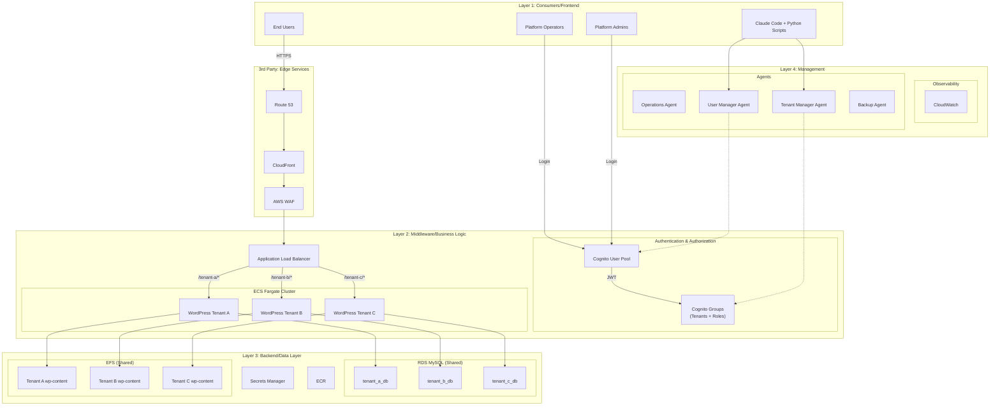

# BBWS ISP-Style ECS Fargate WordPress Hosting Platform

## High-Level Design Document

**Version**: 3.0
**Author**: Tebogo Tseka
**Date**: 2025-12-12
**Status**: Draft for Review

---

## Document History

| Version | Date | Changes | Owner |
|---------|------|---------|-------|
| 1.0 | 2025-12-12 | Initial HLD Spec based on ECS WordPress Research | Tebogo Tseka |
| 2.0 | 2025-12-12 | Enhanced with HLD Agent template compliance | Tebogo Tseka |
| 3.0 | 2025-12-12 | Added Cognito for user and tenant management | Tebogo Tseka |

---

## 1. Business Purpose

### 1.1 Problem Statement

Traditional ISP-style WordPress hosting faces critical challenges:

| Pain Point | Current State | Impact |
|------------|---------------|--------|
| Manual Management | Domain, tenant, database provisioning by hand | Developer time wasted on ops |
| Tenant Isolation | Shared servers with poor separation | Security vulnerabilities, noisy neighbors |
| User Management | No centralized identity management | Security risks, manual access control |
| Database SPOF | Single database server per environment | Bottlenecks, data loss risk |
| Backup Failures | 58% of backups fail; 50% of restores fail | Data loss, compliance issues |
| Security Exposure | 7,966 new WordPress vulnerabilities in 2024 | 57.6% exploitable without auth |

### 1.2 Solution Overview

The **BBWS ISP-Style ECS Fargate WordPress Hosting Platform** is a containerized, multi-tenant WordPress hosting solution on AWS with centralized user and tenant management via Amazon Cognito.

**Key Capabilities:**
- **Cognito User Pool** for centralized user authentication and management
- **Cognito Groups** for tenant-based access control and RBAC
- ECS Fargate serverless container hosting (no EC2 management)
- Per-tenant database isolation (bridge model on shared RDS)
- Per-tenant EFS access points for persistent storage
- Path-based ALB routing for tenant identification
- CloudFront CDN with per-tenant distributions
- Claude Code agent-based operations (Phase 1)
- Microservices automation (Phase 2)

### 1.3 Phased Approach

| Phase | Focus | Operations Model |
|-------|-------|------------------|
| **Phase 1** | Infrastructure, user management, tenant management | CLI Python scripts + Claude Code agents + Cognito |
| **Phase 2** | Microservices integration, automated workflows | Lambda functions, DynamoDB state, APIs |

### 1.4 Stakeholders

| Stakeholder | Role | Interest |
|-------------|------|----------|
| Platform Admins | Super User | User management, tenant creation, platform configuration |
| Platform Operators | Primary User | Tenant provisioning, operations, monitoring |
| DevOps Engineers | Operator | Infrastructure deployment, CI/CD |
| Security Engineers | Approver | Security posture, compliance, access control |
| End Customers | Beneficiary | WordPress site availability, performance |
| BBWS Management | Sponsor | Cost efficiency, customer satisfaction |

### 1.5 Success Criteria

| Metric | Target |
|--------|--------|
| User registration time | < 5 minutes |
| Tenant provisioning time | < 15 minutes |
| Per-tenant monthly cost | $25-$37 USD |
| Tenant isolation | Complete (DB, filesystem, container, Cognito group) |
| Backup success rate | 100% |
| MFA adoption | 100% for Admins/Operators |

---

## 2. Epics, User Stories and Scenarios

### 2.1 Epic Overview

| Epic # | Epic Name | Description | User Stories |
|--------|-----------|-------------|--------------|
| 1 | Infrastructure Setup | Core AWS infrastructure provisioning | US-001 to US-005 |
| 2 | User Management | Cognito-based user lifecycle | US-006 to US-010 |
| 3 | Tenant Management | Customer lifecycle management | US-011 to US-016 |
| 4 | Operations | Day-to-day platform operations | US-017 to US-021 |
| 5 | Security | Security controls and compliance | US-022 to US-024 |
| 6 | WordPress Management | WordPress core and plugin management | US-025, US-026 |
| 7 | Disaster Recovery | DR procedures and failover | US-027, US-028 |

### 2.2 User Stories Table

| Epic | User Story ID | User Story Description | Scenarios |
|------|---------------|------------------------|-----------|
| Infrastructure Setup | US-001 | As a DevOps Engineer, I want to provision the core VPC infrastructure so that I have a secure network foundation | VPC creation with multi-AZ subnets, NAT Gateway setup, Security group configuration |
| Infrastructure Setup | US-002 | As a DevOps Engineer, I want to deploy a shared ECS Fargate cluster so that I can host multiple tenant containers | ECS cluster creation, Capacity provider configuration, Service discovery namespace setup |
| Infrastructure Setup | US-003 | As a DevOps Engineer, I want to provision a shared RDS MySQL instance so that tenants have database capacity | RDS instance creation, Parameter group configuration, Subnet group setup |
| Infrastructure Setup | US-004 | As a DevOps Engineer, I want to set up a shared EFS filesystem so that tenants have persistent storage | EFS filesystem creation, Mount target configuration, Encryption enablement |
| Infrastructure Setup | US-005 | As a DevOps Engineer, I want to configure Cognito User Pool so that platform users can authenticate securely | User Pool creation, App client configuration, Password policy setup, MFA configuration |
| User Management | US-006 | As an Admin, I want to invite users to the platform so that team members can access tenant management | Email invitation, Registration link generation, Welcome email |
| User Management | US-007 | As a User, I want to register via invitation so that I can access the platform | Registration form, Email verification, Password creation |
| User Management | US-008 | As a User, I want to login with MFA so that my account is secure | Username/password login, MFA challenge, JWT token issuance |
| User Management | US-009 | As a User, I want to reset my password so that I can recover account access | Forgot password flow, Verification code, Password reset |
| User Management | US-010 | As an Admin, I want to assign roles to users so that access is controlled | Role assignment (Admin, Operator, Viewer), Cognito group membership |
| Tenant Management | US-011 | As a Platform Operator, I want to create a tenant organization so that customers are logically grouped | Cognito group creation, Tenant metadata in custom attributes |
| Tenant Management | US-012 | As a Platform Operator, I want to provision a new WordPress instance for a tenant so that a customer can have their site | Database creation, EFS access point creation, ECS service deployment, ALB rule configuration |
| Tenant Management | US-013 | As a Platform Operator, I want to deprovision a tenant so that resources are cleaned up when customer leaves | ECS service removal, Database deletion, EFS access point removal, ALB rule cleanup, Cognito group removal |
| Tenant Management | US-014 | As a Platform Operator, I want to provision a CloudFront distribution for a tenant so that they have CDN capability | CloudFront distribution creation, Origin configuration, Cache behavior setup |
| Tenant Management | US-015 | As a Platform Operator, I want to configure DNS for a tenant so that their site is accessible via domain | Route53 record creation, Health check configuration, SSL certificate association |
| Tenant Management | US-016 | As an Admin, I want to assign users to tenants so that access is scoped to specific customers | Cognito group membership, Tenant ID in JWT custom claims |
| Operations | US-017 | As a Platform Operator, I want to monitor platform health so that I can detect issues proactively | CloudWatch dashboard viewing, Alarm monitoring, Log analysis |
| Operations | US-018 | As a Platform Operator, I want to execute tenant backups so that customer data is protected | RDS snapshot creation, EFS backup execution, Cross-region replication verification |
| Operations | US-019 | As a Platform Operator, I want to restore a tenant from backup so that I can recover from data loss | Backup selection, RDS restore, EFS restore, Service restart |
| Operations | US-020 | As a Platform Operator, I want to rotate database credentials so that security is maintained | Secret rotation trigger, Service restart with new credentials, Old credential cleanup |
| Operations | US-021 | As a Platform Operator, I want to list all tenants so that I can see platform utilization | Tenant inventory listing, Status checking, Resource usage viewing |
| Security | US-022 | As a Security Engineer, I want WAF protection enabled so that WordPress sites are protected from attacks | WAF WebACL configuration, OWASP rules enablement, WordPress-specific rules |
| Security | US-023 | As a Security Engineer, I want encryption enabled at rest and in transit so that data is protected | RDS encryption, EFS encryption, TLS enforcement |
| Security | US-024 | As a Security Engineer, I want Cognito to enforce password policies so that accounts are secure | Minimum 12 chars, Complexity requirements, Password history, MFA enforcement |
| WordPress Management | US-025 | As a Platform Operator, I want to update WordPress core so that sites have latest security patches | Container image update, Rolling deployment, Rollback capability |
| WordPress Management | US-026 | As a Platform Operator, I want to manage WordPress plugins so that tenants have required functionality | Plugin installation, Compatibility checking, Update management |
| Disaster Recovery | US-027 | As a Platform Operator, I want to execute DR failover so that service continues during regional outage | DNS repoint to eu-west-1, Backup restoration in DR region, Service validation |
| Disaster Recovery | US-028 | As a Platform Operator, I want to failback to primary region so that normal operations resume | DNS repoint to af-south-1, Data sync verification, Service validation |

---

## 3. Component Diagram

### 3.1 Four-Layer Architecture with Cognito



### 3.2 Cognito User & Tenant Model

```
┌─────────────────────────────────────────────────────────────┐
│                    COGNITO USER POOL                        │
├─────────────────────────────────────────────────────────────┤
│                                                             │
│  ┌─────────────────────────────────────────────────────┐   │
│  │                    USERS                             │   │
│  │  ┌─────────┐  ┌─────────┐  ┌─────────┐             │   │
│  │  │ Admin A │  │ Op B    │  │ Op C    │  ...        │   │
│  │  │ (MFA)   │  │ (MFA)   │  │ (MFA)   │             │   │
│  │  └────┬────┘  └────┬────┘  └────┬────┘             │   │
│  └───────┼────────────┼───────────┼────────────────────┘   │
│          │            │           │                         │
│  ┌───────▼────────────▼───────────▼────────────────────┐   │
│  │                    GROUPS                            │   │
│  │                                                      │   │
│  │  ┌──────────────┐  ┌──────────────┐                 │   │
│  │  │ ROLE GROUPS  │  │TENANT GROUPS │                 │   │
│  │  ├──────────────┤  ├──────────────┤                 │   │
│  │  │ Admins       │  │ tenant-a     │                 │   │
│  │  │ Operators    │  │ tenant-b     │                 │   │
│  │  │ Viewers      │  │ tenant-c     │                 │   │
│  │  └──────────────┘  └──────────────┘                 │   │
│  └──────────────────────────────────────────────────────┘   │
│                                                             │
│  ┌──────────────────────────────────────────────────────┐  │
│  │              CUSTOM ATTRIBUTES                        │  │
│  │  • custom:tenant_id (tenant membership)              │  │
│  │  • custom:role (Admin | Operator | Viewer)           │  │
│  │  • custom:mfa_required (true for Admin/Operator)     │  │
│  └──────────────────────────────────────────────────────┘  │
│                                                             │
└─────────────────────────────────────────────────────────────┘

JWT Token Claims:
{
  "sub": "user-uuid",
  "email": "user@example.com",
  "cognito:groups": ["Operators", "tenant-a", "tenant-b"],
  "custom:tenant_id": "tenant-a,tenant-b",
  "custom:role": "Operator"
}
```

### 3.3 Architecture Design Principles

1. **Cognito-First Identity**: All user authentication via Cognito User Pool
2. **Group-Based Authorization**: Cognito Groups for roles AND tenant access
3. **JWT Token Claims**: Tenant ID embedded in token for stateless authorization
4. **MFA Enforced**: Required for Admin and Operator roles
5. **Containerized Multi-Tenancy**: Each tenant runs as isolated ECS Fargate task
6. **Bridge Database Isolation**: Per-tenant databases within shared RDS instance
7. **Agent-Driven Operations**: Claude Code agents for Phase 1 operations

---

## 4. Component List

### 4.1 Layer 1: Consumers/Frontend

| Component | Service(s) | User Stories |
|-----------|------------|--------------|
| `<User>` End Users | Browser | US-017 |
| `<User>` Platform Admins | Browser, Terminal | US-006, US-010, US-011, US-016 |
| `<User>` Platform Operators | Browser, Terminal | US-012 to US-021, US-025, US-026 |
| `<CLI Tool>` Claude Code + Python Scripts | Local Python, Claude Code | US-005 to US-028 |

### 4.2 Layer 2: Middleware/Business Logic

#### Authentication & Authorization (Cognito)

| Component | Service(s) | User Stories |
|-----------|------------|--------------|
| `<User Pool>` Cognito User Pool | Cognito | US-005, US-006, US-007, US-008, US-009, US-024 |
| `<App Client>` Cognito App Client | Cognito | US-008 |
| `<Group>` Role Groups (Admins, Operators, Viewers) | Cognito Groups | US-010 |
| `<Group>` Tenant Groups (tenant-a, tenant-b, ...) | Cognito Groups | US-011, US-016 |
| `<Custom Attribute>` tenant_id | Cognito | US-011, US-016 |
| `<Custom Attribute>` role | Cognito | US-010 |
| `<MFA>` TOTP MFA | Cognito | US-008, US-024 |

#### Load Balancing & Containers

| Component | Service(s) | User Stories |
|-----------|------------|--------------|
| `<Load Balancer>` Application Load Balancer | ALB | US-012, US-013, US-015 |
| `<Container>` WordPress Tenant Container | ECS Fargate | US-012, US-013, US-025, US-026 |
| `<Target Group>` Tenant Target Group | ALB Target Group | US-012, US-013 |
| `<Listener Rule>` Path-Based Routing Rule | ALB Listener Rule | US-012, US-013 |

### 4.3 Layer 3: Backend/Data Layer

| Component | Service(s) | User Stories |
|-----------|------------|--------------|
| `<VPC>` Single VPC | VPC, Subnets, NAT GW, IGW | US-001 |
| `<Security Group>` ALB/ECS/RDS/EFS Security Groups | EC2 Security Group | US-001, US-022 |
| `<ECS Cluster>` Shared Fargate Cluster | ECS | US-002 |
| `<RDS Instance>` Shared MySQL Instance | RDS MySQL | US-003, US-018, US-019, US-023 |
| `<Database>` Per-Tenant Database | MySQL Database | US-012, US-013, US-018, US-019 |
| `<EFS Filesystem>` Shared EFS | EFS | US-004, US-018, US-019, US-023 |
| `<EFS Access Point>` Per-Tenant Access Point | EFS Access Point | US-012, US-013 |
| `<Secret>` Per-Tenant DB Credentials | Secrets Manager | US-012, US-013, US-020, US-023 |
| `<Container Registry>` WordPress Base Image | ECR | US-002, US-025 |

### 4.4 Edge Layer

| Component | Service(s) | User Stories |
|-----------|------------|--------------|
| `<DNS Service>` Route 53 Hosted Zone | Route 53 | US-015, US-027, US-028 |
| `<DNS Record>` Per-Tenant DNS Record | Route 53 Record | US-015 |
| `<Health Check>` Route 53 Health Check | Route 53 Health Check | US-015, US-027 |
| `<CDN>` Per-Tenant CloudFront Distribution | CloudFront | US-014 |
| `<SSL Certificate>` Per-Tenant Certificate | ACM | US-014, US-015 |
| `<Firewall>` WAF WebACL | AWS WAF | US-022 |
| `<DDoS Protection>` Shield Standard | AWS Shield | US-022 |

### 4.5 Layer 4: Management

#### Observability

| Component | Service(s) | User Stories |
|-----------|------------|--------------|
| `<Log Group>` ECS Log Group | CloudWatch Logs | US-017 |
| `<Dashboard>` Platform Dashboard | CloudWatch Dashboard | US-017 |
| `<Alarm>` Health Alarms | CloudWatch Alarms | US-017 |

#### DevOps (Terraform Modules)

| Component | Service(s) | User Stories |
|-----------|------------|--------------|
| `<IaC Module>` vpc | Terraform | US-001 |
| `<IaC Module>` ecs-cluster | Terraform | US-002 |
| `<IaC Module>` rds | Terraform | US-003 |
| `<IaC Module>` efs | Terraform | US-004 |
| `<IaC Module>` cognito | Terraform | US-005 |
| `<IaC Module>` tenant | Terraform | US-012, US-013 |
| `<IaC Module>` cloudfront | Terraform | US-014 |
| `<IaC Module>` route53 | Terraform | US-015 |
| `<IaC Module>` monitoring | Terraform | US-017 |
| `<IaC Module>` security | Terraform | US-022 |

#### Claude Code Agents

| Component | Service(s) | User Stories |
|-----------|------------|--------------|
| `<Agent>` Operations Agent | operations_agent.md | US-017 |
| `<Agent>` DevOps Agent | devops_agent.md | US-001 to US-005 |
| `<Agent>` User Manager Agent | user_manager_agent.md | US-006, US-007, US-008, US-009, US-010 |
| `<Agent>` Tenant Manager Agent | tenant_manager_agent.md | US-011 to US-016, US-021 |
| `<Agent>` Security Agent | security_agent.md | US-020, US-022, US-023, US-024 |
| `<Agent>` Backup Agent | backup_agent.md | US-018, US-019 |
| `<Agent>` Cost Agent | cost_agent.md | US-017 |
| `<Agent>` Plugin Manager Agent | plugin_manager_agent.md | US-026 |
| `<Agent>` Content Agent | content_agent.md | US-025 |
| `<Agent>` Migration Agent | migration_agent.md | - |
| `<Agent>` DNS Agent | dns_agent.md | US-015 |
| `<Agent>` Certificate Agent | certificate_agent.md | US-014, US-015 |

#### CLI Scripts

| Component | Service(s) | User Stories |
|-----------|------------|--------------|
| `<Script>` invite_user.py | Python CLI | US-006 |
| `<Script>` assign_role.py | Python CLI | US-010 |
| `<Script>` assign_tenant.py | Python CLI | US-016 |
| `<Script>` create_tenant.py | Python CLI | US-011 |
| `<Script>` provision_tenant.py | Python CLI | US-012 |
| `<Script>` deprovision_tenant.py | Python CLI | US-013 |
| `<Script>` provision_cloudfront.py | Python CLI | US-014 |
| `<Script>` backup_tenant.py | Python CLI | US-018 |
| `<Script>` restore_tenant.py | Python CLI | US-019 |
| `<Script>` rotate_credentials.py | Python CLI | US-020 |
| `<Script>` health_check.py | Python CLI | US-017 |
| `<Script>` list_tenants.py | Python CLI | US-021 |

### 4.6 Component Summary

| Layer | Component Count |
|-------|-----------------|
| Layer 1: Consumers/Frontend | 4 |
| Layer 2: Middleware - Cognito | 7 |
| Layer 2: Middleware - Load Balancing | 4 |
| Layer 3: Backend/Data Layer | 9 |
| Edge Layer | 7 |
| Layer 4: Management - Observability | 3 |
| Layer 4: Management - Terraform | 10 |
| Layer 4: Management - Agents | 12 |
| Layer 4: Management - Scripts | 12 |
| **Total** | **68** |

---

## 5. Security

### 5.1 Security Services

| Service | Purpose |
|---------|---------|
| Amazon Cognito | User authentication, MFA, password policies |
| AWS WAF | OWASP Top 10 protection, WordPress-specific rules |
| AWS Shield Standard | DDoS protection (included with CloudFront) |
| AWS Secrets Manager | Credential storage, automatic rotation |
| IAM | Role-based access control for AWS resources |
| KMS | Encryption key management |

### 5.2 Authentication & Authorization (Cognito)

| Aspect | Implementation |
|--------|----------------|
| User Authentication | Cognito User Pool with username/password |
| MFA | TOTP-based MFA, mandatory for Admin/Operator roles |
| Password Policy | Min 12 chars, uppercase, lowercase, number, symbol, no reuse |
| Session Management | JWT tokens with configurable expiry |
| Role-Based Access | Cognito Groups: Admins, Operators, Viewers |
| Tenant-Based Access | Cognito Groups: tenant-a, tenant-b, etc. |
| Token Claims | custom:tenant_id, custom:role in JWT |

### 5.3 Authorization Model

```
┌─────────────────────────────────────────────────────────┐
│                  ROLE PERMISSIONS                        │
├───────────────┬─────────┬───────────┬───────────────────┤
│ Action        │ Admin   │ Operator  │ Viewer            │
├───────────────┼─────────┼───────────┼───────────────────┤
│ Invite Users  │ Yes     │ No        │ No                │
│ Assign Roles  │ Yes     │ No        │ No                │
│ Create Tenant │ Yes     │ Yes       │ No                │
│ Provision WP  │ Yes     │ Yes       │ No                │
│ View Tenants  │ All     │ Assigned  │ Assigned          │
│ Backup/Restore│ Yes     │ Yes       │ No                │
│ View Logs     │ Yes     │ Yes       │ Yes               │
│ Rotate Creds  │ Yes     │ Yes       │ No                │
└───────────────┴─────────┴───────────┴───────────────────┘
```

### 5.4 Data Protection

| Type | Implementation |
|------|----------------|
| Encryption at Rest | RDS encryption, EFS encryption, S3 SSE |
| Encryption in Transit | TLS 1.2+ for all connections |
| Backup Protection | Cross-region replication to eu-west-1 |
| S3 Bucket Security | Public access blocked in all environments |
| Cognito Data | AWS managed encryption |

### 5.5 Network Security

| Control | Implementation |
|---------|----------------|
| VPC Isolation | Private subnets for ECS, RDS, EFS |
| Security Groups | Least privilege between tiers |
| NACLs | Subnet-level filtering |
| NAT Gateway | Outbound-only internet access for private subnets |

---

## 6. Disaster Recovery

### 6.1 DR Strategy

| Aspect | Configuration |
|--------|---------------|
| Primary Region | af-south-1 (Cape Town) |
| Failover Region | eu-west-1 (Ireland) |
| DR Model | Active-Passive with manual failover |
| RPO | 1 hour (based on backup frequency) |
| RTO | 4 hours (manual DNS repoint + restore) |

### 6.2 Cognito DR Considerations

| Aspect | Strategy |
|--------|----------|
| User Pool | Recreate in DR region from IaC |
| Users | Users re-register or import from backup |
| Groups | Recreate from Terraform |
| Note | Cognito is regional; plan for user re-authentication |

### 6.3 DR Playbook Summary

**Playbook**: `playbooks/dr_failover_playbook.md`

| Step | Action | Owner |
|------|--------|-------|
| 1 | Detect primary region failure | Operations Agent |
| 2 | Decision: Invoke DR failover | Platform Admin |
| 3 | Restore latest backups in eu-west-1 | Backup Agent |
| 4 | Provision infrastructure from Terraform | DevOps Agent |
| 5 | Provision Cognito User Pool in eu-west-1 | User Manager Agent |
| 6 | Manually update Route53 DNS | DNS Agent |
| 7 | Notify users of re-authentication requirement | Platform Admin |
| 8 | Validate tenant accessibility | Operations Agent |

---

## 7. Appendix A: TBCs (To Be Confirmed)

| TBC ID | Category | Description | Owner | Status |
|--------|----------|-------------|-------|--------|
| TBC-001 | Decision | Cognito User Pool name and configuration | DevOps | Open |
| TBC-002 | Decision | MFA enforcement policy (Admin only vs all users) | Security | Open |
| TBC-003 | Decision | Password policy parameters (length, complexity) | Security | Open |
| TBC-004 | Decision | Cognito hosted UI vs custom UI | Frontend | Open |
| TBC-005 | Decision | User invitation workflow (email provider) | DevOps | Open |
| TBC-006 | Assumption | Initial tenant count: 5 tenants | Product | Confirmed |
| TBC-007 | Assumption | RDS instance size: db.t3.micro for DEV | DevOps | Confirmed |
| TBC-008 | Decision | CloudFront price class | FinOps | Open |
| TBC-009 | Clarification | Tenant naming convention for Cognito groups | Platform Ops | Open |
| TBC-010 | Dependency | Route53 hosted zone (existing or new) | DNS | Open |
| TBC-011 | Risk | Cognito regional limitation for DR | Security | Open |
| TBC-012 | Decision | JWT token expiry duration | Security | Open |

---

## 8. Appendix B: Referenced Documents

| Ref ID | Document | Type | Description |
|--------|----------|------|-------------|
| REF-001 | ECS WordPress Research | Internal | `0_playpen/research/ECS_WordPress_Research/` |
| REF-002 | AWS Well-Architected Framework | Best Practice | Cloud architecture guidance |
| REF-003 | BBWS Site Builder HLD | Internal | Multi-tenant patterns reference |
| REF-004 | HLD Architect Agent | Internal | `0_playpen/agents/Agentic_Architect/HLD_agent.md` |
| REF-005 | Amazon Cognito Developer Guide | AWS Documentation | User pool configuration |
| REF-006 | AWS ECS Best Practices | AWS Documentation | Container orchestration guidance |
| REF-007 | WordPress Hardening Guide | Best Practice | WordPress security configuration |

---

## 9. Appendix C: Definition of Terms

| Term | Definition | Category |
|------|------------|----------|
| ALB | Application Load Balancer - AWS Layer 7 load balancer | AWS Service |
| Bridge Model | Per-tenant databases within shared RDS instance | Architecture Pattern |
| Claude Code | Anthropic CLI tool for AI-assisted development | Tool |
| CloudFront | AWS Content Delivery Network service | AWS Service |
| Cognito | AWS managed identity service for authentication | AWS Service |
| Cognito Group | Logical grouping of users for authorization | AWS Service |
| Cognito User Pool | User directory for authentication | AWS Service |
| Custom Attribute | User-defined attribute in Cognito (e.g., tenant_id) | AWS Service |
| ECS | Elastic Container Service - AWS container orchestration | AWS Service |
| EFS | Elastic File System - AWS managed NFS | AWS Service |
| Fargate | Serverless compute engine for containers | AWS Service |
| IAM | Identity and Access Management | AWS Service |
| JWT | JSON Web Token - standard for secure token claims | Security Standard |
| MFA | Multi-Factor Authentication | Security Concept |
| RBAC | Role-Based Access Control | Security Pattern |
| RDS | Relational Database Service | AWS Service |
| Route 53 | AWS DNS and domain registration service | AWS Service |
| RPO | Recovery Point Objective - acceptable data loss | DR Metric |
| RTO | Recovery Time Objective - acceptable downtime | DR Metric |
| Secrets Manager | AWS credential and secret storage service | AWS Service |
| Tenant | Customer WordPress instance on the platform | Domain-Specific |
| Terraform | Infrastructure as Code tool by HashiCorp | Tool |
| TOTP | Time-based One-Time Password (for MFA) | Security Standard |
| User Pool | Cognito user directory | AWS Service |
| VPC | Virtual Private Cloud - isolated AWS network | AWS Service |
| WAF | Web Application Firewall | AWS Service |

---

## 10. Signoff

| Signatory | Role | Feedback | Status |
|-----------|------|----------|--------|
| | Security | | Pending |
| | DevOps | | Pending |
| | Product Owner | | Pending |
| | Enterprise Architecture | | Pending |

---

*Document generated with Agentic Architect - HLD Agent*
